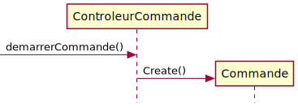

### 3a. Faire des contrats
- Vous devez réaliser les contrats nécessaires pour réaliser une commande en ligne.
- Attention:  Si vous constater lors de l'écriture de vos contrats qu'il y a une incohérence au niveau du MDD ou du DSS vous devez corriger cette incohérence et ensuite réaliser les contrats.
  
#### Modèle du domaine


#### Diagramme de séquence système


#### Solution
.svg)

##### Contrat 
demarrerCommande()
- Une instance c:Commande a été créée
- c:Commande à été associé a m:Membre (précondition)
  
ajouterItem(upcCode:Integer)
- Une instance de item:Item a été créée
- item.serial est devenu serial
- item:Item a été associé à c:Commande
- item:Item a été associé à ItemDescription sur la base de correspondance avec upcCode

#### termineCommande
- c.noCommande est devenu un no unique
- c.date est devenu maintenant

### 3b. Faire des contrats
Qu'est ce qu'une postcondition?
**expliquer: **

Quel patron graps est associé au contrat suivant:
- Une instance l:Livre a été créée (choix multiple des 9 GRASP)
  - Controleur, **créateur**, expert, Forte Cohésion, Faible couplage, Fabrication pure, Indirection, Polymorphisme, Protection de variation
- Une association a été crée entre l:Livre et la classe DescriptionLivre sur la base de correspondance entre DescriptionLivre.isbn == isbs (paramètre)
  - Controleur, créateur, **expert**, Forte Cohésion, Faible couplage, Fabrication pure, Indirection, Polymorphisme, Protection de variation
- l.codeCondition est devenu codeCondition (paramètre
  - Controleur, créateur, **expert**, Forte Cohésion, Faible couplage, Fabrication pure, Indirection, Polymorphisme, Protection de variation
  
  ### 4 Questions validation GRASP

  -  Quel type de controleur est représenté par une classe du Modèle du domaine? **Facade** ou Session
  -  

### 5. Utiliser les GRASP pour comparer deux solutions

5.a En vous basant sur le MDD de la question #3, laquelle de ces solutions est la bonne
[ ]
[ ]

Quel patron(s) GRASP et justification(s) avez vous utilisé(s) pour faire ce choix. Vous devez documenter votre choix en le comparant à toute les autres options. 
|Patron|Justification|
|--|--|

5.b En vous basant sur le MDD de la question #3, laquelle de ces solutions est la bonne
[ ]
[ ]
[ ]

Quel patron(s) GRAPS et justification(s) avez vous utilisé(s) pour faire ce choix. Vous devez documenter votre choix en le comparant à toute les autres options. 
|Patron|Justification|
|--|--|


#### 7 Réusinage

7.a Voici le code à réusiner.  Vous devez utiliser au moins deux techniques de réusinage pour améliorer la qualité de ce code.

```typescript
static fromId(id:number){
    let  members = require('members.json');
		for( var member in members){
			if(members[member].id == id){
        return new this(
          members[member].id,
        members[member].first_name,
        members[member].last_name,
        members[member].email,
        members[member].age,
         members[member].genre);
			}
    }
     throw new Error("member id not found");
  }
```

##### Solution: fix nesting depth

```typescript
 static fromId(id:number){
    let  members = require('members.json');
    let member = members.find(element => element.id == id);
    if(member == null)
      throw new Error("member id not found");

    return new member(
        member.id,
        member.first_name,
        member.last_name,
        member.email,
        member.age,
        member.genre);
  }
  ```
  
  ##### Solution: fix argument count

```typescript
 static fromId(id:number){
    let  members = require('members.json');
    let member = members.find(element => element.id == id);
    if(member == null)
      throw new Error("member id not found");

    return new member(member)
  }
  ```

7.b Voici le code à réusiner
```typescript
 static descriptionCode(code: String){
   switch(isbn) {
     case "12":{
       return "Allo";
     }
    case "34":{
       return "mon";
     }
     case "56":{
       return "coco";
     }
     case "78":{
       return "de";
     }
     case "90":{
       return "LOG430";
     }
   }
  }
  ```
solution: utiliser une map

7.c Le test suivant permettant la création d'une nouvelle classe Forme a une dette technique de niveau C à cause de la densité de commentaire.  Pourriez vous réécrire ce test pour obtenir une dette technique de niveau A.

describe('CourseTest', () => {
   it('fail commentaires', () => { 
      let forme:Forme = new Forme();

      // déplacer la forme horizontalement
      forme.deplacer(10);
      // déplacer la forme verticalement
      forme.vertical(20);
      // déplacer la forme à la position 0,0 pour pouvoir la faire tourner
      forme.origin();
      // rotation de la forme de 10 degré
      forme.rot(10);
      // remettre la forme à sa position après la rotation
      forme.back();
      expect(forme.valid).to be true
   });
});

**Solution**
describe('CourseTest', () => {
   it('pass commentaires', () => { 
      let forme:Forme = new Forme();

      forme.deplacerHorizontalement(10);
      forme.deplacervertical(20);
      forme.déplacerVersOrigin();
      forme.rotationEnDegre(10);
      forme.deplacerDeOriginVersPositionPrealabler();
      expect(forme.valid).to be true
   });
});

# 13 Architecture en couche

## 13.a Routes ajouter question
Est-ce que la méthode de la route ajouterQuestionVraiFaux respecte le principe d'architecture en couche.

```typescript
 public ajouterQuestionVraiFaux(req: Request, res: Response, next: NextFunction) {
    let verite = req.query.verite;
    let enonce = req.query.enonce;
   
    let coursActuel = this.controleur.coursActuel
    let resultat = coursActuel.creerQuestionVraiOuFaux(enonce, verite);
 
    res.status(200)
    .send({
      message: 'Success',
      status: res.status,
      resultat
    });
 }
```

Réponse: oui / non
Expliquer: 


## 13.b route créer membre
Est-ce que la méthode du de la route creerMembre respecte le principe d'architecture en couche.

```typescript
public creerMembre(req: Request, res: Response, next: NextFunction) {
  let courriel = req.query.courriel;
  let motDePasse = req.query.motDePasse;
   
  Membre membre = new Membre(courriel, motDePasse)
  
  let membre = this.controleur.creerMembre(membre)
 
  res.status(200)
    .send({
      message: 'Success',
      status: res.status,
      membre
    });
}
```

Réponse: oui / non
Expliquer: 


## 13.c controleur
Est-ce que la méthode ajouterLivre du controleur de facade de type Objet Racide Bibliothèque respecte le principe d'architecture en couche.

```typescript
class Bibliotheque {
  ArrayList listLivre = new ArrayList<Livre>();

  public ajouterLivre(isbn:String, titre:String)  {
    Livre livre = new Livre(isbn,titre);
    this.listLivre.push(livre);
    return livre.id;
  }
}
```

Réponse: oui / non
Expliquer:

## 15 Convertir diagramme de séquence (RDCU) en Typescript
## reserverChambre(dateArrive:string, dateDepart:string, nomCategorie: String)
Rédiger le code Typescript nécessaire pour implémenter l'opération système reserverChambre(...)


## 16 TDD

### 16.1 Quel artéfact(s) avez vous besoin pour débuter la réalisation d'une solution logiciel en utilisant l'approche TDD
choix: MDD, DSS, Contrats, RDCU, DCL -> solution: RDCU et DCL

### 16.2 Comment allez vous déterminer la première classe à développer si vous utiliser l'approche TDD
La classe ayant le moins de couplage
> #### 16.2a En mode TDD est ce que cela aurait du sens de débuter l'implémentation du code par la classe de la route?

### 16.3 Quel pourcentage de couverture de code minimal devrait t'on atteindre si on utilise l'approche TDD
100%

### 16.4 Mettre dans l'ordre les opérations suivantes:
1. Ajouter un test
2. Exécuter tout les test
3. Écrivez le code le plus simple qui réussit le nouveau test
4. Tous les tests devraient maintenant réussir
5. Refactoriser

### 16.5 Lorsque j'ai tous les artéfacts de mon modèle du domaine, combien de classe devrais-je implémenter en simultané lorsque j'utilise l'approche TDD.


