---

history: true
progress: true
controls: true
controlsTutorial: true
controlsBackArrows: faded
center: false
theme : beige
transition: none
transitionSpeed: fast
highlightTheme: monokai
logoImg: ./assets/logo_ets.svg
slideNumber: true
title: 's20212-seances'
margin: 0
minScale: 1
maxScale: 1
rtl: false
viewDistance: 3
display: block
navigationMode: 'linear'
height: 50%
width: 100%
autoPlayMedia: true
notesSeparator: "Note:"
customTheme : "slide_themes"


---

## LOG210 
### plan proposition S20212

[Site web actuel ](https://cc-yvanross.github.io/14f3178688ff2d131977e55d7002b1fc3b09e3ad/index.html)
L'idéal serait de générer un site web directement à partir du contenu du cours. Moodle ne contiendrait que les quiz.

  - [Notes de cours version html#dss](https://cc-yvanross.github.io/14f3178688ff2d131977e55d7002b1fc3b09e3ad/S20212/build/html/LOG210-notes-de-cours.html#dss)

[version pdf de ce document: remote](https://cc-yvanross.github.io/14f3178688ff2d131977e55d7002b1fc3b09e3ad/S20212/s20212-seances.pdf)

[version pdf de ce document:local](./s20212-seances.pdf)


:::block {style=font-size:0.5em}
[Séances](#seances) | [Quiz](#quiztdm) | [Laboratoires](#laboratoiretdm) | [Intro](#introtdm) | [Équipe](#equipetdm) | [PU](#putdm) | [DCU](#dcutdm) | [CU](#cutdm) | 
[IU](#iutdm) | [MDD](#mddtdm) | [Dss](#dsstdm) | [Contrat](#contrattdm) | [RDCU](#rdcutdm) | [DCL](#dcltdm) | 
[Couche](#couchetdm) | [Exercice](#exercicetdm) | [Typescript](#typescripttdm) | [Complexite](#complexitetdm) 
| [FURPS](#furpstdm) | [TDD](#tddtdm) | [GOF](#goftdm) | [Diagrammes](#diagrammestdm) | [Divers](#diverstdm)  
:::

---

<!--=======================================================================================================-->

## LOG210
### Plan des séances
<!-- .slide: id='seances' -->
[Séance 1](#seance1) | [Séance 2](#seance2) | [Séance 3](#seance3) | [Séance 4](#seance4) | [Séance 5](#seance5) | [Séance 6](#seance6) | [Séance 7](#seance7) | [Séance 8](#seance8) | [Séance 9](#seance9) | [Séance 10](#seance10) | [Séance 11](#seance11) | [Séance 12](#seance12) | [Séance 13](#seance13) |

:::block {style=font-size:0.5em}
 [Séances](#seances) | [Quiz](#quiztdm) | [Laboratoires](#laboratoiretdm) | [Intro](#introtdm) | [Équipe](#equipetdm) | [PU](#putdm) | [DCU](#dcutdm) | [CU](#cutdm) | 
[IU](#iutdm) | [MDD](#mddtdm) | [Dss](#dsstdm) | [Contrat](#contrattdm) | [RDCU](#rdcutdm) | [DCL](#dcltdm) | 
[Couche](#couchetdm) | [Exercice](#exercicetdm) | [Typescript](#typescripttdm) | [Complexite](#complexitetdm) 
| [FURPS](#furpstdm) | [TDD](#tddtdm) | [GOF](#goftdm) | [Diagrammes](#diagrammestdm) | [Divers](#diverstdm)  
:::


--

<!-- .slide: id='seance1' -->
## Séance 1

- Aynchrones (50m)
  - xxx 
  
- Synchrone (44m)
  - [Présentation personnelle](#perso1)


[<div class='footer'>Table des matières séances</div>](#seances)

--

<!-- .slide: id='seance2' -->
## Séance 2

[<div class='footer'>Table des matières séances</div>](#seances)

--

<!-- .slide: id='seance3' -->
## Séance 3

[<div class='footer'>Table des matières séances</div>](#seances)

--

<!-- .slide: id='seance4' -->
## Séance 4
[<div class='footer'>Table des matières séances</div>](#seances)

--

<!-- .slide: id='seance5' -->
## Séance 5
[<div class='footer'>Table des matières séances</div>](#seances)

--

<!-- .slide: id='seance6' -->
## Séance 6
[<div class='footer'>Table des matières séances</div>](#seances)

--

<!-- .slide: id='seance7' -->
## Séance 7
[<div class='footer'>Table des matières séances</div>](#seances)

--

<!-- .slide: id='seance8' -->
## Séance 8
[<div class='footer'>Table des matières séances</div>](#seances)

--

<!-- .slide: id='seance9' -->
## Séance 9
[<div class='footer'>Table des matières séances</div>](#seances)

--

<!-- .slide: id='seance10' -->
## Séance 10
[<div class='footer'>Table des matières séances</div>](#seances)

--

<!-- .slide: id='seance11' -->
## Séance 11
[<div class='footer'>Table des matières séances</div>](#seances)

--

<!-- .slide: id='seance12' -->
## Séance 12
[<div class='footer'>Table des matières séances</div>](#seances)

--

<!-- .slide: id='seance13' -->
## Séance 13
[<div class='footer'>Table des matières séances</div>](#seances)

---

<!--=======================================================================================================-->
<!-- .slide: id='quiztdm'   -->
## Quiz
 

<a href="#quiztdm" target="popup" onclick="window.open('https://ena.etsmtl.ca/mod/quiz/view.php?id=798565','name','width=1600,height=900')">Quiz 02</a> | 
<a href="#quiztdm" target="popup" onclick="window.open('https://ena.etsmtl.ca/mod/quiz/view.php?id=798568','name','width=1600,height=900')">Quiz 03</a> | 
<a href="#quiztdm" target="popup" onclick="window.open('https://ena.etsmtl.ca/mod/quiz/view.php?id=798571','name','width=1600,height=900')">Quiz 04</a> | 
<a href="#quiztdm" target="popup" onclick="window.open('https://ena.etsmtl.ca/mod/quiz/view.php?id=798574','name','width=1600,height=900')">Quiz 05</a> | 
<a href="#quiztdm" target="popup" onclick="window.open('https://ena.etsmtl.ca/mod/quiz/view.php?id=798577','name','width=1600,height=900')">Quiz 06</a> | 
<a href="#quiztdm" target="popup" onclick="window.open('https://ena.etsmtl.ca/mod/quiz/view.php?id=798583','name','width=1600,height=900')">Quiz 08</a> | 
<a href="#quiztdm" target="popup" onclick="window.open('https://ena.etsmtl.ca/mod/quiz/view.php?id=798586','name','width=1600,height=900')">Quiz 09</a> | 
<a href="#quiztdm" target="popup" onclick="window.open('https://ena.etsmtl.ca/mod/quiz/view.php?id=798589','name','width=1600,height=900')">Quiz 10</a> | 
<a href="#quiztdm" target="popup" onclick="window.open('https://ena.etsmtl.ca/mod/quiz/view.php?id=798592','name','width=1600,height=900')">Quiz 11</a> | 
<a href="#quiztdm" target="popup" onclick="window.open('https://ena.etsmtl.ca/mod/quiz/view.php?id=798595','name','width=1600,height=900')">Quiz 12</a> 


:::block {style=font-size:0.5em}
[Séances](#seances) | [Quiz](#quiztdm) | [Laboratoires](#laboratoiretdm) | [Intro](#introtdm) | [Équipe](#equipetdm) | [PU](#putdm) | [DCU](#dcutdm) | [CU](#cutdm) | 
[IU](#iutdm) | [MDD](#mddtdm) | [Dss](#dsstdm) | [Contrat](#contrattdm) | [RDCU](#rdcutdm) | [DCL](#dcltdm) | 
[Couche](#couchetdm) | [Exercice](#exercicetdm) | [Typescript](#typescripttdm) | [Complexite](#complexitetdm) 
| [FURPS](#furpstdm) | [TDD](#tddtdm) | [GOF](#goftdm) | [Diagrammes](#diagrammestdm) | [Divers](#diverstdm)  
:::

---

<!--=======================================================================================================-->
<!-- .slide: id='laboratoiretdm'   -->
## Laboratoires
- <a href="#laboratoiretdm" target="popup" onclick="window.open('https://github.com/cc-yvanross/cc-yvanross.github.io/blob/main/14f3178688ff2d131977e55d7002b1fc3b09e3ad/laboratoire/S20211-planification-laboratoire.md','name','width=1600,height=900')">Planification des laboratoires</a> 


- <a href="#laboratoiretdm" target="popup" onclick="window.open('https://ena.etsmtl.ca/course/view.php?id=13703#section-2','name','width=1600,height=900')">Git lab0 introduction</a> 

- <a href="#laboratoiretdm" target="popup" onclick="window.open('https://ena.etsmtl.ca/course/view.php?id=13703#section-5','name','width=1600,height=900')">Git labo1 SGA</a> 


:::block {style=font-size:0.5em}
[Séances](#seances) | [Quiz](#quiztdm) | [Laboratoires](#laboratoiretdm) | [Intro](#introtdm) | [Équipe](#equipetdm) | [PU](#putdm) | [DCU](#dcutdm) | [CU](#cutdm) | 
[IU](#iutdm) | [MDD](#mddtdm) | [Dss](#dsstdm) | [Contrat](#contrattdm) | [RDCU](#rdcutdm) | [DCL](#dcltdm) | 
[Couche](#couchetdm) | [Exercice](#exercicetdm) | [Typescript](#typescripttdm) | [Complexite](#complexitetdm) 
| [FURPS](#furpstdm) | [TDD](#tddtdm) | [GOF](#goftdm) | [Diagrammes](#diagrammestdm) | [Divers](#diverstdm)  
:::

---

<!--=======================================================================================================-->
<!-- .slide: id='introtdm'   -->
## Module introduction LOG210
### Analyse  et  conception de logiciels
1. [Présentation de l'équipe](#presentationequipe1) 
2. [Présentation personnelle](#perso1) [7.48m](https://youtu.be/i7KNb6QvH-g)
3. [Présentations des étudiants](#pre_etudiants1) 
4. [Faire un logiciel pour un domaine que vous ne connaissez pas](#inconnu1) 

:::block {style=font-size:0.5em}
Il faut trouver un moyen pour faire un lien entre ces titres de section et la section correspondante dans les notes de cours.
:::

:::block {style=font-size:0.5em}
[Séances](#seances) | [Quiz](#quiztdm) | [Laboratoires](#laboratoiretdm) | [Intro](#introtdm) | [Équipe](#equipetdm) | [PU](#putdm) | [DCU](#dcutdm) | [CU](#cutdm) | 
[IU](#iutdm) | [MDD](#mddtdm) | [Dss](#dsstdm) | [Contrat](#contrattdm) | [RDCU](#rdcutdm) | [DCL](#dcltdm) | 
[Couche](#couchetdm) | [Exercice](#exercicetdm) | [Typescript](#typescripttdm) | [Complexite](#complexitetdm) 
| [FURPS](#furpstdm) | [TDD](#tddtdm) | [GOF](#goftdm) | [Diagrammes](#diagrammestdm) | [Divers](#diverstdm)  
:::
[<div class='footer'>Table des matières introduction</div>](#introtdm)


--

<!--------------------------------------------------------------->
<!-- .slide: id="presentationequipe1" class="equipeslide"  -->
## Équipe
- Responsable du cour
    - Christopher Fuhrman
    - christopher.fuhrman@etsmtl.ca

{width=30%}{style=border:none}

--

<!-- .slide: class="equipeslide"  -->
- Chargé de cours 
    - Yvan Ross, M.ing
    - cc-yvan.ross@etsmtl.ca    

{width=25%}{style=border:none}
::: block {style=font-size:0.8em}
Utiliser Discord pour communiquer avec moi.
:::

--

<!-- .slide: class="equipeslide"  -->

## Communiquer avec moi

- Par discord: **objet précis**, ex. 
  **`GR01: question sur le modèle du domaine`**
- Rencontres organisées de façon proactive **en dehors** de ces heures. Proposez moi au moins deux périodes de disponibilité.
::: block {style="font-size:0.8em"}
  - Lun 8h30-12:00
  - Lun 13:30 - 17:00         
  - Mar 18:00 - 21:30        
  - Jeu 08:30 - 12:00        
  - Ven 13:30 - 16:30 
:::

  
<!-- - Mes dispos $\rightarrow$ profs.etsmtl.ca/cfuhrman proposez-moi dans le premier courriel l'heure du rendez-vous 🏆- Ne pas me proposer des choses après 18h SVP 👨‍👨‍👧‍👦 -->

--

<!-- .slide: class="equipeslide"  -->
## Chargés de laboratoire

- 01 Jeu 08:30 - 11:30 Labo A-3322
  - hind.errahmouni.1@ens.etsmtl.ca
    
- 02 Lun 13:30 - 16:30 Labo A-3322
  - edouard.laforge.1@ens.etsmtl.ca
    
- 03 Mer 18:00 - 21:00 Labo A-3322
  - islem.saidani.1@ens.etsmtl.ca

::: block {style=font-size:0.8em}
Utiliser Discord pour communiquer avec eux à propos du laboratoire.
:::
[<div class='footer'>Table des matières introduction</div>](#introtdm)


--


<!--------------------------------------------------------------->
<!-- .slide: id="perso1" class="equipeslide"  -->
## Présentation personnelle

--

<!-- .slide: class="equipeslide"  -->
## Christopher Fuhrman

--


## Présentation personnelle

- Professeur depuis 2001 (Conception de logiciels)
- Expérience industrielle
  - 2019 : Développement Pharo.org Inria Lille
  - 2014-20 : PlantUML Gizmo 
  - 2008 : Développement convertisseur XML FBI-WVU
  - 2000 : Directeur du programme NASA « ASSET »
  - 1998-1999 : Développeur chez ProLogic
  - 1989-1991 : Développeur chez Apple


--

<!-- .slide: class="equipeslide"  -->

## Présentation personnelle 

- Diplômes universitaires
  - 1988 Bachelor of Science (informatique) WVU
  - 1996 Docteur ès sciences (informatique technique) École Polytechnique Fédérale de Lausanne


--

<!-- .slide: class="equipeslide"  -->
## Yvan Ross

--

<!-- .slide: class="equipeslide"  -->
## Présentation personnelle
- Expérience industrielle
    - 2013-: Chargé de cours ETS
    - 2010-2015: Consultant
    - 2011-2013: Web analytique cloud (ROR), gestion de projet
    - 2009-2011: Reconnaissance vocale. C++, java, ROR, Perl

--

<!-- .slide: class="equipeslide"  -->

## Présentation personnelle (...)
- 2008-2009: Capteur d'analyse réseau électrique, C++, simulink , Matlab

{width=75%}{style=border:none}

--

<!-- .slide: class="equipeslide"  -->
## Présentation personnelle (...)

- 2001-2008: R&amp;D en imagerie médicale, C++, Matlab

{width=45%}{style=border:none}
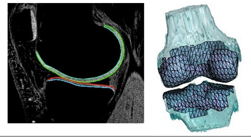{width=45%}{style=border:none}

--

<!-- .slide: class="equipeslide"  -->
## Présentation personnelle (...)

- 1998-2001: Développeur imagerie par microscopie, C++

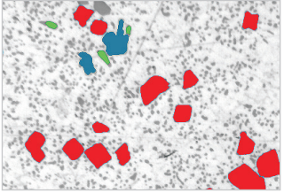{width=30%}{style=border:none}
{width=30%}{style=border:none}

--

<!-- .slide: class="equipeslide"  -->
## Présentation personnelle (...)

- 1994-1998: Directeur R&amp;D, conception de système d'inspection automatisée par vision, C++, conception d'équipement de convoyage
{style=border:none}

--

<!-- .slide: class="equipeslide"  -->
### Présentation personnelle (...)

#### Diplômes universitaires
- 1994 Maîtrise en technologie des systèmes

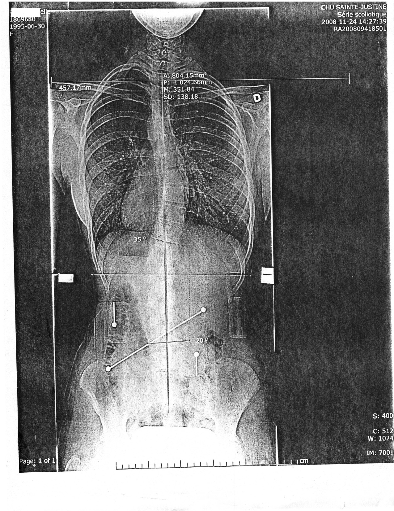{width=30%}{style=border:none}

--

<!-- .slide: class="equipeslide"  -->
#### Diplômes universitaires
- 1990 Baccalauréat en Génie de la production automatisée

[<div class='footer'>Table des matières introduction</div>](#introtdm)

--


<!--------------------------------------------------------------->
<!-- .slide: id='pre_etudiants' class="equipeslide"  -->
## Présentations des étudiants

Questionnaire à tiny.cc/quizdesign

Nom de la salle de class: **ETSDESIGN**

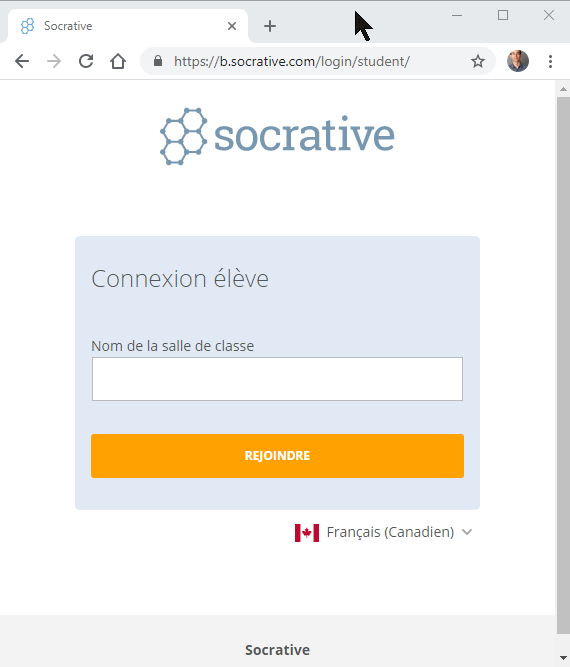{style="width:300px" .plain}

Note: 
https://b.socrative.com/teacher/


--

<!-- .slide: class="equipeslide"  -->
## Présentations des étudiants

- Comment développer un logiciel?
  - Quelle(s) méthode(s) de développement avez-vous suivie(s)?
  - Pour quel genre de logiciel?
- Quelles sont vos attentes pour LOG210?

--

<!-- .slide: class="equipeslide"  -->
## Présentations des étudiants
- Veuillez vous présenter sur Discord dans Général. 
  - Votre nom, votre programme d'étude collégiale, votre programme d'étude universitaire, vos stages (entreprise, domaine, projet), pourquoi vous êtes en génie logiciel.
{width=35%}{style=border:none}


--


<!-- .slide: class="equipeslide"  -->
## Meilleures pratiques pour apprendre

Quelles sont les meilleures pratiques pour apprendre?

{width=30%}{style=border:none}
{width=30%}{style=border:none}
{width=30%}{style=border:none}

--

<!-- .slide: class="equipeslide"  -->
## Mes conseils pour réussir

- L'étudiant qui réussit dans mes cours…
    - <s>s'assied vers l'avant de la salle,</s>
    - est motivé pour apprendre et pour participer, 
    - est bien discipliné, 
    - est organisé, 
    - cherche de l'aide d'une façon proactive,
    - sais que le **multitâche** nuit à la qualité.

--

<!-- .slide: class="equipeslide"  -->
## proactif

1. **Domaine**: psychologie
1. **Auteur**: Office québécois de la langue française, 2002  
1. **Définition**: Qui exerce un effet sur des faits ou des processus **à venir**

> Exemple: Pompiers qui visitent les maisons pour vérifier les détecteurs de fumée{align=left}


--

<!-- .slide: class="equipeslide"  -->
## Ingénieur logiciel, le meilleur métier au monde ?

**Revers de la médaille**: certains reprochent à leur métier la nécessité  de se mettre régulièrement au niveau. Ils trouvent difficile de suivre les évolutions avec les langages et les nouvelles pratiques qui ne cessent d'apparaître ou de se modifier
🧑👩💻👨‍🏫
{.fragment .shade-up} 

Note: 1 animation

--

<!-- .slide: class="equipeslide"  -->
## Ingénieur logiciel, le meilleur métier au monde ?

**Autre inconvénient**: la solitude, notamment  pour les développeurs  qui préfèrent travailler depuis chez eux. Un choix qui leur offre un emploi du temps flexible, mais qui les mène à passer de longues heures sans interagir avec le moindre collègue.{.fragment .shade-up}

::: block {style=font-size:14px}
http://www.developpez.com/actu/26910/Ingenieur-logiciel-le-meilleur-metier-au-monde-Oui-selon-une-etude-signee-CareerCast-com/
:::

Note:
Travail en équipe aide! Beaucoup d'interaction.

[<div class='footer'>Table des matières introduction</div>](#introtdm)

--

<!--------------------------------------------------------------->
<!-- .slide: id="inconnu1" -->
### Faire un logiciel pour un domaine que vous ne connaissez pas

Exemple:  
Application Web permettant de planifier les formations (faites par des spécialistes en TI) des enseignants dans les écoles québécoises.

Comment procéder?
  - Appliquer un processus pour la réalisation
    - Appliquer une méthodologie d'analyse
    - Appliquer une méthodologie de conception
  

Note:
Il faut connaître **comprendre** le domaine, le **modéliser** (pour pouvoir automatiser les processus), faire du code simple. 

[<div class='footer'>Table des matières introduction</div>](#introtdm)

---

<!--=======================================================================================================-->
<!-- .slide: id='outilstdm'   -->
## Module outils
:::block {style=font-size:0.7em}
1. [Notes de cours](https://drive.google.com/file/d/1__yjzv7vuqbX0ElxLj5AkVO0xEk7ubVO/view)
2. [Outils de travail](#outils1) 
4. [Visual studio code](https://code.visualstudio.com/download)
5. [vscode: Markdown all in one](https://marketplace.visualstudio.com/items?itemName=yzhang.markdown-all-in-one)
6. [vscode: Plantuml](https://marketplace.visualstudio.com/items?itemName=jebbs.plantuml)
7. [vscode: liveShare](https://marketplace.visualstudio.com/items?itemName=MS-vsliveshare.vsliveshare-pack)
8. [plantuml website](https://ena.etsmtl.ca/course/view.php?id=13703)
9.  [Mastering markdown](https://guides.github.com/features/mastering-markdown/)
10. [Git: Fork and pull request](https://www.youtube.com/watch?v=dpYSnszeGvM&feature=youtu.be)
11. [Outils UML](#outilsUML8) - [14.44m](https://youtu.be/JU0bEcbhwa4)
:::

:::block {style=font-size:0.5em}
[Séances](#seances) | [Quiz](#quiztdm) | [Laboratoires](#laboratoiretdm) | [Intro](#introtdm) | [Équipe](#equipetdm) | [PU](#putdm) | [DCU](#dcutdm) | [CU](#cutdm) | 
[IU](#iutdm) | [MDD](#mddtdm) | [Dss](#dsstdm) | [Contrat](#contrattdm) | [RDCU](#rdcutdm) | [DCL](#dcltdm) | 
[Couche](#couchetdm) | [Exercice](#exercicetdm) | [Typescript](#typescripttdm) | [Complexite](#complexitetdm) 
| [FURPS](#furpstdm) | [TDD](#tddtdm) | [GOF](#goftdm) | [Diagrammes](#diagrammestdm) | [Divers](#diverstdm)  
:::
[<div class='footer'>Table des matières outils</div>](#outilstdm)

--


<!--------------------------------------------------------------->
<!-- .slide: class="toolslide" -->
## Notes de cours 

Il existe des [notes de cours](https://drive.google.com/file/d/1__yjzv7vuqbX0ElxLj5AkVO0xEk7ubVO/view?usp=sharing) depuis janvier 2020. 

:::block {style=font-size:0.7em}
- https://drive.google.com/file/d/1__yjzv7vuqbX0ElxLj5AkVO0xEk7ubVO/view
:::

- Les notes de cours ne remplacent pas le livre obligatoire

[<div class='footer'>Table des matières outils</div>](#outilstdm)


--

<!------------------------------------------------------------------>
<!-- .slide: id="outils1" class="toolslide" -->
## Outils de travail
- [Plan de cours](https://planets.etsmtl.ca/Public/Versionpdf.aspx?session=20211&sigle=LOG210&groupe=00)
- [Moodle - classe inversé](https://ena.etsmtl.ca/my/)
- [Examen - enaquiz](https://enaquiz.etsmtl.ca/)
- [Google Drive pour le contenu](https://drive.google.com/drive/folders/1CWoWGClL2sQkvsw57NiCUNnqU3RwPBPH?usp=sharing)  
<!--- [GitHub Classrooms pour laboratoires et autres](https://classroom.github.com/classrooms) -->
- [Socrative](http://www.socrative.com)
- [Zoom](http://www.zoom.us) / [obs](https://obsproject.com/) / [youtube](#youtube.com) / [discord](https://discord.com/)
- [one note](https://1drv.ms/u/s!An6-F73ulxAOhVyiCB46jTelNVLs)
- laboratoires


--


<!-- .slide: class="toolslide" -->
###  Outils de travail...
- Visual studio code
  - extension
    - https://visualstudio.microsoft.com/services/live-share/
    - plantuml
    - Markdown all in One
    - Markdown PDF
- https://www.npmjs.com/package/gitinspector
- https://www.npmjs.com/package/tplant
- https://plantuml.com/
- https://wakatime.com/dashboard

--

<!-- .slide: class="toolslide" -->
## Livre obligatoire

- Version anglaise ou française?

{width=25%}{style=border:none}
{width=25%}{style=border:none}

[<div class='footer'>Table des matières outils</div>](#outilstdm)

--

<!--------------------------------------------------------------->
<!-- .slide: id="outilsUML8" class="toolslide"  -->

## Définitions
- Pro-ingénierie
    - Générer du code source à partir des diagrammes (UML) 
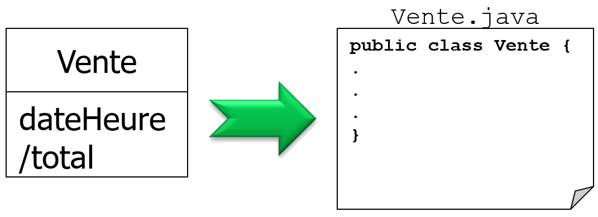{.plain}
        
Note: Simulink

--

<!-- .slide: class="toolslide"  -->
## Définitions
- Rétro-ingénierie
    - Générer des diagrammes (UML) à partir du code 
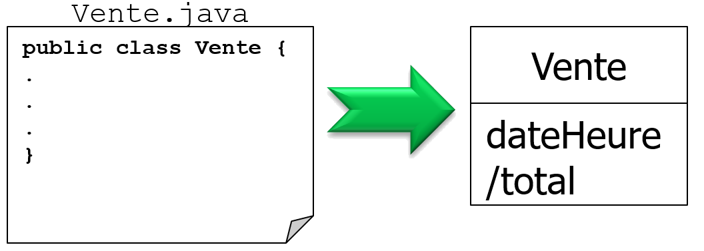{.plain}

Note: railroady

--

<!-- .slide: class="toolslide"  -->
## Définitions
- Ingénierie cycle 
    - Fermer cette boucle
{.plain}

Note: Enterprise Architect

--

<!-- .slide: class="toolslide"  -->
### Que doit-on rechercher dans un outil?
- Essayez un outil gratuitement avant de l'acheter.
- Testez l'outil sur un projet réel.
- Choisissez un outil qui s'intègre à votre IDE préféré (VS, Eclipse, etc.)
- Rétro-ingénierie est important
- L'impression sur grande feuilles est importante (Larman)

--

<!-- .slide: class="toolslide"  -->
## Liste d'outils UML
1. [Wikipedia](http://en.wikipedia.org/wiki/List_of_Unified_Modeling_Language_tools)
- Suggestions: 
  - Papyrus
  - Modeliosoft
  - PlantUML

--

<!-- .slide: class="toolslide"  -->
## UML en mode esquisse
- Esquisses murales UML au début d'une itération
- Suivies par 3 semaines de codage et de tests
  - Les modèles évolueront avec le code
- Entamer de nouveau la modélisation de nouvelles esquisses
- Générer les diagrammes à partir du code existant le jours précédant cette modélisation

--

<!-- .slide: class="toolslide"  -->
## Exemple d'une itération
{.plain}

[<div class='footer'>Table des matières outils</div>](#outilstdm)

---

<!--=======================================================================================================-->
<!-- .slide: id='acootdm'   -->
## Module analyse et conception 
### orienté ojet
1. [Try to fix bug in production](#fixbugprod)
1. [Spectre de la conception](#spectre1)
2. [Analyse et conception orienté objet](#aco1) [21.26m](https://youtu.be/vGV5NN0ZMCo)
3. [AOO](#aoo6) - Approche orienté objet [7.26m](https://youtu.be/scVEOHnTiDU)
4. [Première étude de la conception](#etude8)  

:::block {style=font-size:0.5em}
[Séances](#seances) | [Quiz](#quiztdm) | [Laboratoires](#laboratoiretdm) | [Intro](#introtdm) | [Équipe](#equipetdm) | [PU](#putdm) | [DCU](#dcutdm) | [CU](#cutdm) | 
[IU](#iutdm) | [MDD](#mddtdm) | [Dss](#dsstdm) | [Contrat](#contrattdm) | [RDCU](#rdcutdm) | [DCL](#dcltdm) | 
[Couche](#couchetdm) | [Exercice](#exercicetdm) | [Typescript](#typescripttdm) | [Complexite](#complexitetdm) 
| [FURPS](#furpstdm) | [TDD](#tddtdm) | [GOF](#goftdm) | [Diagrammes](#diagrammestdm) | [Divers](#diverstdm)  
:::

--


<!--------------------------------------------------------------->
<!-- .slide: id='fixbugprod' -->
## Try to fix bug in production
<iframe width="932" height="500" src="htps://www.youtube.com/watch?v=75wa8Lx4yc4" frameborder="0" allow="accelerometer; autoplay; encrypted-media; gyroscope; picture-in-picture" allowfullscreen></iframe>

[<div class='footer'>Table des matières Analyse et conception orienté objet</div>](#acootdm)

--


<!--------------------------------------------------------------->
<!-- .slide: id='spectre1' -->
## Spectre de la Conception

Figure 2.1 des [notes de cours.](https://drive.google.com/file/d/1__yjzv7vuqbX0ElxLj5AkVO0xEk7ubVO/view?usp=sharing)

--

<!-- .slide: data-background-image="https://www.plantuml.com/plantuml/svg/VLJBRjim4BppAnQvE77X8cblXM74Tlf86nH5dRG7EmUAN4k4ALBW0wxxHq4_eRVanxgKR4UsKmC21SpEpYvd85twm5s8fMP-eKp57I_1XvL6EfqIUvMCYqNkR3HIM6qT1CUDfnAQm3eG2kM17Wu5DtBfL0XeO6vD06NWfpBIBZthFCj9dFEeGs8ONY9ySSgdbklRCUlS5kWHR2ZGUT3MBY1to6kfoO-FS5ho1IqP7T9SN7NehGnTHckKDDF1yEO6xYRllqzQm-7Y_8pzVxxdUJhCqIMlpG8-s-WCryTelnP2maGuLOLZj6z89ZdVMghjNN0HcHUSuhXu_QP54ffxFx9EeXlNIHHAIZG7Z6rUnrX3v-oo8MIQEXZHKlxeq8PLXRu1iAp22aeiixHmtGadVQz-uxktvuFx4-0UbfowvXJ2flxu1yQSRa3zLShgyM_D-ogg3QFRVTNjrc0cunpw_PAMr3WOR0WZv57OM95tCoEi4LW5PStCy0ZowI6BOMPEHrTt7yuQwIHpAFwozXL9e5Vvdjh4KZJFYYyAybnHB8UImuGtVNmxPZtZwQ54bzFNijR50nkdTQMW59J9MoP-QX0GTfdPrTR6Wh6jvT3JE0_Jp6fvtwlDPBMZEt123y3wAgovq4vXiqThIByNfvBx0bCznTYarfCjDDjCsIKdTEtQ3btY5cxJELkFtwCNx1ADf1_JFm00" data-background-size="80%" data-background-opacity="1" -->

[<div class='footer'>Table des matières Analyse et conception orienté objet</div>](#acootdm)

--

<!--------------------------------------------------------------->
<!-- .slide: id='aco1' -->
### Survol des modèles
{.plain}

Note:
Indiquer ANALYSE / CONCEPTION / etc.
[<div class='footer'>Table des matières Analyse et conception orienté objet</div>](#acootdm)

--

<!--------------------------------------------------------------->
<!-- .slide: id='coo1' -->
## Analyse vs Conception

C'est de la modélisation!

--


## Analyse

- Faire un modèle du *problème*
  - Diagramme de classes conceptuelles
  - Modèle du domaine
- Investiger le problème
- Comprendre les besoins
- Ne pas (encore) proposer la solution

--

## Conception

- Faire un *modèle* d'une *solution*
  - Diagrammes de classes logicielles
  - Diagrammes d'interaction (séquence)
  - etc.
- Ce n'est pas la solution
- Facilite une évaluation des qualités comme la modularité

--

## Décalage des représentations

Comprenez-vous ce que fait ce programme?

```
000111011000100100101001010100001011110011
```

--

## Décalage des représentations

Comprenez-vous ce que fait ce programme?

{.plain}

--

## Décalage des représentations

- Plus une solution (conception) ressemble à une description du problème, plus elle est facile à comprendre.
- La "distance" entre la représentation d'un problème et la représentation de sa solution s'appelle **le décalage
des représentations.**

--

## Analyse versus Conception


Note:
    Ajouter des notes pour la présentation Powerpoint

--

## Lectures à faire

Le chapitre 1 des notes de cours.
[<div class='footer'>Table des matières Analyse et conception orienté objet</div>](#acootdm)

--

<!--------------------------------------------------------------->
<!-- .slide: id='aoo6' class="codeslide"  -->
## Pourquoi une approche OO?
- Objets logiciels sont proche des objets de la vraie vie
    - Structure du programme peut être plus clair
- OO: technologie utilisée en industrie
    - Outils, langages, modèles, etc.
- Objets peuvent être réutilisés dans plusieurs programmes
- Liaison dynamique : modules peuvent être spécifiés à l'exécution

--

<!-- .slide: class="codeslide"  -->

## Comment développer en OO?
::: block {style=font-size:1em}
- Il existe beaucoup de conseils, d'approches
- Approche méthodique (ingénierie)
    - Conception par responsabilité: la modularité
    - GRASP (General Responsibility Assignment Software Pattern)
    - Patterns GoF (Gang of Four)
    - UML (Unified Modeling Language) 
    - UP (Unified Process) 
:::

--

<!-- .slide: class="codeslide"  -->
## UML
- «&nbsp;Langage visuel dédié à la spécification, la construction et la documentation des artefacts d'un système&nbsp;» -- OMG
- Trois façons d'appliquer UML
    - Mode esquisse – diagrammes informels et incomplets, tracés à la main
    - Mode en plan – diagrammes détaillés
    - Comme langage de programmation – spécification complète et exécutable d'un système logiciel en UML

--

<!-- .slide: class="codeslide"  -->
## Perspectives UML
- Conceptuel (monde réel)
- Spécifications (logicielles)
- Implémentation (logicielle)
{.plain width=100%}

--

<!-- .slide: class="codeslide"  -->
## Spécification de «&nbsp;classe&nbsp;»
1. **Classe conceptuelle**: concept ou entité du monde réel.
1. **Classe logicielle**: composant logiciel du point de vue des spécifications ou de l'implémentation, indépendamment du processus ou de la méthode.
1. **Classe d'implémentation**: Classe implémentée dans un langage OO spécifique tel que Java.

--

<!-- .slide: class="codeslide"  -->
## Validation de la compréhension
Quels sont les genres des classes dans l'exemple suivant?

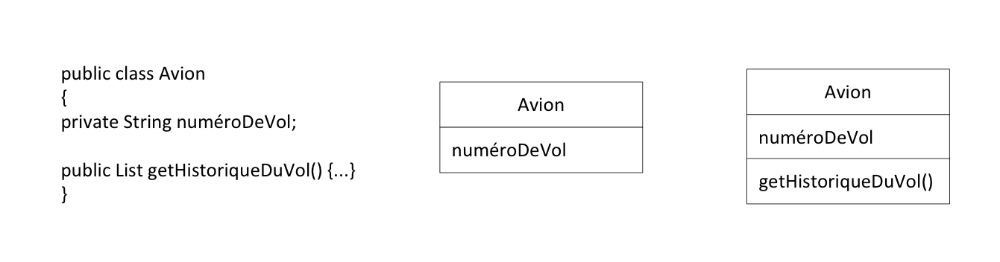{width=75% .plain}

1. Conceptuelle, Spécification, Spécification
2. Implémentation, Conceptuelle, Spécification
3. Implémentation, Spécification, Conceptuelle

[<div class='footer'>Table des matières Analyse et conception orienté objet</div>](#acootdm)

--


<!--------------------------------------------------------------->
<!-- .slide: id='etude8' class="mddslide"  -->
## Conception d'objet 1/2
- Comment les développeurs conçoivent-ils des objets?
  - Ils codent. On conçoit en codant (vous avez fait ça au CÉGEP, en INF111, en LOG121, en stage?)
  - Outils de réusinage (refactoring)

--

<!-- .slide: class="mddslide"  -->

## Conception d'objet 2/2

- Comment les développeurs conçoivent-ils des objets?
  - Ils tracent des diagrammes puis ils codent.
  - UML au tableau blanc, puis Java dans Eclipse
- Ils se contentent de tracer des diagrammes.
  - Les outils ne sont pas encore capables de faire le codage à partir des diagrammes… (est-ce vrai?)

--

<!-- .slide: class="mddslide"  -->

## Qu'est-ce qui est plus important?
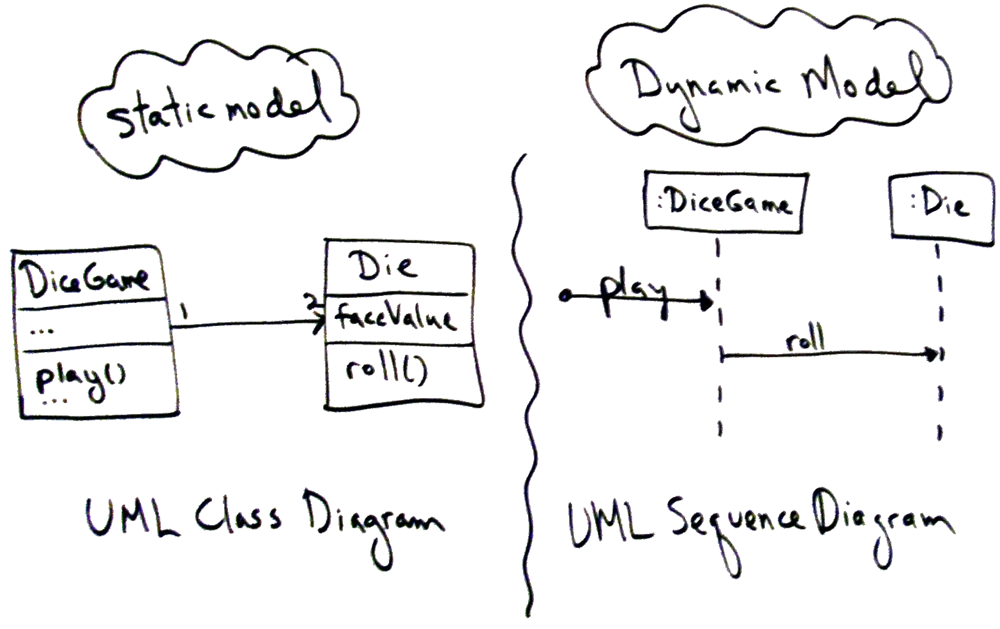{.plain width=80%}

Note: les deux ont des avantages et inconvénients

--

<!-- .slide: class="mddslide"  -->

## Cartes CRC

- Classe, Responsabilité, Collaborateurs
- Utilisées pour faire le design
1. [LOG121](https://horstmann.com/oodp3/slides/ch02/#(22)) (Cay Horstmann, chap: 2.12):
{.plain}

--

<!-- .slide: class="mddslide"  -->

## Exemple CRC
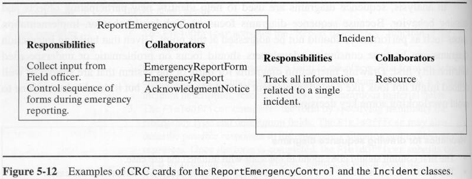{.plain}

ref: Object-Oriented Software Engineering, Bruegge &amp; Dutoit, Prentice-Hall, 2000.

--

<!-- .slide: class="mddslide"  -->

## Résumé
- Modélisation agile
  - Caméra pour numériser les esquisses
  - Habileté avec UML
- Modélisation dynamique est importante
- Pas beaucoup de temps pour modéliser
  - Une itération de 3 semaines (120 h) 
  - 2 à 8 heures de modélisation, pas plus

[<div class='footer'>Table des matières Analyse et conception orienté objet</div>](#acootdm)

---

<!--=======================================================================================================-->
<!-- .slide: id='equipetdm' class="equipeslide"  -->
## Module travail d'équipe
1. [Travail d'équipe (HRC)](#equipe1) - [25.53m](https://youtu.be/KJUXa8Yxrl4)
2. [Confiance](#confiance3) - [4.33m](https://youtu.be/yge8cI11JRE)
3. [Humilité](#equipe4) - [10.05m](https://youtu.be/rNHYdNo5cjU)
4. [Culture d'équipe](#equipe5) - [20.146m](https://youtu.be/0RN7ZoaIAEM)
5. [Rencontres efficace](#equipe6) - [7.17m](https://youtu.be/UYwIfODjHPI)
6. [Équipe en laboratoire](#equipe8) 

:::block {style=font-size:0.5em}
[Séances](#seances) | [Quiz](#quiztdm) | [Laboratoires](#laboratoiretdm) | [Intro](#introtdm) | [Équipe](#equipetdm) | [PU](#putdm) | [DCU](#dcutdm) | [CU](#cutdm) | 
[IU](#iutdm) | [MDD](#mddtdm) | [Dss](#dsstdm) | [Contrat](#contrattdm) | [RDCU](#rdcutdm) | [DCL](#dcltdm) | 
[Couche](#couchetdm) | [Exercice](#exercicetdm) | [Typescript](#typescripttdm) | [Complexite](#complexitetdm) 
| [FURPS](#furpstdm) | [TDD](#tddtdm) | [GOF](#goftdm) | [Diagrammes](#diagrammestdm) | [Divers](#diverstdm)  
:::

--

<!--------------------------------------------------------------->
<!-- .slide: id='equipe1' class="equipeslide"  -->
## Développement de logiciel en équipe
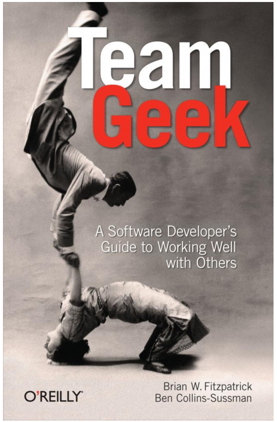{width=35%}{style=border:none}

--

<!-- .slide: class="equipeslide"  -->
## Développement de logiciel en équipe

Pratiquement tout conflit social est dû à un manque d'humilité, de respect ou de confiance.

{width=50%}{style=border:none}

:::block {style=font-size:0.5em}
référence: «Team Geek» Brian W. Fitzpatrick (Google), Ben Collins-Sussman (Subversion, Google)
:::

--

<!-- .slide: class="equipeslide"  -->
## Humilité
Trouvez-moi un exemple ou:
- un étudiant ou un professeur fait preuve d'humilité
- un étudiant ou un professeur ne fait pas preuve d'humilité{.fragment .shade-up}

--

<!-- .slide: class="equipeslide"  -->

## Respect
Trouvez-moi un exemple d'un manque de respect:

- envers un coéquipier
- envers les élèves de la classe{.fragment .shade-up}
- d'un étudiant envers un professeur ou un chargé de laboratoire{.fragment .shade-up}
- d'un professeur/chargé de laboratoire envers un étudiant{.fragment .shade-up}

Note:  3 animations

--

<!-- .slide: class="equipeslide"  -->
## Confiance
Trouvez-moi un exemple d'une:

- action qui donne confiance à mes coéquipiers
- action qui diminue la confiance envers mes coéquipiers{.fragment .shade-up}

Note: 1 animation

--


<!-- .slide: class="equipeslide"  -->

#### Pourquoi l'enseignant décide les membres de l'équipe? (1/2)

- Pour apprendre les compétences non-techniques
  - Demandées par les employeurs
  - N'évoluent pas autant que les compétences techniques (p.ex. Flash)
- On ne choisit pas (facilement) son équipe en entreprise
- Travailler avec des collègues différents tout au long de son baccalauréat élargit son réseau de contacts
- Impact positif pour la carrière

::: block {style=font-size:0.5em}
Mark Granovetter, «The Strength  of Weak Ties » , Academic Press, 1977. 
:::

--

<!-- .slide: class="equipeslide"  -->

#### Pourquoi l'enseignant décide les membres de l'équipe? (2/2)

- Favorise le « coaching » car il y a de la diversité
- Un coéquipier moins fort dans un aspect du projet peut bénéficier du coaching d'un membre plus fort
- Le « coach » peut bénéficier également de ce qu'on appelle «deep learning»
- L'équipe est finalement plus cohésive et plus performante
  

--

<!-- .slide: class="equipeslide"  -->

### Éviter les comportements dysfonctionnels

- Chacun fait "sa part" sans se soucier de la santé de l'équipe et de la qualité globale du projet
  - L'équipe > moi (appliquer l'humilité)
  - Rester flexible pour les tâches, s'adapter
  - Proactivité envers problèmes dans l'équipe:
    - Exiger la présense des coéquipiers
    - Demander de l'aide (technologies)
    - S'impliquer!

Note: l'absense de preuves de proactivité vous donne tord généralement s'il y a un conflit majeur

--

<!-- .slide: class="equipeslide"  -->

### Éviter les comportements dysfonctionnels

- Un ou deux membres prennent tout le contrôle (manque de confiance)
  - Reconnaître les niveaux différents et aider (faire du coaching)
  - Être patient avec les membres ayant moins d'expérience
  - Membres ayant besoin d'aide doivent la chercher tôt (être proactif, s'impliquer)
  - Facteur de bus > 1

[<div class='footer'>Table des matières equipe</div>](#equipetdm)

Note: exclure quelqu'un veut dire qu'il ne pourra pas aider


--

<!--------------------------------------------------------------->
<!-- .slide: id="confiance3" class="equipeslide"  -->
## [confiance](#equipetdm)
:::block {style=font-size:0.5em}
[Séances](#seances) | [Quiz](#quiztdm) | [Laboratoires](#laboratoiretdm) | [Intro](#introtdm) | [Équipe](#equipetdm) | [PU](#putdm) | [DCU](#dcutdm) | [CU](#cutdm) | 
[IU](#iutdm) | [MDD](#mddtdm) | [Dss](#dsstdm) | [Contrat](#contrattdm) | [RDCU](#rdcutdm) | [DCL](#dcltdm) | 
[Couche](#couchetdm) | [Exercice](#exercicetdm) | [Typescript](#typescripttdm) | [Complexite](#complexitetdm) 
| [FURPS](#furpstdm) | [TDD](#tddtdm) | [GOF](#goftdm) | [Diagrammes](#diagrammestdm) | [Divers](#diverstdm)  
:::


--

## confiance 

- Je crois que les autres coéquipiers sont compétents et qu'ils feront la bonne chose.
- Je suis à l'aise lorsqu'ils prennent le volant, le cas échéant.

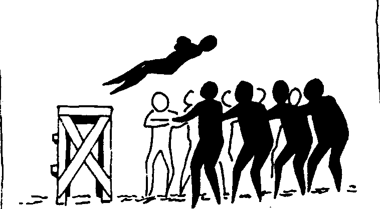{width=50%}

--

<!-- .slide: class="equipeslide"  -->

#### Tendances comportementales chez les développeurs…

- Je ne veux pas montrer mon code source à mes coéquipiers…
    - Mon code n'est pas fini…
    - J'ai trop peur d'être jugé(e)…
    - J'ai peur que quelqu'un vole mon idée…  
Il s'agit de l'insécurité. C'est normal!

{width=35%}{.plain}

--

<!-- .slide: class="equipeslide"  -->
### Cacher ses idées augmente le risque…
- de faire des erreurs dans la conception initiale.
- de «&nbsp;réinventer la roue&nbsp;».
- de terminer le travail plus tard que son compétiteur, qui, lui, a collaboré avec son équipe.

{width=40%}{.plain}

[<div class='footer'>Table des matières equipe</div>](#equipetdm)

--

<!--------------------------------------------------------------->
<!-- .slide: id='equipe4' class="equipeslide"  -->
## Humilité
:::block {style=font-size:0.5em}
[Séances](#seances) | [Quiz](#quiztdm) | [Laboratoires](#laboratoiretdm) | [Intro](#introtdm) | [Équipe](#equipetdm) | [PU](#putdm) | [DCU](#dcutdm) | [CU](#cutdm) | 
[IU](#iutdm) | [MDD](#mddtdm) | [Dss](#dsstdm) | [Contrat](#contrattdm) | [RDCU](#rdcutdm) | [DCL](#dcltdm) | 
[Couche](#couchetdm) | [Exercice](#exercicetdm) | [Typescript](#typescripttdm) | [Complexite](#complexitetdm) 
| [FURPS](#furpstdm) | [TDD](#tddtdm) | [GOF](#goftdm) | [Diagrammes](#diagrammestdm) | [Divers](#diverstdm)  
:::

--

<!-- .slide: class="equipeslide"  -->
## Humilité
- Je ne suis pas le centre de l'univers.
- Je ne suis ni omniscient ni infaillible  
- Je suis ouvert à m'améliorer {.fragment .shade-up}

**Moi < Équipe** {.fragment .shade-up}
  
Note: 4 animations, omniscient -> qui sait tout

--

<!-- .slide: class="equipeslide"  -->
##  Humilité en pratique…
- Si quelqu'un travaille sans assez d'humilité
  - «Veux-tu descendre de ton piédestal?»
- Même si tu es le plus fort en JavaScript dans l'équipe, ne le mets pas en évidence constamment. C'est agaçant.
- Dans certaines cultures, l'humilité est très importante (p. ex. le confucianisme).


--

<!-- .slide: class="equipeslide"  -->
##  Humilité en pratique…
- Apprendre à donner et à accepter les critiques **CONSTRUCTIVES**
- Les donner avec respect, p.ex. « J'ai de la misère à comprendre le flot de contrôle ici dans ton code » plutôt que « Ton code est mal écrit. »
- Les accepter avec humilité, p.ex. « Je comprends ton point de vue. Je vais refactoriser ce code en fin de semaine. »
- Savoir que son estime de soi n'équivaut pas à sa qualité de code.


--

<!-- .slide: class="equipeslide"  -->
## Humilité en pratique…

- Apprendre à être patient
- Chacun a sa personnalité et donc sa façon de déboguer, de concevoir, d'écrire du code
- Rester susceptible à l'influence des autres…
- Plus on est ouvert à être influencé, plus on *peut* influencer
- Plus on est vulnérable, plus on a l'air fort
- Si on veut être entendu, on doit d'abord écouter

[<div class='footer'>Table des matières equipe</div>](#equipetdm)

--

<!--------------------------------------------------------------->
<!-- .slide: id='equipe5' class="equipeslide" -->
## Culture d'équipe
:::block {style=font-size:0.5em}
[Séances](#seances) | [Quiz](#quiztdm) | [Laboratoires](#laboratoiretdm) | [Intro](#introtdm) | [Équipe](#equipetdm) | [PU](#putdm) | [DCU](#dcutdm) | [CU](#cutdm) | 
[IU](#iutdm) | [MDD](#mddtdm) | [Dss](#dsstdm) | [Contrat](#contrattdm) | [RDCU](#rdcutdm) | [DCL](#dcltdm) | 
[Couche](#couchetdm) | [Exercice](#exercicetdm) | [Typescript](#typescripttdm) | [Complexite](#complexitetdm) 
| [FURPS](#furpstdm) | [TDD](#tddtdm) | [GOF](#goftdm) | [Diagrammes](#diagrammestdm) | [Divers](#diverstdm)  
:::

--

<!-- .slide: class="equipeslide"  -->
## Culture d'équipe
::: block {style=font-size:0.70em}
- Qu'est-ce qu'une culture d'équipe?
  - Ensemble de valeurs, d'objectifs, d'expériences qui est unique à chaque équipe.
  - Éléments «&nbsp;codage&nbsp;» : revues de code, développement piloté par les tests, documentation de la conception, etc.
  - Éléments sociaux: sushi à midi, ou un 5 à 7 le vendredi, etc.
- Qu'elle soit bonne ou mauvaise, la culture existera
- Le leader ne décide pas la culture; il s'en occupe.
:::
{width=20%}{style=border:none}

--

<!-- .slide: class="equipeslide"  -->
## Culture forte d'équipe

- Culture ouverte au changement qui l'améliore, mais résistant à un changement radical qui lui fait mal.
- Celle qui concentre l'effort sur **la livraison de logiciel génial** est la mieux réussite.
- Efforts pour souder une équipe ne mènent pas toujours à la productivité:
  - faire la fête, surenchère de programmation, faire des rencontres

--

<!-- .slide: class="equipeslide"  -->
## Culture forte d'équipe
- Une culture forte sera une culture d'auto-sélection
- Culture de code propre et facile à maintenir attirera des développeurs appréciant ces valeurs…
- Culture d'agressivité, d'initiation, de dérapages verbaux, etc. attirera des développeurs appréciant ces valeurs…

--

<!-- .slide: class="equipeslide"  -->
### Éléments pour les cultures d'équipe réussites
::: block {style=font-size:0.8em}
- Énoncé de mission d'équipe
- Culture de HRC
- favorise une participation des coéquipiers extrovertis et introvertis
- team.égo > coéquipier[i].égo
- La critique constructive
  - facile à recevoir
  - difficile à donner : ne pas oublier «&nbsp;respect&nbsp;»
- Bonne communication est essentielle
- Moyens de communication diversifiés
- Listes de diffusion
- Documentation de design
- Communication synchrone (rencontres) vs asynchrone (courriel)
:::

--

<!-- .slide: class="equipeslide"  -->
### Comportements menaçant une bonne culture

- Ne pas respecter le temps des autres
- Ne pas respecter une décision prise par l'équipe
- Ne pas écouter ou respecter les autres
- Ne pas faire de compromis
- Être perfectionniste
- Être provocateur (troll) / Répondre aux provocateurs (trolls)
- Devenir trop affectif

*L'attention et la concentration sont primordiales.*

--

<!-- .slide: class="equipeslide"  -->
### Comment agir face à ces comportements
::: block {style=font-size:0.85em}
- Chercher des faits dans le drame
- Si quelqu'un se plaint, même avec trop d'émotion, lui donner le bénéfice du doute et chercher les causes (malgré le manque de respect, etc.)
- Amener la discussion sur un plan technique si possible.
- Souvent il y a des choses à améliorer dans la situation.
- La gentillesse peut chasser les trolls en fin de compte…

{.plain width=25%}

--

<!-- .slide: class="equipeslide"  -->
### Comment agir face à ces comportements

::: block {style=font-size:0.85em}

- Se concentrer sur l'objectif à long terme
- Un témoin de comportement délétère se demande:
  - Malgré la perte de concentration de l'équipe à court terme, une résolution du drame sera-t-elle bénéfique à l'équipe à long terme?
  - Est-ce que la situation se résoudra d'elle-même?
- Si la réponse est «&nbsp;non&nbsp;» à une de ces questions, mettre fin au comportement immédiatement (sans résolution).
:::
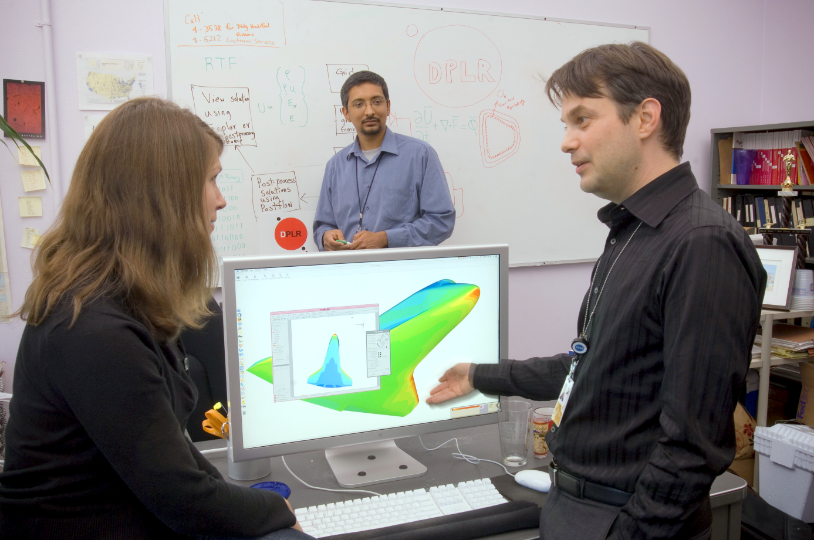{.plain width=25%}

--

<!-- .slide: class="equipeslide"  -->
### Comment agir face à ces comportements
- Savoir quand abandonner
- Parfois le comportement d'un coéquipier ne s'améliore pas malgré beaucoup d'efforts. Il faut dans ce cas l'isoler de l'équipe.

> Avant de demander un changement d'équipe, il faudra avoir essayé une approche HRC et être en mesure de l'expliquer à l'enseignant.

--

<!-- .slide: class="equipeslide"  -->
## Culture d'équipe

- La plupart des gens ne sont pas des imbéciles!
- Cependant, il est naïf de penser aux gens comme «&nbsp;**bons**» ou «&nbsp;**mauvais**&nbsp;».
- La malice qui menace une bonne culture d'équipe est souvent expliquée par **l'ignorance**, **le besoin d'être reconnu**, ou **un manque d'empathie**…
- Il faut toujours être tolérant *envers les gens*, mais *ne pas tolérer les comportements* qui nuisent à une bonne culture d'équipe (selon la norme HRC).

[<div class='footer'>Table des matières equipe</div>](#equipetdm)

--

<!--------------------------------------------------------------->
<!-- .slide: id="equipe6" class="equipeslide"  -->
## Rencontres efficaces
:::block {style=font-size:0.5em}
[Séances](#seances) | [Quiz](#quiztdm) | [Laboratoires](#laboratoiretdm) | [Intro](#introtdm) | [Équipe](#equipetdm) | [PU](#putdm) | [DCU](#dcutdm) | [CU](#cutdm) | 
[IU](#iutdm) | [MDD](#mddtdm) | [Dss](#dsstdm) | [Contrat](#contrattdm) | [RDCU](#rdcutdm) | [DCL](#dcltdm) | 
[Couche](#couchetdm) | [Exercice](#exercicetdm) | [Typescript](#typescripttdm) | [Complexite](#complexitetdm) 
| [FURPS](#furpstdm) | [TDD](#tddtdm) | [GOF](#goftdm) | [Diagrammes](#diagrammestdm) | [Divers](#diverstdm)  
:::

--

<!-- .slide:  class="equipeslide"  -->
## Rencontres efficaces

1. N'inviter que ceux qui doivent absolument être présents.
2. Préparer et distribuer l'ordre du jour bien avant que ça commence.
3. Terminer tôt si les objectifs ont été atteints.
4. Respecter l'ordre du jour.
5. Planifier autour des pauses habituelles (p.ex., à midi, à la fin de la journée).

[TeamGeek]

[<div class='footer'>Table des matières equipe</div>](#equipetdm)

--

<!--------------------------------------------------------------->
<!-- .slide: id="equipe8" class="equipeslide"  -->
## Équipe en laboratoire
:::block {style=font-size:0.5em}
[Séances](#seances) | [Quiz](#quiztdm) | [Laboratoires](#laboratoiretdm) | [Intro](#introtdm) | [Équipe](#equipetdm) | [PU](#putdm) | [DCU](#dcutdm) | [CU](#cutdm) | 
[IU](#iutdm) | [MDD](#mddtdm) | [Dss](#dsstdm) | [Contrat](#contrattdm) | [RDCU](#rdcutdm) | [DCL](#dcltdm) | 
[Couche](#couchetdm) | [Exercice](#exercicetdm) | [Typescript](#typescripttdm) | [Complexite](#complexitetdm) 
| [FURPS](#furpstdm) | [TDD](#tddtdm) | [GOF](#goftdm) | [Diagrammes](#diagrammestdm) | [Divers](#diverstdm)  
:::

--

<!-- .slide: class="equipeslide"  -->
## Travail d'équipe au niveau du laboratoire
- Quels sont les problèmes HRC rencontré par votre équipe?
- Quels solutions avez vous apportées?

[<div class='footer'>Table des matières equipe</div>](#equipetdm)

---

<!--=======================================================================================================-->
<!-- .slide: id='putdm'   -->
## Module Processus Unifié
1. [Phases du processus unifié + inception ](#pu1) - [5.21m](https://youtu.be/SR7BoDKVbPg)
2. [Durée typique](#pu6) - [15.20m](https://youtu.be/-HdeYp9Qr5I)
3. [Développement itératif et incrémental](#pu11) - [13.23m](https://youtu.be/HQnMJE7H1x0)
:::block {style=font-size:0.5em}
[Séances](#seances) | [Quiz](#quiztdm) | [Laboratoires](#laboratoiretdm) | [Intro](#introtdm) | [Équipe](#equipetdm) | [PU](#putdm) | [DCU](#dcutdm) | [CU](#cutdm) | 
[IU](#iutdm) | [MDD](#mddtdm) | [Dss](#dsstdm) | [Contrat](#contrattdm) | [RDCU](#rdcutdm) | [DCL](#dcltdm) | 
[Couche](#couchetdm) | [Exercice](#exercicetdm) | [Typescript](#typescripttdm) | [Complexite](#complexitetdm) 
| [FURPS](#furpstdm) | [TDD](#tddtdm) | [GOF](#goftdm) | [Diagrammes](#diagrammestdm) | [Divers](#diverstdm)  
:::

--

<!--------------------------------------------------------------->
<!-- .slide: id='pu1' class="puslide"  -->
## Phases du Processus Unifié

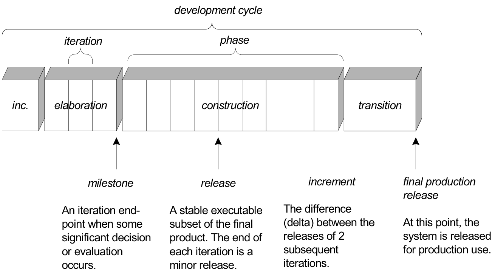{style="border:none; margin-left:12%"}

--

<!-- .slide: class="puslide"  -->

## Phase  Inception
- Étude de faisabilité
    - Vision approximative
    - Estimations globales
    - Cas d'utilisation
    - Continuer ou non (p.ex. chercher le financement)

    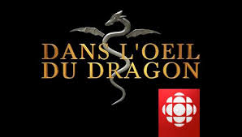{style="margin-left:25%"}

- Ne pas confondre avec
    - analyse des exigences

[<div class='footer'>Table des matières processus unifié</div>](#putdm)

--

<!--------------------------------------------------------------->
<!-- .slide: id='pu6' class="puslide"  -->
## Processus unifié?

- Quelle est une durée typique d'une itération dans le processus unifié?

--

<!-- .slide: class="puslide"  -->

### Approche évolutive vs approche en cascade

{.plain width=75%}

--

<!-- .slide: class="puslide"  -->

## Processus Unifié

- Souple et ouvert – peut accommoder l'Extreme Programming (XP), Scrum, etc.
 - Développement piloté par les tests
    - intégration continue «&nbsp;war room&nbsp;»
    - réunions quotidiennes
    - etc.
- Processus *itératif* et *évolutif*

--

<!-- .slide: class="puslide"  -->
## Itératif et évolutif

{.plain}

--

<!-- .slide: class="puslide"  -->

## Résumé

::: block {style=font-size:0.8em}
- Avantages du processus unifié
    - courtes itérations produisant un système partiel
    - rétroaction du client permet d'ajuster la prochaine itération
    - meilleure gestion du risque
- Inconvénients
    - Clients veulent les «&nbsp;promesses&nbsp;» de coûts au début
    - Contrat traditionnel (!) n'est pas adapté pour un processus itératif (orienté modèle en cascade)
:::

<!-- .slide: data-fullscreen data-background-image="http://ecx.images-amazon.com/images/I/51pmCeDUXmL._SS500_.jpg" 

data-background-size="20%" data-background-position="top 5% right 5%" data-background-opacity="0.5" -->

[<div class='footer'>Table des matières processus unifié</div>](#putdm)

--

<!--------------------------------------------------------------->
<!-- .slide: id='pu11' class="puslide" -->
## Processus Unifié

- Souple et ouvert – peut accommoder l'Extreme Programming (XP), Scrum, etc.
- Développement piloté par les tests
- Processus *itératif* et *évolutif*

--

<!-- .slide: class="puslide" -->
## Itératif et évolutif

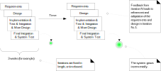{.plain}

--

<!-- .slide: class="puslide" -->
## Stabilisation

{.plain}


--

<!-- .slide: class="puslide" -->
## Itératif et évolutif

{.plain width=80%}

--

<!-- .slide: class="puslide" -->
#### Gestion des exigences  (Humour)
::: block {style=font-size:0.6em}
Écrire des spécifications correctes et complètes n'est pas facile.
:::

<iframe width="932" height="500" src="https://www.youtube.com/embed/cDA3_5982h8?start=36" frameborder="0" allow="accelerometer; autoplay; encrypted-media; gyroscope; picture-in-picture" allowfullscreen></iframe>

[<div class='footer'>Table des matières processus unifié</div>](#putdm)

---

<!--=======================================================================================================-->
<!-- .slide: id='dcutdm'   -->
## Module Diagramme de cas d'utilisation
1. [DCU](#dcu1) - Diagramme de cas d'utilisation - [3.24m](https://youtu.be/ZtCCUaEfOgQ)
:::block {style=font-size:0.5em}
[Séances](#seances) | [Quiz](#quiztdm) | [Laboratoires](#laboratoiretdm) | [Intro](#introtdm) | [Équipe](#equipetdm) | [PU](#putdm) | [DCU](#dcutdm) | [CU](#cutdm) | 
[IU](#iutdm) | [MDD](#mddtdm) | [Dss](#dsstdm) | [Contrat](#contrattdm) | [RDCU](#rdcutdm) | [DCL](#dcltdm) | 
[Couche](#couchetdm) | [Exercice](#exercicetdm) | [Typescript](#typescripttdm) | [Complexite](#complexitetdm) 
| [FURPS](#furpstdm) | [TDD](#tddtdm) | [GOF](#goftdm) | [Diagrammes](#diagrammestdm) | [Divers](#diverstdm)  
:::

--


<!--------------------------------------------------------------->
<!-- .slide: id='dcu1' class="dcuslide"  -->
## DCU (LOG410) 
### Diagramme de cas d'utilisation

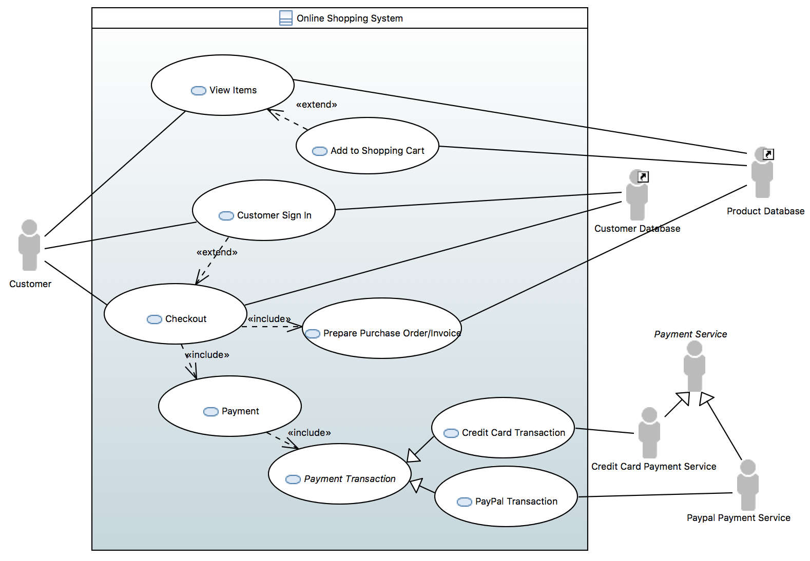{style="border:none"}{width=50%}

https://plantuml.com/use-case-diagram

Note: LOG410

--

<!-- .slide: class="dcuslide"  -->
#### Concepts de base du  diagramme   de  cas  d'utilisation
1. **Sujet (subject)** 
    -  Le sujet est utilisé  pour délimiter  le système  de son environnement
1. **Acteur** 
    - Entité externe  qui interagit  avec le système
    - Peut représenter  des personnes  / utilisateurs  et d'autres systèmes externes  avec lesquels  le système interagit

--

<!-- .slide: class="dcuslide"  -->
#### Concepts de base du  diagramme   de  cas  d'utilisation...

1. **Cas d'utilisation**
    - Fonctionnalité fournie  par le système 
    - Décrit comme une séquence d'étapes  / actions
1. **Relations**
    - L'interaction  entre les acteurs  et un cas d'utilisation est spécifiée à l'aide d'une  association.
    - Différents  types de relations entre les cas d'utilisation: include, extend, generalization/inheritance


--

<!-- .slide: class="dcuslide"  -->
## Trois types d‘acteurs
::: block {style=font-size:32px}
1. **Acteur principal**
    - il a un objectif et utilise le système à l'étude (SAE)
1. **Acteur de support**
    - fournit un service, une information, au SAE
    - p.ex. système d'autorisation de paiement. Peut être humain, système externe ou équipement.
1. **Intervenant**
    - a un intérêt, mais ni acteur principal ou acteur de support (ex: service des taxes du gouvernement, comptable, vérificateur, propriétaire, client, …)
:::

--

<!-- .slide: class="dcuslide"  -->
## Diagramme de cas d'utilisation (agile)
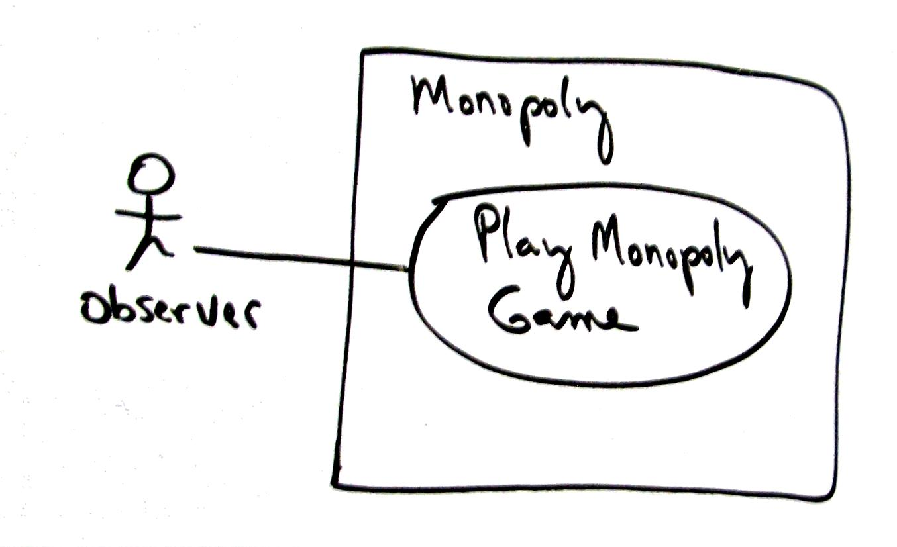{width=60%}{style=border:none}

[<div class='footer'>Table des matières diagramme de cas d'utilisation</div>](#dcutdm)


---

<!--=======================================================================================================-->
<!-- .slide: id='cutdm'   -->
## Module Cas d'utilisation
1. [CU](#cu1) - Cas d'utilisation informel - [1.53m](https://youtu.be/JgesxHruhmo)
2. [CU](#cu6) - Cas d'utilisation - types

:::block {style=font-size:0.5em}
[Séances](#seances) | [Quiz](#quiztdm) | [Laboratoires](#laboratoiretdm) | [Intro](#introtdm) | [Équipe](#equipetdm) | [PU](#putdm) | [DCU](#dcutdm) | [CU](#cutdm) | 
[IU](#iutdm) | [MDD](#mddtdm) | [Dss](#dsstdm) | [Contrat](#contrattdm) | [RDCU](#rdcutdm) | [DCL](#dcltdm) | 
[Couche](#couchetdm) | [Exercice](#exercicetdm) | [Typescript](#typescripttdm) | [Complexite](#complexitetdm) 
| [FURPS](#furpstdm) | [TDD](#tddtdm) | [GOF](#goftdm) | [Diagrammes](#diagrammestdm) | [Divers](#diverstdm)  
:::

--


<!--------------------------------------------------------------->
<!-- .slide:  id='cu1' class="cuslide"  -->
## Cas d'utilisation - informel
1. **Traiter une vente.**  Un client arrive à la caisse avec les articles qu'il souhaite acheter. Pour enregistrer chaque article, le caissier utilise le système POS, lequel présente le détail des articles et le montant total des achats. Le client fournit les informations nécessaires pour le règlement. Le système valide et enregistre ces informations, puis met à jour les quantités en stock et imprime le ticket de caisse destiné au client. La vente est terminée et le client peut quitter le magasin.

--

<!-- .slide: class="cuslide"  -->

#### De la description du cas d'utilisation au diagramme  de cas d'utilisation
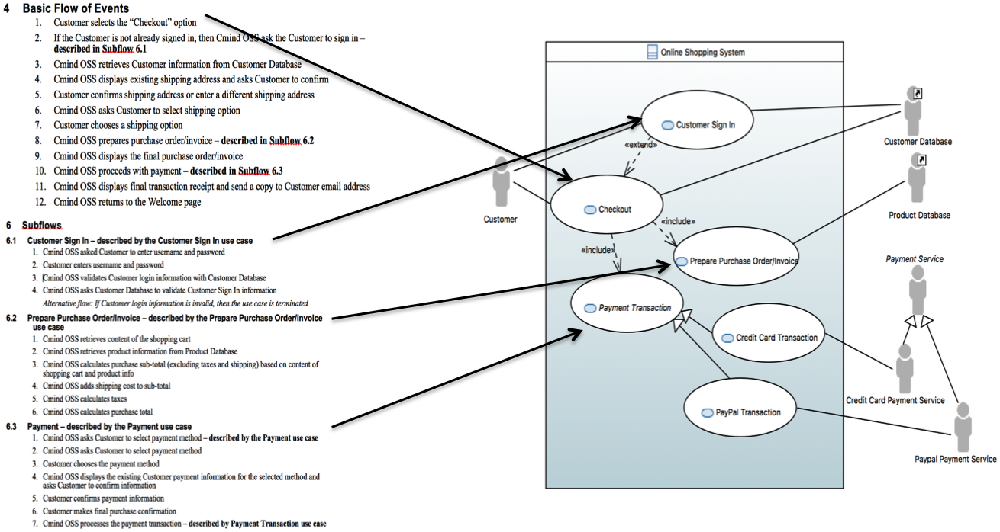{style=border:none}

[<div class='footer'>Table des matières cas d'utilisation</div>](#cutdm)

--


<!--------------------------------------------------------------->
<!-- .slide:  id='cu6' class="cuslide"  -->
### Cas d'utilisation
::: block {style=font-size:0.8em}
- Que fait le système et non comment
- Trois types:
    - Abrégé
        - Un paragraphe décrivant le scénario principal
    - Informel (casual)
        - Plusieurs paragraphes décrivant plusieurs scénarios
    - Détaillé
        - Toutes les étapes et les variantes sont indiquées en détail, de même que les préconditions et les garanties en cas de succès
:::

--

<!-- .slide: class="cuslide"  -->

## Définitions
::: block {style=font-size:0.8em}
- Acteur
    - Entité qui a un comportement, comme une personne (identifiée par un rôle)
- Scénario
    - Suite spécifique d'actions et d'interactions entre un ou plusieurs acteurs et le système. C'est une histoire particulière de la façon dont on utilise un système
- Cas d'utilisation
    - Collection de scénarios de réussite ou d'échec.
:::

--

<!-- .slide: class="cuslide"  -->
## Acteur

- Quelque chose ayant un comportement
    - un usager, identifié par un rôle
    - un système informatique
    - une organisation
    - par exemple : un cassier

{width=20% .plain}

[<div class='footer'>Table des matières cas d'utilisation</div>](#cutdm)


---

<!--=======================================================================================================-->
<!-- .slide: id='iutdm'   -->
## Module d'interface usagé
1. [IU](#iu1) - Interface Usager vs DSS [6.22m](https://youtu.be/2uiPVpRFNxA)

:::block {style=font-size:0.5em}
[Séances](#seances) | [Quiz](#quiztdm) | [Laboratoires](#laboratoiretdm) | [Intro](#introtdm) | [Équipe](#equipetdm) | [PU](#putdm) | [DCU](#dcutdm) | [CU](#cutdm) | 
[IU](#iutdm) | [MDD](#mddtdm) | [Dss](#dsstdm) | [Contrat](#contrattdm) | [RDCU](#rdcutdm) | [DCL](#dcltdm) | 
[Couche](#couchetdm) | [Exercice](#exercicetdm) | [Typescript](#typescripttdm) | [Complexite](#complexitetdm) 
| [FURPS](#furpstdm) | [TDD](#tddtdm) | [GOF](#goftdm) | [Diagrammes](#diagrammestdm) | [Divers](#diverstdm)  
:::

--


<!--------------------------------------------------------------->
<!-- .slide: id="iu1" class="uislide"  -->
## Interface Usager
- Réaliser les wireframes des différentes interfaces usagées nécessaires pour la réalisation du cas d'utilisation [Noter une réservation](#cu1-noter-une-reservation)

- Utiliser plant uml
  - https://plantuml.com/salt

[<div class='footer'>Table des matières interface usager</div>](#iutdm)

---

<!--=======================================================================================================-->
<!-- .slide: id='mddtdm'   -->
## Module MDD
1. [Modèle du domaine](#mdd1) - [12.25m](https://youtu.be/LeakCzmEzEc)
2. [Catégories](#mdd2) - [30.27m](https://youtu.be/9ia0Mvdk4XY)
3. [Classes, Attributs, Associations](#mdd3) - [58.47m](https://youtu.be/THARfauPB-8)
4. [Composition](#mdd4) - [22.47](https://youtu.be/-GPYii8-ivk)
5. [Révision](#mdd5) - [6.05m](https://youtu.be/sL4QTfu6ld4)
6. [Décalage de représentataion](#mdd6) - [24.12m](https://youtu.be/y8AZDw_Z41I)
7. [Affinement du MDD](#affinementMDD10) - [25.42m](https://youtu.be/oIjKVwf1Wps)

:::block {style=font-size:0.5em}
[Séances](#seances) | [Quiz](#quiztdm) | [Laboratoires](#laboratoiretdm) | [Intro](#introtdm) | [Équipe](#equipetdm) | [PU](#putdm) | [DCU](#dcutdm) | [CU](#cutdm) | 
[IU](#iutdm) | [MDD](#mddtdm) | [Dss](#dsstdm) | [Contrat](#contrattdm) | [RDCU](#rdcutdm) | [DCL](#dcltdm) | 
[Couche](#couchetdm) | [Exercice](#exercicetdm) | [Typescript](#typescripttdm) | [Complexite](#complexitetdm) 
| [FURPS](#furpstdm) | [TDD](#tddtdm) | [GOF](#goftdm) | [Diagrammes](#diagrammestdm) | [Divers](#diverstdm)  
:::

--


<!--------------------------------------------------------------->
<!-- .slide: id='mdd1' class="mddslide"  -->
## Qu'est-ce qu'un modèle du domaine?
Représentation visuelle des classes conceptuelles ou des objets du monde réel dans 
un domaine donné [MO95, Fowler96]

- modèle conceptuel
- modèle objet du domaine
- modèle objet d'analyse

--

<!-- .slide: class="mddslide"  -->
#### Exemple avec l'outil PlantUML
{width=75% .plain}

[Plant Uml class diagram](https://plantuml.com/class-diagram)

--

<!-- .slide: class="mddslide"  -->
## Comment créer un modèle du domaine?
- Dans les limites des besoins de l'itération en cours:
    1. Identifier les classes conceptuelles.
    1. Les représenter sous forme de classes dans un diagramme UML.
    1. Ajouter des attributs et des associations.

--

<!-- .slide: class="mddslide"  -->
## Réaliser votre premier MDD
**En équipe de 2**
::: block {style=font-size:1em}
1. Trouver les classes du domaine
1. Ajouter des associations entre les classes lorsque vous désirez persister cette relation
1. Ajouter un verbe pour décrire cette association
1. Ajouter une multiplicité à l'association
:::
[<div class='footer'>Table des matières modèle du domaine</div>](#mddtdm)

--

<!--------------------------------------------------------------->
<!-- .slide: id="cu-noter-une-reservation1" class="mddslide"  -->
## Réaliser votre premier MDD
Cas d'utilisation «Noter une réservation»

**Scénario principal**

::: block {style=font-size:0.75em}
1. Un client appelle à l'hôtel pour placer une réservation. 
2. Le commis démarre une nouvelle réservation. 
3. Le commis entre: 
    - La date d'arrivée; 
    - La date de départ; 
    - Le nom de la catégorie de chambre; 
4. Le système inscrit les informations à la réservation.


[Interface usager](#iu1) | [Réaliser votre premier DSS](#realiser-votre-premier-dss) | [Itération suivante](#iteration-suivante)
:::
[<div class='footer'>Table des matières modèle du domaine</div>](#mddtdm)

--


<!--------------------------------------------------------------->
<!-- .slide: id="mdd2" class="mddslide"  -->
## Survol Visuel
{.plain}

Note: 
On dessine MDD, DSS, Contrat, RDCU sur cette image...

--

<!-- .slide: class="mddslide"  -->

## MDD
## Identifier classes conceptuelles

1. Réutiliser modèle existant
2. Catégories de classes
3. Groupes nominaux


--

<!-- .slide: class="mddslide"  -->

## Méthode 1: Modèle existant

{height=80% .plain}

--

<!-- .slide: class="mddslide"  -->

### Méthode 1: Modèle existant

[](https://www.researchgate.net/figure/Car-Crash-CMS-Domain-Model-Part-1_fig2_220116635){.plain>}

--

<!-- .slide: class="mddslide"  -->

### Méthode 2: Chercher par catégorie

Section 9.5 du livre.

{width="85%" .plain}

--

<!-- .slide: class="mddslide"  -->

## Catégorie de classe

Cas d'utilisation « S'inscrire à un groupe-cours »

1. L'Étudiant commence une inscription.
2. L'Étudiant entre le sigle du cours.
3. Le Système affiche la liste des groupes-cours ainsi que l'horaire de chaque groupe-cours.
4. L'étudiant sélectionne le groupe-cours auquel il veut s'inscrire.
5. …

>Catégories dans les [Notes de cours](https://drive.google.com/file/d/1__yjzv7vuqbX0ElxLj5AkVO0xEk7ubVO/view?usp=sharing)

Note: Faire une liste de classes du MDD avec **Transaction métier**, **Rôle**, **Évènement notable**

--

<!-- .slide: class="mddslide"  -->

## Méthode 3: identifier les groupes nominaux

- Analyse linguistique du texte des spécifications (Cas d'utilisation, Récit utilisateur, etc.)
- Noms $\rightarrow$ Classes conceptuelles ou attributs possibles
- Approche *simple*, mais *imprécise*

--

<!-- .slide: class="mddslide"  -->

## Identifier les groupes nominaux(...)

Cas d'utilisation « S'inscrire à un groupe-cours »

1. L'Étudiant commence une inscription.
2. L'Étudiant entre le sigle du cours.
3. Le Système affiche la liste des groupes-cours ainsi que l'horaire de chaque groupe-cours.
4. L'étudiant sélectionne le groupe-cours auquel il veut s'inscrire.
5. …

Note: Faire la liste des classes au tableau

--

<!-- .slide: class="mddslide"  -->

## Identifier les groupes nominaux(...)

Cas d'utilisation «S'inscrire à un <ins>groupe-cours</ins>»

1. L'<ins>Étudiant</ins>  commence une <ins>inscription</ins>.
2. L'Étudiant entre le <ins>sigle</ins>  du <ins>cours</ins>.
3. Le <ins>Système</ins>  affiche la <ins>liste</ins>  des groupes-cours ainsi que l'<ins>horaire</ins>  de chaque groupe-cours.
4. L'étudiant sélectionne le groupe-cours auquel il veut s'inscrire.
5. …

--

<!-- .slide: class="mddslide"  -->

## Identifier les groupes nominaux(...)

**Résultat:** *Classes candidates*

- Beaucoup de directives (Chapitre 9)
- Classe vs Attribut?
- Attribut vs Association?

C'est de l'analyse (pas la conception)

--

<!-- .slide: class="mddslide"  -->

## Exercice: MDD Classes Conceptuelles

<s>Google Classrooms</s>
[Exercices](#exercicetdm)
[<div class='footer'>Table des matières modèle du domaine</div>](#mddtdm)

--


<!--------------------------------------------------------------->
<!-- .slide: id="mdd3" class="mddslide"  -->
## MDD

- Classes conceptuelles
- Attributs
- Associations

--

<!-- .slide: class="mddslide"  -->

## *MDD - Jeu [Risk](https://fr.wikipedia.org/wiki/Risk)

{.plain width="100%"}

Note: 1) Classes 2) attributs 3) associations, 4) Association a un verbe (éviter verbes «avoir», «posséder», «contenir» car ils sont moins précis), 5) Association un sens de lecture (indiqué par triangle), 6) association a cardinalités 7) association parfois multiple (Pays et Attaque), 8) classe d'association (Occupation), 9) pas d'association qui ne sont pas «mémorables» (JeuRisk et Attaque) 10)composition

--

<!-- .slide: class="mddslide"  -->

### MDD - Attributs NextGen (Larman) 

Dans LOG210 il <span style="color:red">faut</span> spécifier les **types des attributs**

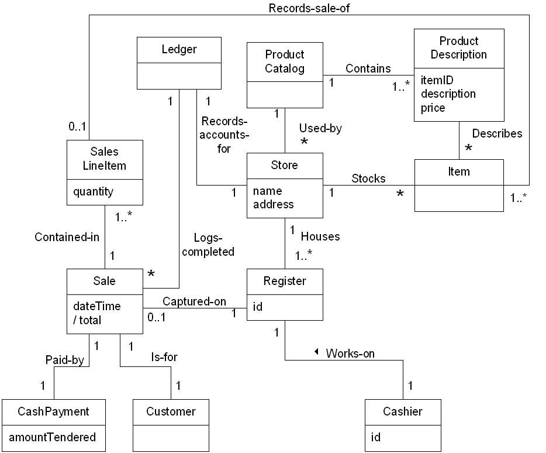{.plain width="60%"}

--

<!-- .slide: class="mddslide"  -->
## Attributs dérivés
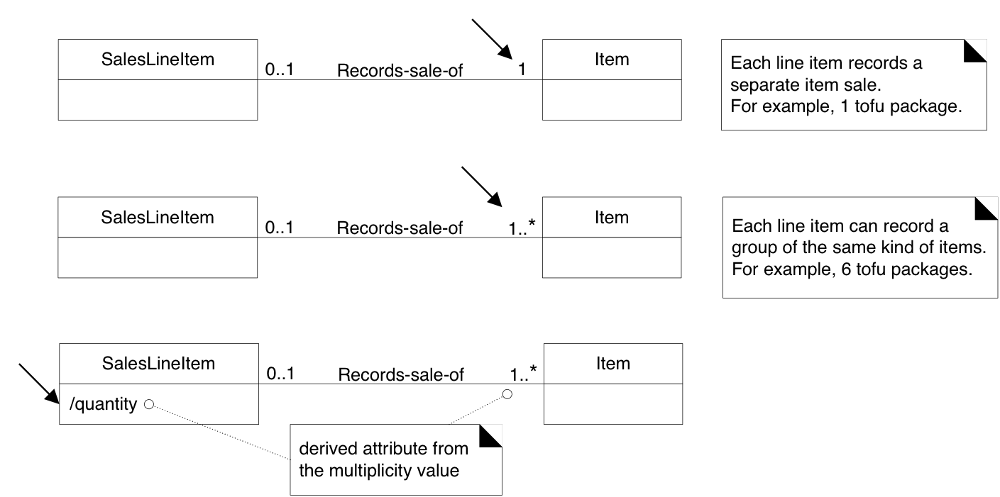{.plain}


--

<!-- .slide: class="mddslide"  -->
## *Attribut dérivé - Risk
Voyez-vous où appliquer un attribut dérivé?

{.plain width="80%"}

Note: Joueur./nbPaysOccupés: int

--

<!-- .slide: class="mddslide"  -->
### Calcul des renforts
On reçoit les renforts selon le nombre de pays occupés. Utiliser une **classe d'association**


{.plain width="35%"}

--

<!-- .slide: class="mddslide"  -->
## Types de données Ch. 9.16
- Définir de nouveaux types quand les types primitifs ne sont pas adéquats
  - ex : Sigle de cours $\rightarrow$ `LOG120`  
   {.plain}  
  - ex : un code SKU  
{.plain width="60%"}
 

--


<!-- .slide: class="mddslide"  -->
## UML : classes types de données
{.plain}

--

<!-- ## Entité -> nouveau type de donnée si…
Tableau 9.3
::: block {style=font-size:0.8em}
- Elle est composée de sections séparées
- Des opérations lui sont habituellement associées, comme une analyse syntaxique ou une validation (ex. numéro de carte de crédit){.fragment .shade-up}
- Elle a d'autres attributs (ex. prix promotionnel a une date de début et de fin){.fragment .shade-up}
- Elle a une quantité exprimée en unités (ex. Paiement en `$`US  ou  `$`CA){.fragment .shade-up}
- C'est une abstraction d'un ou de plusieurs types présentant l'une de ces propriétés{.fragment .shade-up}
    - ex. CodeArticle est une généralisation de UPC (Universal Product Code) ou EAN (European Article Number){.fragment .shade-up}
:::

-- -->

<!-- .slide: class="mddslide"  -->
## *Généralisation

Lire Ch. 32.2-32.7 (version française 26.2-26.7)

 {width=80%}{.plain}

Note: CashPayment a un attribut «&nbsp;amount&nbsp;» et CheckPayment est associé aussi à Sale. Une sous casse conceptuelle respecte les deux règles suivantes: Est-un, A 100%

--

<!-- .slide: class="mddslide"  -->
## Sous-classes conceptuelles

Les énoncés sur les super-classes s'appliquent aux sous-classes

 {.plain}


--

<!-- .slide: class="mddslide"  -->
## Règle «&nbsp;à 100%&nbsp;»
- 100% de la définition d'une classe conceptuelle est applicable aux sous-classes
- Sous-classe
    - conforme à 100% à sa superclasse
        - en termes d'attributs
        - en termes d'associations

--

<!-- .slide: class="mddslide"  -->
## Règle «&nbsp;est un&nbsp;»
- Sous-classe conceptuelle
    - est membre de l'ensemble de sa superclasse
    - objet d'une sous-classe **est un** objet de la super-classe

 {.plain width="70%"}

--

<!-- .slide: class="mddslide"  -->
### Définir une sous-classe conceptuelle quand elle...

- possède des attributs additionnels intéressants
- possède des associations additionnelles intéressantes
- réagit, est manipulée, est traitée d'une façon intéressante et
  - différemment de sa superclasse
  - différemment d'autres sous-classes
- représente un objet animé (humain, animal, robot) ayant un comportement différent et intéressant

Note: Exemples: Tableau F26.2/A32.2

--

<!-- .slide: class="mddslide"  -->
## Super-classe conceptuelle

- Quand définit-on une super-classe conceptuelle?
    - Lorsque les classes sont des variations de concepts similaires
    - respectent les règles à 100% et «&nbsp;est un&nbsp;»
    - ont des attributs communs
        - qui pourraient être placés dans la super-classe
    - ont les mêmes associations
        - qui pourraient s'appliquer à la super-classe

--

<!-- .slide: class="mddslide"  -->
## Exemple de partition inutile
 {.plain}

figure: F26.6, A32.6

--

### Classes d'association
::: block {style=font-size:0.8em}
- Services d'autorisation de paiement
    - assignent une identification à chaque magasin
    - demande d'autorisation de paiement  codeVendeur
    - le même magasin peut utiliser plusieurs services, chacun lui donnant un codeVendeur différent
- Dans quelle classe conceptuelle mettre codeVendeur?
:::
 {.plain}

--

<!-- .slide: class="mddslide"  -->
## Solution intermédiaire

 {.plain width=100%}

--

<!-- .slide: class="mddslide"  -->
## Classe d'association

 {.plain}

--

<!-- .slide: class="mddslide"  -->
## Ajout - classe d'association

- Règles pour l'ajout : 
    - un **attribut**  est lié à une association
    - la durée de vie des instances de la classe d'association dépend de l'association
        - «historic mapping» (patron d'analyse, M. Fowler)
- il y a une association N-N entre deux concepts et des **informations liées à l'association** elle-même.

https://martinfowler.com/apsupp/properties.pdf

--

<!-- .slide: class="mddslide"  -->
<!-- .slide: class="mddslide"  -->
## Classes d'association (Exemple)
 
{.plain width=60%}

--

<!-- .slide: class="mddslide"  -->
## *Solution Exercice MDD sur Google Classroom
voir: seance-03-exercice-reserverLivre

--


<!-- .slide: class="mddslide"  -->
## Exercice MDD (Hôtel)
::: block {style=font-size:0.7em}
1. Un client appelle à l'hôtel pour placer une réservation.
1. Le commis démarre une nouvelle réservation.
1. Le commis saisit la date d'arrivée; la date de départ; le nom de la catégorie de chambre; la quantité de chambres.
1. Le système inscrit les informations à la réservation.

Les étapes 3 et 4 sont répétées tant que le client n'indique pas qu'il a terminé{align="left"}

5. Le commis termine la réservation.
1. Le système affiche toutes les informations entrées.
1. Le commis valide les informations auprès du client et confirme la réservation à l'aide du nom et du numéro de téléphone du client.
1. Le système enregistre la réservation et affiche le numéro de confirmation.
1. Le commis communique le numéro de confirmation au client.
:::
voir seance-01-exercice-CU02

[<div class='footer'>Table des matières modèle du domaine</div>](#mddtdm)

--


<!--------------------------------------------------------------->
<!-- .slide: id='mdd4' class="mddslide"  -->
## MDD

Correction de l'exercice

--

<!-- .slide: class="mddslide" -->

## MDD?
- Attributs dérivées?
- Généralisation/spécialisation?{.fragment .shade-up}
  - Règle « à 100% »?{.fragment .shade-up}
  - Règle « est un »?{.fragment .shade-up}
  - Création d'une sous-classe conceptuelle?{.fragment .shade-up}
  - Création d'une super-classe conceptuelle?{.fragment .shade-up}
- Classe d'association{.fragment .shade-up}

--

<!-- .slide: class="mddslide" -->
## Agrégation et Composition
- N'utilisez pas l'agrégation (c'est un placébo)
- Utilisez la composition lorsque c'est approprié.

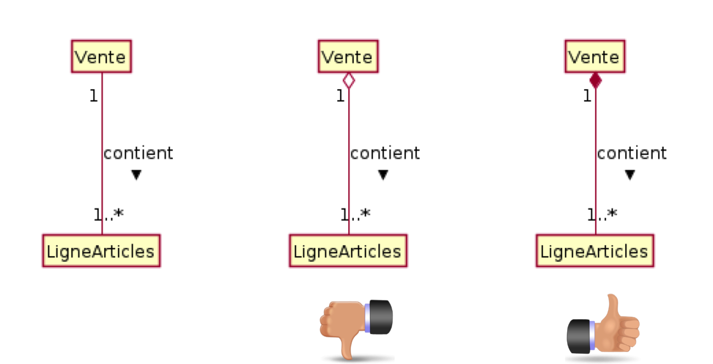{.plain width="70%"}

Note: 1 animation

--

<!-- .slide: class="mddslide" -->
### Composition?
Durée de vie du composant est limitée à celle du composite; {.fragment .shade-up}
- **dépendance de création-suppression** de la partie avec le tout. {.fragment .shade-up}
::: block {.fragment .shade-up}
- **Assemblage logique ou physique évident** entre le tout et les parties
::: 
::: block {.fragment .shade-up}
- **Propriétés** du composite (ex. son emplacement s'étendent aux composants)
:::
::: block {.fragment .shade-up}
- **Opérations** appliquées au composite (destruction, déplacement et enregistrement) se propagent aux composants
:::

Note: 3 animations

--

<!-- .slide: class="mddslide" -->
## Composition

#### Avantages

- Clarifie des contraintes du domaine
- Aide à identifier le **patron créateur**
- Opérations sont souvent propagées aux composants

#### Inconvénient

 - «Chicanerie» - laisser tomber la composition en cas de doute ou de conflit dans l'équipe (voir [Bikeshedding](https://exceptionnotfound.net/bikeshedding-the-daily-software-anti-pattern/))

--

<!-- .slide: class="mddslide" -->
## Modélisation des associations 

- La création d'une instance ne signifie pas la création d'une association
- Association un à plusieurs (⚠️dans la solution)
  - Avec  un attribut
  - Avec une map (tableau associatif)
  - Avec une liste

--

<!-- .slide: class="mddslide" -->
## Classe de «&nbsp;description&nbsp;»
{.plain width="50%"}
- Article représente un article physique
- Attributs prix, numéro de série et code
- Chaque fois qu'un article est vendu, l'objet Article correspondant est «&nbsp;supprimé&nbsp;»

Note: A cause du numéro de série qui est unique

--

<!-- .slide: class="mddslide" -->
## Classe de «&nbsp;description&nbsp;»

- Il est nécessaire de disposer de la description d'un produit ou d'un service, indépendamment de l'existence actuelle de ces derniers
- La suppression d'instances d'une entité qu'elle décrit entraîne la perte d'information qui doit être mémorisée
- Elle réduit la redondance ou la duplication des informations

--

<!-- .slide: class="mddslide" -->
## Classes de description
- Souvent, les objets d'une classe de description sont stockés dans un Catalogue
- Lire en détail la section 9.13 du livre pour d'autres exemples

--

<!-- .slide: class="mddslide" -->
## Classes de description
- Attention : ne pas appliquer les classes de description n'importe comment:

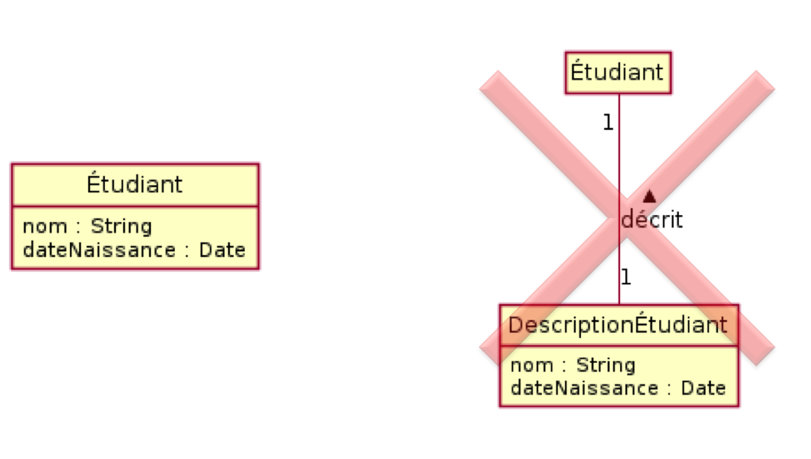{.plain width=70%}

[<div class='footer'>Table des matières modèle du domaine</div>](#mddtdm)

--


<!--------------------------------------------------------------->
<!-- .slide: id='mdd5' class="mddslide"  -->
## MDD?

- Agrégation vs composition?
- Comment interpréter une multiplicité de plusieurs

--

<!-- .slide: class="mddslide"  -->
## Symbole, intension, extension
{.plain width=55%}
[<div class='footer'>Table des matières modèle du domaine</div>](#mddtdm)

--


<!--------------------------------------------------------------->
<!-- .slide: id='mdd6' class="mddslide"  -->
### Réduire le décalage des représentations
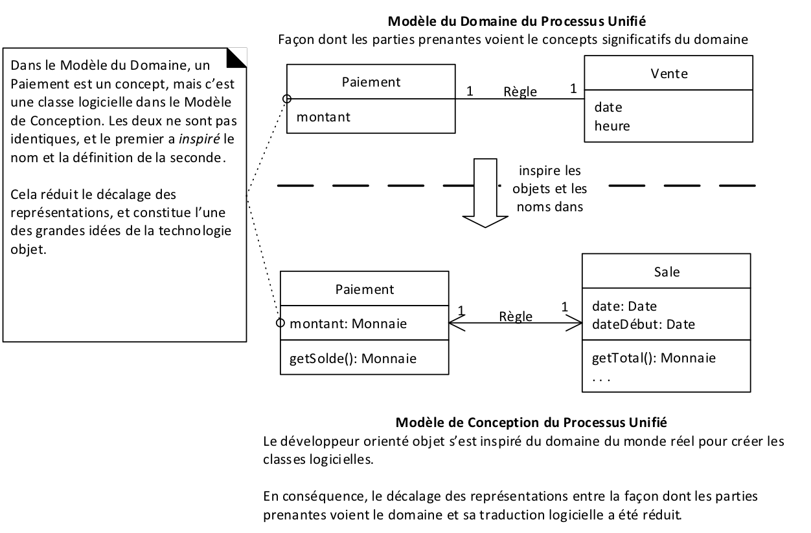{width=80% .plain}


--

<!-- .slide: class="mddslide"  -->
## Chap 9
1. Qu'est-ce qu'un modèle du domaine?
1. Que veut dire symbole, intension et extension quand on parle d'un MDD? {.fragment .shade-up}
1. Qu'est-ce que le décalage des représentations? {.fragment .shade-up}
1. Qu'est-ce qu'une classe de description? {.fragment .shade-up}
1. Quand doit-on représenter une association? {.fragment .shade-up}
1. Décrivez la notation UML d'un MDD {.fragment .shade-up}
1. Qu'est-ce qu'un exemple des associations multiples? {.fragment .shade-up}
1. Qu'est-ce qu'un attribut dérivé? Notation ?{.fragment .shade-up}

--

<!-- .slide: class="mddslide"  -->
## Chp9 complexité
1. Qu'est-ce que la complexité inhérente?
2. Donnez un synonyme de inhérente.{.fragment .shade-up}
3. Qu'est-ce que la complexité accidentelle?{.fragment .shade-up}
4. La complexité inhérente est-elle due au problème ou à la solution?{.fragment .shade-up}
5. Est-il plus facile de gérer la complexité inhérente ou accidentelle? Pourquoi?{.fragment .shade-up}
6. Comment peut-on gérer la complexité inhérente?{.fragment .shade-up}


--

<!-- .slide: class="mddslide"  -->
## Validation de la compréhension

En UML on modélise les classes conceptuelles et les classes logicielles dans la même perspective.{align=left}
 
 - Vrai 
 - Faux

--

<!-- .slide: class="mddslide"  -->
## Chp26 Affinement du MDD

1. Qu'est-ce que la généralisation?
1. Quelle est la relation entre la sous classe et la super classe?{.fragment .shade-up}
1. Qu'est-ce qu'une classe d'association?{.fragment .shade-up}
1. Est-il préférable d'utiliser une agrégation ou une composition? Pourquoi?{.fragment .shade-up}
1. Qu'est-ce qu'un attribut dérivé?{.fragment .shade-up}

[<div class='footer'>Table des matières modèle du domaine</div>](#mddtdm)

--


<!--------------------------------------------------------------->
<!-- .slide: id='affinementMDD10' class="mddslide" -->
###  Affinement du modèle du domaine
::: block {style=font-size:0.8em}
Catégorie | Exemples 
------------|-----
 Objets physiques ou tangibles | CarteDeCrédit, Chèque
Transactions |PaiementEnEspèces, PaiementACrédit, PaiementParChèque
Systèmes externes | ServiceDAutorisationDesCrédits, ServiceDAutorisationDesChèques

Organisations |ServiceDAutorisationDesCrédit, ServiceDAutorisationDesChèques,       Documents de travail comptables, contractuels, juridiques | EffetsARecevoir

Tableau F26.1/A32.1
:::

Note: todo arranger la table

--

<!-- .slide: class="mddslide" -->

## Extensions au UC1: Traiter vente
- 7b. Payer par carte de crédit
    - … information de crédit … demande d'autorisation … autorisation de paiement …
- 7c. Payer par chèque
    - …
    - chèque … pièce d'identité …
    - autorisation de paiement par chèque … paiement par chèque …

--

<!-- .slide: class="mddslide" -->

## Systèmes d'autorisation de paiement

- RequêtePaiementACrédit et AccordCrédit
    - Abstractions des éléments dans l'activité d'autorisation de paiement
    - Pas nécessairement des informations (en termes de données transactionnelles) transmises sur le fil du réseau
    - **Classes conceptuelles toujours**

{.plain width=10%}

Note: todo refaire lien entre les images

--

<!-- .slide: class="mddslide" -->

## Exemple dans POS
Généralisation/spécialisation
 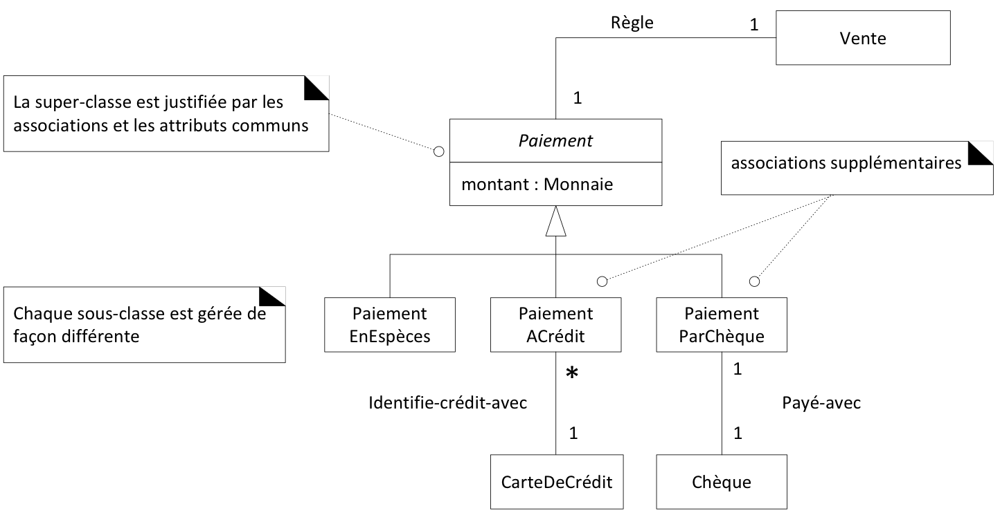{.plain}

--

<!-- .slide: class="mddslide" -->
### Exemple dans POS
Hiérarchie des services d'autorisation

 {.plain width=80%}

--

<!-- .slide: class="mddslide" -->
### Transactions d'autorisation
- Est-ce utile?

{.plain width=70%}
::: block {style=font-size:0.5em}
figure: F26.9, A32.9
:::

--

<!-- .slide: class="mddslide" -->
### Transactions d'autorisation

 {.plain width=90%}

::: block {style=font-size:0.7em;text-align:left}
Le modèle du domaine n'est pas jugé en fonction de sa précision (justesse, correcte ou non) mais en terme de son utilité. Il n'est pas un but en soi
:::

--

<!-- .slide: class="mddslide" -->
### Modélisation de changement d'état
::: block {style=font-size:0.7em}
- Ne modélisez pas les différents états possibles d'un concept comme des sous classes
- Deux solutions
    - définir une hiérarchie d'états et les associés à X ;
    - ignorer la représentation des états dans le MDD et faire un diagramme d'états

 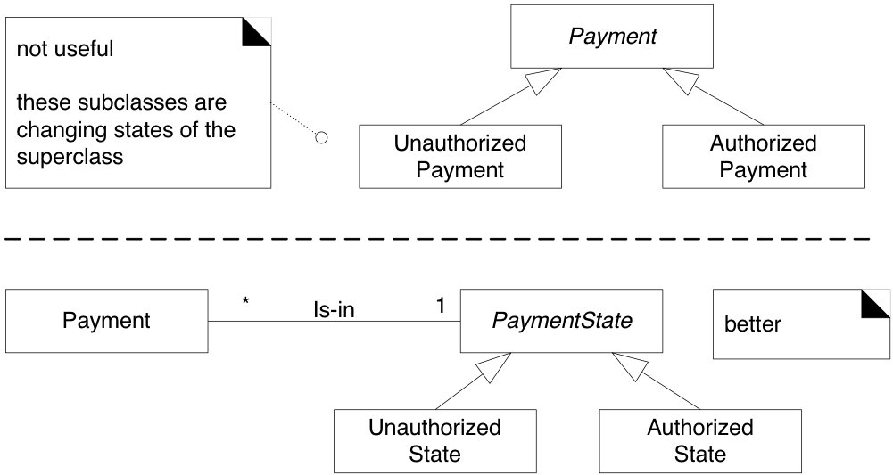{width=60% .plain}

:::

--

<!-- .slide: class="mddslide" -->
## Hiérarchies et héritage dans l'implémentation
::: block {style=font-size:0.8em}
- Les hiérarchies de classes conceptuelles peuvent êtres reflétées ou non dans le modèle de conception
    - Par exemple, les classes paramétrées (templates) en C++/Java/C# permettre de réduire le nombre de classes dans l'implémentation
    - [www.tutorialspoint.com/cplusplus/cpp_templates](https://www.tutorialspoint.com/cplusplus/cpp_templates.htm)

--

<!-- .slide: class="mddslide" -->
## Intervalles de temps et prix des produits
Correction d'une «&nbsp;erreur&nbsp;» de l'itération 1

{.plain}

--

<!-- .slide: class="mddslide" -->
## Nom de rôles

- Extrémité d'une association peut avoir un rôle
- Rôle possède plusieurs propriétés: nom et multiplicité

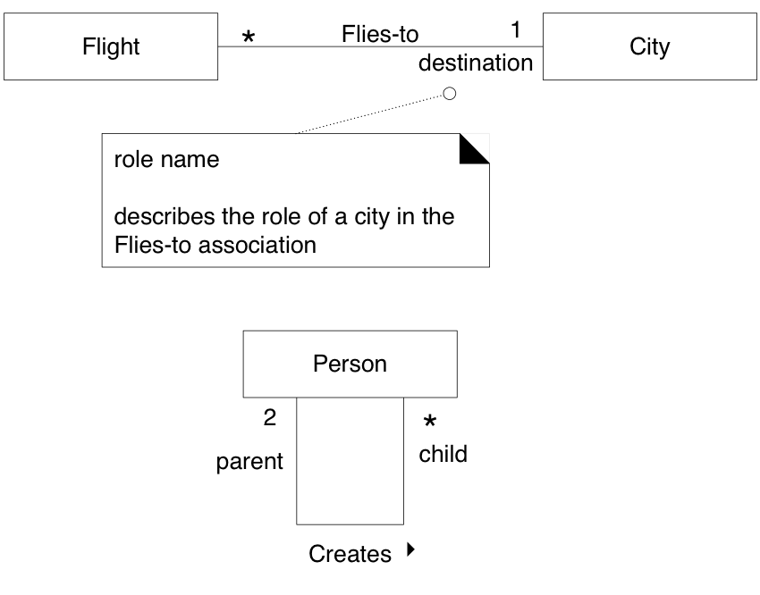{.plain width=40%}


--

<!-- .slide: class="mddslide" -->
## Concepts vs associations

{.plain width=80%}


Note: Les deux approches sont avantageuses
Note: Q : Quand est-ce important de présenter le nom d'un rôle?
Quand le rôle de l'objet n'est pas clair

Note: Q : Avantage de la première approche?
Montre une personne qui peut jouer plusieurs rôles
 Rôle peut changer dynamiquement

Note: Q : Avantage de la deuxième?
Permet d'avoir des associations et attributs spécifiques


--

<!-- .slide: class="mddslide" -->
## Éléments dérivés
::: block {style=font-size:0.8em; text-align: left}
Évitez de faire apparaître les éléments dérivés dans les diagrammes, sauf si leur omission peut nuire à la compréhension


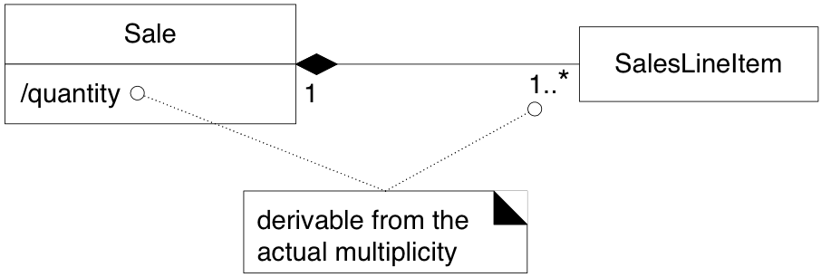{.plain width=80%}


--

<!-- .slide: class="mddslide" -->
## Packages pour organiser le MDD

- Un élément peut être référencé dans un autre package
    - nom augmenté du nom du package
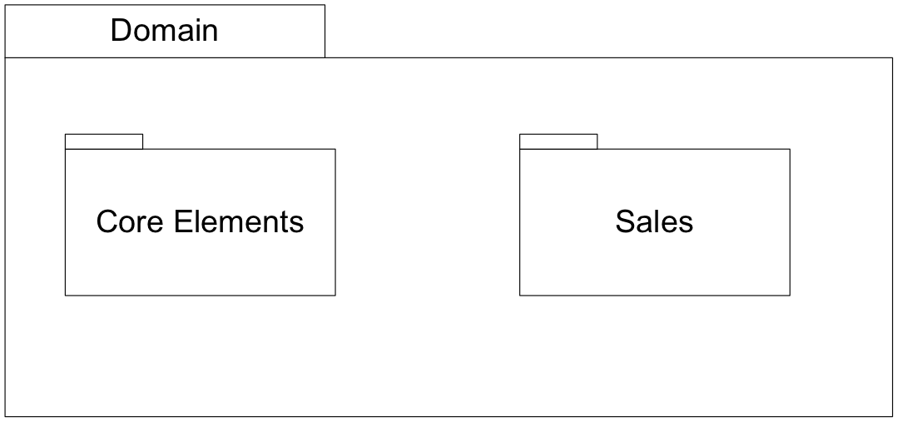{.plain width=80%}

--

<!-- .slide: class="mddslide" -->
## Dépendance entre package 
::: block {style=font-size:0.8em}
- Package qui dépend d'un autre
    - indicateur de couplage
    - entre certains éléments du premier et du deuxième
:::
{.plain width=70%}

--

<!-- .slide: class="mddslide" -->
## Partitionner le modèle du domaine

- Placer en package les éléments
    - Cohésion relationelle
      - qui sont fortement associés
      - situés dans la même hiérarchie de classes
    - Cohésion fonctionnelle
      - situés dans le même domaine
      - participant au même cas d'utilisation
      

--

<!-- .slide: class="mddslide" -->
## Modèle du domaine (1)

{.plain width=75%}

--

<!-- .slide: class="mddslide" -->
## Modèle du domaine (2)

{.plain width=60%}

--

<!-- .slide: class="mddslide" -->
## Affinements  du MDD Monopoly

{.plain width=50%}

[<div class='footer'>Table des matières modèle du domaine</div>](#mddtdm)


---

<!--=======================================================================================================-->
<!-- .slide: id='dsstdm'   -->
## Module DSS
1. [Qu'est-ce qu'un DSS?](#dss1) - [8.47m](https://youtu.be/GhNeVi0t8f0)
2. [Opérations systèmes](#dss2)  - [19.01m](https://youtu.be/y5fXCWYq6m4)
3. [Exercice](#dss3)Exercice, résumé - [11.23m](https://youtu.be/XUK39QK9I58)
4. [Retour d'opération](#dss5) - [4.45m](https://youtu.be/Aqab8iOmcPM)
5. [Révision](#dss6) - Diagramme de séquence système - [18.28m](https://youtu.be/h_cKLbxI-zw)

:::block {style=font-size:0.5em}
[Séances](#seances) | [Quiz](#quiztdm) | [Laboratoires](#laboratoiretdm) | [Intro](#introtdm) | [Équipe](#equipetdm) | [PU](#putdm) | [DCU](#dcutdm) | [CU](#cutdm) | 
[IU](#iutdm) | [MDD](#mddtdm) | [Dss](#dsstdm) | [Contrat](#contrattdm) | [RDCU](#rdcutdm) | [DCL](#dcltdm) | 
[Couche](#couchetdm) | [Exercice](#exercicetdm) | [Typescript](#typescripttdm) | [Complexite](#complexitetdm) 
| [FURPS](#furpstdm) | [TDD](#tddtdm) | [GOF](#goftdm) | [Diagrammes](#diagrammestdm) | [Divers](#diverstdm)  
:::

--


<!--------------------------------------------------------------->
<!-- .slide: id='dss1' class="dssslide"  -->
## Qu'est-ce qu'un DSS?
- Interaction avec le système
    - acteur génère des événements
    - réponses du système
- Illustrer ces opérations
    - pour mieux comprendre le système

--

<!-- .slide: class="dssslide"  -->
### Diagramme de séquence du système (DSS)
::: block {style=font-size:0.5em}
- événements synchrones
- paramètres
- retour d'information
- frontières du système
:::
{width=55%}{.plain}


--

<!-- .slide: class="dssslide"  -->
## Pourquoi tracer un DSS?
- Pour connaître les événements système
    1. déclenchés par acteurs (humains ou ordis)
    1. d'échéance de temporisation (timeout) 
    1. d'erreurs ou d'exceptions (sources externes)
- Début de la modélisation par décomposition (top-down)
- Vu abstrait du système comme application
- Facilite le changement de l'interface humain-machine (la couche présentation)

--

<!-- .slide: class="dssslide"  -->
## DSS et cas d'utilisation

{style=border:none}{width=75%}
https://plantuml.com/sequence-diagram


[<div class='footer'>Table des matières diagramme de séquence système</div>](#dsstdm)

--

<!--------------------------------------------------------------->
<!-- .slide: id="realiser-votre-premier-dss1" class="dssslide"  -->
## Réaliser votre premier DSS
- Réaliser un diagramme de séquence système du cas d'utilisation [Noter une réservation](#cu1-noter-une-reservation).

--

## IU - Interface Usager vs DSS

Le DSS peut vous permettre de définir les interfaces usager nécessaires pour appeller les opérations systèmes et afficher les retours d'informations.

- Vérifier la correspondance entre vos interfaces usager et vos opérations systèmes

[<div class='footer'>Table des matières diagramme de séquence système</div>](#dsstdm)

--


<!--------------------------------------------------------------->
<!-- .slide: id="dss2" class="dssslide"  -->
## Diagramme Séquence Système

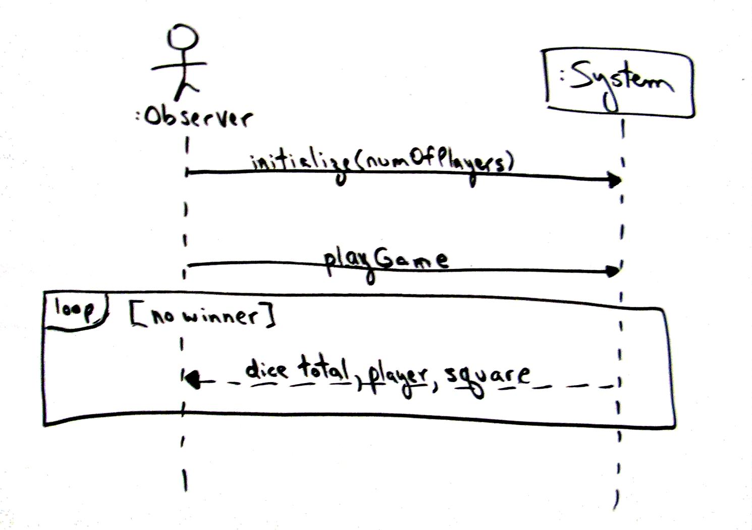{.plain width="400px"}

--

<!-- .slide: class="dssslide"  -->

## DSS

- Créé à partir d'un cas d'utilisation
- Modélise l'interaction
  - Opérations système
  - Messages de retour (au besoin)
- Notation UML
- But : définir l'API (haut niveau)
- Système est une « boîte noire »

--

<!-- .slide: class="dssslide"  -->

## Faire un DSS

- Identifier l'acteur principal
- Modéliser système comme boîte noire
- Proposer une opération système pour chaque évènement système
  - Types primitifs pour arguments
  - Messages de retour si nécessaire

--

<!-- .slide: class="dssslide"  -->

### DSS: CU01 - Ajouter un livre à échanger

1. Le Client démarre un nouvel ajout de livre.
2. Le Client entre le code ISBN du livre, ainsi que le code de sa
condition.
3. Le Système enregistre le livre et présente sa description. 
> Le Client
répète les étapes 2 à 3 jusqu'à ce qu'il ait saisi tous les livres à
échanger.
4. Le Système présente la liste de livres que possède le Client.

Note: 
faire le DSS 


--

<!-- .slide: class="dssslide"  -->

### DSS: «Attaquer un pays»

1. Le Joueur attaquant choisit d'attaquer un pays voisin du Joueur défenseur.
2. Le Joueur attaquant annonce combien de régiments il va utiliser pour son attaque.
3. Le Joueur défenseur annonce combien de régiments il va utiliser pour sa défense.
4. Les deux Joueurs jettent le nombre de dés selon leur stratégie choisie aux étapes précédentes.
5. Le Système compare les dés et élimine les régiments de l'attaquant ou du défenseur selon les règles et affiche le résultat.

Note: solution dans deux pages

--

<!-- .slide: class="dssslide"  -->

### DSS: «Attaquer un pays»

> Les Joueurs répètent l'étape 2 jusqu'à ce que l'attaquant ne puisse plus attaquer ou ne veuille plus attaquer.

--

<!-- .slide: class="dssslide"  -->

### DSS: «Attaquer un pays»

{style="width:70%" .plain}

--

<!-- .slide: class="dssslide"  -->

tiny.cc/quizdesign $\rightarrow$ ETSDESIGN

Vrai/Faux: Il y a 5 opérations système dans ce DSS

{style="width:60%" .plain}

[<div class='footer'>Table des matières diagramme de séquence système</div>](#dsstdm)

Note: https://b.socrative.com/teacher/#launch -> True/False


--

<!--------------------------------------------------------------->
<!-- .slide: id='dss3' class="dssslide"  -->
## DSS

Retour sur l'exercice Google 

Voir: Seance-03-solution-reserverLivreBibliotheque

--

<!-- .slide: class="dssslide"  -->
## Points importants

Voir le PDF des [notes de cours](https://drive.google.com/file/d/1__yjzv7vuqbX0ElxLj5AkVO0xEk7ubVO/view?usp=sharing)


<!-- - opération système n'a pas de verbe
- Utiliser des boucles alors qu'il n'y a aucune répétition dans le cas d'utilisation -->
<!-- - Une boucle commence toujours par une opération -->
<!-- - Oublier l'opération qui termine la boucle
- Oublier les paramètres et types dans les opérations -->
<!-- - Une opération synchrone avec plusieurs retour! -->
<!-- - Les types de flèches pour des opérations synchrones et asynchrones sont différents -->
<!-- - On oublie de mettre un message de retour
- On met un message de retour pour une information qui n'est pas spécifique. -->

<!-- ## Exercice DSS
::: block {style=font-size:0.7em}
Cas d'utilisation «Noter une réservation»
1. Un client appelle à l'hôtel pour placer une réservation.
2. Le commis démarre une nouvelle réservation.
3. Le commis saisit la date d'arrivée; la date de départ; le nom de la catégorie de chambre; la quantité de chambres.
4. Le système inscrit les informations à la réservation.

Les étapes 3 et 4 sont répétées tant que le client n'indique pas qu'il a terminé{align="left"}

5. Le commis termine la réservation.
1. Le système affiche toutes les informations entrées.
1. Le commis valide les informations auprès du client et confirme la réservation à l'aide du nom et du numéro de téléphone du client.
1. Le système enregistre la réservation et affiche le numéro de confirmation.
1. Le commis communique le numéro de confirmation au client.
::: -->

--


<!--------------------------------------------------------------->
<!-- .slide: id='dss5' class="dssslide"  -->
## Retour d'une opération système (DSS)

- Du cas d'utilisation…
  - Le système présente le total incluant les taxes calculées.
- L'affichage du total => couche présentation
- Mais le calcul du total?
  - Aucune classe n'en a la responsabilité
  - Affectez-la avec «&nbsp;Expert&nbsp;»
  - (il y a un attribut dérivé `/total` dans le MDD)

{.plain}

--

<!-- .slide: class="dssslide"  -->
## Expert pour calculer le total
:::block {style=font-size:0.75em}
1. Énoncer la responsabilité
    - Qui doit connaître le montant total de la vente?
2. Récapituler les informations nécessaires
    - total est la somme de tous les sous-totaux des lignes
    - sous-total de ligne := quantité * prix
3. Dresser la liste des informations nécessaires et des classes qui les possèdent.

Informations nécessaires au total de la vente |  Expert
--|--
Produit.prix | Produit
LigneArticles.quantité | LigneArticles
Toutes les LigneArticles de la vente en cours | Vente

Analyse détaillée: p.F337
:::

--

<!-- .slide: class="dssslide"  -->
## Conception

`Vente.getTotal()`

{.plain}

(diagramme de communication)

[<div class='footer'>Table des matières diagramme de séquence système</div>](#dsstdm)

--

<!--------------------------------------------------------------->
<!-- .slide: id='dss6' class="dssslide"  -->
## Chp10 DSS
1. Quels sont les artéfacts qui influencent ou sont influencés par le DSS?
2. Qu'est-ce qu'un DSS?{.fragment .shade-up}
3. Pourquoi tracer un DSS?{.fragment .shade-up}

--

<!-- .slide: class="dssslide"  -->

### Influence entre artefacts du PU

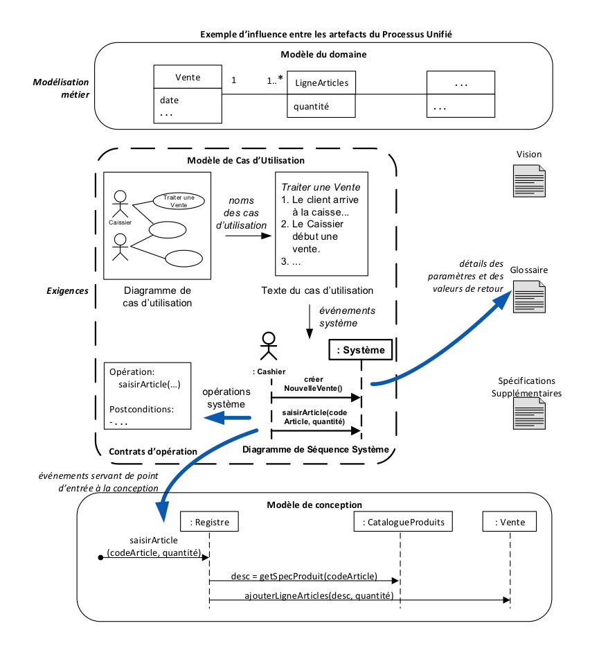{.plain width=55%}


Note: Domain diagrams represent static relationships. Why?
What about modeling dynamic behavior?
Interaction diagrams model how groups of objects collaborate to perform some behavior
Typically captures the behavior of a single use case

[<div class='footer'>Table des matières diagramme de séquence système</div>](#dsstdm)

---

<!--=======================================================================================================-->
<!-- .slide: id='contrattdm'   -->
## Module Contrat
1. [Contrats](#contrat1) - Contrats d'opération - [9.57m](https://youtu.be/Ava0v-vmuEI)
2. [Contrats d'opération](#contrat3) - [12.08m](https://youtu.be/4bJ5a5l_TQk)
3. [list/map](#contrat4) - [4.39m](https://youtu.be/S8_grRXb3G4)
4. [Maps](#contrat5) - [1.26m](https://youtu.be/eSlbIfteQ_M)
5. [Révision](#contrat6) - Contrats pour réaliser les RDCU 
:::block {style=font-size:0.5em}
[Séances](#seances) | [Quiz](#quiztdm) | [Laboratoires](#laboratoiretdm) | [Intro](#introtdm) | [Équipe](#equipetdm) | [PU](#putdm) | [DCU](#dcutdm) | [CU](#cutdm) | 
[IU](#iutdm) | [MDD](#mddtdm) | [Dss](#dsstdm) | [Contrat](#contrattdm) | [RDCU](#rdcutdm) | [DCL](#dcltdm) | 
[Couche](#couchetdm) | [Exercice](#exercicetdm) | [Typescript](#typescripttdm) | [Complexite](#complexitetdm) 
| [FURPS](#furpstdm) | [TDD](#tddtdm) | [GOF](#goftdm) | [Diagrammes](#diagrammestdm) | [Divers](#diverstdm)  
:::

--

<!--------------------------------------------------------------->
<!-- .slide: id='contrat1' class="contratslide"  -->
## Contrats
- Transformation au niveau des données dans le MDD suite à l'exécution d'une opération du DSS
- Expliquer en vos propre mots se qui ce passe au niveau des données de votre modèle du domaine lorsque vous appellez chacune des opérations système.{.fragment .shade-up}
- Opération système == contrat{.fragment .shade-up}

Note: 2 animations

[<div class='footer'>Table des matières contrats</div>](#contrattdm)

--


<!--------------------------------------------------------------->
<!-- .slide: id='contrat3' class="contratslide"  -->

## Contrats d'opération

- Qu'est-ce qu'un contrat d'opération?
- Pourquoi les contrats d'opération?

--

<!-- .slide: class="contratslide"  -->
### *Qu'est-ce qu'un contrat d'opération?

Un document décrivant ce qui est arrivé après l'exécution d'une opération système.

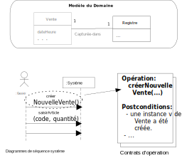{.plain width="45%"}

Note: exemple avec `créerNouvelleVente()` - l'instance de Vente dans le MDD n'existe pas encore avant que le caissier démarre une vente. - Après l'exécution de créerNouvelleVente, l'instance existe et elle est associée à la caisse.

--

<!-- .slide: class="contratslide"  -->
## Éléments d'un contrat d'opération

- Signature de l'opération système:  
`saisirArticle(codeArticle: CodeArticle, quantité: int)`
- Postconditions (3 formes, vocabulaire du MDD)
  - création (ou suppression) d'instances;
  - modification des valeurs des attributs;
  - formation (ou rupture) d'associations.

--

<!-- .slide: class="contratslide"  -->
## *Contrat d'opération: 

**Opération:** `créerNouvelleVente()` {align=left}

**Références croisées:** Cas d'utilisation : Traiter Vente {align=left}

**Postconditions:** {align=left}
  - une instance *v* de Vente a été créée
  - *v* a été associée au Registre
  - des attributs de *v* ont été initialisés

Note: chacune de forme des postconditions, vocabulaire du MDD

--

<!-- .slide: class="contratslide"  -->
## Pourquoi les contrats

- Facilite la conception OO (RDCU)
  - Liste d'épicerie (quoi faire)
  - RDCU s'inspire du MDD (réduire décalage des représentations)
- Donne des conditions pour tests
- Aide à valider le MDD
  

--


<!-- .slide: class="contratslide"  -->
## Exercice contrats (Google Classroom)
 
Voir seance-03-exercice-reserverLivre

[<div class='footer'>Table des matières contrats</div>](#contrattdm)

--

<!--------------------------------------------------------------->
<!-- .slide: id='contrat4' class="contratslide" -->
## Contrats

Quel sont les trois type de postconditions?

--

<!-- .slide: class="contratslide" -->
## Contrats

- Postcondition:
  - « ... sur la base de correspondance avec *clé*.&nbsp;»
    - implique une multiplicité de 1 à plusieurs
    - implique l'utilisation d'une Map (tableau associatif)

[<div class='footer'>Table des matières contrats</div>](#contrattdm)

--


<!--------------------------------------------------------------->
<!-- .slide: id='contrat5' class="contratslide"  -->
## Contrats - maps
- sur la base de  correspondance avec "Clé"
    - implique l'utilisation d'un tableau associatif (`Map<>`)

[<div class='footer'>Table des matières contrats</div>](#contrattdm)

--


<!--------------------------------------------------------------->
<!-- .slide: id='contrat6' class="contratslide"  -->
## Chp11 Contrats
1. Quels sont les éléments d'un contrat?
1. Quelle est la relation entre le DSS et les contrats?{.fragment .shade-up}
1. Que décrivent les postconditions?{.fragment .shade-up}

--

<!-- .slide: class="contratslide"  -->
### Influence d'artefacts du Processus Unifié

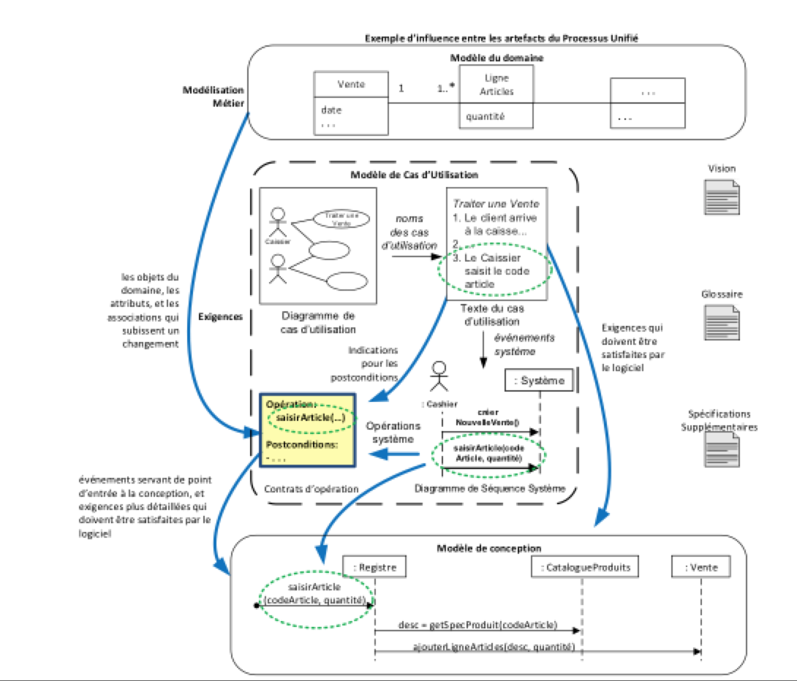{.plain width=60%}

--

<!-- .slide: class="contratslide"  -->

### Contrats - Erreurs fréquents

::: block {style=font-size:0.9em}
- Ne pas mettre les paramètres de l'opération
- Inventer de nouveaux paramètres
- Ne pas utiliser un paramètre pour trouver une instance d'un objet lorsque le contrat spécifie que la relation est faite sur la base de correspondance avec une clé.
- Les postconditions ne sont pas écrites au passé.
- Les postconditions ne sont pas cohérentes avec le MDD
:::

[<div class='footer'>Table des matières contrats</div>](#contrattdm)

---

<!--=======================================================================================================-->
<!-- .slide: id='rdcutdm'   -->
## Module RDCU
:::block {style=font-size:0.8em}
1. [Réalisation d'un cas d'utilisation](#rdcu1) - [25.10m](https://youtu.be/3QJLltSRbqc)
2. [GRASP - Contrôleur ](#rdcu2) - [17.54m](https://youtu.be/gZ3Jir-mKDE)
3. [GRASP - Créateur et Expert ](#rdcu3) - [24.28m](https://youtu.be/qJ2qG-CZzUY)
4. [GRASP - Couplage et Cohésion](#rdcu4) - [27.49m](https://youtu.be/6VbY6RFPnjc)
5. [Exercice avancé ](#rdcu5) - [30.33m](https://youtu.be/1YJWRgnO3Ns)
6. [Révision](#rdcu6) - [9.42m](https://youtu.be/_sR9pej9l_8)
7. [GRASP - polymorphisme, fabrication pure, indirection, protection des variations](#grasp8) - [19.40m](https://youtu.be/DlufMFcGSSE)
8. [GRASP sont une généralisation d'autres patterns](#grasp9) - [16.43m](https://youtu.be/4LO-dzPAa7Y)
9. [Patron faire soi-même](#soimeme9) 
:::

:::block {style=font-size:0.5em}
[Séances](#seances) | [Quiz](#quiztdm) | [Laboratoires](#laboratoiretdm) | [Intro](#introtdm) | [Équipe](#equipetdm) | [PU](#putdm) | [DCU](#dcutdm) | [CU](#cutdm) | 
[IU](#iutdm) | [MDD](#mddtdm) | [Dss](#dsstdm) | [Contrat](#contrattdm) | [RDCU](#rdcutdm) | [DCL](#dcltdm) | 
[Couche](#couchetdm) | [Exercice](#exercicetdm) | [Typescript](#typescripttdm) | [Complexite](#complexitetdm) 
| [FURPS](#furpstdm) | [TDD](#tddtdm) | [GOF](#goftdm) | [Diagrammes](#diagrammestdm) | [Divers](#diverstdm)  
:::

--


<!--------------------------------------------------------------->
<!-- .slide: id='rdcu1' class="rdcuslide"  -->
### Réalisation d'un cas d'utilisation
- Un diagramme d'interaction avec des annotations pour réaliser une opération système et satisfaire:
    - Son contrat
    - Ses retours d'informations
- Deux types de responsabilités
  - Faire
  - Savoir

https://plantuml.com/sequence-diagram

Note: Diagramme de séquence, Diagramme de communication

--

<!-- .slide: class="rdcuslide" -->

## Responsabilités de faire
- faire quelque chose lui-même (ex. effectuer un calcul)
- déclencher une action d'un autre objet
- contrôler et coordonner les activités d'autres objets

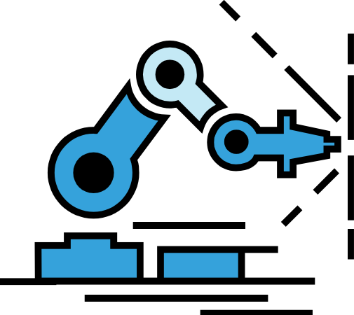{width=25%}{style=border:none}

--

<!-- .slide: class="rdcuslide" -->

### Responsabilités de savoir
- connaître les données privées encapsulées
- connaître les objets connexes
- connaître des éléments qu'il peut dériver ou calculer

{width=20%}{style=border:none}

--

<!-- .slide: class="rdcuslide" -->


### La CPR est une métaphore pour la COO
- On y assimile les objets à des personnes qui
    - ont des responsabilités
    - collaborent avec d'autres personnes
    - réalisent une tâche

{width=30%}{style=border:none}

CPR = Conception pilotée par les responsabilités

--

<!-- .slide: class="rdcuslide" -->

### Réaliser vos premiers RDCU
- Concrètement: Un RDCU est un diagramme de séquence ou de communication qui réalise le contrat associer à l'opération système et s'assure de pouvoir retourner les informations demandées.
- Créer un contrôleur{.fragment .shade-up}
- Faire un diagramme de séquence ou de communication pour chaque opération système.{.fragment .shade-up}

[<div class='footer'>Table des matières Réalisation des cas d'utilisations</div>](#rdcutdm)

Note: 2 animations

--


<!--------------------------------------------------------------->
<!-- .slide: id="rdcu2" class="rdcuslide" -->

### 🤠:Pourquoi faire une RDCU?

Pour apprendre à faire une solution  
**modulaire** et **intuitive**

{.plain width="60%"}

Note:
Les stagiaires n'ont souvent pas la mission de faire une solution modulaire/intuitive. Les compagnies paient pour quelque chose qui fonctionne d'abord. Mais dans LOG210 on s'intéresse à la modularité et la facilité de maintenance!

--

<!-- .slide: class="rdcuslide" -->

## RDCU: aspects

- Proposer des **classes logicielles** correspondant aux **classes conceptuelles**
  - Inspirées du MDD
  - Pour réduire le *décalage des représentations*
- Utiliser les principes GRASP
  - **Faible Couplage** et **Forte cohésion** (LOG121!)
  - **Contrôleur** ([architecture en couches](#couche2))

--

<!-- .slide: class="rdcuslide" -->

## RDCU - Jeu de dés

Opérations système du DSS

"){.plain}

--

<!-- .slide: class="rdcuslide" -->

## RDCU - Jeu de dés

Première opération système:

{.plain width="60%"}

Qui envoie l'opération? Qui la reçoit?

--

<!-- .slide: class="rdcuslide" -->

## RDCU (solution Java Swing)

Opération `démarrerJeu` - qui **envoie** cette opération?

{.plain}

--

<!-- .slide: class="rdcuslide" -->

## RDCU (solution Java Swing)

Opération `démarrerJeu` - qui **reçoit** cette opération?

{.plain}

--

<!-- .slide: class="rdcuslide" -->

### Principe Contrôleur GRASP

**Problème:** Quel est le premier objet en dehors de la couche présentation **qui reçoit** et coordonne («&nbsp;contrôle&nbsp;») les opérations système ?

--

<!-- .slide: class="rdcuslide" -->

### Principe Contrôleur GRASP

**Solution:** Affectez une responsabilité à la classe qui correspond à l'une de ces définitions:
1. Elle représente le **système global,** un « **objet racine** », un **équipement** ou un
**sous-système**.
1. ...

{.plain}

--

<!-- .slide: class="rdcuslide" -->

## RDCU - Contrôleur

`JeuDeDés` est le contrôleur GRASP (inspiré du MDD)

{.plain}

--

<!-- .slide: class="rdcuslide" -->

### RDCU - détaillé 

Faire un design modulaire et facile à comprendre. Affecter les responsabilités aux bonnes classes.

{width="65%" .plain}

[<div class='footer'>Table des matières Réalisation des cas d'utilisations</div>](#rdcutdm)

--


<!--------------------------------------------------------------->
<!-- .slide: id='rdcu3' class="rdcuslide"  -->
## RDCU

Prendre les bonnes décisions pour une solution facile à comprendre et modulaire... {align=left}

{width="65%" .plain}

--

<!-- .slide:  class="rdcuslide"   -->
## Décalage des représentations

Facile? Les classes logicielles devraient ressembler à des classes conceptuelles.

{.plain width="50%"}

Qui fait quoi? Qui a quelle responsabilité?

--

<!-- .slide:  class="rdcuslide"   -->
## RDCU

Approche: conception orientée-responsabilités

## GRASP

**G**eneral **R**esponsability **A**ssignment **S**oftware **P**atterns

Pour décider où mettre les méthodes...

--

<!-- .slide:  class="rdcuslide"   -->
## GRASP

- Contrôleur (séparation des couches)
- **Créateur**
- **Expert en information**
- Faible couplage
- Forte cohésion
- Polymorphisme
- Indirection
- Protection de variation
- Fabrication pure

--

<!-- .slide:  class="rdcuslide"   -->
## *RDCU (Survol)

{.plain width=50%}

Note: expliquer encore le contexte de la RDCU

--

<!-- .slide:  class="rdcuslide"   -->
## RDCU: scénario Démarrer

- C'est l'initialisation du système. 
- C'est implicite mais essentiel!
- On doit instancier les objets faisant partie de l'application.

  
Note: page suivante; Exemple: Monopoly - instancier les objets Case

--

<!-- .slide:  class="rdcuslide"   -->
## Instancier les objets Case

- Quelle classe s'en occupe? (sondage Zoom)

{.plain width=65%}

--

<!-- .slide:  class="rdcuslide"   -->
## Créateur (GRASP)

- Les «conteneurs» créent les objets «contenus»

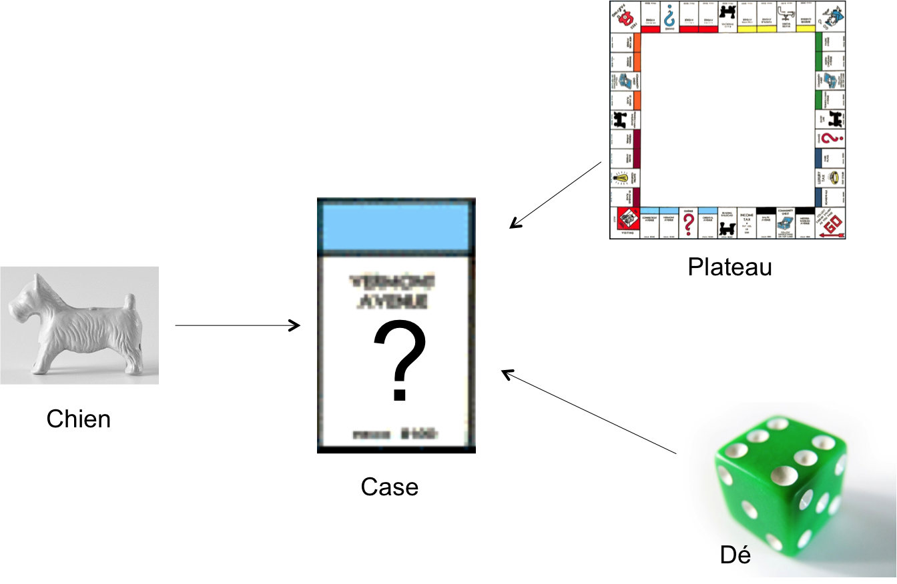{width=70% .plain}

--

<!-- .slide:  class="rdcuslide"   -->
## Créateur (GRASP)

- **Problème**: Qui crée? (postcondition d'un contrat)
- **Solution**: Affecter à la classe B la responsabilité de créer les objets d'une classe A si...
  - B possède les données d'initialisation des objets A
  - B contient ou agrège des objets A
  - B utilise étroitement des objets A
  - B enregistre des objets A

On s'inspire du MDD. On réutilise les liens existents.

--

<!-- .slide:  class="rdcuslide"   -->
## *Créateur

- Qui crée les cases (Square)?

{.plain width=65%}

Note: On favorise la classe agrégate

--

<!-- .slide:  class="rdcuslide"   -->
## *Créateur (Annotation)

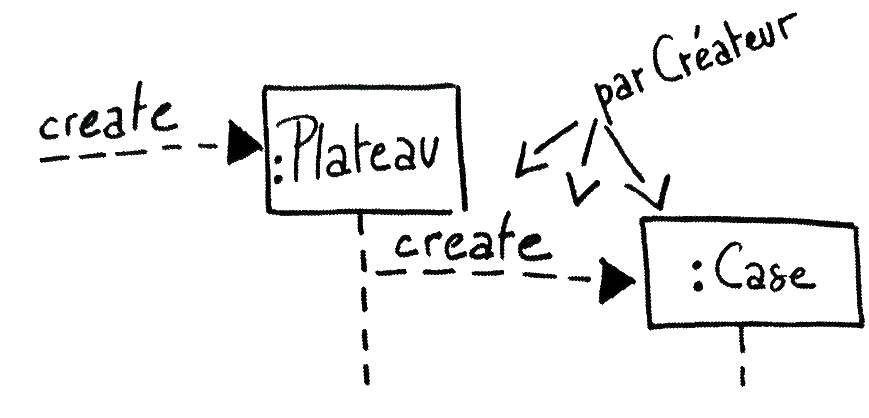{width=100%}{.plain}

Note: Ce n'est pas une classe `CaseRepertoire` (nom étrange, augmente l'écart des représentations)

--

<!-- .slide:  class="rdcuslide"   -->
## Expert en Information

- **Problème:** Quel est le principe général d'affectation des responsabilités aux objets?
- **Solution:** Affecter la responsabilité à la classe qui possède les informations nécessaires pour s'en acquitter
> En termes de paramètres, associations

--

<!-- .slide:  class="rdcuslide"   -->
## Expert (GRASP)

- (Sondage) Où mettre la méthode `getCase(nom)`?

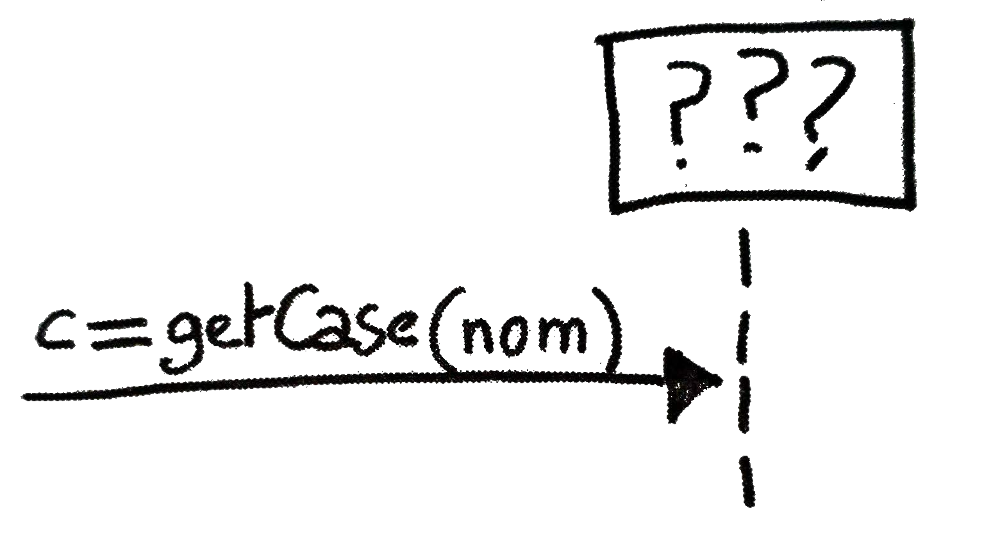{width=30%}{.plain align=top style="background:#DDFFDD"}
{width=60%}{.plain}

--

<!-- .slide:  class="rdcuslide"   -->
## Expert

- Application du patron Expert

{width=30%}{.plain align=top style="background:#DDFFDD"}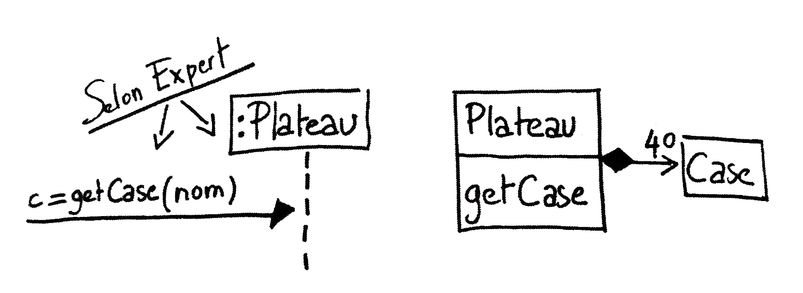{.plain width=75%}

--

<!-- .slide: class="contratslide"  -->
<s>
## Exercice RDCU (Google Classroom)
 
Voir seance-03-exercice-reserverLivre
</s>

[<div class='footer'>Table des matières Réalisation des cas d'utilisations</div>](#rdcutdm)

--


<!--------------------------------------------------------------->
<!-- .slide: id='rdcu4' class="rdcuslide" -->
## GRASP
- Contrôleur
- Créateur
- Expert en information
- **Faible couplage**
- **Forte cohésion**
- Polymorphisme
- Indirection
- Protection de variation
- Fabrication pure

--

<!-- .slide: class="rdcuslide" -->

## Faible Couplage
Question : Qui peut fournir la liste des cases
{.plain width=75%}

--

<!-- .slide: class="rdcuslide" -->
## Faible Couplage
- Si la classe Pion (chien) avait la responsabilité:

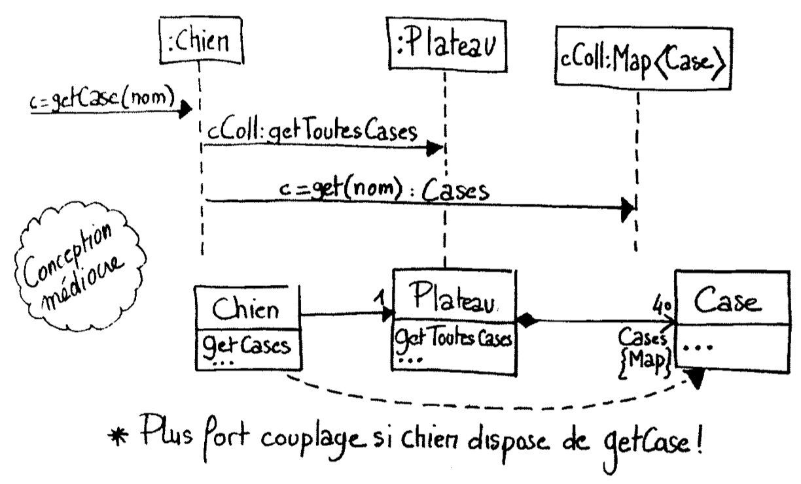{.plain width=70%}

--

<!-- .slide: class="rdcuslide" -->
## Faible Couplage
- Problème :
    - Comment réduire l'impact des modifications?
- Solution :
    - Assigner les responsabilités de sorte à **éviter tout couplage inutile**.
    - Appliquer ce principe pour **évaluer plusieurs solutions possibles**.

{width=60% .plain}

--

<!-- .slide: class="rdcuslide" -->
## Faible Couplage
- Expert soutient Faible Couplage
- Expert évite de faire du couplage inutile, puisqu'un expert n'aura pas à demander à quelqu'un d'autre…

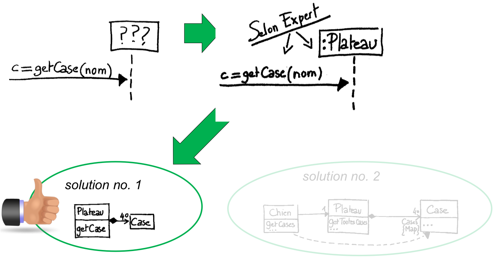{width=70% .plain}

--

<!-- .slide: class="rdcuslide" -->
## Faible Couplage
### Motivation
- Classes fortement couplées sont
    - difficiles à maintenir
    - difficiles à comprendre seules
    - difficiles à réutiliser

--

<!-- .slide: class="rdcuslide" -->
## Forte Cohésion
- Poursuivons la conception

{.plain}

--

<!-- .slide: class="rdcuslide" -->
## Cohésion
- Mesure de combien une classe (ou module) supporte une seule responsabilité
{.plain}

--

<!-- .slide: class="rdcuslide" -->
## Cohésion


Faible | Forte
--|--
Beaucoup de fonctions | Peu de fonctions
Responsabilités écartées | Fonctions apparentées

--

<!-- .slide: class="rdcuslide" -->
## Forte Cohésion
- Plusieurs choix opposés de conception

{width=40% .plain}

--

<!-- .slide: class="rdcuslide" -->
## Forte Cohésion
- JeuDeMonopoly délègue les responsabilités

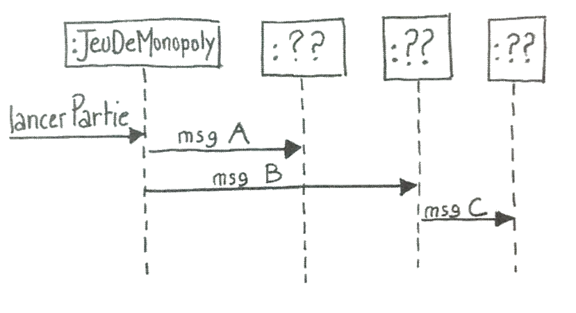{width=80% .plain}

--

<!-- .slide: class="rdcuslide" -->
## Forte Cohésion
1. **Problème** :
    - Comment s'assurer que les objets restent compréhensibles et faciles à gérer, et, bénéfice second, qu'ils contribuent au Faible Couplage?
1. **Solution** :
    - Assigner les responsabilités de sorte que la cohésion demeure élevée. Appliquer ce principe pour évaluer les solutions possibles.{.fragment .shade-up}

--

<!-- .slide: class="rdcuslide" -->
## Forte Cohésion
- Comparaison des choix

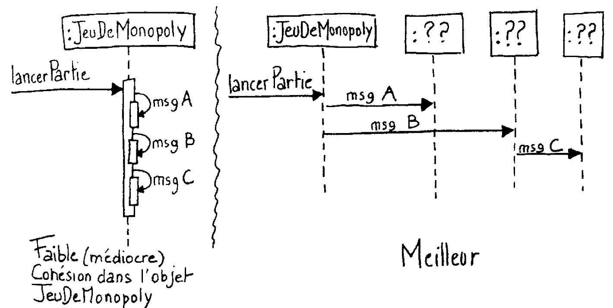{.plain width=80%}

--

<!-- .slide: class="rdcuslide" -->
## Cohésion: Exercice

- Lesquelles des classes suivantes ont de multiples responsabilités?
  
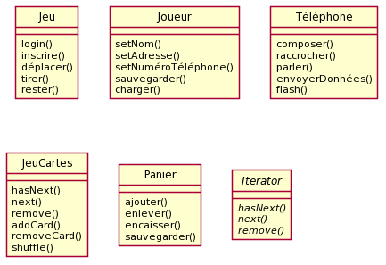{.plain width="60%"}

--

<!-- .slide: class="rdcuslide" -->
## Cohésion: Exercice
- Déterminez si ces classes ont une cohésion forte ou faible:

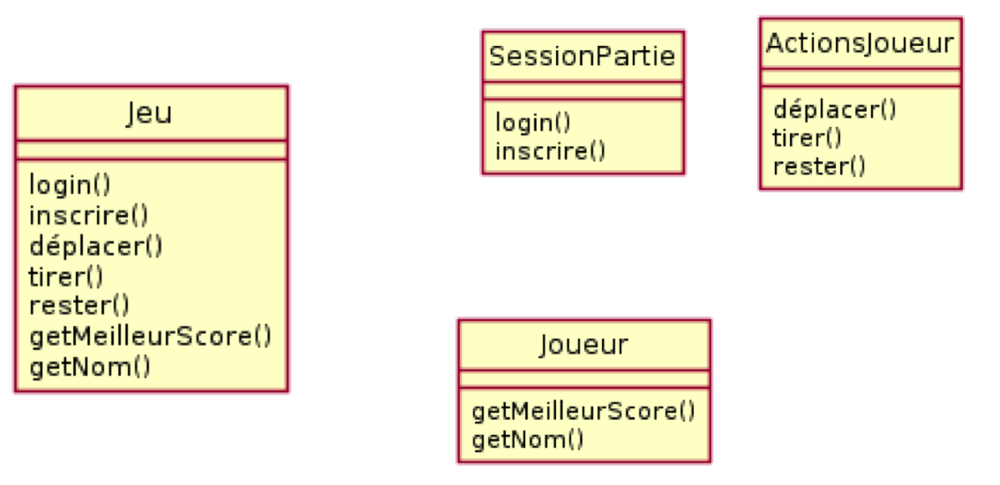{.plain width=75%}

--

<!-- .slide: class="rdcuslide" -->
### Validation de la compréhension
Les patrons GRASP Forte Cohésion et Faible Couplage servent principalement à{align=left}

1. concevoir des classes avec beaucoup de responsabilités
2. choisir les classes dans la couche applicative pour traiter une opération système
3. évaluer plusieurs possibilités lors de la réalisation d'une dynamique de conception
4. choisir une bonne classe pour créer des instances d'une autre classe

<!-- ## Décision 
### Faible couplage vs Forte cohésion
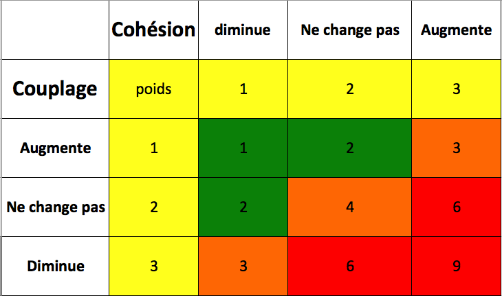{style=border:none} -->

[<div class='footer'>Table des matières Réalisation des cas d'utilisations</div>](#rdcutdm)

--


<!--------------------------------------------------------------->
<!-- .slide: id='rdcu5' class="rdcuslide"  -->
## RDCU-GRASP
1. **Contrôleur**
1. **Créateur**
1. **Expert en information**
1. **Faible couplage**
1. **Forte cohésion**
- Polymorphisme
- Indirection
- Protection de variation
- Fabrication pure

--


<!-- .slide: class="rdcuslide"  -->
## Visibilité
::: block {style=font-size:0.75em}
- Avant qu'un objet puisse envoyer un message à un autre objet, il doit «&nbsp;voir&nbsp;» ce dernier
- Avoir une visibilité = posséder une référence (en Java) F18.1

{.plain width=50%}
:::

--

<!-- .slide: class="rdcuslide"  -->
## Types de visibilité
- Attribut
- Paramètre
- Locale
- Globale

--

<!-- .slide: class="rdcuslide"  -->

## Visibilité d'attribut
- Relativement permanente
- Très commune

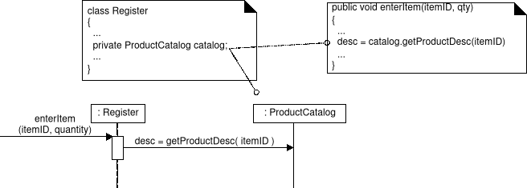{width=150%}{style=border:none}

--

<!-- .slide: class="rdcuslide"  -->

## Visibilité de paramètre
- Durée de vie relativement courte
- Paramètre peut devenir attribut

{style=border:none}

--

<!-- .slide: class="rdcuslide"  -->

## Visibilité locale

- Durée de vie relativement courte
- Peut être définie via
    - Instance créée localement
    - Instance retournée par une méthode

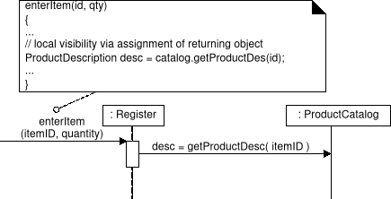{style=border:none}

--

<!-- .slide: class="rdcuslide"  -->

## Visibilité globale
::: block {style=font-size:0.6em}
- Relativement permanente
- Moins commune
- Meilleure définition via un singleton (GoF)
```java 
public class LogManager  {    
    private java.io.PrintStream sout ;    
    private static LogManager lmInstance ; 
    private LogManager ( java.io.PrintStream  out ) 
    {
         sout  = out; 
    }    
    public void log( String msg  ) 
    { 
      sout.println ( msg  ); 
    }    
    public static LogManager getInstance () {      
        if ( lmInstance  == null ) { 
            lmInstance  = new LogManager ( System.out );
        }      
        return lmInstance ;      
    } 
 }
```

Usage:

```java
LogManager.getInstance().log( "haaaaaaah haaaaaahhaa");
```
:::

--

<!-- .slide: class="rdcuslide"  -->

### Créativité et changements pendant le codage

- Les artefacts de conception affectent l'implémentation
- Pendant la programmation et les tests
    - multitudes de changements peuvent surgir
- S'attendre à des déviations et les prévoir
    - Favoriser le changement
- Le codage n'est pas une activité triviale
    - Pourquoi?

Note: Un bon design facilite l'implémentation et vice versa
Q : est-ce que le codage est trivial? 
non
efficacité
optimisation
clarté
gestion des imprévus
réusinage
...

--

<!-- .slide: class="rdcuslide"  -->

#### Méthodes à partir des diagrammes d'interaction
{style=border:none}{.stretch}

--

<!-- .slide: class="rdcuslide"  -->

## SalesLineItem
- SalesLineItem en Java
  
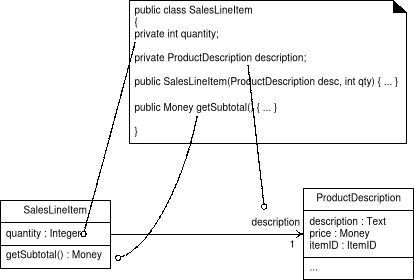{style=border:none}{width=70%}

--

<!-- .slide: class="rdcuslide"  -->
## Résumé

- Nous avons vu des processus de traduction entre:
    - les diagrammes de classes UML et les définitions de classes
    - les diagrammes d'interaction UML et les corps des méthodes
- Mais le travail de programmation laisse encore beaucoup de place à l'exploration

--

<!-- .slide: class="rdcuslide"  -->
### Validation de la compréhension
- Quelle est la motivation principale du principe GRASP Créateur?
    1. Pour avoir une création rapide (performante) d'instances
    1. Pour obtenir une conception plus facile à comprendre
    1. Pour avoir une conception qui prend moins de mémoire
    1. Pour identifier des occasions d'appliquer le patron Fabrique

--

<!-- .slide: class="rdcuslide"  -->
### Validation de la compréhension
- Le pattern Contrôleur GRASP sert à trouver la bonne classe…
    1. de la couche présentation pour réaliser une opération système
    1. de la couche domaine pour réaliser une opération système
    1.  de l'IHM pour implémenter une logique applicative
    1. de l'IHM pour contrôler le système

--

<!-- .slide: class="rdcuslide"  -->
### Validation de la compréhension
- Quel genre de contrôleur GRASP est JeuDeMonopoly dans l'exemple?

    1. Contrôleur de jeu
    1. Contrôleur MVC
    1. Contrôleur de session
    1. Contrôleur de façade

--

<!-- .slide: class="rdcuslide"  -->
### Validation de la compréhension
::: block {style=font-size:0.8em}
- Selon la figure A17.3/F16.3, qui connaît un objet Joueur, étant donné le nom du joueur?
:::
{style=border:none}{width=50%}
::: block {size=font-size:0.8em}
Quel est ce patron GRASP? {.fragment .shade-up}
:::

--

<!-- .slide: class="rdcuslide"  -->
#### Réalisation de cas d'utilisation NextGen
::: block {style=font-size:0.7em}
- La zone non-magie
    - Création de diagrammes d'interaction bien conçus n'est pas magique!
    - Tout s'appuie sur des principes de bonne conception justifiables.
        - GRASP (General Responsibility Assignment Software Pattern)
- L'examen final est aussi une zone non-magie!
    - Il faut y faire preuve d'utilisation des principes justifiables (GRASP)

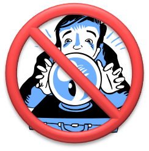{style=border:none}{width=20%}
:::

--

<!-- .slide: class="rdcuslide"  -->
### Processus de haut niveau
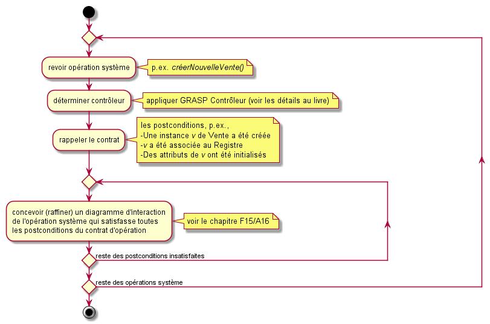{style=border:none}

--

<!-- .slide: class="rdcuslide"  -->
### Réalisation de cas d'utilisation
- Cela «&nbsp;décrit la façon dont les cas d'utilisation sont réalisés dans le Modèle de Conception, en termes d'objets qui collaborent&nbsp;» [RUP]
    - Réalisation de scénario
- Cela fait le lien entre exigences et conception
- C'est un diagramme d'interaction
- C'est une documentation des décisions de COO
    - annotations GRASP
  
[<div class='footer'>Table des matières Réalisation des cas d'utilisations</div>](#rdcutdm)

--


<!--------------------------------------------------------------->
<!-- .slide: id='rdcu6' class="rdcuslide"  -->
### Chp17 Conception avec les GRASP
1. Qu'est-ce qu'une RDCU?
1. Quelle est l'utilité des contrats d'opérations dans une RDCU? {.fragment .shade-up}
1. Est-ce que le retour d'information dans une opération du DSS est important pour la création d'une RDCU? {.fragment .shade-up}
   - Pourquoi? {.fragment .shade-up}

[<div class='footer'>Table des matières Réalisation des cas d'utilisations</div>](#rdcutdm)

--

<!--------------------------------------------------------------->
<!-- .slide: id='visibilite6' class="rdcuslide"  -->


## Chp18 Visibilité

1. Nommez les 4 types de visibilités.
2. Comment déterminer l'ordre d'implémentation des classes?{.fragment .shade-up}
    - Pourquoi?{.fragment .shade-up}

--

<!--------------------------------------------------------------->
<!-- .slide: id='devoir6' class="rdcuslide"  -->

## Exercice RDCU
Correction

https://github.com/yvanross/LOG210-exercices

--

<!-- .slide:  class="rdcuslide"  -->
### RDCU - Aide mémoire

Voir la figure 8.1 des notes de cours.

[<div class='footer'>Table des matières Réalisation des cas d'utilisations</div>](#rdcutdm)

--

<!--------------------------------------------------------------->
<!-- .slide: id="grasp8" class="rdcuslide"  -->
## autres patterns d'affectation des responsabilités

--

<!-- .slide: class="rdcuslide"  -->

## Les neuf patrons GRASP

1. [X] Expert
1. [X] Créateur
1. [X] Contrôleur
1. [X] Faible Couplage
1. [X] Forte Cohésion
1. [ ] Polymorphisme
1. [ ] Fabrication pure
1. [ ] Indirection
1. [ ] Protection des variations

--

<!-- .slide: class="rdcuslide"  -->

## Polymorphisme
- Principe de base pour la conception OO
- Cas qui varient mais qui sont similaires
- Dans une famille de classes
  - opération polymorphique
  - dans laquelle les cas sont différents
- Formes géométriques (carré, cercle, triangle, etc.)
  - se dessine avec une méthode draw()
  - chaque classe implémente sa méthode selon son cas…

--

<!-- .slide: class="rdcuslide"  -->

## Polymorphisme

{.plain width=65%}

Fig. 25.1 (3e édition)

--

<!-- .slide: class="rdcuslide"  -->

## Polymorphisme

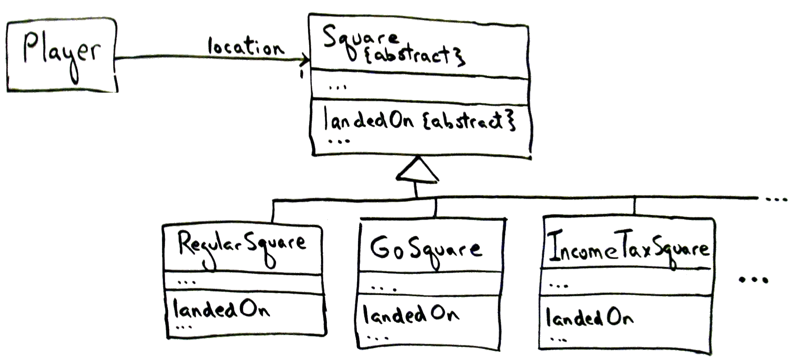{.plain}

Fig. 25.2 (3e édition)

--

<!-- .slide: class="rdcuslide"  -->

## Polymorphisme
{.plain width=80%}

Fig. 25.3 (3e édition)

--

<!-- .slide: class="rdcuslide"  -->

## Polymorphisme
Fig. 25.4, 25.5, 25.7 (3e édition)

{width=30%}{.plain} &nbsp;&nbsp;&nbsp;&nbsp;&nbsp;&nbsp;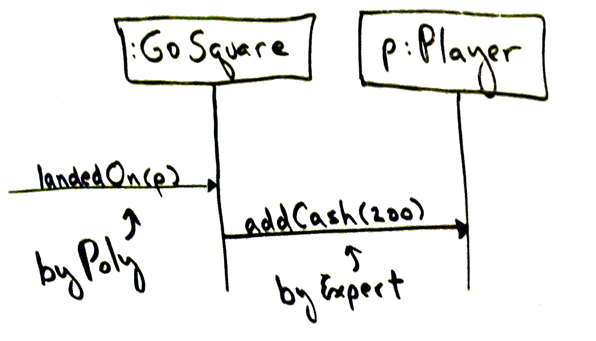{width=30%}{.plain}

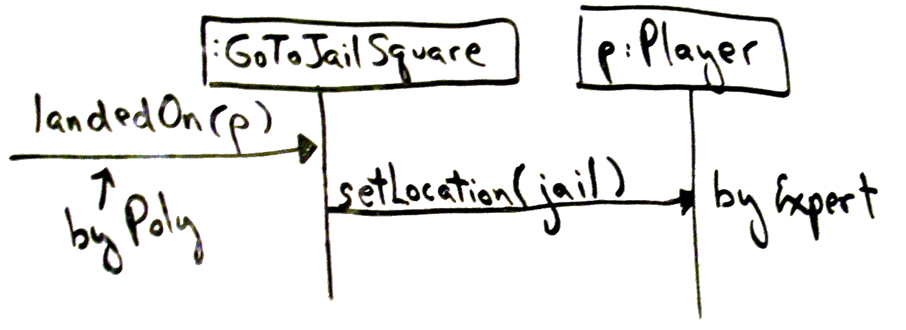{.plain}{width=50%}

--

<!-- .slide: class="rdcuslide"  -->

## Fabrication pure
- Parfois en suivant un patron
    - assigne une responsabilité
    - mais il y a des conséquences non désirables
        - augmentation du couplage
        - diminution de la cohésion
- Solution
    - fabrique une classe «&nbsp;comportementale&nbsp;»
    - qui n'a pas d'équivalent dans le modèle du domaine
    - invention de la part du concepteur

--

<!-- .slide: class="rdcuslide"  -->

## Fabrication pure
{.plain}

Fig. 25.8 (3e édition)

--

<!-- .slide: class="rdcuslide"  -->

## Fabrication pure
{.plain width=80%}

Fig. 25.9 (3e édition)

--

<!-- .slide: class="rdcuslide"  -->

## Compréhension

Quel autre GRASP implique une fabrication pure? Autrement dit, on propose une classe «&nbsp;inventée&nbsp;» ne faisant pas partie du MDD. {align=left}

1. Créateur
2. Contrôleur
3. Expert
4. Forte cohésion
5. Faible couplage

--

<!-- .slide: class="rdcuslide"  -->

## Indirection
- Mécanisme souvent utilisé pour réduire le couplage
- Objet intermédiaire
    - découple deux composants

--

<!-- .slide: class="rdcuslide"  -->

## Indirection
{.plain}{width=130%}

Fig. 25.10 (3e édition)

--

<!-- .slide: class="rdcuslide"  -->

## Protection des variations
- Composants (classes, interfaces, ...)
  - variations (ou instabilités) de ces composants en affectent d'autres
- Éliminer ces effets indésirables
- Identifier des zones de variabilité

--

<!-- .slide: class="rdcuslide"  -->

## Protection des variations
- Créer une interface stable (API) autour des composants instables

{.plain width=35%}

--

<!-- .slide: class="rdcuslide"  -->

## Protection des variations
{.plain}{width=130%}

Note: Adaptateur permet d'utiliser d'autres systèmes externes qui se ressemblent mais qui ont un des API différents

--

<!-- .slide: class="rdcuslide"  -->

## Protection des variations
- Vieux principe du génie logiciel
- Principe de «&nbsp;Information hiding&nbsp;» (Parnas, 1972)
  - Encapsulation des données
  - Déterminer
    - choix difficiles du design
    - choix du design qui auront tendance à changer
  - Concevoir chaque module afin de cacher ces choix «&nbsp;variables&nbsp;»

--

<!-- .slide: class="rdcuslide"  -->

## Protection des variations
- Principe de «&nbsp;Open-closed&nbsp;» (Meyer, 1988)
- Composants devraient être
  - ouverts à l'extensibilité (Implémentations)
  - fermés à la modification (API)
- Ces contraintes paraissent contradictoires

--

<!-- .slide: class="rdcuslide"  -->

## Résumé
- D'autres patrons GRASP
    - Polymorphisme
    - Fabrication pure
    - Indirection
    - Protection des variations
- Vocabulaire
    - concepts de base pour les ingénieurs en logiciel
    - améliore la communication dans une équipe

[<div class='footer'>Table des matières Réalisation des cas d'utilisations</div>](#rdcutdm)

--


<!--------------------------------------------------------------->
<!-- .slide: id='grasp9' class="rdcuslide" -->
## GRASP dans les GoF
- Adaptateur est une spécialisation de certains principes GRASP
{.plain width=75%}

fig. F23.3

--

<!-- .slide: class="rdcuslide" -->
## GRASP dans les GoF

Exercice Google Classrooms  
"Identification des GRASP dans les GoF"

Salles de travail Zoom

20 minutes, suivre le modèle

[<div class='footer'>Table des matières Réalisation des cas d'utilisations</div>](#rdcutdm)

--


<!--------------------------------------------------------------->
<!-- .slide:  id="soimeme9" class="rdcuslide" -->
## Traitement de paiements
- Multiple paiements
    - chèque
    - carte de crédit
    - carte de débit
    - comptant

--

<!-- .slide: class="rdcuslide" -->

## Patron «&nbsp;faire soi-même&nbsp;»
- Objet logiciel
    - abstraction d'un objet réel
    - fait ce qui est normalement fait à l'objet réel
    - avantage: réduire le décalage dés représentations
- Exemple
    - objet Texte qui vérifie sa propre orthographe

--

<!-- .slide: class="rdcuslide1" -->
## Paiement et polymorphisme
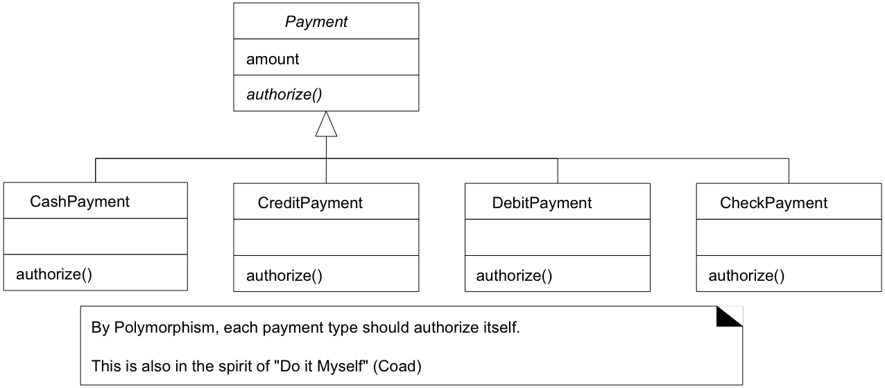{.plain}{width=100%}
fig. F33.17

--

<!-- .slide: class="rdcuslide" -->

## Paiement par chèque
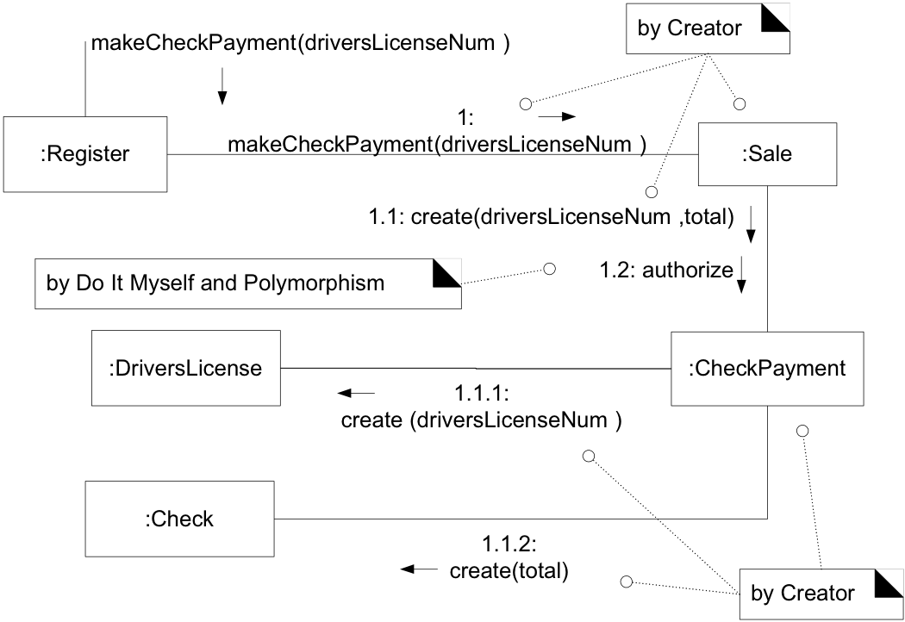{.plain}{width=75%}
fig. F30.19

--

<!-- .slide: class="rdcuslide" -->
## Paiement par carte de crédit
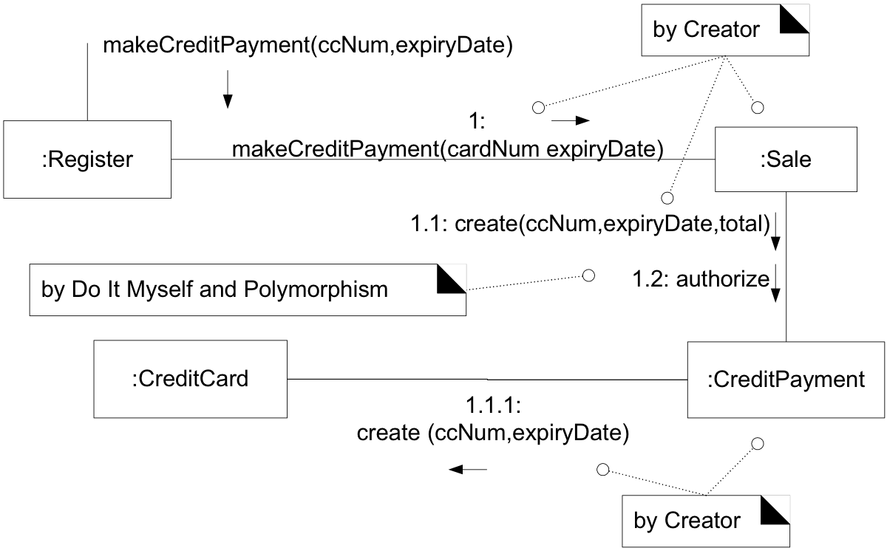{.plain}{width=75%}
fig. F30.18

--

<!-- .slide: class="rdcuslide" -->
## Autorisation
{.plain}{width=50%}
fig. F30.20

--

<!-- .slide: class="rdcuslide" -->
## Autorisation
{.plain}{width=75%}
fig. F30.21

--

<!-- .slide: class="rdcuslide" -->
## Paiement approuvé
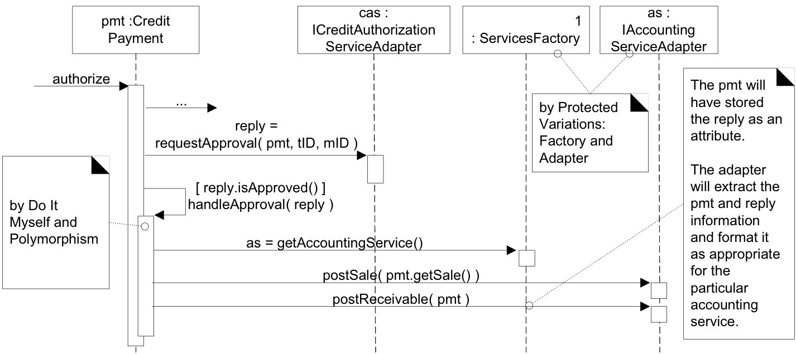{.plain}{width=100%}
fig. F30.22

--

<!-- .slide: class="rdcuslide" -->
### Version simple du paiement
{.plain}{width=70%}

--

<!-- .slide: class="rdcuslide" -->
### Package: Paiement
{.plain width=70%}


[<div class='footer'>Table des matières Réalisation des cas d'utilisations</div>](#rdcutdm)

---

<!--=======================================================================================================-->
<!-- .slide: id='dcltdm'   -->
## Module DCL
1. [Diagramme de classe logiciel](#dcl1) - Diagramme de classe logiciel - [8.59m](https://youtu.be/-XH1jSyJboY)
2. [Attributs](#dcl5) - Diagramme de classes logiciel - [15.11m](https://youtu.be/9n-sh3DnZx8)
3. [Révision](#dcc6) - Diagramme de classes de logicielles 

:::block {style=font-size:0.5em}
[Séances](#seances) | [Quiz](#quiztdm) | [Laboratoires](#laboratoiretdm) | [Intro](#introtdm) | [Équipe](#equipetdm) | [PU](#putdm) | [DCU](#dcutdm) | [CU](#cutdm) | 
[IU](#iutdm) | [MDD](#mddtdm) | [Dss](#dsstdm) | [Contrat](#contrattdm) | [RDCU](#rdcutdm) | [DCL](#dcltdm) | 
[Couche](#couchetdm) | [Exercice](#exercicetdm) | [Typescript](#typescripttdm) | [Complexite](#complexitetdm) 
| [FURPS](#furpstdm) | [TDD](#tddtdm) | [GOF](#goftdm) | [Diagrammes](#diagrammestdm) | [Divers](#diverstdm)  
:::

--


<!--------------------------------------------------------------->
<!-- .slide: id='dcl1' class="dclslide"  -->
## DCL - DCC
### Diagramme de classe logiciel
## Diagramme de classe de conception
Note: S20201-03 continuer ici

--

<!-- .slide: class="dclslide"  -->
## Classificateurs UML
- Dans les DCC, il y en a deux classificateurs courants:
    - Les classes
    - Les interfaces
  
https://plantuml.com/class-diagram


--

<!-- .slide: class="dclslide"  -->

## Notation courante (vue en LOG121)
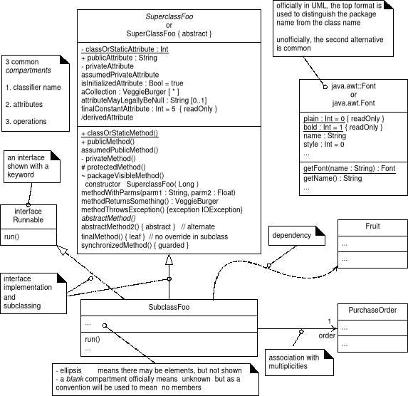{width=50%}{style=border:none}

--

<!-- .slide: class="dclslide"  -->

## Attributs en UML
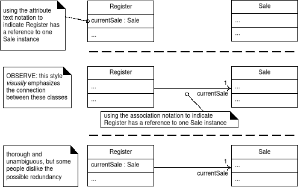{width=75%}{style=border:none}

--

<!-- .slide: class="dclslide"  -->
### Décalage de représentation
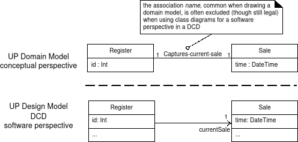{width=75%}{style=border:none}

--

<!-- .slide: class="dclslide"  -->
### Relation diagrammes 
### d'interaction et de classes
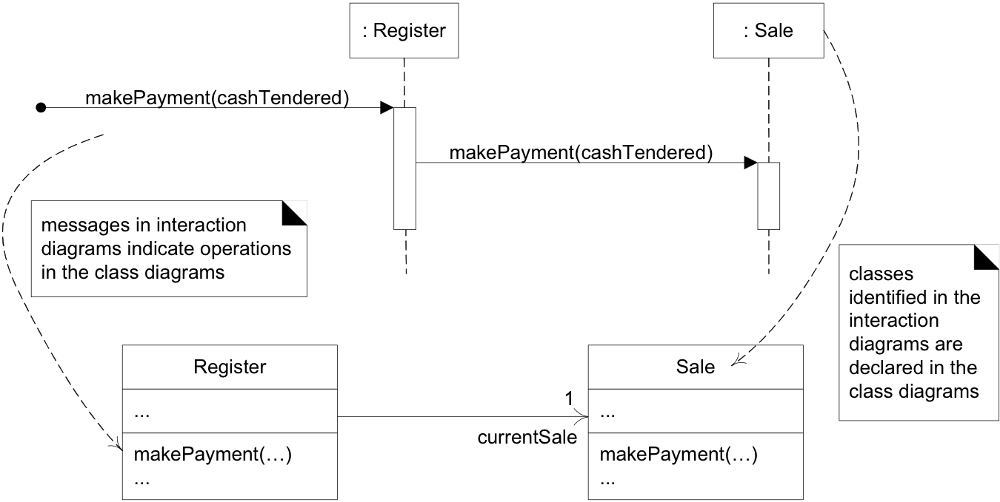{width=75%}{style=border:none}

--

<!-- .slide: class="dclslide"  -->
## Ordre d'implémentation
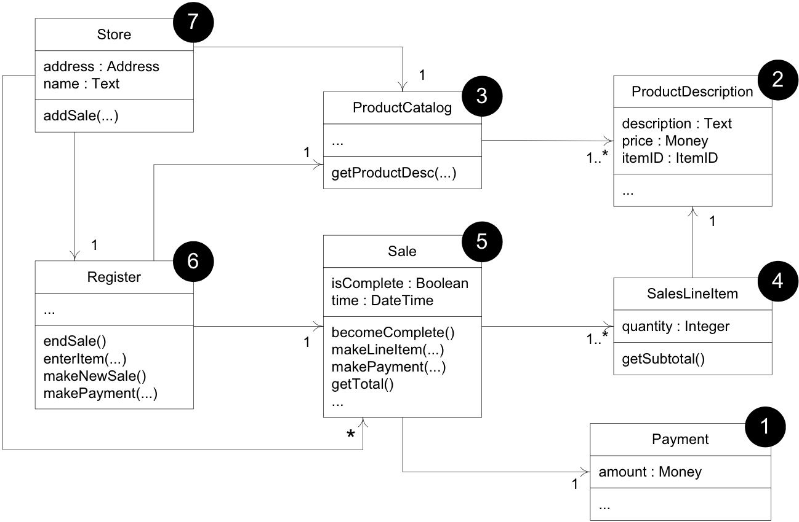{width=75%}{style=border:none}

--

<!-- .slide: class="dclslide"  -->

## Résumé
- DCC servent comme plan pour le codage
    - Soyez à l'aise avec la transformation
- DCC se construisent au fur et à mesure que l'on réalise la dynamique (à travers les diagrammes d'interaction)

[<div class='footer'>Table des matières diagramme de classes logiciels</div>](#dcltdm)

--


<!--------------------------------------------------------------->
<!-- .slide: id='dcl5' class="dclslide"  -->
## Deux façons de noter les attributs


```java
public class Register {
  private int id;
  private Sale currentSale;
  private Store location;
  // …
}
```

--

<!-- .slide: class="dclslide"  -->
## Classes collection
- Multiplicités des associations
- Besoin d'un groupe d'objets similaires
- Choix du type de collection
    -  influencé par le besoin
```java
public class Sale{
  private List<SalesLineItem> lineItems =
        new ArrayList<SalesLineItems>();
  // …
}
```

--

<!-- .slide: class="dclslide"  -->
## Ajouter une classe de collection
{style=border:none}{width=100%}

--

<!-- .slide: class="dclslide"  -->
### Opération vs Méthode
::: block {style=font-size:0.8em}

- UML DCC : signature des opérations
    - Déclaration (décision de conception)
    - Opérations sont quasiment «&nbsp;vides&nbsp;» en UML
- Java : implémentation des méthodes
    - Implémentation (décision de codage)
- Déclaration d'**opération** (UML) est différente de l'implémentation de **méthode** (langage OO)
    - P.ex. un contrat d'opération définit les contraintes sur une opération et non une méthode
    - La différence est subtile mais importante
:::

--

<!-- .slide: class="dclslide"  -->
## Mots clés, stéréotypes, profils, étiquettes
::: block {style=font-size:0.8em}
- Voir les sections A16.7/F15.7, A16.8/F15.8
    - ```Stéréotype <create> , <destroy>, <metaclass>, <Actor>, <Interface>, …```
    - Le stéréotype déclare un ensemble d'étiquettes
- Etiquette: @login_required
    - Fonctionnalitées et attributs que l'on veux donner à une classe ou une méthode.
:::

--

<!-- .slide: class="dclslide"  -->
## Notation de dépendance
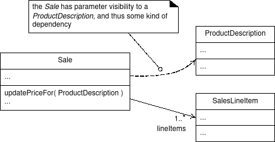{style=border:none}{width=50%%}
::: block {style=font-size:0.6em}
fig F15.9

```java
public class Sale{
  public void updatePriceFor(

ProductDescription
description) {
    Money basePrice = description.getPrice();
    // …
  }
  // …
}
```
:::

--

<!-- .slide: class="dclslide"  -->

- Interfaces et réalisation d'interface
{style=border:none}

[<div class='footer'>Table des matières diagramme de classes logiciels</div>](#dcltdm)

--


<!--------------------------------------------------------------->
<!-- .slide: id='dcc6' class="dclslide"  -->
## Chp15 Diagramme  de classe
1. Quelle est la différence entre un diagramme de classes conceptuelles et logicielles?
1. Quelles sont les deux façons de noter les attributs?{.fragment .fade-up}
1. Pourquoi fait-on un DCC?{.fragment .fade-up}

--

<!-- .slide: class="dclslide"  -->

## Validation de la compréhension

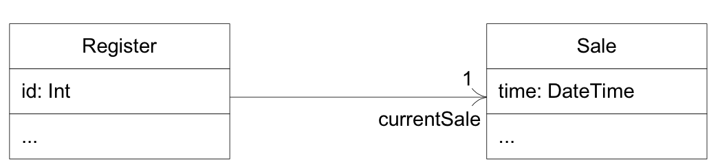{.plain}

- Combien d'attributs pour Register et Sale ?
    - A. 1, 1
    - B. 2, 1
    - C. 1, 2
    - D. 2, 2

Note: B: 2, 1 puisque Register connaît sa Vente et doit stocker sa référence `currentSale`

[<div class='footer'>Table des matières diagramme de classes logiciels</div>](#dcltdm)


---

<!--=======================================================================================================-->
<!-- .slide: id='couchetdm'   -->
## Architecture en couche
1. [Architecture logique](#couche2) en couches - [21.45m](https://youtu.be/BNu7_aT4WwU)
2. [Packaging](#package8) - [34.58m](https://youtu.be/ZyBbUEyZegY)
3. [Valider l'architecture en couche du laboratoire](#couche11) - [10.19m](https://youtu.be/MBMqj8eG68k)

:::block {style=font-size:0.5em}
[Séances](#seances) | [Quiz](#quiztdm) | [Laboratoires](#laboratoiretdm) | [Intro](#introtdm) | [Équipe](#equipetdm) | [PU](#putdm) | [DCU](#dcutdm) | [CU](#cutdm) | 
[IU](#iutdm) | [MDD](#mddtdm) | [Dss](#dsstdm) | [Contrat](#contrattdm) | [RDCU](#rdcutdm) | [DCL](#dcltdm) | 
[Couche](#couchetdm) | [Exercice](#exercicetdm) | [Typescript](#typescripttdm) | [Complexite](#complexitetdm) 
| [FURPS](#furpstdm) | [TDD](#tddtdm) | [GOF](#goftdm) | [Diagrammes](#diagrammestdm) | [Divers](#diverstdm)  
:::

--

<!--------------------------------------------------------------->
<!-- .slide: id="couche2" class="packageslide" -->

## Architecture logique

Solution avec Java/Swing:

{.plain}

Note: bug


--

<!-- .slide: class="packageslide" -->

## Architecture logique

Solution avec Navigateur/HTTP/ExpressJS/TypeScript:

{.plain}

--

<!-- .slide: class="packageslide" -->

## Comprendre et respecter l'architecture en couches du laboratoire

https://log210-cfuhrman.github.io/log210-valider-architecture-couches/

[<div class='footer'>Table des matières architecture en couche</div>](#couchetdm)

--


<!--------------------------------------------------------------->
<!-- .slide: id='package8' class="packageslide" -->
## Packaging?
::: block {.fragment .shade-up}
### Attribut de qualité
1. [ ] Performance 
1. [ ] Disponibilité 
1. [ ] Testabilité
1. [ ] Interopérabilité
1. [ ] Sécurité
1. [ ] Usabilité
1. [X] Modifiabilité
:::

--

<!-- .slide:  class="packageslide" -->

## Objectifs
- Organiser les packages pour réduire l'impact des **modifications**
- Apprendre d'autres notations des structures de packages UML

--

<!-- .slide:  class="packageslide" -->

## Principes

- Organiser les packages par **cohésion**
- Packager une **famille d'interface**
- Créer un package par **tâche** et par **goupe  de classes instables** (Branches)
- Les plus responsables sont les plus stables
- Factoriser les type indépendants
- Utiliser des **fabrications** pour limiter la dépendance aux packages concrets
- Pas de cycles dans les packages [DSM](https://www.ndepend.com/docs/dependency-structure-matrix-dsm)

--

<!-- .slide:  class="packageslide" -->

### Groupement par cohésion fonctionnelle
- On groupe les types qui sont fortement apparentés, parce qu'ils participent à une finalité, un service, des collaborations, une politique et une fonction qu'ils ont en commun.
- P.ex. le package "Tarification" contient des classes liées à la tarification des produits.
- C'est intuitif.

--


<!-- .slide:  class="packageslide" -->
### Groupement par cohésion relationnelle
::: block {style=font-size:0.6em}
- Mettre dans un package des classes qui se sont fortement couplées les unes aux autres.
- CR = (NombreDeRelationsInternes + 1) / NombreDeTypes
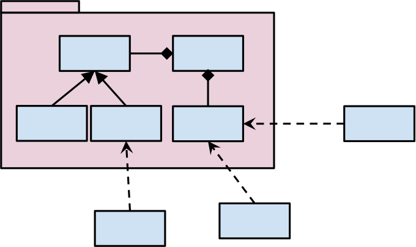{.plain}{width=50%}

- GOF Facade  pour améliorer la cohésion relationnelle avec les packages externes

:::

--

<!-- .slide:  class="packageslide" -->

#### Cohésion relationnelle - exemple
{.plain}
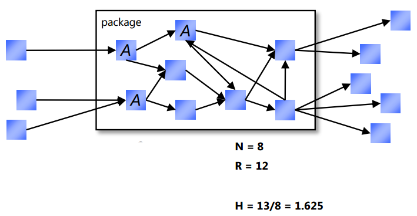{.plain}{width=50%}
::: block {style=font-size:0.7em}
[ndepend: métrique de cohésion](http://www.hanselman.com/blog/content/binary/NDepend%20metrics%20placemats%201.1.pdf){.plain}

:::

--

<!-- .slide:  class="packageslide" -->

### Packager une famille d'interfaces

- Placez une famille d'interfaces fonctionnellement liées dans un package à part
- Cela vaut pour les familles de trois interfaces ou plus
- Exemple: javax.ejb  comprend au moins douze 

::: block {style=font-size:0.5em}
```
- EJBContext
- EJBHome
- EJBLocalHome
- EJBLocalObject
- EJBMetaData
- EJBObject
- EnterpriseBean
- EntityBean
- EntityContext
- Handle
- HomeHandle
- MessageDrivenBean
- MessageDrivenContext
- SessionBean
- SessionContext
- SessionSynchronization
- TimedObject
- Timer
- TimerHandle
- TimerService
```
:::

Note: todo plusieurs colonnes

--

<!-- .slide:  class="packageslide" -->

## Créez un package par tâche de livraison

- Les packages sont l'unité de base de développement et de livraison (on ne développe rarement qu'une seule classe)
- Créer un package par tâche de livraison

{.plain}

--

<!-- .slide:  class="packageslide" -->

### ... et par groupe de classes instables [2/]
::: block {style=font-size:0.8em}
- Si un ensemble de classes dans un package a une tendance à évoluer ensemble, p.ex. on remarque qu'à chaque itération, c'est toujours les mêmes 5 ou 10 classes dans un package qui ont été modifiées.
- Exemple concret – chaque fois que l'on change le schéma de la BD il y a des changements dans plusieurs classes, surtout les appels à la méthode “sqlquery()”
    - Créez un package dans le package (sous package) pour isoler les classes ayant une tendance à changer ensemble
    - Notez que la tendance de ce genre de changement n'est pas visible dans les premières itérations.

Note: Sujets de recherche en génie logiciel: “co-change” – “couplage logique” et “couplage évolutionnaire” - liens de couplage déterminés par l'historique des versions.
:::

--

<!-- .slide:  class="packageslide" -->

### Les plus responsables sont les plus stables
Les packages «&nbsp;les plus responsables&nbsp;» engendrent le **plus de dépendances** et devraient être plus stables.

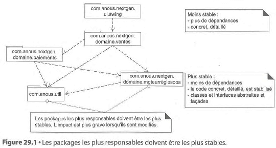{.plain}{width=65%}

Quel GRASP pour rendre un package plus stable? {.fragment .shape-up}

Note: Protections de variations propose de créer une interface stable

--

<!-- .slide:  class="packageslide" -->

## Factoriser les types

Organiser les types qui peuvent être utilisés indépendamment ou dans des contextes différents en packages distincts.

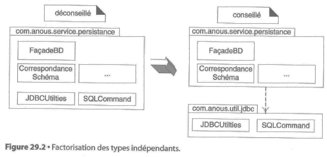{.plain}

--

<!-- .slide:  class="packageslide" -->

#### Fabriques pour découpler 
####  des classes concrètes

Renforcer la stabilité des packages consiste à réduire leur dépendance à des classes concrètes qui **appartiennent à d'autres packages**

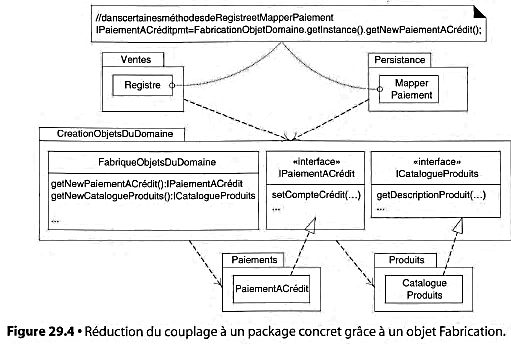{.plain}

--

<!-- .slide:  class="packageslide" -->

### Visibilité et encapsulation dans les packages

Organiser les classes dans un package avec la bonne visibilité

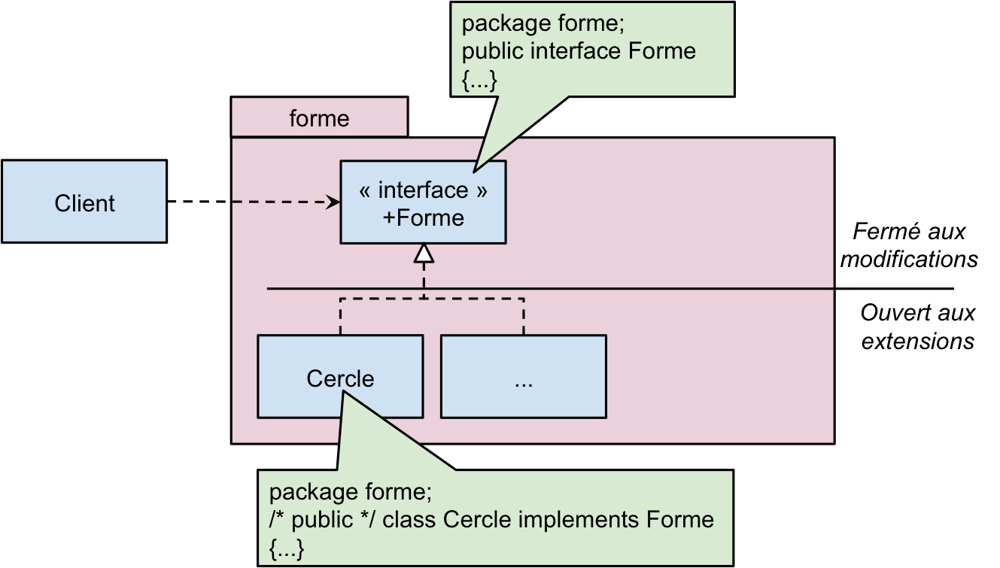{.plain}{width=70%}

--

<!-- .slide:  class="packageslide" -->

### Visibilité et encapsulation dans les packages

- Bloquer l'accès à un attribut ou une méthode d'une classe avec `private`
- Bloquer l'accès à une classe dans un package?
  - Déclarer la classe `class X {...}` (package protection, sans mot clé)
  - GRASP Protection des variations
    - Client ne devrait pas accéder aux implémentations de Forme.

--

<!-- .slide:  class="packageslide" -->

### Visibilité et encapsulation dans les packages
- Cette visibilité empêche les transgressions de l'encapsulation
{.plain}{width=90%}

--

<!-- .slide:  class="packageslide" -->

### Comment instancier les classes invisibles?

- FabriqueForme permet à Client d'instancier les Formes concrètes, bien qu'elles lui soient invisibles

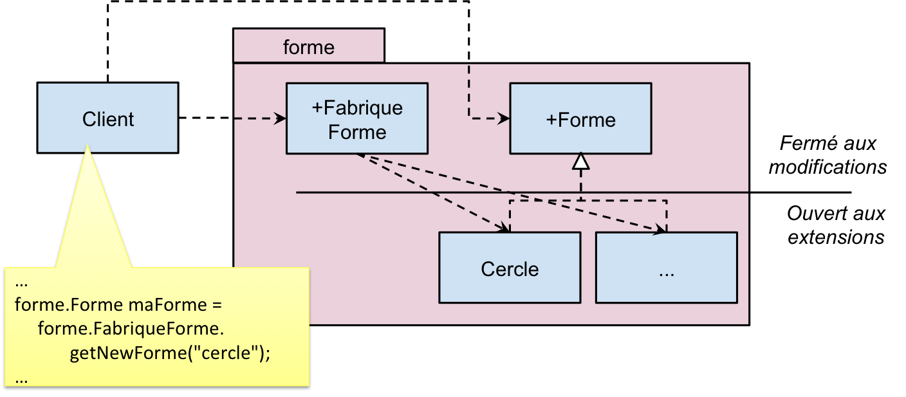{.plain}

--

<!-- .slide:  class="packageslide" -->

### Principe: pas de cycles dans les packages
::: block {style=font-size:0.7em}
- Si un groupe de packages a une dépendance cyclique, on peut devoir les traiter comme un seul grand package. Cela n'est pas souhaitable, car la livraison de packages volumineux (ou d'agrégats de packages) aggrave le risque d'effets néfastes.
- Factoriser les types participant au cycle dans un package plus petit.
- Rompre le cycle à l'aide d'une interface.

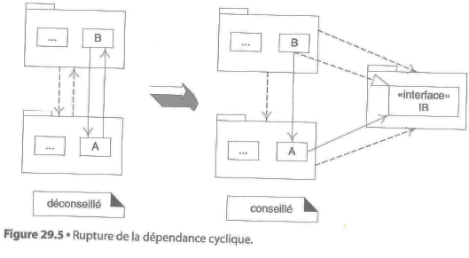{.plain}
:::

--

<!-- .slide:  class="packageslide" -->

### Combinaison des patrons de packaging

{.plain}{width=125%}

::: block {style=font-size:0.5em}
ref: [Commonly used architectural patterns in Java applications](http://www.techrepublic.com/article/commonly-used-architectural-patterns-in-java-applications)
:::

--

<!-- .slide:  class="packageslide" -->

## Qu'est-ce qu'une couche?
- Groupement à forte granularité de classes, packages et sous-systèmes
- Possède un thème «&nbsp;cohésif&nbsp;»
- Une couche plus «&nbsp;haute&nbsp;» fait appel aux couches plus «&nbsp;basses&nbsp;», mais pas l'inverse
- Couches OO typiques
  - Présentation (IHM)
  - Logique applicative (objets du domaine)
  - Services techniques (persistance, journalisation, etc.)

--

<!-- .slide:  class="packageslide" -->

### Concevoir une architecture en couches
- Séparation nette et cohésive
- Collaboration et couplage vont du haut vers le bas

{.plain}{width=30%}

fig F12.2, A13.2

- Séparation Modèle-Vue est un cas simple

--

<!-- .slide:  class="packageslide" -->

### Architecture  - Modèle / Vue / Contrôleur
::: block {style=font-size:0.7em}
- Vues/contrôleurs modifient le modèle
- Modèle informe les vues des changements
- Vues se mettent à jour de nouveau en conséquence

{.plain}{width:75%}

--

<!-- .slide:  class="packageslide" -->

### Avantages de la modélisation en couches
- Séparation de fonctions/services -> couplage réduit, cohésion améliorée
- La complexité est encapsulée (décomposable)
- On peut remplacer certaines couches
- Les couches basses contiennent des fonctions réutilisables
- Certaines couches (Domaine) peuvent être distribuées
- Segmentation logique facilite développement en équipe

--

<!-- .slide:  class="packageslide" -->

##### Architecture multi-couches
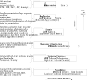{.plain}{width=65%}

<!-- --

## Architecture web multi-couches
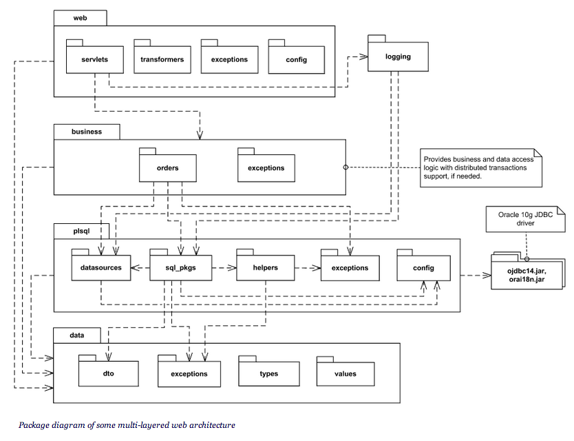{.plain}{width=70%} -->

--

<!-- .slide:  class="packageslide" -->

### Relation entre couche domaine et DCC
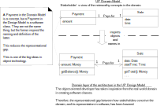{.plain}{width=90%}

--

<!-- .slide:  class="packageslide" -->

## Relation entre DSS et couches
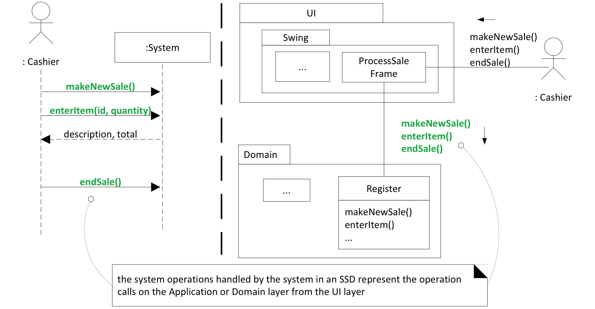{.plain}

--

<!-- .slide:  class="packageslide" -->

#### Influence des artefacts du Processus Unifié

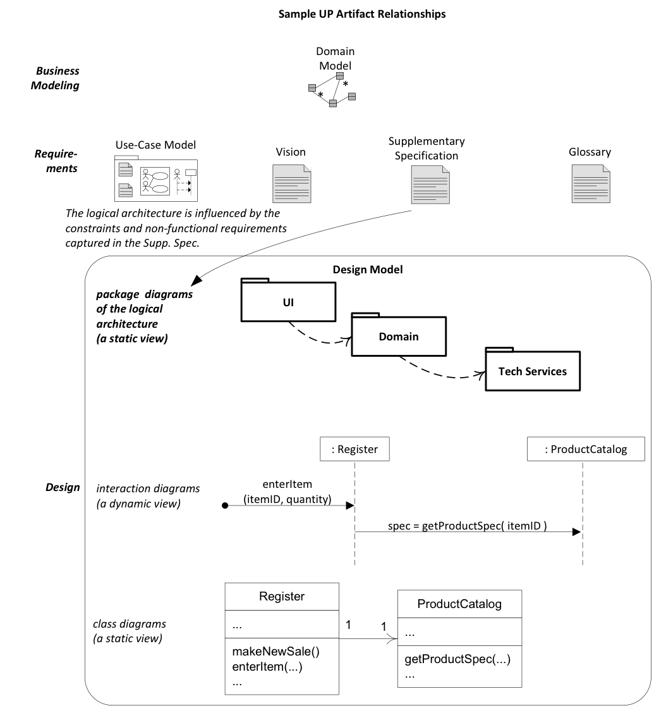{.plain}{width=50%}

::: block {style=font-size:0.5em}
fig A13.1, F12.1
:::

--

<!-- .slide:  class="packageslide" -->

## Résumé
- Architecture logique est importante pour les conceptions de systèmes complexes
- Modèle en couches est populaire
    - Extension du principe de séparation Modèle-Vue
    - Java est organisé en couches
    - Android aussi
- DSS relie la couche présentation avec la couche du domaine à travers les opérations système

[<div class='footer'>Table des matières architecture en couche</div>](#couchetdm)


--


<!--------------------------------------------------------------->
<!-- .slide: id='couche11' class="packageslide" -->
## Valider l'architecture en couche

[Valider l'architecture en couches (des laboratoires)](https://log210-cfuhrman.github.io/log210-valider-architecture-couches/#/)

[<div class='footer'>Table des matières architecture en couche</div>](#couchetdm)


---

<!--=======================================================================================================-->
<!-- .slide: id='exercicetdm'   -->
## Module exercices

1. [Git exercices](https://github.com/yvanross/LOG210-exercices)
2. [Mise en plateau](#exercice2) - [Google Doc](https://docs.google.com/document/d/1nGiQOeRyrY-Tx-J82z3qa0vAoUsF1rvHMNjyPGXH2mY/edit?usp=sharing)
3. [Reserver plusieurs chambres](#reservation2)
4. [Système d'échange de livre universitaire](#exercice4) 
5. [Exercice Système d'échange de livre](#exercice5) - [55.43m](https://youtu.be/pcBHIMMowrc)
6. [Exercices de préparation à l'examen final](#exercice13)
7. [Patron observateur](./observateur-solution.puml)

:::block {style=font-size:0.5em}
[Séances](#seances) | [Quiz](#quiztdm) | [Laboratoires](#laboratoiretdm) | [Intro](#introtdm) | [Équipe](#equipetdm) | [PU](#putdm) | [DCU](#dcutdm) | [CU](#cutdm) | 
[IU](#iutdm) | [MDD](#mddtdm) | [Dss](#dsstdm) | [Contrat](#contrattdm) | [RDCU](#rdcutdm) | [DCL](#dcltdm) | 
[Couche](#couchetdm) | [Exercice](#exercicetdm) | [Typescript](#typescripttdm) | [Complexite](#complexitetdm) 
| [FURPS](#furpstdm) | [TDD](#tddtdm) | [GOF](#goftdm) | [Diagrammes](#diagrammestdm) | [Divers](#diverstdm)  
:::

--

<!--------------------------------------------------------------->
<!-- .slide: id="exercice2" class="codeslide" -->
## Exercice Mise en plateau

https://docs.google.com/document/d/1nGiQOeRyrY-Tx-J82z3qa0vAoUsF1rvHMNjyPGXH2mY/edit?usp=sharing

[<div class='footer'>Table des matières exercices</div>](#exercicetdm)

--

<!--------------------------------------------------------------->
<!-- .slide: id='reservation2' -->
### Itération suivante
::: block {style=font-size:0.9em}
CU02-Le client aimerais pouvoir réserver plusieurs chambres avec des dates différents lors de la même réservation
- Qu'est-ce qui change au niveau du [DCU](#dcu1)
- Qu'est-ce qui change au niveau du [CU](#cu1-noter-une-reservation)
- Qu'est-ce qui change au niveau du [MDD](#mdd1)
- Qu'est-ce qui change au niveau des [IU](#iu1)
- Qu'est-ce qui change au niveau du [Dss](#dss1)
- Qu'est-ce qui change au niveau des [contrats](#contrat1)
- Qu'est-ce qui change au niveau des [RDCU](#rdcu1)
- Qu'est-ce qui change au niveau du [DCL](#dcl1)

[Noter une réservation](#cu1-noter-une-reservation)

[<div class='footer'>Table des matières exercices</div>](#exercicetdm)


<!--------------------------------------------------------------->--
<!-- .slide: id="exercice4" class="codeslide" -->
## Exercice 
### Système échange de livre

- En équipe de 4 personnes, réaliser les modèles suivant:
  - MDD(avec catégorie de classe et d'association), 
  - DSS, 
  - Contrats, 
  - RDCU 
  - DCL 
  
Pour les cas d'utilisations suivants:

--

<!-- .slide:  class="codeslide" -->
## Étude de cas 
### Système d'échange de livres universitaires
::: block {style=text-align:justify}
Le Bureau du Développement Durable (BDD) de l'Université a mis en place un système d'échange de livres aux fins de développement durable et pour réduire les coûts pour les étudiants (les clients du système). La version initiale est rudimentaire et ne permet que deux fonctionnalités :
:::

--

<!-- .slide:  class="codeslide" -->
### CU01 - Ajouter un livre à échanger

::: block {style=font-size:0.6em;text-align:left}
Acteur principal : Client (étudiant)

**Préconditions :**

Le Client est identifié (par son nom d'utilisateur) et authentifié par son mot de passe.

**Scénario principal (succès)**
1.	Le Client démarre un nouvel ajout de livre. 
2.	Le Client entre le code ISBN du livre, ainsi que le code de sa condition. 
3.	Le Système enregistre le livre et présente sa description (titre, nombre de pages, auteurs, maison d'édition, no d'édition ). Le Client répète les étapes 2 à 3 jusqu'à ce qu'il ait saisi tous les livres à échanger. 
4.	Le Système présente la liste de livres que possède le Client. 

**Cas alternatifs**

3a. Le système affiche un message d'erreur puisque le livre n'existe pas.
:::

--

<!-- .slide:  class="codeslide" -->
#### CU02 - Proposer un échange de livres 
::: block {style=font-size:0.5em;text-align:left}
Acteur principal : Client (étudiant)

**Préconditions :**
Le Client est identifié (par son nom d'utilisateur) et authentifié par son mot de passe.

Scénario principal (succès) 

1.	Le Client démarre une nouvelle proposition d'échange de livres. 
2.	Le Système présente une liste d'autres Clients dans le système ainsi que le(s) livre(s) qu'ils ont à échanger. 
3.	Le Client sélectionne un autre Client (le Client Proposé) à qui il veut proposer un échange. 
4.	Le Système présente la liste de livres que possède le Client Proposé et une liste de livres que possède le Client. 
5.	Le Client ajoute à la proposition d'échange un livre. Si c'est un de ses livres, alors c'est à offrir dans la proposition. Sinon c'est un livre du Client Proposé et c'est à recevoir dans la proposition. Le Client répète l'étape 5. jusqu'à ce qu'il soit satisfait de la proposition. 
6.	Le Système présente le nombre total de livres à offrir et à recevoir et demande au Client de confirmer la proposition. 
7.	Le Client confirme et le Système enregistre sa proposition d'échange avec la date et l'heure. 
8.	Le Système envoie un courriel au Client Proposé pour l'informer de la proposition d'échange. 
::: 

[<div class='footer'>Table des matières exercices</div>](#exercicetdm)

--


<!--------------------------------------------------------------->
<!-- .slide: id='exercice5' class="exerciceslide"  -->
## Révision exercice 
## système d'échange de livre
https://github.com/yvanross/LOG210-exercices

[<div class='footer'>Table des matières exercices</div>](#exercicetdm)

--

<!--------------------------------------------------------------->
<!-- .slide: id='exercice13' -->
## exercices en ligne
https://github.com/yvanross/LOG210-exercices

[<div class='footer'>Table des matières exercices</div>](#exercicetdm)

---

<!--=======================================================================================================-->
<!-- .slide: id='typescripttdm'   -->
## Module Typescript
1. [Exemmples TypeScript (SGB)](#exemplests5) - [24.55m](https://youtu.be/QZI41p5E8aU)

:::block {style=font-size:0.5em}
[Séances](#seances) | [Quiz](#quiztdm) | [Laboratoires](#laboratoiretdm) | [Intro](#introtdm) | [Équipe](#equipetdm) | [PU](#putdm) | [DCU](#dcutdm) | [CU](#cutdm) | 
[IU](#iutdm) | [MDD](#mddtdm) | [Dss](#dsstdm) | [Contrat](#contrattdm) | [RDCU](#rdcutdm) | [DCL](#dcltdm) | 
[Couche](#couchetdm) | [Exercice](#exercicetdm) | [Typescript](#typescripttdm) | [Complexite](#complexitetdm) 
| [FURPS](#furpstdm) | [TDD](#tddtdm) | [GOF](#goftdm) | [Diagrammes](#diagrammestdm) | [Divers](#diverstdm)  
:::

[<div class='footer'>Table des matières exercices</div>](#exercicetdm)

--

<!--------------------------------------------------------------->
<!-- .slide: id='exemplests5' class="codeslide"  -->
## Exemples TypeScript

[Dépôt github](https://github.com/profcfuhrmanets/exemples-ts/)
https://github.com/profcfuhrmanets/exemples-ts/

--

<!-- .slide: class="codeslide"  -->
## Arrow Function (JavaScript)

src/arrow_function.ts

--

<!-- .slide: class="codeslide"  -->

## Array.prototype.map() (JavaScript)

src/array_map_arrow.ts

--

<!-- .slide: class="codeslide"  -->

## Tableau associatif Map() (JavaScript)

src/tableau_associatif.ts

--

<!-- .slide: class="codeslide"  -->

## Accès SGB

src/get_students_fetch.ts

--

<!-- .slide: class="codeslide"  -->

## ⚠️Deux "Map"

Le sens est différent:

- Tableau associatif `Map<>()`
  - https://howtodoinjava.com/typescript/maps/
- `Array.prototype.map()`
    - https://developer.mozilla.org/en-US/docs/Web/JavaScript/Reference/Global_Objects/Array/map

[<div class='footer'>Table des matières exercices</div>](#exercicetdm)


---

<!--=======================================================================================================-->
<!-- .slide: id='complexitetdm'   -->
## Module complexité
1. [Complexité - Inhérente et accidentelle](#complexite5) - [23.04m](https://youtu.be/afZsZ26j0k8)

:::block {style=font-size:0.5em}
[Séances](#seances) | [Quiz](#quiztdm) | [Laboratoires](#laboratoiretdm) | [Intro](#introtdm) | [Équipe](#equipetdm) | [PU](#putdm) | [DCU](#dcutdm) | [CU](#cutdm) | 
[IU](#iutdm) | [MDD](#mddtdm) | [Dss](#dsstdm) | [Contrat](#contrattdm) | [RDCU](#rdcutdm) | [DCL](#dcltdm) | 
[Couche](#couchetdm) | [Exercice](#exercicetdm) | [Typescript](#typescripttdm) | [Complexite](#complexitetdm) 
| [FURPS](#furpstdm) | [TDD](#tddtdm) | [GOF](#goftdm) | [Diagrammes](#diagrammestdm) | [Divers](#diverstdm)  
:::

--


<!--------------------------------------------------------------->
<!-- .slide: id='complexite5' class="complexiteslide"  -->
## Complexités inhérente et accidentelle

--

<!-- .slide: class="complexiteslide"  -->
## Objectif

Vous sensibiliser aux conséquences de vos choix en conception sur le plan de la complexité.

{.plain}

--

<!-- .slide: class="complexiteslide"  -->
### Défis posés par la complexité

- La complexité est l'adversaire de tout développeur logiciel
- On peut distinguer entre deux sources de complexité (F. Brooks)
- Le domaine du problème
  - «&nbsp;complexité inhérente (essentielle)&nbsp;»
- La solution (logicielle)
  - «&nbsp;complexité accidentelle&nbsp;»

--

<!-- .slide: class="complexiteslide"  -->
## Complexités
::: block {style=font-size:0.85em}
- Inhérente (essentielle)
    - «&nbsp;Essentielle&nbsp;» selon Aristote
    - Pour «&nbsp;être&nbsp;» une voiture, une voiture a un moteur, des roues, des portes, etc.
- Accidentelle (due à des choix)
:::

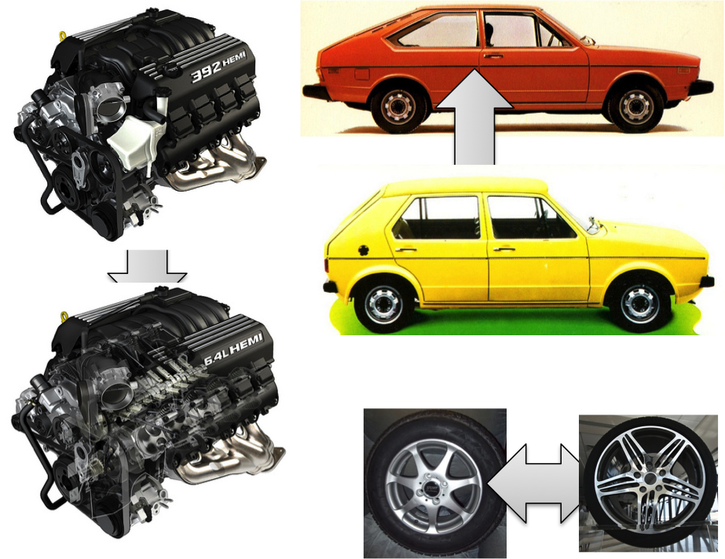{.plain width=40%}

--

<!-- .slide: class="complexiteslide"  -->
## Complexité inhérente

- Le domaine du problème concernant le logiciel peut être complexe
  - Exemple : système d'exploitation pour ordinateur
- La complexité inhérente est due au «&nbsp;problème&nbsp;» et non à la solution
  - Linux est complexe parce qu'il doit supporter plein de fonctionnalités…
- Synonyme : «&nbsp;complexité essentielle&nbsp;»

--

<!-- .slide: class="complexiteslide"  -->
## Complexité inhérente

{.plain width=70%}

--

<!-- .slide: class="complexiteslide"  -->
## Complexité accidentelle

- Les choix proposés pour la solution peuvent introduire une complexité «&nbsp;accidentelle&nbsp;»
  - Langage de développement à bas niveau (p. ex. C ou assembleur)
  - Outils de débogage limités
- La complexité accidentelle peut être plus facilement gérée
  - Meilleurs outils (IDE), meilleurs techniques, langage plus haut niveau, solution plus simple (si possible)

--

<!-- .slide: class="complexiteslide"  -->
##### Exemple : gestion de complexité accidentelle en Java

- Compilation en ligne de commande
- Utilisation de IDE (Eclipse)
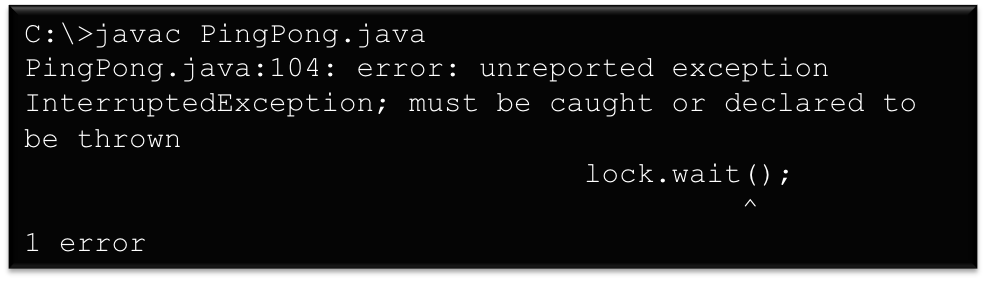
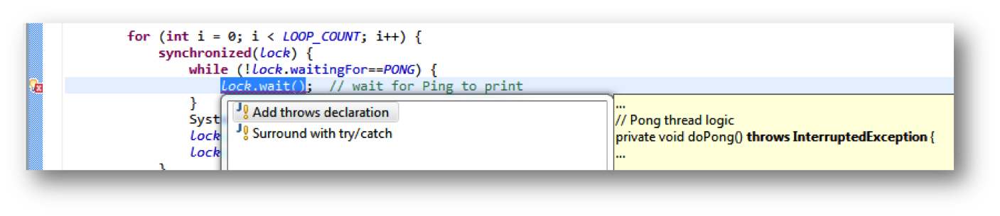

--

<!-- .slide: class="complexiteslide"  -->
#### Distinction n'est pas toujours facile
::: block {style=font-size:0.85em}

- Dans une conception logicielle, les éléments sont souvent complexes.
- La source de la complexité n'est pas toujours facile à identifier.
    - Exemple: logiciels de réseau
        - Difficultés rencontrées: délais, pertes d'informations, timeout, communication asynchrone , etc.
    - Sont-elles dues aux complexités inhérentes ou accidentelles?
- Communication asynchrone vs complexité inhérente
- Pertes d'informations vs complexité accidentelle (p.ex. avec protocole UDP)
:::
Note: todo remplacer les deux carré

--

<!-- .slide: class="complexiteslide"  -->
## Gérer la complexité
::: block {style=font-size:0.85em}
- Réduire l'effort cognitif en gérant la complexité inhérente
    - Abstractions (OO)
    - Encapsulation (OO)
    - Masquage de l'information (OO)
:::
{.plain width=40%}

--

<!-- .slide: class="complexiteslide"  -->
## Abstraction et encapsulation

--

<!-- .slide: class="complexiteslide"  -->
## Abstraction 

Vue plus simple{: .left}

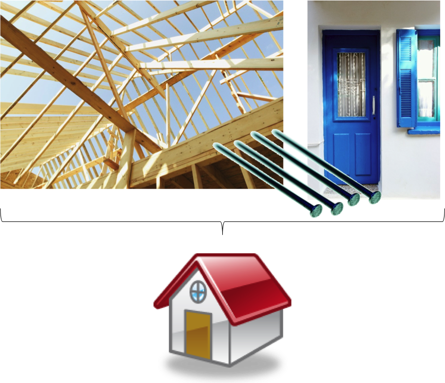{.plain width=55%}

--

<!-- .slide: class="complexiteslide"  -->
## Encapsulation

Accès limité{: .left}

{.plain width=40%}

--

<!-- .slide: class="complexiteslide"  -->
## Patterns pour gérer la complexité
- Proposer des solutions aux problèmes récurrents dans un contexte particulier

{style=border:none}{width=45%}
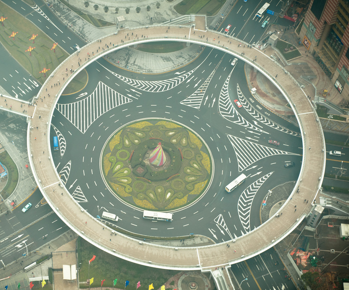{style=border:none}{width=45%}

--

<!-- .slide: class="complexiteslide"  -->
### Design Patterns sont une partie de la solution
- Proposer des solutions aux problèmes récurrents dans un **contexte particulier**

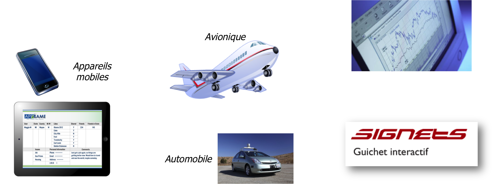{style=border:none}

--

<!-- .slide: class="complexiteslide"  -->
## Socrative ou Zoom

Nom de la salle de class: **ETSDESIGN**

{style="width:300px" .plain}

Note: 
https://b.socrative.com/teacher/

--

<!-- .slide: class="complexiteslide"  -->
## Validation de la compréhension
- En développement logiciel, la complexité inhérente est due au domaine du problème et cause des complexités dans la solution.
    - Vrai?
    - Faux?

--

<!-- .slide: class="complexiteslide"  -->
## Validation de la compréhension

- La complexité inhérente est de mieux en mieux gérée grâce aux innovations technologiques.
    - Vrai?
    - Faux?

--

<!-- .slide: class="complexiteslide"  -->
## Validation de la compréhension

- Le déverminage d'un algorithme de parcours d'arbre représentant une expression mathématique est difficile à cause de la complexité accidentelle
    - Vrai?
    - Faux?

--

<!-- .slide: class="complexiteslide"  -->
## Validation de la compréhension
- Les outils de développement comme Eclipse répondent principalement aux difficultés dues à la complexité inhérente.
    - Vrai?
    - Faux?

--

<!-- .slide: class="complexiteslide"  -->
## Validation de la compréhension

- Qu'est-ce qui n'est pas une technique pour gérer la complexité inhérente?
  1. Masquage de l'information
  1. Encapsulation
  1. Ramasse-miettes (récupérateur de mémoire)
  1. Abstraction
  1. Généralisation

--

<!-- .slide: class="complexiteslide"  -->
## Résumé

::: block {style=font-size:0.75em}

- Soyez attentif aux sources de complexité dans les logiciels que vous développez
- La complexité inhérente ne peut pas être éliminée si votre problème est complexe
- Cependant, elle peut être gérée avec un bon choix d'abstractions.
- Patrons utilisent des abstractions et de l'encapsulation pour gérer la complexité
- Cependant, ils amènent aussi de la complexité accidentelle
- Vérifier:
  - Le problème récurrent que le patron est censé résoudre existe-t-il? (facile)
  - Le coût de la complexité due au patron est acceptable par rapport aux bénéfices (moins facile)
:::

[<div class='footer'>Table des matières complexité</div>](#complexitetdm)

---

<!--=======================================================================================================-->
<!-- .slide: id='furpstdm'   -->
## Module Exigences FURPS
1. [FURPS](#furps6) - [39.44m](https://youtu.be/YEZUVE8tJfw)

:::block {style=font-size:0.5em}
[Séances](#seances) | [Quiz](#quiztdm) | [Laboratoires](#laboratoiretdm) | [Intro](#introtdm) | [Équipe](#equipetdm) | [PU](#putdm) | [DCU](#dcutdm) | [CU](#cutdm) | 
[IU](#iutdm) | [MDD](#mddtdm) | [Dss](#dsstdm) | [Contrat](#contrattdm) | [RDCU](#rdcutdm) | [DCL](#dcltdm) | 
[Couche](#couchetdm) | [Exercice](#exercicetdm) | [Typescript](#typescripttdm) | [Complexite](#complexitetdm) 
| [FURPS](#furpstdm) | [TDD](#tddtdm) | [GOF](#goftdm) | [Diagrammes](#diagrammestdm) | [Divers](#diverstdm)  
:::

--

<!--------------------------------------------------------------->
<!-- .slide: id="furps6" class="furpslide"  -->
## FURPS - Exigences du client
- FURPS+
    1. **F**onctionnalité (Use case)
    1. **U**sability (Aptitude à l'utilisation, facteurs humains, aide et documentation)
    1. **R**eliability (Fiabilité)
    1. **P**erformance
    1. **S**upportability  (Possibilités de prise en charge, adaptabilité, maintenabilité, etc.)

--

<!-- .slide: class="furpslide"  -->

## FURPS et Patrons

L'application d'un patron doit être motivée par des exigences: 
- *Façade* favorise la modifiabilité du code (**S**)
- *Memento* favorise l'implémentation de «&nbsp;Undo&nbsp;» (**F** et **U**)
- *Stratégie* favorise des «&nbsp;plug-in&nbsp;» (**S**)
- *Stratégie* peut faciliter la mise en place de la redondance de l'information (**R** et **P**)
- *Flyweight* favorise une meilleure performance (**P**)

--

<!-- .slide: class="furpslide"  -->

## Définition des besoins
- Cas d'utilisation
    - Descriptions des besoins fonctionnels
    - Le «&nbsp;F&nbsp;» dans FURPS

--

<!-- .slide: class="furpslide"  -->

## Énoncé laboratoire

Le modèle FURPS est utilisé.

Plus d'exemples.

--

<!-- .slide: class="furpslide"  -->

### Comment organiser les besoins dans le PU?

- Plusieurs artefacts décrivent les besoins
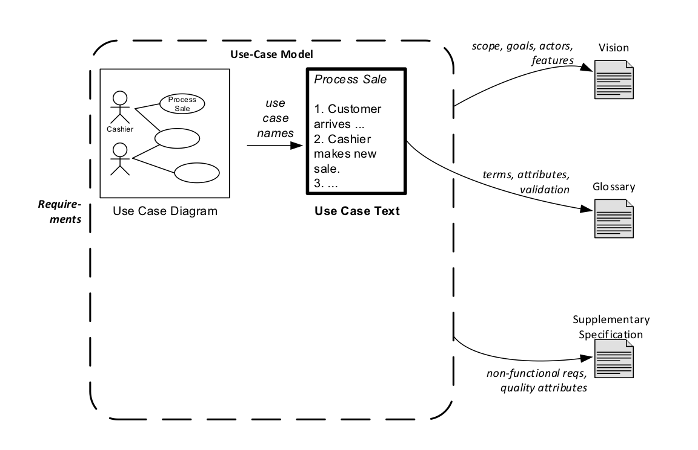{.plain width=90%}

--

<!-- .slide: class="furpslide"  -->

## Exigences FURPS+
::: block {style=font-size:0.7em}
- Une messagerie en nuage
- Calendriers et contacts partagés
- Messagerie instantanée, appels de PC à PC et conférence en ligne
- Site Intranet pour le partage de fichiers
- Site Web destiné au public
- Installation et administration simples
- Antivirus et filtrage antispam
- Support de la communauté Microsoft
- Disponibilité à 99,9&nbsp;% garantie financièrement
- Office Web Apps (Word, Excel, PowerPoint, et OneNote)
- Support en direct par téléphone 24h/24 et 7j/7
- Synchronisation Active Directory
- Prise en charge de la messagerie vocale hébergée
- Stockage du courrier électronique et archivage illimités
:::

--

<!-- .slide: class="furpslide"  -->
## Résumé

- Les besoins ne sont pas juste les fonctionnalités
    - Besoins non fonctionnels (qualités) sont souvent ignorés: convivialité, fiabilité, extensibilité, etc.
    - FURPS+ facilite la classification des besoins
- Définition des besoins est itérative dans le processus unifié

[<div class='footer'>Table des matières FURPS</div>](#furpstdm)


---

<!--=======================================================================================================-->
<!-- .slide: id='tddtdm'   -->
## Module TDD
1. [TDD](#tdd6)  - Développement piloté par les test - [15.01m](https://youtu.be/eZ5gtgSq1f0)
2. [TDD en pratique](#tdd8) 

:::block {style=font-size:0.5em}
[Séances](#seances) | [Quiz](#quiztdm) | [Laboratoires](#laboratoiretdm) | [Intro](#introtdm) | [Équipe](#equipetdm) | [PU](#putdm) | [DCU](#dcutdm) | [CU](#cutdm) | 
[IU](#iutdm) | [MDD](#mddtdm) | [Dss](#dsstdm) | [Contrat](#contrattdm) | [RDCU](#rdcutdm) | [DCL](#dcltdm) | 
[Couche](#couchetdm) | [Exercice](#exercicetdm) | [Typescript](#typescripttdm) | [Complexite](#complexitetdm) 
| [FURPS](#furpstdm) | [TDD](#tddtdm) | [GOF](#goftdm) | [Diagrammes](#diagrammestdm) | [Divers](#diverstdm)  
:::

[<div class='footer'>Table des matières TDD</div>](#tddtdm)

--

<!--------------------------------------------------------------->
<!-- .slide: id="tdd6" class="codeslide"  -->
## Kata TDD
- [Kata TDD avec TypeScript](https://github.com/profcfuhrmanets/typescript-tdd-kata)
- Expérimenté avec SGB
  - npm run test
  - npm run watch
  - npm run test -- -g "nom ou partie du nom"
    - https://github.com/yvanross/log210-systeme-gestion-bordereau-node-express-ts

Note: Donnez le lien aux étudiants mais ne pas faire l'exercice.  Laisser leur le temps d'expérimenter.

--

<!-- .slide: class="codeslide"  -->
## TDD Laboratoire

## TDD 3 laws
1. You are not allowed to write any production code at all until you have written a failing unit test.
1. You are not allowed to write more of a unit test than is sufficient to fail and not compiling is failing.{.fragment .fade-up}
1. You are not allowed to write more production code than is sufficient to pass the currently failing test. These three last gives us the perfect low-level documentation for a system code examples. {.fragment .fade-up}

[<div class='footer'>Table des matières TDD</div>](#tddtdm)

--


<!--------------------------------------------------------------->
<!-- .slide: id="tdd8" class="codeslide"   -->
## TDD
1. [Kata TDD avec TypeScript](https://github.com/profcfuhrmanets/typescript-tdd-kata)
 - Développer un fonction permettant d'extraire les mots uniques d'une phrase
 - Développer une fonction permettant de faire l'intesection des mots de deux phrases

[<div class='footer'>Table des matières TDD</div>](#tddtdm)

---

<!--=======================================================================================================-->
<!-- .slide: id='goftdm'   -->
## Module GOF
::: block {style=font-size:0.8em}
1. [Qu'est ce qu'un design pattern?](#gofrevision8) - [14.25m](https://youtu.be/eGIM9xIEGQE)
2. [Adaptateur, Fabrique concrète, Singleton](#afs9) - [9.21m](https://youtu.be/INHD-GvPqtw)
3. [Logique de tarification élaborée avec patron Stratégie et Composite](#tarif9) - [18.57m](https://youtu.be/_HyMJuBmZfc)
4. [Actualisation interface usager](#observateur9) - [6.21m](https://youtu.be/03I-fUhdIXg)
5. [Révision Observateur](#observateur12) - [8.47m](https://youtu.be/J_2E8JggVf0)
6. [Découverte des patrons GOF](#decouverte9) - [10.23m](https://youtu.be/AgnBD0y4FVA)
7. [Recouvrement avec Proxy](#recouvrement9) - [16.45m](https://youtu.be/7dH1fRtV-Xc)
8. [Attention à la patternite](#patternite9) 
9. [GRASP dans les GoF](#grasp11) [7.27m](https://youtu.be/NC5zjxnwoTQ)
:::

:::block {style=font-size:0.5em}
[Séances](#seances) | [Quiz](#quiztdm) | [Laboratoires](#laboratoiretdm) | [Intro](#introtdm) | [Équipe](#equipetdm) | [PU](#putdm) | [DCU](#dcutdm) | [CU](#cutdm) | 
[IU](#iutdm) | [MDD](#mddtdm) | [Dss](#dsstdm) | [Contrat](#contrattdm) | [RDCU](#rdcutdm) | [DCL](#dcltdm) | 
[Couche](#couchetdm) | [Exercice](#exercicetdm) | [Typescript](#typescripttdm) | [Complexite](#complexitetdm) 
| [FURPS](#furpstdm) | [TDD](#tddtdm) | [GOF](#goftdm) | [Diagrammes](#diagrammestdm) | [Divers](#diverstdm)  
:::

--


<!--------------------------------------------------------------->
<!-- .slide: id="gofrevision8" class="gofslide"  -->
## Qu'est ce qu'un design pattern?

- Solution à un problème récurrent dans un contexte particulier

--

<!-- .slide: class="gofslide"  -->

### Trois défis pour bien utiliser les Patterns
  1. (Re)connaître le problème
  2. Comprendre le patron (la solution)
  3. Appliquer la solution 

{.plain width=30%}

--

<!-- .slide: class="gofslide"  -->

### 1.(Re)connaître le problème
- *Comprendre* le problème
- Exercice de «&nbsp;croyance&nbsp;» (on débute en OO)
- Certains problèmes sont plus «&nbsp;récurrents&nbsp;» que d'autres…
- Auteurs (GoF) avaient beaucoup d'expérience en OO
  
{.plain}

--

<!-- .slide: class="gofslide"  -->

### 2.Comprendre le patron 
### (la solution)
- abstractions
- notation UML est importante
- aspects statique et dynamique

{.plain width=30%}&nbsp;&nbsp;&nbsp;&nbsp;&nbsp;&nbsp;
{.plain width=50%}

--

<!-- .slide: class="gofslide"  -->

### 3. Appliquer la solution

- Étape concrète
- Mise en contexte particulier

--

<!-- .slide: class="gofslide"  -->

### 3. Appliquer la solution

| Nom dans le patron | Vrai nom (Bouton Swing) |
| ------------------ | ----------------------- |
|Subject | JButton |
|Observer | ActionListener |
|ConcreteObserver | la classe implémentant l'interface ActionListener |
|`attach()` | `addActionListener()` |
|`notify()` | `actionPerformed()` |

--

<!-- .slide: class="gofslide"  -->

### Patrons vus dans le livre de LOG121
::: block {style=font-size:0.9em}
- **Adaptateur**
- Commande
- Composite
- Décorateur
- Itérateur
- Méthode fabrique
- Observateur
- **Proxy**
- Singleton
- Stratégie
- Template
- Visiteur
:::

--

<!-- .slide: class="gofslide"  -->

## Perspective  Zen
{.plain}

--

<!-- .slide: class="gofslide"  -->

### Design Pattern Relationships
{.plain width=55%}

Ref: Design Patterns, Element of Reusable Object-oriented Software

--

<!-- .slide: class="gofslide"  -->

## Résumé


- Reconnaître des problèmes récurrents est difficile faute d'expérience adéquate
- Expérimenter avec les patterns (dans une version du projet qui n'est pas critique){.fragment .shape-up}
- Un patron ne s'enlève pas facilement!{.fragment .shape-up}
- Discuter de leurs avantages et leurs inconvénients avec des collègues{.fragment .shape-up}
- Vérifier après l'application du pattern que les bénéfices sont vraiment là{.fragment .shape-up}
  - p.ex. il est plus facile d'étendre le logiciel {.fragment .shape-up}

[<div class='footer'>Table des matières GOF</div>](#goftdm)

Note: Animations

--

<!--------------------------------------------------------------->
<!-- .slide:  id="gof1218" class="gofslide"  -->

## Patron GOF LOG121
- **[Décorateur](http://fuhrmanator.github.io/oodp-horstmann/htm/Ch5/Ch5_fr.html#:~:text=Bars\)-,Patron%20D%C3%A9corateur,Contexte,-Objets%20composant%20peuvent%20avoir%20de%20la%20d%C3%A9coration%2C%20soit%20visuelle%2C%20soit%20comportementale)**
 - **[Itérateur](http://fuhrmanator.github.io/oodp-horstmann/htm/Ch5/Ch5_fr.html#:~:text=mur.-,Patron%20It%C3%A9rateur)**
 - **[Commande](http://fuhrmanator.github.io/oodp-horstmann/htm/Ch10/Ch10_fr.html#:~:text=Le%20patron%20COMMAND,-Le%20patron%20COMMAND)**
 - **[Façade](http://fuhrmanator.github.io/oodp-horstmann/htm/Ch7/Ch7_fr.html#:~:text=Le%20pattern%20Fa%C3%A7ade)**
 - **[Singleton](http://fuhrmanator.github.io/oodp-horstmann/htm/Ch10/Ch10_fr.html#:~:text=Le%20patron%20SINGLETON,-Contexte)**
 - **[Template method](http://fuhrmanator.github.io/oodp-horstmann/htm/Ch6/Ch6_fr.html#:~:text=Ch6%2Fscene2%2FHouseShape.java-,Patron%20TEMPLATE%20METHOD,Contexte,-Un%20algorithme%20est%20applicable%20pour%20plusieurs%20types.)**
 - **[Factory method](http://fuhrmanator.github.io/oodp-horstmann/htm/Ch10/Ch10_fr.html#:~:text=M%C3%A9thodes%20de%20fabrique%20(Factory%20methods))**
 - **[Proxy](http://fuhrmanator.github.io/oodp-horstmann/htm/Ch10/Ch10_fr.html#:~:text=distante-,Le%20patron%20PROXY)**
 - **[Observateur](http://fuhrmanator.github.io/oodp-horstmann/htm/Ch5/Ch5_fr.html#:~:text=sujet-,Patron%20Observateur,Contexte,-Un%20objet%2C%20nomm%C3%A9%20le%20sujet%2C%20est%20une%20source%20d'%C3%A9v%C3%A8nements)**
 - **[Visiteur](http://fuhrmanator.github.io/oodp-horstmann/htm/Ch10/Ch10_fr.html#:~:text=double-,Le%20patron%20VISITOR)**

--

<!-- .slide:   class="gofslide"  -->

## Patrons GOF

[Quiz patron GOF](http://www.vincehuston.org/dp/patterns_quiz.html)

[<div class='footer'>Table des matières GOF</div>](#goftdm)

--


<!--------------------------------------------------------------->
<!-- .slide: id='afs9' class="rdcuslide" -->
### Adaptateur (GoF){.fragment .shade-up}
### *Problème

- POS NextGen doit supporter: (1) calcul des taxes, (2) autorisation de crédit, (3) comptabilité, (4) gestion des stocks
- Services trop compliqués pour le périmètre du projet → Services tiers «&nbsp;externes&nbsp;»
- Plusieurs fournisseurs de service (comme *TaxMaster* et *GoodAsGoldTaxPro*)
- L'API de chaque service est **distincte** et **immuable** 

**Patron GOF?**

Note: animation ask for patron

--

<!-- .slide: class="gofslide" -->

## Adaptateur (GoF)
- Problème (suite)
    - On veut éviter ce genre de solution:

{.plain}{width=80%}

--

<!-- .slide: class="gofslide" -->

## Adaptateur pour le calcul des taxes

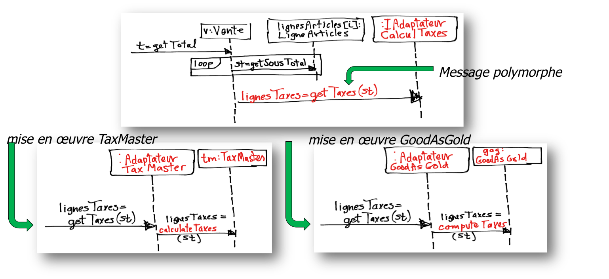{.plain}{width=100%}
fig. F14.21

--

<!-- .slide: class="gofslide" -->

## Adaptateur
{.plain width=60%}

fig. F22.1/A25.1

--

<!-- .slide: class="gofslide" -->

## Adaptateur (GoF)

{.plain}{width=65%}

fig. F23.1

--

<!-- .slide: class="gofslide" -->
## Comptabilité
{.plain}{width=100%}
fig. F23.2

Note: L'API de chaque service est distincte et immuable.

--

<!-- .slide: class="gofslide" -->
## *GRASP dans le laboratoire

- SGB est un système externe alors avez vous utilisé un patron GOF pour que SGA se connecte a SGB.
- Si oui, quel patron et pourquoi
- Si non, pourquoi

- Adaptateur? -> cache mémoire accès information{.fragment .shade-up}
- Proxy? Persistance pour écrire lorsque SGB n'est pas disponible{.fragment .shade-up}


--

<!-- .slide: class="gofslide" -->
## Adaptateur - problèmes
- Qui instancie les adaptateurs?
- Comment déterminer la classe d'adaptateur à instancier?

AdaptateurTaxMaster  vs AdaptateurGoodAsGold

{.plain}{width=100%}

[<div class='footer'>Table des matières GOF</div>](#goftdm)

--

<!-- .slide: class="gofslide" -->

<!--------------------------------------------------------------->
## Fabrique concrète (pas GoF){.fragment .shade-up}
<!-- .slide: id="fabrique9" -->
- Contexte / Problème
  - Créer des objets
  - logique de création complexe, ou
  - séparer les responsabilités de créations (+ cohésion)
- Solution
  - Fabrication Pure nommé FabriqueConcrète pour gérer la création

--

<!-- .slide: class="gofslide" -->
## Fabrique concrète
{.plain}{width=70%}

::: block {style=font-size:0.5em}
[Documentation `System.getProperty()`](http://docs.oracle.com/javase/tutorial/essential/environment/sysprop.html)
:::


--

<!-- .slide: class="gofslide" -->
## *Problème suivant…
### Patron Singleton {.fragment .shade-up}

- Qui instancie la Fabrique elle-même?
- Comment y accéder?
- Indices
  - besoin de seulement une instance de chaque Fabrique
  - méthodes de la Fabrique appelées à partir d'endroits différents dans le code
  - problème de visibilité

Note: animation Patron singleton

--

<!-- .slide: class="gofslide" -->
## Singleton
- Contexte / Problème
    - Une seule instance est permise: le «&nbsp;singleton&nbsp;»
    - besoin d'un point d'accès global et unique
- Solution
    - méthode statique qui retourne le singleton

#### ⚠️il est difficile de tester un singleton{.fragment .shade-up}

--

<!-- .slide: class="gofslide" -->
## Singleton
{.plain width=70%}

--

<!-- .slide: class="gofslide" -->
## Singleton – implémentation Java
::: block {style=font-size:0.8em}
- Initialisation différée
- `getInstance()` est souvent fréquemment appelé
- Avec plusieurs fils d'exécution (threads), l'étape de création d'une logique d'initialisation différée (lazy initialization) est critique
  - nécessite un contrôle de la concurrence des threads (p.ex. une méthode atomique)
:::
```java
public static synchronized FabriqueDeServices getInstance () {  
    if (instance == null ) {
 // section critique pour une application multithread
    instance = new FabriqueDeServices();
   }
  return instance;
 }
 ```
 ::: block {style=font-size:0.5em}
 référence: [http://www.cs.wustl.edu/~schmidt/PDF/monitor.pdf](http://www.cs.wustl.edu/~schmidt/PDF/monitor.pdf)
:::

--

<!-- .slide: class="gofslide" -->
## Singleton – implémentation Java
```java
public class FabriqueDeServices  {  
    // initialisation immédiate 
    private static FabriqueDeServices instance = 
                        new FabriqueDeServices();   
    public static FabriqueDeServices getInstance () {
        return instance;   
    }  // autres méthodes... 
}
```
::: block {style=font-size:0.7em}
- Initialisation immédiate
- Quelle initialisation est préférée?
- Initialisation différée a plusieurs avantages:
    - si l'objet Singleton n'est jamais utilisé, on évite un travail de création inutile
    - getInstance() comprend parfois une logique de création complexe et conditionnelle (difficile à mettre dans une initialisation immédiate)
:::

--

<!-- .slide: class="gofslide" -->
## Singleton
- Message implicite «&nbsp;getInstance&nbsp;»
- Pas besoin de l'écrire dans la dynamique

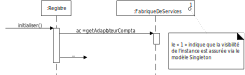{.plain width=100%}
fig. F23.7

--

<!-- .slide: class="gofslide" -->
## Singleton
#### Faire le DS de la solution précédente en incluant la dynamique de getInstance

{.plain width=75%}


--

<!-- .slide: class="gofslide" -->
### *Conclusion sur les services externes…

{.plain width=70%}

Quel message est polymorphe?{.fragment .shade-up}

Note: animation

[<div class='footer'>Table des matières GOF</div>](#goftdm)

--


<!--------------------------------------------------------------->
<!-- .slide: id='tarif9' class="gofslide" -->
#### Logique de tarification élaborée
::: block {style=font-size:0.7em}
- Support pour la logique des promotions
    - Réductions, soldes, rabais, etc.
- «&nbsp;Stratégie de tarification&nbsp;» peut varier
    - Règle, algorithme, politique, etc.
- Exemples
    - réduction de 10% sur toute les ventes pour une période
    - réduction fixe de 10 dollars pour tout achat d'un montant supérieur à 200$
    - etc.
- Il ne faut pas reprogrammer le logiciel pour chaque nouvelle promotion
- Comment faire un bon design face à cette exigence?

**Patron GOF?**
:::

[<div class='footer'>Table des matières GOF</div>](#goftdm)

--

<!-- .slide: class="gofslide" -->

<!--------------------------------------------------------------->
## Stratégie{.fragment .shade-up}
<!-- .slide: id="strategie9" -->
- Contexte / Problème
    - algorithmes ou politiques sont variables mais se ressemblent (politiques de tarification)
    - ils doivent pouvoir évoluer
- Solution
    - définir les algorithmes/politiques/stratégies dans une classe séparée, avec une interface commune.

**Patron GOF?**

--

<!-- .slide: class="gofslide" -->
## Stratégies des prix
{.plain width=80%}

--

<!-- .slide: class="gofslide" -->
## Stratégie et objet context (Vente)
 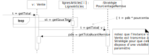{.plain width=100%}


--

<!-- .slide: class="gofslide" -->
## L'objet contexte (Vente)
{.plain}{width=80%}

--

<!-- .slide: class="gofslide" -->
## Créer une stratégie
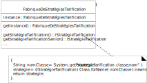{.plain width=100%}

--

<!-- .slide: class="gofslide" -->
## Créer une stratégie
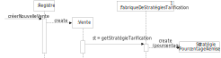{.plain width=100%}

--

<!-- .slide: class="gofslide" -->
## En résumé
- *Stratégie* et *Fabrique concrète* assurent la *Protection des variations* dues aux changements dynamiques de politique tarifaire
- *Stratégie* → *Polymorphisme* (GRASP)
- Fabriques sont souvent utilisées pour créer les stratégies pour autoriser des algorithmes insérables


--

<!-- .slide: class="gofslide" -->
## Composite{.fragment .shade-up}
### Conflits dus aux politiques tarifaires
::: block {style=font-size:0.75em}
- Politiques de prix pour aujourd'hui (lundi)
    - 20% de rabais pour les personnes du troisième âge
    - 15% de rabais sur un achat supérieur à 400$
    - 50 dollars de rabais pour sur un achat supérieur à 500$ (ce lundi seulement)
    - Si on achète un carton de thé Darjeeling, il y a un rabais de 15% sur tout
- Comment résoudre les cas conflictuels?
    - Une dame de 77 ans qui est aussi client privilégié achète une caisse de Darjeeling et dépense 600$

**Patron GOF?**
:::

--

<!-- .slide: class="gofslide" -->
## Facteurs des stratégies
- Période du temps (lundi)
- Type de client (personne du 3e âge){.fragment .shade-up}
- Un produit particulier (thé Darjeeling){.fragment .shade-up}
- Approche pour résoudre les conflits{.fragment .shade-up}
    - Prix le plus bas{.fragment .shade-up}
    - Prix le plus haut{.fragment .shade-up}
    - Etc.{.fragment .shade-up}

[<div class='footer'>Table des matières GOF</div>](#goftdm)

--

<!-- .slide: class="gofslide" -->

<!--------------------------------------------------------------->
## Composite{.fragment .shade-up}
<!-- .slide: id="composite9" -->
::: block {style=font-size:0.8em}
- Contexte / Problème
    - parfois on traite un seul objet
        - atomique
    - parfois on traite un groupe
        - composition d'objets
    - les traiter de la même façon
- Solution
    - définir des classes pour les objets
        - composites
        - atomiques
- implémentent la même interface

**Patron GOF?**
:::

--

<!-- .slide: class="gofslide" -->
### Composite POS

{.plain width=50%}

--

<!-- .slide: class="gofslide" -->
## Composite – collaboration
{.plain width=100%}

--

<!-- .slide: class="gofslide" -->
## Réalisation de cas d'utilisation
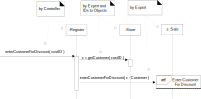{.plain width=100%}

--

<!-- .slide: class="gofslide" -->
## Réalisation de cas d'utilisation
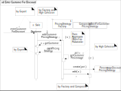{.plain width=70%}

--

<!-- .slide: class="gofslide" -->
## Règles d'affaires
- Règles d'affaires personnalisables
- À certains points dans les scénarios
    - e.g., makeNewSale, enterItem
- Exemple : Paiement par bon de cadeau
    - limite l'utilisation d'un bon à un seul item
    - il n'y a pas de monnaie à rendre au client
    - etc.

--

<!-- .slide: class="gofslide" -->
## Implémentation des règles
- Implémentation des règles est inconnue
    - et peut être extensible
- Voudrait permettre
    - utilisation de plusieurs méthodes
    - patron stratégie/composite
    - interpréteurs de règles «&nbsp;open source&nbsp;»
    - interpréteurs de règles propriétaires (COTS)

[<div class='footer'>Table des matières GOF</div>](#goftdm)

--

<!--------------------------------------------------------------->
<!-- .slide:  id='observateur9' class="gofslide" -->
## Actualisation
{.plain}{width=100%}
fig. F26.21

--

<!-- .slide: class="gofslide" -->
## Solution possible…
::: block {style=font-size:0.9em}
- Total de Sale est changé
    - envoie un message à la fenêtre GUI
    - lui demande de se mettre à jour
- Cette solution n'est pas recommandée
    - Sale ne devrait pas connaître le GUI
        - c'est une dépendance vers une classe dont le code risque de changer (la GUI est peu stable)
- Par exemple
    - si la classe Sale dépend de Swing
    - alors il est difficile de changer l'interface
:::

[<div class='footer'>Table des matières GOF</div>](#goftdm)

--

<!-- .slide: class="gofslide" -->

<!--------------------------------------------------------------->
## Observateur{.fragment .shade-up}
<!-- .slide: id="observateur9" -->
- Contexte / Problème
    - objet observateur
        - réagit selon les changements du sujet
    - objet sujet
        - annonce un changement
- minimiser le couplage du sujet vers l'observeur

--

<!-- .slide: class="gofslide" -->
## Observateur
- Solution
    - interface observateur
    - les observateurs s'inscrivent au sujet
    - le sujet ne connaît pas les observateurs particuliers
        - seulement des objets implémentant l'interface
    - le sujet envoie un message aux observateurs
        - lorsqu'un certain changement (événement) survient

--

<!-- .slide: class="gofslide" -->
## Observateur
Plusieurs observateurs, un sujet

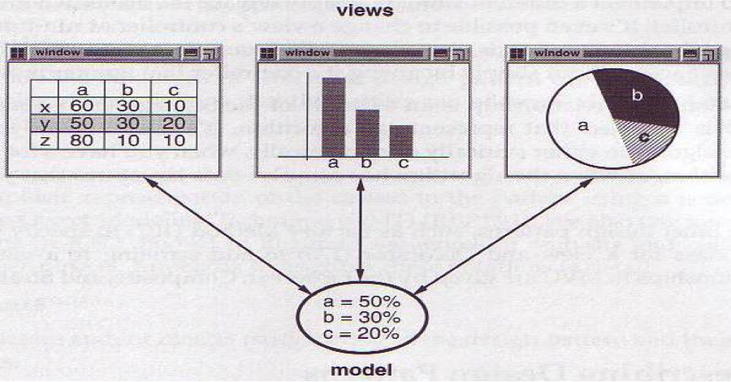{.plain width=70%}

::: block {style=font-size:0.5em}
ref: Design Patterns, Gamma, Helm, Johnson &amp; Vlissides, 1995
:::

--

<!-- .slide: class="gofslide" -->
## Observateur
Communication

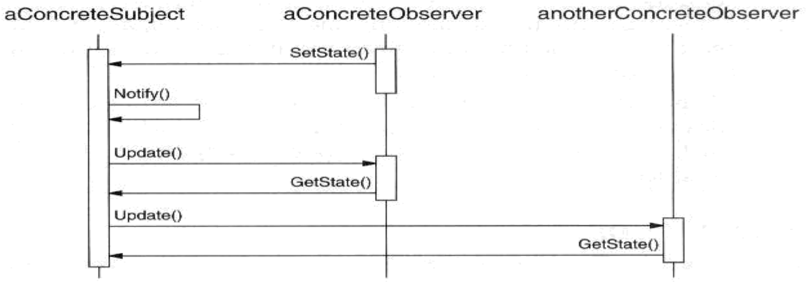{.plain}{width=100%}

ref: Design Patterns, Gamma, Helm, Johnson &amp; Vlissides, 1995

--

<!-- .slide: class="gofslide" -->
## Solution : Observateur
{.plain}{width=80%}
fig. F26.22

[<div class='footer'>Table des matières GOF</div>](#goftdm)

--


<!--------------------------------------------------------------->
<!-- .slide: id='observateur12' class='gofslide' -->
## Exercice Observateur

- Rappeler le patron Observateur
- Réviser le diagramme de structure
- Réaliser les diagrammes de comportement
  - Communication
  - Activité
  - Séquence

--


<!-- .slide: class="gofslide" -->
## Solution : Observateur structure
{.plain}{width=80%}

fig. F26.22

--

<!-- .slide: class="gofslide" -->
## Observateur communication

Voir la note pour la solution

Note:{.plain}
"){.plain}
{.plain}


--

<!-- .slide: class="gofslide" -->
## Observateur Activité

Voir la note pour la solution

Note: "){.plain}
"){.plain}
"){.plain}


--

<!-- .slide: class="gofslide" -->
## Observateur Séquence

Voir la note pour la solution

Note: "){.plain}
"){.plain}
"){.plain}


[<div class='footer'>Table des matières GOF</div>](#goftdm)

--


<!--------------------------------------------------------------->
<!-- .slide: id="decouverte9" class="gofslide" -->
### *Découvertes «&nbsp;d'analyse&nbsp;» lors de la conception
<table>
<tr>
<td>

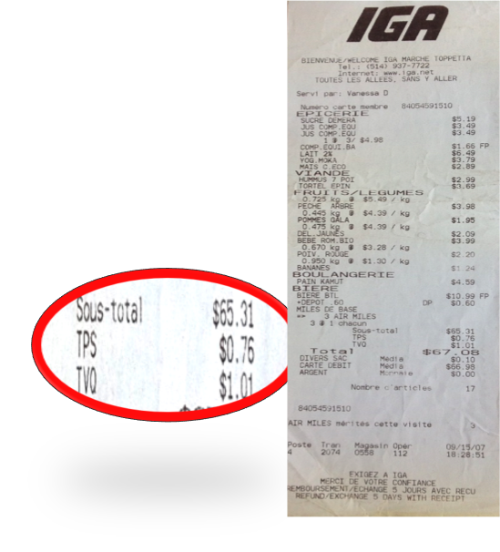{.plain width=90%}

</td>
<td>
   
{.plain align=top} {.fragment .shade-up}


</td>
</tr>
</table>

Note: animation display Mdd 

--

<!-- .slide: class="gofslide" -->
### Découvertes «&nbsp;d'analyse&nbsp;» lors de la conception
- Calculateurs de taxes retournent `LigneTaxes`
  - pas envisagé lors de l'analyse initiale
- Concept dans le modèle du domaine
  - mettre à jour le modèle du domaine
  - mettre à jour le glossaire
- Avec l'expérience ceci devient un réflexe
  - travail d'un ingénieur (vs technicien ou codeur)
  - nécessaire dans un processus itératif

[<div class='footer'>Table des matières GOF</div>](#goftdm)

--

<!--------------------------------------------------------------->
<!-- .slide: id="recouvrement9" -->
## Attributs de qualité
::: block {style=font-size:0.9em}
- Appliquer les GoF et GRASP dans les RDCU pour traiter les attributs de qualité (exigences URPS)
  - NextGen
    - basculement sur les services locaux,
    - gestion du terminal POS et
    - autorisations de crédit
  - Monopoly
    - différentes cases
    - achat de propriétés
    - paiement de loyers
:::

--

<!-- .slide: class="furpslide" -->

## Exigences NextGen
- En cas d'échec d'un service distant, le système doit continuer à fonctionner (tolérance aux pannes, **fiabilité**)
- Mise en cache locale (**performance**)
- Prise en charge d'équipements POS tiers, notamment différents scanners (**adaptabilité**)
- Gestion des paiements par carte de crédit, carte de débit ou chèque (**adaptabilité**)


--

<!-- .slide: class="furpslide" -->

### Problème : Fiabilité – reprise sur défaillance

- Tolérance à la panne de services distants
- Plusieurs scénarios de panne

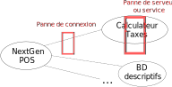{.plain}{width=85%}

--

<!-- .slide: class="furpslide" -->

## Recouvrement – motivation

- Les propriétaires des magasin ne veulent pas manquer des ventes en cas de panne
- Le développeur NextGen POS sait que les concurrents n'offrent pas ce degré de fiabilité

{.plain}{width=40%}

--

<!-- .slide: class="furpslide" -->

## Reprise sur défaillance
- Récupération robuste en cas de défaillance
  - d'un service distant (calculateur de taxes, gestion des stocks…)
  - de la BD des produits (descriptifs et prix)

{.plain}{width=70%}

--

<!-- .slide: class="furpslide" -->

## Principe de recouvrement
Exemple: Pneu de secours permet de continuer, après un délai, perte de performance (pneu plus petit){align=left}

{.plain}{width=50%}


<!-- --

### Analyse des tactiques  par l'architecte logiciel
Pas à l'examen
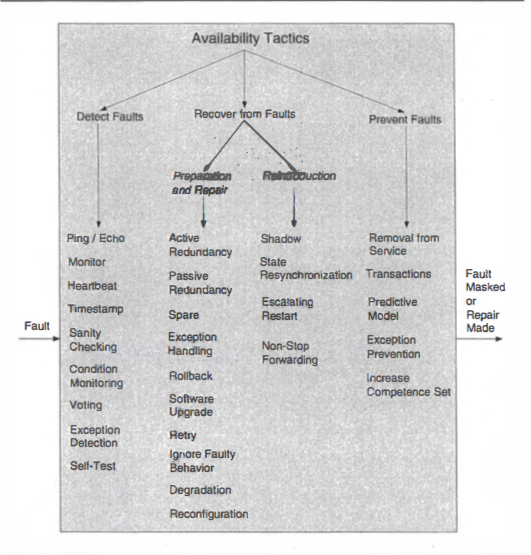{.plain}{width=100%} -->

--

<!-- .slide: class="furpslide" -->

## Conseils de l'architecte : cache local
::: block {style=font-size:0.9em}
- Augmente performance (et permet récupération quand l'accès à BD échoue)
- Utilise un cache local (simple fichier sur disque) des objets DescriptionProduit
- Conséquence : toujours consulter le cache local pour chercher les informations avant d'accéder au service distant
- Principe informatique «&nbsp;Cache&nbsp;»
    - http://en.wikipedia.org/wiki/Cache_(computing)
    - http://fr.wikipedia.org/wiki/M%C3%A9moire_cache
:::


--

<!-- .slide: class="furpslide" -->

## Recouvrement - Product Specification
- Recherche d'une spécification d'article
    - informations locales
        - performance
        - recouvrement
    - puis requête au système distant

--

<!-- .slide: class="furpslide" -->

### Recouvrement - Product Specification
- Plusieurs niveaux de caches
    - mémoire vive (~1000)
        - performance
    - disque dur (~100 MB)
        - pannes de courant
    - serveur local au commerce
        - indépendance au réseau
    - web
    - etc.


--

<!-- .slide: class="gofslide" -->
### Rappel – adaptateurs
{.plain width=70%}
fig. F23.1

--

<!-- .slide: class="gofslide" -->
### Rappel – adaptateurs
- FabriqueDeServices retourne un adaptateur pour accéder aux variantes de services BD Produits

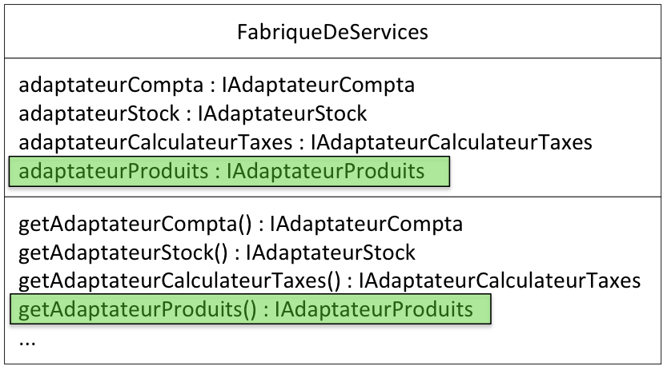{.plain}{width=80%}


--

<!-- .slide: class="gofslide" -->
## Rappel – adaptateurs
- FabriqueDeService retourne un adaptateur pour accéder à la BD Produits

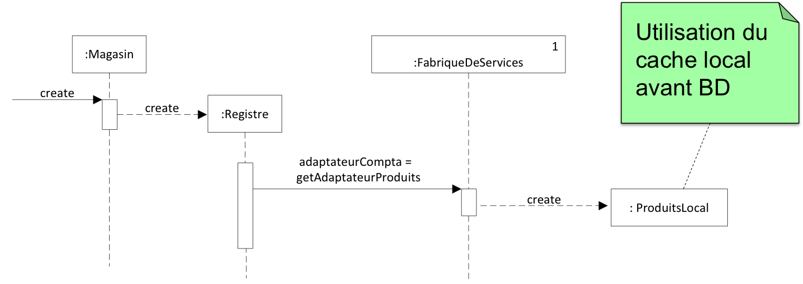{.plain}{width=100%}

--

<!-- .slide: class="furpslide" -->
## Design de recouvrement
{.plain}{width=100%}

--

<!-- .slide: class="furpslide" -->
## Design de recouvrement
Initialisation
{.plain width=80%}

--

<!-- .slide: class="furpslide" -->
## Design de recouvrement
`enterItem`
{.plain}{width=100%}
fig. F30.3

--

<!-- .slide: class="furpslide" -->
## Design de recouvrement
`enterItem`…
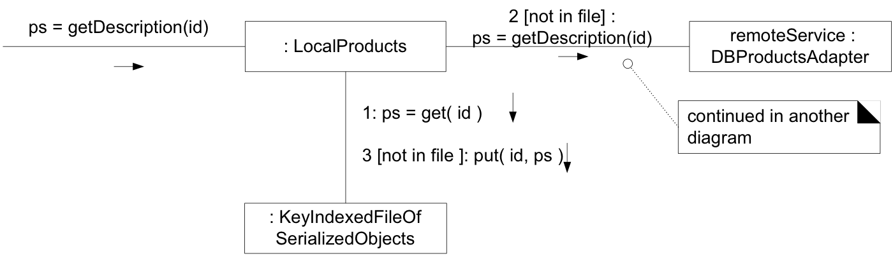{.plain}{width=100%}
fig. F30.4

--

<!-- .slide: class="furpslide" -->
## Mise en mémoire cache
- Approches pour initialiser les caches
    - Paresseuse
        - au fur et à mesure
    - Stricte
        - à l'initialisation

--

<!-- .slide: class="furpslide" -->
## Cohérence de cache

- Les prix peuvent changer
- Incohérence (niveaux de cache ↔ serveur externe)
- Mise-à-jour des caches
  - initiée par le serveur
  - initiée par le client

[<div class='footer'>Table des matières GOF</div>](#goftdm)

--

<!--------------------------------------------------------------->
<!-- .slide: id="patternite1" class="gofslide" -->
## Attention à la «&nbsp;patternite&nbsp;»
«&nbsp;Patternite&nbsp;» : tendance de rentrer de force dans les patterns GoF
{.plain width=100%}

--

<!-- .slide: class="gofslide" -->
## Attention à la «&nbsp;patternite&nbsp;»
- Tout pattern GoF amène une complexité
- Est-ce que les bénéfices du pattern justifient la complexité?
- La simplicité (KISS) est aussi une forme d'élégance.

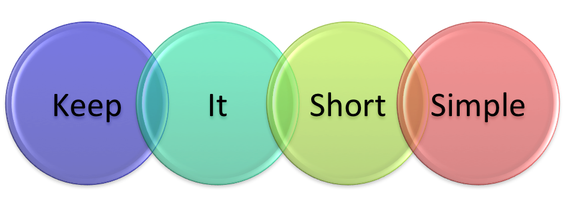{.plain width=80%}

--

## Attention à la «&nbsp;patternite&nbsp;»

[Connaître vos patrons de concpetion](http://fr.wikipedia.org/wiki/Patron_de_conception#Patrons_de_conception_du_GoF)

[<div class='footer'>Table des matières GOF</div>](#goftdm)

--

<!--------------------------------------------------------------->
<!-- .slide: id='grasp11' class="rdcuslide" -->
## GRASP dans les GoF

[Rapport technique](https://espace2.etsmtl.ca/id/eprint/3766/)

--

<!-- .slide: class="rdcuslide" -->
### Table 7: GRASP dans les GoF

| Pattern GoF  | Indir. | Poly. | Fab. Pure | P. V. |
| ----------------------- | ----------- | ------------ | ---------------- | ------------------- |
| Abstract factory        | ✓           | ✓            | ✓                | ✓                   |
| Builder                 | ✓           | ✓            | ✓                | ✓                   |
| Factory method          | ✓           | ✓            |                  | ✓                   |
| Prototype               | ✓           | ✓            |                  | ✓                   |
| Singleton               |             |              |                  |                     |
| Adapter                 | ✓           | ✓            | ✓                | ✓                   |
| Bridge                  | ✓           | ✓            | ✓                | ✓                   |

--

<!-- .slide: class="rdcuslide" -->
### Table 7: GRASP dans les GoF

| Pattern GoF  | Indir. | Poly. | Fab. Pure | P. V. |
| ----------------------- | ----------- | ------------ | ---------------- | ------------------- |
| Composite               | ✓           | ✓            |                  | ✓                   |
| Decorator               | ✓           | ✓            |                  | ✓                   |
| Facade                  | ✓           |              | ✓                | ✓                   |
| Flyweight               | ✓           | ✓            | ✓                | ✓                   |
| Proxy                   | ✓           | ✓            | ✓                | ✓                   |
| Chain of responsibility | ✓           | ✓            | ✓                | ✓                   |

--

<!-- .slide: class="rdcuslide" -->
### Table 7: GRASP dans les GoF

| Pattern GoF  | Indir. | Poly. | Fab. Pure | P. V. |
| ----------------------- | ----------- | ------------ | ---------------- | ------------------- |
| Command                 | ✓           | ✓            | ✓                | ✓                   |
| Interpreter             | ✓           | ✓            | ✓                | ✓                   |
| Iterator                | ✓           | ✓            | ✓                | ✓                   |
| Mediator                | ✓           | ✓            | ✓                | ✓                   |
| Memento                 | ✓           |              | ✓                | ✓                   |
| Observer                | ✓           | ✓            | ✓                | ✓                   |
| State                   | ✓           | ✓            |                  | ✓                   |

--

<!-- .slide: class="rdcuslide" -->
### Table 7: GRASP dans les GoF

| Pattern GoF  | Indir. | Poly. | Fab. Pure | P. V. |
| ----------------------- | ----------- | ------------ | ---------------- | ------------------- |
| Strategy                | ✓           | ✓            |                  | ✓                   |
| Template method         | ✓           | ✓            |                  | ✓                   |
| Visitor                 | ✓           | ✓            | ✓                | ✓                   |


--


<!-- .slide: class="rdcuslide" -->
## Identification des GRASP dans les Gof
https://docs.google.com/document/d/1Mmi0SDH4EX4UsgUuhuVu0U8tAbDOBZ90p84HNrSn2Cg/edit?usp=sharing

## solution
https://docs.google.com/document/d/1pe3RTLkBFiHErDbBQq-rne9et8qqyTinNfcA21HlT-o/edit?usp=sharing

[<div class='footer'>Table des matières GOF</div>](#goftdm)

---

<!--=======================================================================================================-->
<!-- .slide: id='diagrammestdm'   -->
## Module autre diagramme UML
1. [Diagramme d'intéraction](#interaction10)  - [9.33m](https://youtu.be/oVFNLrN5OYQ)
2. [Diagramme d'état](#etat10) - [26.34m](https://youtu.be/RrFpwLGIxIs)
3. [Diagrammes d'état](#etat11) - [2.54m](https://youtu.be/w-nttVt9Xb4)
4. [Diagramme d'activité](#activite10) - [16.01m](https://youtu.be/baWGzdegw5Q)
5. [Diagrammes d'activité](#activite11) - [1.18m](https://youtu.be/wBLchMHDKCM)
6. [Diagrammes de composants](#composant12) - [17.37m](https://youtu.be/fdgdvvtYcIA)
7. [Diagrammes de déploiement](#deploiement12) - [10.02m](https://youtu.be/yiS-ga3F4yg)
8. [Révision diagrammes UML](#uml12) - [16.57m](https://youtu.be/2XmhNF-0GwU)
:::block {style=font-size:0.5em}
[Séances](#seances) | [Quiz](#quiztdm) | [Laboratoires](#laboratoiretdm) | [Intro](#introtdm) | [Équipe](#equipetdm) | [PU](#putdm) | [DCU](#dcutdm) | [CU](#cutdm) | 
[IU](#iutdm) | [MDD](#mddtdm) | [Dss](#dsstdm) | [Contrat](#contrattdm) | [RDCU](#rdcutdm) | [DCL](#dcltdm) | 
[Couche](#couchetdm) | [Exercice](#exercicetdm) | [Typescript](#typescripttdm) | [Complexite](#complexitetdm) 
| [FURPS](#furpstdm) | [TDD](#tddtdm) | [GOF](#goftdm) | [Diagrammes](#diagrammestdm) | [Divers](#diverstdm)  
:::

--


<!--------------------------------------------------------------->
<!-- .slide: id='interaction10'  class="dssslide" -->
### Diagrammes d'interaction modélisent l'action
Diagrammes de séquence
  
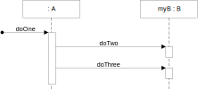{.plain width=40%}

Diagrammes de communication
  
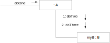{.plain width=40%}


--

<!-- .slide: class="dssslide" -->
## Diagramme d'interaction
- Pour détailler les opérations
- Annoté avec les GRASP

--

<!-- .slide: class="dssslide" -->
## Comparaison
::: block {style=font-size:0.7em}
Type |  Forces (+) | Faiblesses (-)
--|--|--
Séquence | Indique clairement la séquence et l'ordonnancement des messages. Grande richesse de la notation | Ajout de nouveaux objets doit être vers la droite: consomme l'espace horizontal
Communication | Économique en termes d'espace, permet d'ajouter des objets dans les deux dimensions | Rend plus difficile la lecture des séquences de messages. Moins d'options de notation
:::

--

<!-- .slide: class="dssslide" -->

## Rappel de LOG121
## Classe vs. instance

{.plain width=100%}

--

<!-- .slide: class="dssslide" -->

## Notation: Diagrammes de séquence
{.plain width=80%}

Note: montrez la Fin des contextes d'exécution

--

<!-- .slide: class="dssslide" -->
## Résultat d'un message
{.plain width=100%}

--

<!-- .slide: class="dssslide" -->
## Message d'un objet à lui-même
{.plain width=60%}

--

<!-- .slide: class="dssslide" -->
## Destruction d'un objet
{.plain width=100%}

--

<!-- .slide: class="dssslide" -->
## Itération sur une collection (notation explicite)

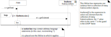{.plain width=100%}

fig F14.16, A15.16


--

<!-- .slide: class="dssslide" -->
## Itération sur une collection (notation implicite)
{.plain width=100%}

--

<!-- .slide: class="dssslide" -->
## Imbrication de cadres
{.plain width=100%}

--

<!-- .slide: class="dssslide" -->
## Appels asynchrones et objets actifs


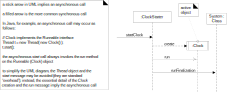{.plain width=100%}

--

<!-- .slide: class="dssslide" -->
## Diagramme de communication
- Liens et messages
  
{.plain width=100%}

--

<!-- .slide: class="dssslide" -->
## Diagramme de communication
- Liens et messages
  
{.plain width=100%}
Note: Voir solution dans la section exercice plus bas.

--


<!-- .slide: class="dssslide" -->
## Message pour une classe
{.plain width=80%}

--

<!-- .slide: class="dssslide" -->
## Message d'un objet à lui-même
{.plain width=40%}

--

<!-- .slide: class="dssslide" -->
<!-- .slide: class="dssslide" -->
## Création d'instance
{.plain width=90%}

--

<!-- .slide: class="dssslide" -->
## Affectation de numéros d'ordre
{.plain width=100%}

--

<!-- .slide: class="dssslide" -->
## Affectation de numéros d'ordre
{.plain width=90%}

--

<!-- .slide: class="dssslide" -->
## Itération sur une collection
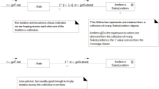{.plain width=80%}

[collection en java](http://docs.oracle.com/javase/6/docs/api/java/util/Collection.html)

--

<!-- .slide: class="dssslide" -->
## Message vers une classe
{.plain width=100%}

--

<!-- .slide: class="dssslide" -->
## Messages polymorphes
{.plain width=100%}

--

<!-- .slide: class="dssslide" -->
##### *Exercice - Transformer en diagramme de séquence, de classes

{.plain width=60%}

::: block {style=font-size:0.3em}
ref: UML Distilled, 2nd ed., Fowler, Scott, Addison Wesley, 2000.
:::

Note: Solution séquence   
Solution classe 


Note: https://github.com/yvanross/LOG210-exercices/blob/master/out/communication/Macallan-communication-sequence/Macallan%20order.png

Note: https://github.com/yvanross/LOG210-exercices/blob/master/out/communication/Macallan-DCC/Diagramme%20de%20classe%20logiciel%20Macallan%20Stock.png


--

<!-- .slide: class="dssslide" -->
## *Exercice
### Transformer en diagramme de séquence

{.plain width=100%}

Note: 

--

<!-- .slide: class="dssslide" -->
### Parallélisme: Diagramme de communication

{.plain width=40%}
::: block {style=font-size:0.6em}

- For example,
    - messages 2.3a and 2.3b are concurrent within  activation 2.3,
    - Name represents  a concurrent thread of control.
    - Instance of A sends draw () messages concurrently to instance of B and to instance of C

- Réf: https://www.uml-diagrams.org/communication-diagrams.html
:::

--

<!-- .slide: class="dssslide" -->
<!-- .slide: class="dssslide" -->
## Diagramme de collaboration UML

{.plain width=50%}

::: block {style=font-size:0.5em}
Réf: Documenting Software Architectures: Views and Beyond, 2e édition, Felix Bachmann, Len Bass, Paul C. Clements, David Garlan, James Ivers, Reed Little, Paulo Merson, Robert Nord, Judith A. Stafford
:::

--

<!-- .slide: class="dssslide" -->
## Résumé
::: block {style=font-size:80%}
- Deux types de diagrammes d'interaction
    - de séquence et de communication
- Agilité est importante dans la modélisation
    - Habileté de faire rapidement des modèles en UML
:::   
{.plain width=80%}

[<div class='footer'>Table des matières diagrammes uml</div>](#diagrammestdm)

--

<!--------------------------------------------------------------->
<!-- .slide: id="etat10" class="stateslide" -->
## Diagramme d'état

Pour modéliser les comportements.

Notion préalable: [Automate fini](https://fr.wikipedia.org/wiki/Automate_fini#Automates_UML)

--

<!-- .slide: class="stateslide" -->
## Exemple d'automate fini

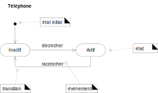{.plain width=90%}

--

<!-- .slide: class="stateslide" -->
## Événement, état et transition

- Événement
    - occurrence d'un fait significatif ou remarquable
- État
    - la condition d'un objet à un moment donné, jusqu'à l'arrivée d'un nouvel événement
- Transition
    - relation état-événement-état
    - indique que l'objet change d'état

Note: Q : différences entre événement et transition?
selon l'état, un même événement peut mener à différentes transitions

Note: Il s'agit de la modélisation (un état est une simplification de la réalité). Ça dépend de ce qu'on veut capturer comme information dans l'état.

--

<!-- .slide: class="stateslide" -->
## Objets état-dépendants et état-indépendants

- Un objet répondant de la même manière à un événement donné
  - état-indépendant  (par rapport à l'événement )
- Un objet répondant différemment, selon son état, à un événement donné
  - état-dépendant

--

<!-- .slide: class="stateslide" -->
## Modélisation d'objet état-dépendants
- Équipement physiques contrôlés par des logiciels

{.plain width=30%}
{.plain width=30%}
{.plain width=30%}

--

<!-- .slide: class="stateslide" -->
## Modélisation d'objet état-dépendants
::: block {style=font-size:0.9em}
Transactions et objets métier apparentés
  - Vente, Commande, Paiement, etc.
  - Exemple: annuler l'envoi d'un colis après son ramassage? Cela dépend de son «&nbsp;état&nbsp;» probablement…
:::
{.plain width=20%}
{.plain width=30%}
{.plain width=30%}

--

<!-- .slide: class="stateslide" -->
## Modélisation d'objet état-dépendants

Objets qui changent de rôle, comme une personne...
- état de civil ou de militaire
- résident temporaire, résident permanent, citoyen
  
{.plain width=40%}

--

<!-- .slide: class="stateslide" -->
## Modélisation d'objet état-dépendants
::: block {style=font-size:0.7em}
- Protocoles de communication
    - p.ex. en TCP, si le gestionnaire du protocole est dans l'état «&nbsp;fermé&nbsp;», un message «&nbsp;close&nbsp;» sera ignoré
- Flot page/fenêtre IHM
    - séquence légale des pages Web ou des fenêtres, souvent complexe
- Contrôleurs de flot ou de sessions
    - objets «&nbsp;session&nbsp;» p.ex. application Web
- Ordre des opérations système d'un cas d'utilisation 
    - créerNouvelleVente , saisirArticle , terminerVente , etc.
- Gestion d'un événement individuel dans une fenêtre d'une IHM
    - séquences légales d'une fenêtre ou d'un formulaire (coller n'est pas valide si presse-papiers est nul)
:::

--

<!-- .slide: class="stateslide" -->
## Notation additionnelle
Transitions peuvent avoir des actions et des conditions de guard{style=text-align:left}

{.plain width=100%}

--

<!-- .slide: class="stateslide" -->
### Notation additionnelle
États imbriqués

{.plain width=90%}
::: block {style=font-size:0.8em}
- Pouvez vous réaliser le diagramme de classe correspondant?
:::

--

<!-- .slide: class="stateslide" -->
#### *Automate fini et cas d'utilisation 1/2

{.plain width=70%}

::: block {style=font-size:0.7em}
- Diagramme d'état correspondant?
:::

Note: Est ce que vous savez comment passer du diagramme d'état vers le code?

Note: Déterminer les états à partir d'un diagramme de séquence système.  Question aux étudiants: Quel est l'intérêt?

Note: Les nom des opérations correspondent aux nom des transitions.

Note: Convertissez ce diagramme d'état en diagramme de séquence


--

<!-- .slide: class="stateslide" -->
## *Automate fini et cas d'utilisation 2/2

{.plain width=100%}

::: block {style=font-size:0.7em}
- Diagramme de classes logiciels correspondant?
:::

Note: Convertissez ce diagramme d'état en diagramme de classe.
Note: Diagramme de classe 
Note: Diagramme de séquence 


--

<!-- .slide: class="stateslide" -->
## État d'une commande
{.plain width=80%}

Réf:Applying Domain-Driven Design and Patterns: With Examples in C# and .NET

--

<!-- .slide: class="stateslide" -->
## Exercices diagramme d'état

- Téléphone intelligent
- Vidéo projecteur
- Guichet automatique
- [CU29-Annuler un service](https://docs.google.com/document/d/18s-eN0QoqREblJUihUaEC2L7f1hZF82_Jm9PjfL6BuY/edit?pli=1#heading=h.woe7hjrtreze)
- [CU30-Confirmer une visite supervisée](https://docs.google.com/document/d/18s-eN0QoqREblJUihUaEC2L7f1hZF82_Jm9PjfL6BuY/edit?pli=1#heading=h.woe7hjrtreze)
- [CU31-Confirmer des échanges de garde](https://docs.google.com/document/d/18s-eN0QoqREblJUihUaEC2L7f1hZF82_Jm9PjfL6BuY/edit?pli=1#heading=h.571qr0tmgkvv)
- [CU32-Rédiger une note d'observation](https://docs.google.com/document/d/18s-eN0QoqREblJUihUaEC2L7f1hZF82_Jm9PjfL6BuY/edit?pli=1#heading=h.1u1pach8bqyv)
- [CU33-Corriger une note d'observation](https://docs.google.com/document/d/18s-eN0QoqREblJUihUaEC2L7f1hZF82_Jm9PjfL6BuY/edit?pli=1#heading=h.8rnjn3p0d663)


[<div class='footer'>Table des matières diagrammes uml</div>](#diagrammestdm)

--


<!--------------------------------------------------------------->
<!-- .slide: id='etat11' class="stateslide" -->
## Diagramme d'état implémentation

Comment implémenter?

1. [StackOverflow: Is there a typical state machine implementation pattern?](https://stackoverflow.com/q/133214/1168342)
1. [Derek Banas, State pattern](https://www.youtube.com/watch?v=MGEx35FjBuo)

--

## Diagramme d'état
## Exercice Vidéo projecteur

- En équipe de 4, réaliser le diagramme d'état en suivant les étapes identifées dans l'exercice suivant:

[https://github.com/yvanross/LOG210-exercices/blob/master/etat/etat-videoprojecteur.md](https://github.com/yvanross/LOG210-exercices/blob/master/etat/etat-videoprojecteur.md)

Note: https://github.com/yvanross/LOG210-exercices/blob/master/etat/etat-videoprojecteur-avec-solution.md

[<div class='footer'>Table des matières diagrammes uml</div>](#diagrammestdm)

--


<!--------------------------------------------------------------->
<!-- .slide: id="activite10" class="dssslide" -->
## Diagrammes d'activités
- Exposer les activités séquentielles et parallèles d'un processus.

{.plain width=40%}

--

<!-- .slide: class="dssslide" -->
### Diagrammes d'activités
{.plain width=50%}

Note: Pouvez vous réaliser le diagramme de classe correspondant?

--

<!-- .slide: class="dssslide" -->
### Compléments sur la notation
{.plain width=40%}

{.plain width=60%}

--

<!-- .slide: class="dssslide" -->
## Signaux

{.plain width=70%}

--

<!-- .slide: class="dssslide" -->
### Lignes directrices – modélisation d'activités
::: block {style=font-size:0.8em}
- Utile pour les processus très complexes 
  - impliquant **plusieurs parties**
  - impliquant des **activités séquentielles**
- - impliquant des **processus en parallèles**
- Utilisez les niveaux d'abstraction («rateau» et sous-activité) afin de gérer la complexité
    - Niveaux 0, 1, 2, etc.
    - Dans un diagramme, veillez à ce que les nœuds d'action soient à peu près équivalents en ce qui concerne leur propre niveau d'abstraction.
    - p.ex. au niveau 0, «&nbsp;Livrer Commande&nbsp;» et «&nbsp;Calculer TVA&nbsp;» ne sont pas cohérents
            - «&nbsp;Livrer Commande&nbsp;» et «&nbsp;Envoyer Facture&nbsp;» le sont
:::

--


<!-- .slide: class="dssslide" -->
#### Modélisation de Traiter une vente

{.plain width=60%}


--

<!-- .slide: class="dssslide" -->
#### D'autres exemples
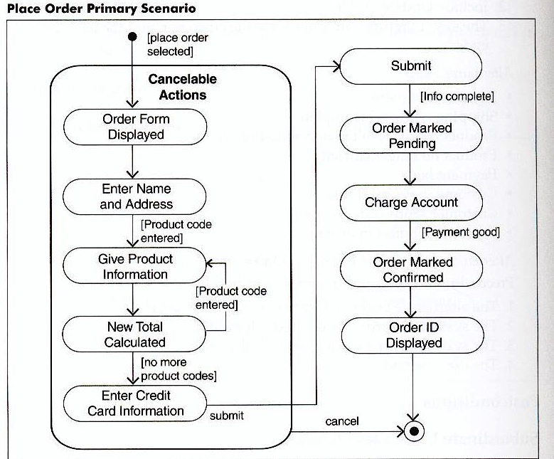{.plain width=60%}
::: block {style=font-size:0.5em}
- Applying  Use Cases, 2nd ed., Schneider &amp; Winters, Addison Wesley, 2001.
:::

--

<!-- .slide: class="toolslide" -->
## outils PlantUML

<div class="container">

{.col .plain  width=80%}

::: block {.col}
```plantuml
|Client|
start
:Commander plat;
|#lightgreen|Restaurant|
:Commande]
:Preparer plat;
|Livraison|
:Plat]
:Livrer Plat;
|Client|
:Payer;
stop
```
:::
</div>

[Exemple : Dynamique GitHub Classroom](https://education.github.community/t/what-do-students-see/57848/4?u=fuhrmanator)

--

<!-- .slide: class="toolslide" -->

#### Exercice: Retour de voiture loué
::: block {style=font-size:0.5em}


Esquissez le diagramme d'activités lors de la réception de voitures
louées (après la location) dans une compagnie. Pour le diagramme, faites
att ention à la **notation UML**: cela comprend les objets (pour la
voiture et pour la facture), le début et la fin de l'activité, les
débranchements, les jointures, les décisions et les fusions.

Scénario

-   Le client rend la voiture et les clés.
-   Le réceptionniste note le kilométrage et le niveau d'essence pour calculer la facture.
-   Le client paye sa location, selon le montant sur la facture et part après.
-   L'agent inspect la voiture pour la proprété. Si elle n'est pas assez propre, alors l'agent doit laver, rincer et sécher l'extérieur et nettoyer l'intérieur. Ce travail devrait commencer le plus vite possible, après que le réceptionniste ait finit de noter les informations pour la facture.
-   Les rôles sont le \_\_\_\_\_\_ le \_\_\_\_\_\_\_\_ (qui gère la documentation et le paiement de la location) et \_\_\_\_\_\_ (qui gère le traitement des voitures avant la prochaine location).
:::
Note: 

--

<!-- .slide: class="dssslide" -->

#### *Exercices - Modéliser d'une dynamique de stationnement
- Client arrive, entre sa carte de crédit, le système enregistre la carte et la remet au client, le clientl reprend sa carte, le système ouvre la barrière, le client entre pour se stationner, le système ferme la barrière. Le client se présente à la sortie, présente sa carte de crédit, le système imprime le recu, le client reprend sa carte de crédit, prend le recu, le système ouvre la barrière, le client peut alors sortir, le système détecte la sortie et ferme la barrière.

Note: 
Note: 


--


<!-- .slide: class="dssslide" -->
## Exercices diagramme d'activité

- Retour de voiture louée
- Recette de cuisine
- Retrait au guichet automatique
- Ordinateur de plongée
- Demander un remplacement
- Processus d'achat sur le web
- Vendre au comptoir

https://github.com/yvanross/LOG210-exercices

[<div class='footer'>Table des matières diagrammes uml</div>](#diagrammestdm)

--


<!--------------------------------------------------------------->
<!-- .slide: id='activite11' class="dssslide" -->
## Diagramme d'activité

Comment implémenter?

Business Process Modeling Notation (BPMN)

1. [BPMN Demo](https://modeling-languages.com/modelling-bpmn-2-0-with-bpmn-io/)
1. [UML](https://plantuml.com/activity-diagram-beta)
1. [Derek Banas, Activity Diagram](https://www.youtube.com/watch?v=XFTAIj2N2Lc)

--

<!-- .slide: class="dssslide" -->
## Diagramme d'activité

## Exercice Recette de cuisine
- En équipe de 4, réaliser le diagramme d'activité en suivant les étapes identifées dans l'exercice suivant:

https://github.com/yvanross/LOG210-exercices/blob/master/activite/activite-recette-de-cuisine.md

Note: https://github.com/yvanross/LOG210-exercices/blob/master/activite/activite-recette-de-cuisine-solution.md

[<div class='footer'>Table des matières diagrammes uml</div>](#diagrammestdm)

--

<!--------------------------------------------------------------->
<!-- .slide: id='composant12' class="packageslide" -->
## Diagrammes de composants

Un composant n'est pas clairement défini dans l'UML:
::: block {style=text-align:justify}
« Un composant est la **partie modulaire** d'un système qui encapsule son contenu et dont la manifestation est **remplaçable**  dans son environnement. Il définit son **comportement**  en termes d'**interfaces**  fournies et requises. Ainsi, un composant peut être utilisé comme un type dont la conformité est définie par ces interfaces fournies et requises. »

--

<!-- .slide: class="packageslide" -->
## Exemple en PlantUML

Figure F31.2 Composants UML

{.plain width=100%}

::: block {style=font-size:0.4em}
[(PlantUML)](http://www.plantuml.com/plantuml/uml/NP31QiCm44Jl-eh5bwO7cIQzbM3IfBHGua0nFOKSXBnLHEoLaLQb-Vkk3GaX1x7IpF3GpYgnYPpx3ZQX7q8on0c-wosyUvSZmlEyNAXqyZIOQ7fO6tjoCMHgDw4B4JWQIc8XyKtAZYWIhU5pXo3qXUhmXu43HE-E3AsFQDa7KkCqv2Ismp_-G8BbCfqJOrzLD-RwJVGhLwnBMi-UD1IVTLF0liQKZFFa6eo_tk91pHwX-TfUmsLPJMyveBL0rOE0TQSdTRpkZxvjaGvHmprDKM04as0tLw-PfHmHpBJ447A4JCfUEbH8xMYZkgV87mG0Br0KQYKfAUSV)
:::


--

<!-- .slide: class="packageslide" -->
### Existe-t-il réellement des composants logiciels?
::: block {style=font-size:0.7em}
**They have to exist.** Sales and marketing people are talking about them. Components are not a technology. Components are about how customers want to relate to software.{align=left}
- They want to be able to buy their software a piece at a time, and to be able to upgrade it just like they can upgrade their stereo.
- They want new pieces to work seamlessly with their old pieces, and to be able to upgrade on their own schedule, not the manufacturer's schedule.
- They want to be able to mix and match pieces from various manufacturers. This is a very reasonable requirement. It is just hard to satisfy.

[RalphJohnson do component exist](http://www.c2.com/cgi/wiki?DoComponentsExist)
:::

--

<!-- .slide: class="packageslide" -->
### Métaphore cinéma maison

-  [IFTTT](https://ifttt.com/)
1. [Heroku](https://elements.heroku.com/search/addons?q=redis)
1. [IOT](https://fr.wikipedia.org/wiki/Internet_des_objets)

{.plain width=40%}
{.plain width=40%}
::: block {style=font-size:0.5em}
[viet](http://www.flickr.com/photos/viet/4807198270/)    /    [photostream](http://www.flickr.com/photos/criminalintent/4841917543/sizes/l/in/photostream/)
:::


--

<!-- .slide: class="packageslide" -->
## Diagramme de composants
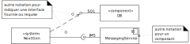{.plain}
::: block {style=font-size:0.5em}
fig: 31.2, A37.2
:::

--

<!-- .slide: class="packageslide" -->
## D'autres exemples
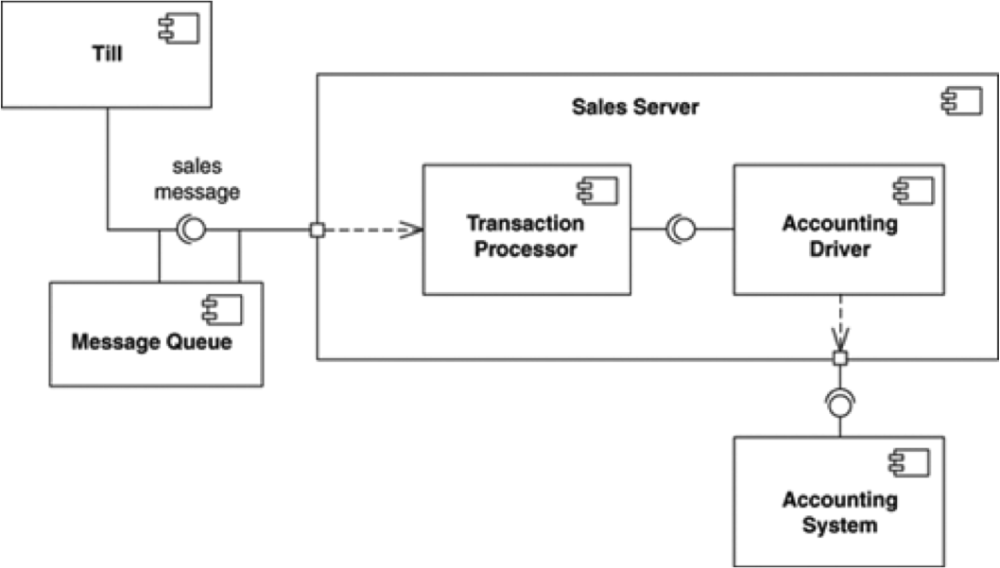{.plain width=75%}
::: block {style=font-size:0.5em}
fig.: F14.2
UML Distilled: A Brief Guide to the Standard Object Modeling Language, Third Edition
:::

--

<!-- .slide: class="packageslide" -->
## Exercices diagramme de déploiement

1. [Application web](https://docs.google.com/document/d/1KdTyAWF27UavHbx1uLpxswOpJbw56A1oNnEUoZi45KM/edit?usp=sharing)
1. [Tutorial online](http://www.peter-lo.com/Teaching/U08182/Tut_04_ans.pdf)
1. [UML deployment diagram - Apple iTunes](https://www.conceptdraw.com/examples/uml-deployment-diagram)
1. [UML Deployment Diagrams Examples
](https://www.uml-diagrams.org/deployment-diagrams-examples.html)

::: block {style=text-align:left}
Prenez le temps regarder la documentation de planUml pour les diagrammes de déploiement et de composants. Nous ferons un exercice la semain prochaine.
:::
  - https://plantuml.com/deployment-diagram
  - https://plantuml.com/component-diagram

[<div class='footer'>Table des matières diagrammes uml</div>](#diagrammestdm)

--

<!--------------------------------------------------------------->
<!-- .slide: id='deploiement12' class="packageslide" -->
## Diagrammes de déploiement
Documenter (1) comment les fichiers exécutables seront affectés sur les nœuds de traitement et (2)&nbsp;la&nbsp;communication entre composants physiques

{.plain width=30%}
{.plain width=30%}
{.plain width=10%}
::: block {style=font-size:0.3em}
- http://wahlnetwork.com/2012/06/03/hp-discover-2012-targeted-sessions/
- http://gadgetsin.com/speck-pixelskin-hd-wrap-ipad-2-case.htm
- http://wiki.open.hr/wiki/Samsung_I7500_(Samsung_Galaxy)
:::

--

<!-- .slide: class="packageslide" -->
## Types de nœuds
**Nœud physique (équipement)**

Ressource de traitement physique (p.ex. de l'électronique numérique), dotée de services de traitement et de mémoire destinés à exécuter un logiciel. Ordinateur classique, cellulaire, etc.{align=left}

--

<!-- .slide: class="packageslide" -->
## Types de nœuds

**Nœud d'environnement d'exécution  
(EEN *execution environment node*)**

Ressource de traitement logiciel qui s'exécute au sein d'un nœud externe (comme un ordinateur) et offrant lui-même un service pour héberger et exécuter d'autres logiciels.{align=left}

--

<!-- .slide: class="packageslide" -->
## Nœud d'environnement exécution

- Système d'exploitation (OS) est un logiciel qui héberge et qui exécute des programmes
- Machine virtuelle (JVM ou .NET)
- Moteur de base de données (p.ex. PostgreSQL) exécute les requêtes SQL
- Navigateur Web héberge et exécute JavaScript, applets Flash/Java
- Moteur de workflow
- Conteneur de servlets ou conteneur d'EJB

--

<!-- .slide: class="packageslide" -->
## Diagramme de déploiement

{.plain width=60%}
::: block {style=font-size:0.5em}
fig. F31.1, A37.1
:::

--

<!-- .slide: class="packageslide" -->
## Diagramme de déploiement

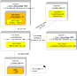{.plain width=40%}
::: block {style=font-size:0.5em}
fig. F32.2, A38.2
:::

--

<!-- .slide: class="packageslide" -->
## Exemple 1/

La figure 2 de [Distributed visualization of gridded geophysical data: a web API for carbon flux](https://www.researchgate.net/publication/307681378_Distributed_visualization_of_gridded_geophysical_data_a_web_API_for_carbon_flux):

{.plain width=50%}

--

<!-- .slide: class="packageslide" -->
## Exemple 2/

{.plain}

::: block {style=font-size:0.4em}
[(PlantUML)](http://www.plantuml.com/plantuml/uml/LLBTJi8m5BxVKvpWXLSi4haYG80X6YCwCnGJ9APZnz7GdPAsOnB20_aSlfWju_UcIK-_VdzjHnkcJ9u9JoyuBPbY6MYp5cXNnMUxasiZbs0anD8OcK725SuCb-G9_3RkGF5qRixc7ia4eT9u7nPCuTTTzC4_QGDTOcAj3RP2lszXy1ArtkASJ0wrkdzJXsq5casDQeMgtOOhuLXJXKYmyG3sdCyffvyZC5TGO6pHJCCuEg72jPbRXLk_xeG7DXKMKYrQ0y7qeXJAf77NIwJJA-RSu4uAO2QpfIGa0q4tz4jFJYEOEv7jIMYuZbwV75tCD88T9PBexnTrwQdVyoRspXIgYIoe2fD-RtgOv4kx7qTJRtlewnu9RUbXu0XdWZjzPzk-aUlrM4eiShpeXAruoboSeHqemifvciiiUzfciqjfBfXwZA3crorr6I-mRhQUinYSJ5kJq827qIZqEaY9_HF_)
:::

--

<!-- .slide: class="packageslide" -->
## Exemple 3/

{.plain width=80%}

::: block {style=font-size:0.4em}
[(PlantUML)](http://www.plantuml.com/plantuml/uml/ZLDBJwmm5DxtLvpWmkGcOCQbCSHNuYn6XuIvcStT53WwJKgBRH7dtlZVxpdGA3wYiYhqVC-MCn-a2tshuRphD8BQz0Qz41hl0WGBJjtl0ZJAOHsKDSBO1Y6PPhTOGOdk4Lq2fwSDFgeQy_oWa1etlNlehV88_mJGCy8cRf2ULbj235Xv5HYoOfLIwjQQ2E27ZAaxMOS8n193tsNuX8ILv43LaZtb-OXuVXLAeb8PhCDa4Yn_8CWXfRcdQCaDDah2IbLEkdqI1Px58JjF6pkOb3bZ7KlR8bpQjki3Tq5woyjv8n_L9XoCiqCrMOFAsS6ZUmiGRutDEtnVmu73HdoPWt4tgmMGG8lN3j5GfbXPiRC6ZrGXcoCCTJRDNf56Qoj5LD-cKUioWjPSzhhyCiYdpexVEml86xSBCKthSLfn0Gw5tvjwvwnHVobtXM4WLBJfeTgBU9VHDC1CudO1MSRvNrR7uf2FwbUQZf_ZYqxfJ0Gj-VCLdC3lye9F7h8-osc4Y7cBxzG91UsS3RQsEi__cFd5Wo9k42_HZ29KpUoDzEdmHwhj1whbPbE8iSkPra0_eaRluNlHCyfD__L_)
:::

[<div class='footer'>Table des matières diagrammes uml</div>](#diagrammestdm)

--

<!--------------------------------------------------------------->
<!-- .slide: id='uml12' -->
### Méthodologie  de développement  UML 
::: block {style=font-size:0.9em}
- UML est  un langage  de modélisation général  qui inclut  un large éventail  de concepts, notations et diagrammes.


- Avant d’intégrer  UML dans  un processus  de développement , il est fondamental  de définir correctement une méthodologie  pour prendre en  charge son utilisation.
    - La définition d’une méthodologie  de développement facilitera l’intégration  et l’adoption d’UML , augmentera  la qualité  des modèles  et augmentera  la productivité  des développeurs.
:::

--

### Méthodologie  de développement  UML 
::: block {style=font-size:0.7em}

- Pour chaque  phase de développement , vous devez définir
    - Ensemble de diagrammes  UML utilisés dans  la phase 
    - Rôle  de chaque diagramme
    - Sous-ensemble de la notation UML utilisée
    - Remarque: certains diagrammes peuvent jouer   différents rôles dans différentes  phases du processus  de développement .
        - Par exemple . Les diagrammes  de séquence peuvent être utilisés  pour décrire  les interactions entre le système  et les acteurs lors  de la phase de modélisation  de cas d'utilisation , fournir  des détails  sur l'exécution  de scénarios lors  de la phase de conception et capturer des traces d'exécution lors  de la phase de test.
- Définir  un ensemble de règles  et de directives pour développer  des éléments  de modèle  aux différentes  phases de développement
:::

--

## Personnaliser / Customiser  UML
::: block {style=font-size:0.8em}
- UML fournit  un ensemble de concepts, notations et diagrammes pouvant être utilisés dans  un large éventail  de contextes  de développement.

- Cependant, seul  un sous-ensemble de ces éléments est requis dans  tout contexte  de développement

- Le mécanisme  de profil  UML peut être utilisé  pour personnaliser  le langage  UML pour des domaines  de développement spécifiques.

- Mais  la plupart  des outils  UML n'ont  pas réussi à fournir  un support de premier ordre  pour la personnalisation  et la modélisation spécifique à  un domaine.
:::

--

## Étapes de modélisation
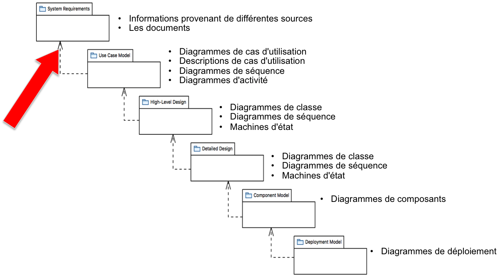{style=border:none}


--

## Dimensions de la modélisation UML

Perspective selon [UML par la pratique](https://www.amazon.ca/UML-2-5-PAR-PRATIQUE-%C3%89D/dp/2212675658)

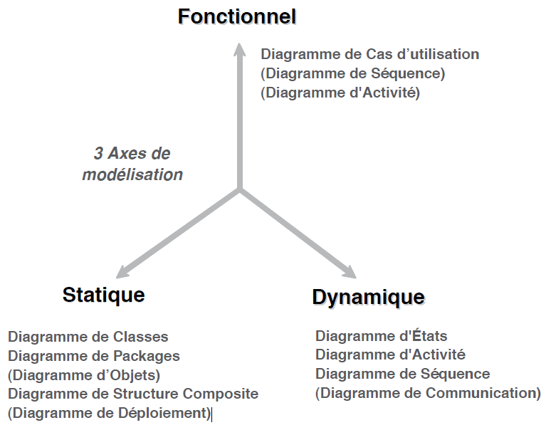{.plain width=60%}

--

## Structure vs Comportement

<!-- ```plantuml
@startuml Classification de diagrammes UML
skinparam backgroundcolor transparent
skinparam style strictuml
'left to right direction
'skinparam linetype ortho
'skinparam groupInheritance 2
hide empty members
abstract class "**Diagrammes UML**" as UML #ffffff
abstract class "Structure" as S #ddffdd extends UML
abstract class "Comportement" as B #ddddff extends UML
class "Cas\nd'utilisation" as CU extends S implements B
class Activité extends B
class État extends B
abstract class "Interaction" as Int #ddffff extends B
class Séquence extends Int
class Commu-\nnication extends Int
class Classe extends S
class Object extends S
class Package extends S
class Déploie-\nment extends S
class Composant extends S
@enduml
``` -->

{.plain width=100%}


--

#### Les meilleures pratiques  – Cas d'utilisations
::: block {style=font-size:0.7em}
- Développer Itérativement
- Utilisez  la décomposition  et le packaging pour structurer votre modèle  de cas d'utilisation
- Définir l'ensemble  des acteurs
- Définir  / adopter un ensemble de guidelines et une  convention de nommage
- Utiliser  un modèle  de description de cas d'utilisation  «standard»
- Éloignez-vous  de trop de détails , vous en parlerez  plus tard
- **Remarques:**
    - Rappelez-vous  que l'un  des objectifs principaux  des cas d'utilisation est  de communiquer  avec les parties prenantes , qui incluent  des personnes  de divers horizons.

**Pas de solution magique , écrire  des cas d'utilisation est  un art!**
:::

--


#### Les meilleures pratiques  – Structure
::: block {style=font-size:0.8em}
- Respecter le décalage  de représentation

- Commencez par définir  les classes directement dérivées  des exigences et du modèle du domaine. Ajoutez  de manière itérative  de nouvelles  classes et raffinez -les selon vos besoins  au fur et à mesure  de votre  progression dans  le processus  de conception
- Définissez  les principaux attributs  de la classe . Ajoutez  de manière itérative  de nouveaux attributs  au fur et à mesure que vous avancez dans  le processus  de conception de manière itérative
- Utiliser une  convention de nommage cohérente  pour les classes et les attributs
:::

--


#### Les meilleures pratiques  – Diagramme d'intéraction
::: block {style=font-size:0.75em}
- Se concentrer  sur le comportement  global du système  et la communication entre le système  et l'ensemble  des acteurs
    - Ne commencez  pas à prendre  des décisions  de    conception à ce stade

- Concentrez-vous  sur les principaux scénarios , n'essayez  pas d'être exhaustif

- Décomposer  les diagrammes  de séquences  longs en  fragments plus petits, le cas échéant
    - Définir  des interactions séparées  et utiliser  « Interaction Use » pour faire référence à  des interactions définies séparément
:::


--

### Les meilleures pratiques  – diagramme activité
- Choisissez  le «bon» niveau d'abstraction  / détails
    - Évitez  le piège  de spécifier  les détails  de conception,… vous  le ferez  plus tard!


- Maintenir  la cohérence  avec les descriptions de cas d'utilisation 
    - Ne signifie  pas une traçabilité individuelle

- Concentrez-vous  sur la clarification et la compréhension  du modèle

--

#### Les meilleures pratiques  – “Diagramme d'état”
::: block {style=font-size:0.9em}
- Choisissez  le «bon» niveau d'abstraction  / détails
    - Évitez  le piège  de spécifier  les détails  de conception,… vous  le ferez  plus tard dans  le processus  de conception!
- Maintenir  la cohérence  avec le modèle  de cas d'utilisation
    - Ne signifie  pas une traçabilité formelle individuelle
- Exploiter les relations de cas d'utilisation  (et de scénarios) pour structurer les machines d’états
- Ne définissez  pas une  machine d’états pour chaque classe , mais uniquement  pour les classes actives
:::

[<div class='footer'>Table des matières diagrammes uml</div>](#diagrammestdm)

---

<!--=======================================================================================================-->
<!-- .slide: id='diverstdm'   -->
## Module divers
:::block {style=font-size:0.7em}
1. [Faute, erreur, échec et exception](#faute9) - [14.33m](https://youtu.be/SXRtswxk1ac)
2. [Dette technique](#dette11) - [51.06m](https://youtu.be/VFKkGz9sx8o)
3. Dette technique vscode- [4.09m](https://youtu.be/eLKutSXOPMk)
4. [Sondage sur technologies](https://forms.gle/Yu1wbZTw4K9TgmQT7)
6. [Enquête sur la rémunération d'ingénieur...](#salaire13) - [31.02m](https://youtu.be/8xvxEONaHIA)
7. [Résautage](#resautage13)
8. [Stackoverflow developer Survey](#stackoverflow13)
9. [Liste de recruteurs](#recruteurs13)
10. [Sales statistics](#stats13)
11. [97 things](#things13)
:::

:::block {style=font-size:0.5em}
[Séances](#seances) | [Quiz](#quiztdm) | [Laboratoires](#laboratoiretdm) | [Intro](#introtdm) | [Équipe](#equipetdm) | [PU](#putdm) | [DCU](#dcutdm) | [CU](#cutdm) | 
[IU](#iutdm) | [MDD](#mddtdm) | [Dss](#dsstdm) | [Contrat](#contrattdm) | [RDCU](#rdcutdm) | [DCL](#dcltdm) | 
[Couche](#couchetdm) | [Exercice](#exercicetdm) | [Typescript](#typescripttdm) | [Complexite](#complexitetdm) 
| [FURPS](#furpstdm) | [TDD](#tddtdm) | [GOF](#goftdm) | [Diagrammes](#diagrammestdm) | [Divers](#diverstdm)  
:::


--

<!--------------------------------------------------------------->
<!-- .slide: id='faute9' class="furpslide" -->
## Tolérance aux fautes
Définitions
<!-- .slide:  class="furpslide" -->
- Faute
    - source d'un mauvais comportement
- Erreur
    - manifestation de la faute dans le système en fonctionnement
- Échec (Défaillance)
    - service échoue à cause de l'erreur

--

<!-- .slide: class="furpslide" -->
## Faute vs. erreur (1)
Faute ne produit pas toujours une erreur

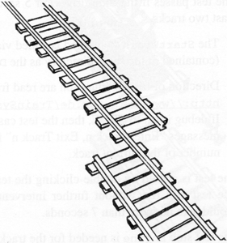{.plain}{width=30%}
::: block {style=font-size:0.5em}
ref: «&nbsp;Object-Oriented Software Engineering&nbsp;» BerndBruegge, B.Bruegge, AllenDutoit
:::

--

<!-- .slide: class="furpslide" -->
## Faute vs. erreur (2)
L'erreur est la manifestation de la faute dans le système

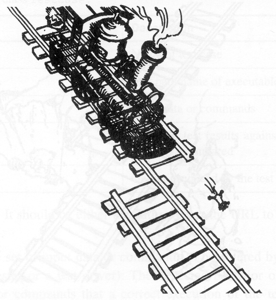{.plain}{width=30%}
::: block {style=font-size:0.5em}
ref: «&nbsp;Object-Oriented Software Engineering&nbsp;» BerndBruegge, B.Bruegge, AllenDutoit
:::

--

<!-- .slide: class="furpslide" -->
## Source d'une faute
Problème algorithmique

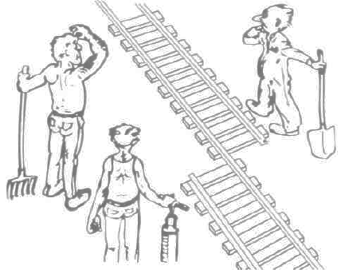{.plain}{width=45%}
::: block {style=font-size:0.5em}
ref: «&nbsp;Object-Oriented Software Engineering&nbsp;» BerndBruegge, B.Bruegge, AllenDutoit
:::

--

<!-- .slide: class="furpslide" -->
## Source d'une faute
Problème environnemental

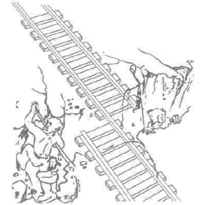{.plain}{width=35%}

::: block {style=font-size:0.5em}
ref: «&nbsp;Object-Oriented Software Engineering&nbsp;» BerndBruegge, B.Bruegge, AllenDutoit
:::

--

<!-- .slide: class="furpslide" -->
## Enchaînement
- Une faute  peut provoquer une erreur,  qui peut provoquer une défaillance
- Vue d'un niveau plus haut, la défaillance  peut être aperçue comme une faute

{.plain}{width=100%}


--

<!-- .slide: class="codeslide" -->
## Traitement des défaillances

- Quand rien ne va plus: *article n'est pas dans la cache et service web n'est pas accessible*
- Intervenants résolvent le problème: *entrée à la main du prix et de la description*

--

<!-- .slide: class="codeslide" -->
## Traitement des erreurs
- Exceptions
- Utiles pour des ressources telles que
  - disque dur
  - mémoire
  - réseau
  - base de donnée
  - services externes

[<div class='footer'>Table des matières divers</div>](#diverstdm)

--

<!--------------------------------------------------------------->
<!-- .slide: id="exception9" class="codeslide" -->
## Exceptions: grandes lignes
- Patrons
  - «&nbsp;Donner le nom du problème et non celui de l'objet qui lance l'exception&nbsp;»
  - «&nbsp;Convertir exceptions&nbsp;»
  - «&nbsp;Journal centralisé d'erreurs&nbsp;»
  - «&nbsp;Dialogue d'erreur&nbsp;»

--

<!-- .slide: class="codeslide" -->
## Convertir exceptions
- Comment présenter l'exception?
- Niveau d'abstraction
    - équivalent : faute -> erreur -> défaillance (faute)
- Exception de haut niveau
    - encapsule exception de bas niveau

Note: Convertir Exception suggère qu'une exception de haut niveau englobe une exception de bas niveau.  De plus l'exception peut contenir de l'information additionnelles selon le contexte. Cette règle n'est pas absolue. Exemple: si le système de persistance attrape une ”SQLException” et supposant qu'il la traite en lançant une DBUnavailbleException qui englobe l'exception précédente. «&nbsp;le DBProductAdaptar joue le rôle d'une façade ou sous-système pour l'information des produits et attrape cette exception et supposant qu'il la traite en lançant à nouveau une nouvelle exception à un autre niveau et qui englobe l'exception du niveau précèdent et lui donnant plus de sens dans son contexte spécifique

--

<!-- .slide:class="codeslide" -->

## Journal centralisé d'erreurs
- Objet singleton global
  - lui acheminer toutes les exceptions
  - flexibilité des définitions de flux de sortie
- `java.util.logging` (depuis JDK 1.4)

--

<!-- .slide: class="codeslide" -->
## Dialogue d'erreur
- Objet singleton
    - mécanisme centralisé de notification des erreurs
    - pour notifier l'utilisateur
    - protection contre les variations dans le mécanisme de sortie
    - pas un objet de l'IU
    - indépendant de l'application

--

<!-- .slide:  class="codeslide" -->
### Patron: Dialogue d'erreur
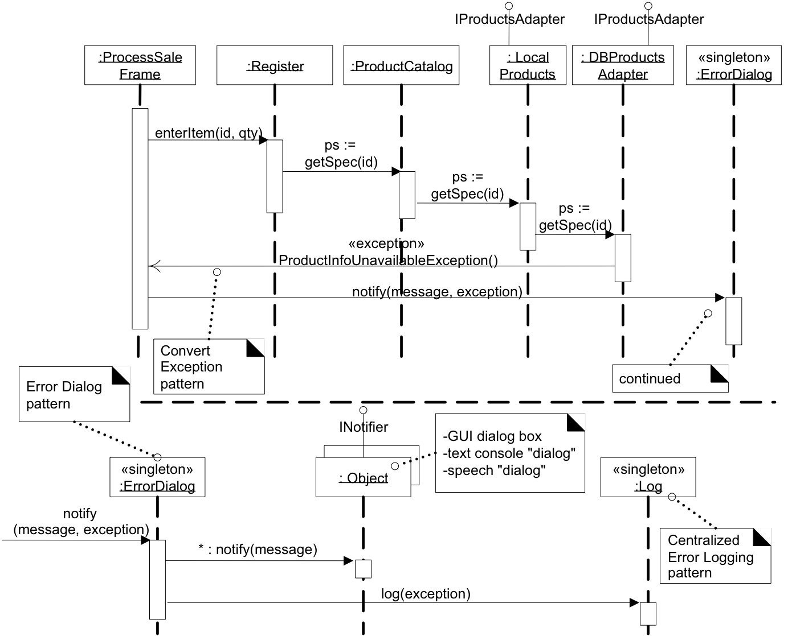{.plain}{width=60%}

fig A35.11 p 592


--

<!-- .slide: class="furpslide" -->

## Problème - service non disponible
- Dans le cas ou on doit envoyer les ventes au services de comptabilité, il faut agir le plus rapidement possible, donc directement communiquer avec les services de comptabilité externes.
- Dans l'éventualité ou le service comptable est temporairement non disponible, comment peut-ont éviter que cette faute devienne une défaillance.

[<div class='footer'>Table des matières divers</div>](#diverstdm)

--

<!--------------------------------------------------------------->
## Patron Proxy (GoF){.fragment .shade-up}
<!-- .slide: id="proxy9" class="gofslide" -->
- Problème
    - l'accès direct à un objet est impossible (ou est indésirable). Que faire?
- Solution
    - Utiliser un objet proxy qui est un substitut à un objet
    - Le proxy implémente la même interface
    - Cela ajoute un niveau d'indirection

--

<!-- .slide:  class="gofslide" -->

## Proxy
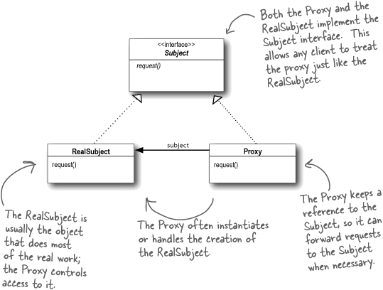{.plain width=60%}

::: block {style=font-size:0.3em}
Freeman, Eric; Robson, Elisabeth; Bates, Bert; Sierra, Kathy. Head First Design Patterns.
:::

--

<!-- .slide:  class="gofslide" -->
## Proxy
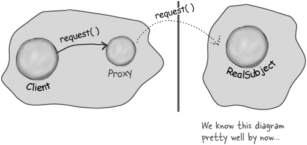{.plain width=80%}

::: block {style=font-size:0.3em}
Freeman, Eric; Robson, Elisabeth; Bates, Bert; Sierra, Kathy. Head First Design Patterns.
:::


--

<!-- .slide:  class="gofslide" -->
## Patron Proxy (GoF)
{.plain}{width=100%}
fig. F30.12

--

<!-- .slide: class="gofslide" -->
## Les Proxy dans PoS
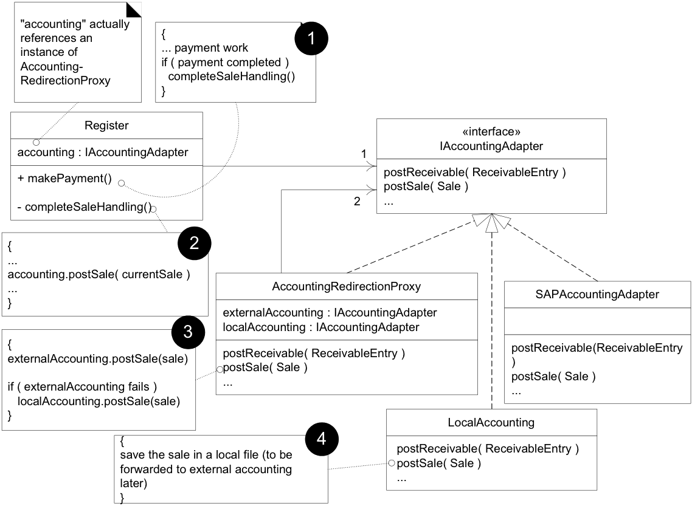{.plain width=70%}

--

<!-- .slide:  class="gofslide" -->
## Proxy de redirection
Exercice
<!--  -->
{.plain width=100%}

[<div class='footer'>Table des matières divers</div>](#diverstdm)

--

<!--------------------------------------------------------------->
<!-- .slide: id="dette11" -->
## Dette technique

Rappel : Spectre de la conception de Neal Ford.


{.plain}

--

## Dette technique : Risque

La dette est une forme de risque.

Elle apporte des *bénéfices* ou des *pertes*, selon la quantité d'intérêt à payer.

[Chapitre 18 des notes de cours](https://classroom.google.com/u/0/c/MTQ4OTkyMTQ0OTg5)

--

## Dette technique: métaphore

Le "Hacking Cowboy" 🤠 (s'endetter)
- Bénéfice: obtenir une solution rapidement
- Perte: utiliser ce code à long terme

Pour *rembourser* la dette, on doit  
réécrire le code (faire un meilleur design, écrire des tests, "refactor", etc.)

--

### Dette technique: Exemple

::: block {style=font-size:0.8em}
Accumulation de décision dans le temps qui donne un code de mauvaise qualité et contraint la solution architecturale

- Conséquences
  - Taux élevé de défaut
  - Retard du projet
  - Complication d'entretien
  - La productivité de developpement très faible

- Proxy pour dette techniques
  - Combien de temps faut t’il pour mettre à jour le système
  - Combien coute la mise à jour du système.
  - Combien de fois les choses sont cassées.
:::


--

### Classification de la dette technique
Fowler, 2009

| Dette        | Imprudente                                 | Prudente                                                    |
| ------------ | ------------------------------------------ | ----------------------------------------------------------- |
| Délibérée    | "On n'a pas le temps pour la conception" | "Faut livrer maintenant puis en assumer les conséquences" |
| Involontaire | "C'est quoi la séparation en couches?"   | "Maintenant on sait comment on aurait dû le faire"        | 

--

### Dettes technique: autre exemples
- Ne pas migrer à la dernière version du framework de développement
- Ne pas faire d'analyse
- Ne pas faire de conception
- Ne pas faire de test
- Ne pas avoir de tracabilité entre les différents documents

--

#### 5 arguments pour que les managers se soucient de la dette technique
::: block {style=font-size:0.8em}
1. Le réusinage réduira la volatilité du coût marginal des caractéristiques»
2. Au cours des 3 derniers mois, nous avons dépensé 63% du budget de développement pour régler des questions de qualité
3. Nous avons pris des prêts techniques pour expédier plus rapidement, nous devons rembourser une dette pour garder un délai de marché faible"
4. Nous pouvons réduire nos dépense d'affaires en investissant 10% de notre temps dans la qualité de notre code"
5. Investir 20% du budget dans le réusinage coupera le temps de première réponse de moitié avec un ROI positif sur la productivité de développeurs

réf.: https://understandlegacycode.com/blog/5-arguments-to-make-managers-care-about-technical-debt/
:::

--

## Dettes technique: Tests
::: block {style=font-size:0.7em}
- Essentiellement, il est dans votre intérêt, en tant que développeur, en tant qu'équipe, d'encourager de nombreux tests plus bas dans les piles présentées ici. Cela commence par des tests unitaires complets et vérifiés. Cela continue avec une discipline de test solide et reproductible (pour laquelle je recommande l'automatisation des tests).

- Pourquoi? Parce que - lorsque vous vous déplacez plus haut dans la pile, ce fichu bug que quelqu'un a enregistré est caché derrière couche après couche de code. Plus le bogue est éloigné du niveau d'unité, plus les composants et les variables d'environnement sont impliqués. Plus ceux-ci sont impliqués, plus il est difficile d'identifier et de réparer, et plus le coût est élevé.


http://jessenoller.com/blog/2008/09/17/the-cost-of-not-testing-software
:::


--

## Dettes technique: Tests
{style=border:none}{width=40%}
{style=border:none}{width=40%}

--

## Dettes technique: Tests
### a 75$/heure

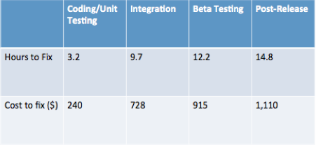


--


#### Test manuel vs test automatisé

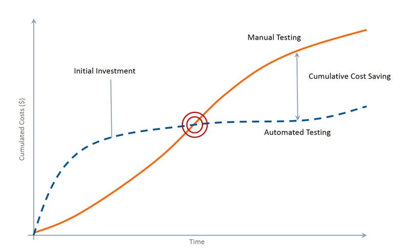

::: block {style=font-size:0.8em}
https://abstracta.us/blog/test-automation/true-roi-test-automation/
:::

--

#### Avantages
::: block {style=font-size:0.6em}
- Un testeur manuel exécute des tests 8 heures par jour et rentre chez lui. À ce moment, les tests s'arrêtent. Avec l'automatisation des tests, nous pouvons exécuter des tests 16 heures de plus par jour (dans le meilleur des cas… bien sûr) pour le même coût, ce qui réduit le coût moyen des heures de test.

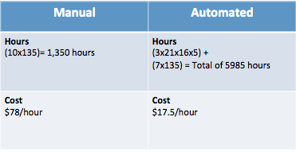

- Coût total : 101250$/mois
- 3 developpeurs x 21 jours/mois * 16h/jour de test * 5 fois plus rapide = 5040h equivalent

- 7 developpeurs x 135h/mois = 945h
:::

--

## Avantages 

- Dans ce scénario, nous avons  considérablement réduit le coût de chaque heure de test de 78 $ à 17,54 $,  ce qui est un avantage que le directeur financier comprendra clairement. Ou vous pouvez le voir de cette façon; nous avons  augmenté les tests de 1 350 heures à 5 985 heures équivalentes et gagné 315 000 $ de tests par mois  pour le même coût (5 040 fois le coût horaire moyen d'un testeur).

--

## Valeur commerciale
- Améliorez la qualité des logiciels
- Évitez les problèmes de fonctionnement
- Maintenir une bonne image client
- Évitez les problèmes juridiques
- Diminuer le coût de la correction des bogues de 5 fois

--

## Valeur informatique
- Simplifie les tâches de routine
- Exécutez plus de tests sans augmenter les coûts dans le même temps
- Augmentez l'étendue de la couverture
- Trouvez les défauts difficiles à détecter plus tôt, lorsqu'ils sont plus faciles à corriger
- Améliorez la qualité du logiciel

::: block {.fragment .shade-up}
Êtes-vous d'accord pour dire que le retour sur investissement de l'automatisation des tests est important?
:::

--

## Visual studio code

- voir plugin Tech Debt Metrics 
 
[<div class='footer'>Table des matières divers</div>](#diverstdm)

--

<!---------------------------------------------------------------> 
<!-- .slide: id='salaire13' -->
### Enquête sur la rémunération d'ingénieur
- https://www.genium360.ca/fr-ca/services-aux-entreprises/enquete-sur-la-remuneration/
- https://drive.google.com/file/d/1UnInAz3y1it-l5S_ED2W-dj2JVJ8clTC/view?usp=sharing

[<div class='footer'>Table des matières divers</div>](#diverstdm)

--


<!--------------------------------------------------------------->
<!-- .slide: id='resautage13' -->

<!--------------------------------------------------------------->
## Résautage
https://drive.google.com/open?id=1Cm2WTaG5KN0sqonAfOnbxjcuNfbMYFBW

[<div class='footer'>Table des matières divers</div>](#diverstdm)


--

<!--------------------------------------------------------------->
<!-- .slide: id='stackoverflow13' -->
## Developer Survey Results
### 2019
https://insights.stackoverflow.com/survey/2019

[<div class='footer'>Table des matières divers</div>](#diverstdm)

--

<!--------------------------------------------------------------->
<!-- .slide: id='recruteurs13' -->

<!--------------------------------------------------------------->
## Liste de recruteurs
https://drive.google.com/open?id=11XYE6k8m6YIcbAJ6hGBfkmIlJLH_DRTp

[<div class='footer'>Table des matières divers</div>](#diverstdm)


--

<!--------------------------------------------------------------->
<!-- .slide: id='stats13' -->

https://drive.google.com/open?id=1jJT5YChfylxJNfSQQPH1lsBLab2CQYpG
[<div class='footer'>Table des matières divers</div>](#diverstdm)


--

<!--------------------------------------------------------------->
<!-- .slide: id='things13' -->
## 97 things

### 97-things-every-programmer-should-know
::: block {style=font-size:0.7em}
- https://github.com/97-things/97-things-every-programmer-should-know/blob/master/en/SUMMARY.md
:::

### 97-things-every-agile-developer-should-know
::: block {style=font-size:0.7em}
- https://github.com/97-things/97-things-every-agile-developer-should-know
:::
[<div class='footer'>Table des matières divers</div>](#diverstdm)
