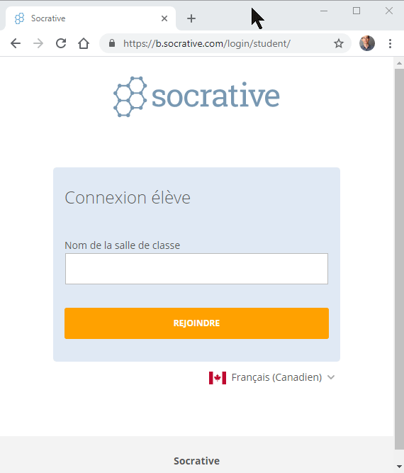
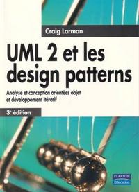

---

history: true
progress: true
controls: true
controlsTutorial: true
controlsBackArrows: faded
center: true
theme : beige
transition: none
transitionSpeed: fast
highlightTheme: monokai
logoImg: ./assets/logo_ets.svg
slideNumber: true
title: 'LOG210-seance-01'
margin: 0
minScale: 1
maxScale: 1
#rtl: false
viewDistance: 3
display: block
navigationMode: 'linear'
# height: 50%
# width: 100%
#autoPlayMedia: true
notesSeparator: "Note:"
customTheme : "slide_themes"

---

# LOG210 Analyse et conception de logiciels: Séance 01

--

# Bienvenue dans LOG210! (Été 2021)

---

<!-- https://dev.to/berry_clione/set-up-to-convert-a-markdown-file-to-revealjs-slides-by-pandoc-58n5 -->
<!-- .slide: id="presentationequipe" class="equipeslide"  -->
# Survol

1. **Présentation de l'équipe** {style=color:red}
2. Présentation personnelle
3. Présentations des étudiant.e.s
4. Faire un logiciel pour un domaine que vous ne connaissez pas
5. Outils de travail
6. Introduction à l'analyse et conception de logiciels

--

<!-- .slide:  class="equipeslide"  -->

## Équipe

- Professeur responsable du cour, enseignant du groupe 01

{width=30% .plain}  
Prof. Christopher Fuhrman, PhD P.Eng

--

<!-- .slide: class="equipeslide"  -->
## Équipe

Chargé de cours, enseignant du groupe 02

{width=25% .plain}  
Yvan Ross, M.ing

--

<!-- .slide: class="equipeslide"  -->

## Communiquer avec moi

- Par courriel: **objet précis**, ex. 
  **`LOG210-01: question sur le modèle du domaine`**
- Éviter d'utiliser l'objet par défaut de SIGNETS!
- Rencontres organisées de façon proactive selon mes disponibilités.
  - profs.etsmtl.ca/cfuhrman proposez-moi dans le premier courriel l'heure du rendez-vous 🏆
  - Ne pas me proposer des choses après 18h SVP 👨‍👨‍👧‍👦

--

<!-- .slide: class="equipeslide"  -->
## Chargés de laboratoire

Groupes 01 et 02: **Valère K. Fami**  
Groupe 02: **Guillaume**

### Communication
- Discord pour communiquer avec eux à propos des questions de laboratoire
- Courriel pour communiquer avec eux (et votre enseignant) à propos des questions administratives (communication officielle)

---

<!-- .slide: id="presentationequipe" class="equipeslide"  -->
# Survol

1. Présentation de l'équipe
2. **Présentation personnelle**{style=color:red}
3. Présentations des étudiant.e.s
4. Faire un logiciel pour un domaine que vous ne connaissez pas
5. Outils de travail
6. Introduction à l'analyse et conception de logiciels

--

<!-- .slide: class="equipeslide"  -->
# Christopher Fuhrman

--

<!-- .slide: data-background-image="assets/LogosFuhrman.png" data-background-size="100%" data-background-opacity="0.1" -->
## Présentation personnelle

- Professeur depuis 2001 (Conception de logiciels)
- Expérience industrielle
  - 2019- : Développement Pharo.org Inria Lille
  - 2014- : PlantUML Gizmo / GIFT Quiz Editor
  - 2008 : Développement convertisseur XML FBI-WVU
  - 2000 : Directeur du programme NASA « ASSET »
  - 1998-1999 : Développeur chez ProLogic
  - 1989-1991 : Développeur chez Apple

--

<!-- .slide: data-background-image="assets/LogosFuhrman.png" data-background-size="100%" data-background-opacity="0.1" -->

## Présentation personnelle

- Diplômes universitaires
  - 1988 Bachelor of Science (informatique) WVU
  - 1996 Docteur ès sciences (informatique technique) École Polytechnique Fédérale de Lausanne

---

<!-- .slide: id="presentationequipe" class="equipeslide"  -->
# Survol

1. Présentation de l'équipe
2. Présentation personnelle
3. **Présentations des étudiant.e.s**{style=color:red}
4. Faire un logiciel pour un domaine que vous ne connaissez pas
5. Outils de travail
6. Introduction à l'analyse et conception de logiciels

--

<!-- .slide: id='pre_etudiants' class="equipeslide"  -->
## Présentations des étudiant.e.s

Questionnaire à tiny.cc/quizdesign

Nom de la salle de class: **ETSDESIGN**

{style="width:300px" .plain}

Note:
https://b.socrative.com/teacher/

--

<!-- .slide: class="equipeslide"  -->
## Présentations des étudiant.e.s

- Comment développer un logiciel?
  - Quelle(s) méthode(s) de développement avez-vous suivie(s)?
  - Pour quel genre de logiciel?
- Quelles sont vos attentes pour LOG210?

--

<!-- .slide: class="equipeslide"  -->
## Présentations des étudiant.e.s
- Veuillez vous présenter sur Discord dans Général. 
  - Votre nom, votre programme d'étude collégiale, votre programme d'étude universitaire, vos stages (entreprise, domaine, projet), pourquoi vous êtes en génie logiciel.
{width=35%}{.plain}

--

<!-- .slide: class="equipeslide"  -->
## Meilleures pratiques pour apprendre

Quelles sont les meilleures pratiques pour apprendre?

{width=30%}{.plain}
{width=30%}{.plain}
{width=30%}{.plain}

--

<!-- .slide: class="equipeslide"  -->
## Mes conseils pour réussir

- L'étudiant.e qui réussit dans mes cours…
    - <s>s'assied vers l'avant de la salle,</s>
    - est motivé pour apprendre et pour participer, 
    - est bien discipliné, 
    - est organisé, 
    - cherche de l'aide d'une façon proactive,
    - sais que le **multitâche** nuit à la qualité.

--

<!-- .slide: class="equipeslide"  -->
## proactif

1. **Domaine**: psychologie
1. **Auteur**: Office québécois de la langue française, 2002  
1. **Définition**: Qui exerce un effet sur des faits ou des processus **à venir**

> Exemple: Pompiers qui visitent les maisons pour vérifier les détecteurs de fumée{align=left}

--

<!-- .slide: class="equipeslide"  -->
## Ingénieur logiciel, le meilleur métier au monde ?

**Revers de la médaille**: certains reprochent à leur métier la nécessité  de se mettre régulièrement au niveau. Ils trouvent difficile de suivre les évolutions avec les langages et les nouvelles pratiques qui ne cessent d'apparaître ou de se modifier
🧑👩💻👨‍🏫
{.fragment .shade-up} 

Note: 1 animation

--

<!-- .slide: class="equipeslide"  -->
## Ingénieur logiciel, le meilleur métier au monde ?

**Autre inconvénient**: la solitude, notamment  pour les développeurs  qui préfèrent travailler depuis chez eux. Un choix qui leur offre un emploi du temps flexible, mais qui les mène à passer de longues heures sans interagir avec le moindre collègue.{.fragment .shade-up}

::: block {style=font-size:14px}
http://www.developpez.com/actu/26910/Ingenieur-logiciel-le-meilleur-metier-au-monde-Oui-selon-une-etude-signee-CareerCast-com/
:::

Note:
Travail en équipe aide! Beaucoup d'interaction.

---

<!-- .slide: id="inconnu" class="equipeslide"  -->
# Survol

1. Présentation de l'équipe
2. Présentation personnelle
3. Présentations des étudiant.e.s
4. **Faire un logiciel pour un domaine que vous ne connaissez pas**{style=color:red}
5. Outils de travail
6. Introduction à l'analyse et conception de logiciels

--

### Faire un logiciel pour un domaine que vous ne connaissez pas

Exemple:  
Application Web permettant de planifier les formations (faites par des spécialistes en TI) des enseignants dans les écoles québécoises.

Comment procéder?
  - Appliquer un processus pour la réalisation
    - Appliquer une méthodologie d'analyse
    - Appliquer une méthodologie de conception
  

Note:
Il faut connaître **comprendre** le domaine, le **modéliser** (pour pouvoir automatiser les processus), faire du code simple. 

---

<!-- .slide: id="outils" class="toolslide" -->
# Survol

1. Présentation de l'équipe
2. Présentation personnelle
3. Présentations des étudiant.e.s
4. Faire un logiciel pour un domaine que vous ne connaissez pas
5. **Outils de travail**{style=color:red}
6. Introduction à l'analyse et conception de logiciels

--

<!-- .slide: class="toolslide" -->
# Outils de travail
- [Plan de cours](https://planets.etsmtl.ca/public/Versionpdf.aspx?sigle=LOG210)
- Moodle pour quiz chaque semaine
- Examen final - enaquiz
- Accès ETSMTL.NET (Google)
  - Google Disque pour le contenu
  - Google Classrooms (exercices)
- Socrative
- Discord (invitation)
- GitHub Classrooms (labs, invitation)

--

<!-- .slide: class="toolslide" -->
##  Outils de travail...
- Visual Studio Code et extensions
  - plantuml
  - Markdown all in One
  - Markdown PDF
  - [Live Share](https://visualstudio.microsoft.com/services/live-share/)
- [GitInspector](https://www.npmjs.com/package/gitinspector)
- etc.

--

<!-- .slide: class="toolslide" -->
# Notes de cours

Il existe des [notes de cours](https://tinyurl.com/log210ndc) depuis janvier 2020.

## tinyurl.com/log210ndc

> Les notes de cours ne remplacent pas le livre obligatoire!

--

<!-- .slide: class="toolslide" -->
# Livre obligatoire

{width=25%}{.plain}
{width=20%}{.plain}

- Version anglaise sur la [BANQ](http://res.banq.qc.ca/login?url=https://www.oreilly.com/library/view/temporary-access/)

---

<!-- .slide: id="introaoo" class="toolslide" -->
# Survol

1. Présentation de l'équipe
2. Présentation personnelle
3. Présentations des étudiant.e.s
4. Faire un logiciel pour un domaine que vous ne connaissez pas
5. Outils de travail
6. **Introduction à l'analyse et conception de logiciels**{style=color:red}

---

# ⚠️LOG210 n'est pas un cours...

- ~~pour apprendre à programmer.~~
- ~~de technologies web.~~
- ~~de bases de données.~~
- ~~de conception d'interfaces humain-machine.~~
- ~~de gestion des exigences.~~

--

# Chapitre 1 des notes de cours

- Analyse vs Conception
- Complexité
- Méthodologie de développement
- Processus unifié

--

## Valider la compréhension

tiny.cc/quizdesign $\rightarrow$ ETSDESIGN

L'activité **d'analyse** vise à

::: block {.socrative}
1. étudier le problème que l'application est censée résoudre.
2. proposer une solution de l'application qui résout un problème.
:::

Note:
https://b.socrative.com/teacher/

--

## Valider la compréhension

tiny.cc/quizdesign $\rightarrow$ ETSDESIGN

La **complexité inhérente** est celle qui vient

::: block {.socrative}
1. du domaine de l'application
2. de la solution (conception)
3. de l'environnement d'exécution
:::

Note:
https://b.socrative.com/teacher/

--

## Valider la compréhension

tiny.cc/quizdesign $\rightarrow$ ETSDESIGN

La **complexité inhérente** se manifeste dans

::: block {.socrative}
1. le modèle du problème
2. le code de la solution
3. les deux
:::

Note:
https://b.socrative.com/teacher/

--

# Spectre de la Conception

Figure 6.1 des [notes de cours.](https://tinyurl.com/log210ndc)

--

<!-- .slide: data-background-image="https://www.plantuml.com/plantuml/svg/VLJRRjf047stb7yOvIK95LNIlbK81KWlQQEgAg5zW3oiTmTxvVMkjHTHyaTHFw5loOzrriR4X0Z9CjAPCsTcpW4kdMVMXr8bhf2wOfQLuFnQ8RsjvB5or2cbZ1UPDK4BRfInu2tJZage_L5o0ZwN3kXXa3CjLbPwZngMHdkG6dvBBSpA4V5PKE2I1UKZHRCIuPkLBlPStqw8TvkZGp0-H-j06LD0Pf7LOjDVd-6qP0Kj6YpIP5oVqAVKT91IA6YgXT7D3Soc7tzEE-FXuloiUzBB3HpBuaiVtlDQ5_3L1AkPEiZxKt01KsvbvG_oVY1PPLrtiQw5tWPC76UKoyNRTnqILyoviR42xQHE99T2eDvZR7Cxn1fPQrOD8LNKaH0jVX7Gel7h2bq3O5dvDPHOfhHnKdV2yS39U_pm_dnuTmpCmOfHrvAIQEkFVs72w0Bghs9WZ_zgtdTUjOnUxqslLuEf24iO34fQKk5ms1B6o08teIBp5feRpR7oqkY5PW74qqCQ_4AVZgzcdyuQwIYpB_wwzan3XII3z3YPlH2T6eheMVXLNPP9IcTVUHJnfe-rsDLcnjD3YJQZ7yz65_VSdDULdCAGEkju-QL1W9jLQjPRD_CasJeFVOLBFq-D4dVzsjEaDdO7ZkWUM9-ID0Vj5DezEaC6_J0NpEKOwp7D9ho-wA1fEsMN7D6DQpjqWLkuIsV9PlmBUfvSeXRqH_KV" data-background-size="80%" data-background-opacity="1" -->

---

### Survol des modèles
{.plain}

Note:
Indiquer ANALYSE / CONCEPTION / etc.

--

# Analyse vs Conception

C'est de la modélisation!
<!-- .slide: id='coo' -->

--

<!-- .slide: id='coo' -->
## Lectures à faire

Le chapitre 1 des notes de cours et les chapitres correspondants du livre de Larman.

---

<!-- .slide: class="equipeslide"  -->

## Développement de logiciel en équipe
{width=35%}{.plain}

--

<!-- .slide: class="equipeslide"  -->
## Développement de logiciel en équipe

Pratiquement tout conflit social est dû à un manque d'humilité, de respect ou de confiance.

{width=40%}{.plain}

:::block {style=font-size:0.5em}
référence: «Team Geek» Brian W. Fitzpatrick (Google), Ben Collins-Sussman (Subversion, Google)
:::

--

<!-- .slide: class="equipeslide"  -->

## Respect

Avez-vous un exemple d'un manque de respect:

- envers un coéquipier
- envers les élèves de la classe{.fragment .shade-up}
- d'un étudiant envers un professeur ou un chargé de laboratoire{.fragment .shade-up}
- d'un professeur/chargé de laboratoire envers un étudiant{.fragment .shade-up}

Note:  3 animations

--

<!-- .slide: class="equipeslide"  -->
## Confiance

Donnez-moi un exemple d'une:

- action qui donne confiance à mes coéquipiers
- action qui diminue la confiance envers mes coéquipiers{.fragment .shade-up}

Note: 1 animation

--

<!-- .slide: class="equipeslide"  -->
## Humilité

Trouvez-moi un exemple où:

- un étudiant ou un professeur fait preuve d'humilité
- un étudiant ou un professeur ne fait pas preuve d'humilité{.fragment .shade-up}

--

<!-- .slide: class="equipeslide"  -->

#### Pourquoi l'enseignant décide les membres de l'équipe? (1/2)

- Pour apprendre les compétences non-techniques
  - Demandées par les employeurs
  - Qui sont +stables que les compétences techniques (p.ex. Flash)
- On ne choisit pas (facilement) son équipe en entreprise
- Connaître des collègues différents pendant le bacc élargit son réseau de contacts
- Impact positif pour la carrière

::: block {style=font-size:0.5em}
Mark Granovetter, «The Strength  of Weak Ties » , Academic Press, 1977. 
:::

--

<!-- .slide: class="equipeslide"  -->

#### Pourquoi l'enseignant décide les membres de l'équipe? (2/2)

- Favorise le « coaching » car il y a de la diversité
- Un coéquipier moins fort dans un aspect du projet peut bénéficier du coaching d'un membre plus fort
- Le « coach » peut bénéficier également de ce qu'on appelle « deep learning »
- L'équipe est finalement plus cohésive et plus performante
  
--

<!-- .slide: class="equipeslide"  -->

### Éviter les comportements dysfonctionnels

- Chacun fait "sa part" sans se soucier de la santé de l'équipe et de la qualité globale du projet
  - L'équipe > moi (appliquer l'humilité)
  - Rester flexible pour les tâches, s'adapter
  - Proactivité envers problèmes dans l'équipe:
    - Exiger la présence des coéquipiers
    - Demander de l'aide (technologies)
    - S'impliquer!

Note: l'absence de preuves de proactivité vous donne tord généralement s'il y a un conflit majeur

--

<!-- .slide: class="equipeslide"  -->

### Éviter les comportements dysfonctionnels

- Un ou deux membres prennent tout le contrôle (manque de confiance)
  - Reconnaître les niveaux différents et aider (faire du coaching)
  - Être patient avec les membres ayant moins d'expérience
  - Membres ayant besoin d'aide doivent la chercher tôt (être proactif, s'impliquer)
  - Facteur de bus > 1

Note: exclure quelqu'un veut dire qu'il ne pourra jamais aider

---

<!-- .slide:  class="cuslide"  -->
# CU
## Cas d'utilisation

--

<!-- .slide: class="cuslide"  -->
## Cas d'utilisation - informel
1. **Traiter une vente.**  Un client arrive à la caisse avec les articles qu'il souhaite acheter. Pour enregistrer chaque article, le caissier utilise le système POS, lequel présente le détail des articles et le montant total des achats. Le client fournit les informations nécessaires pour le règlement. Le système valide et enregistre ces informations, puis met à jour les quantités en stock et imprime le ticket de caisse destiné au client. La vente est terminée et le client peut quitter le magasin.

--

<!-- .slide: class="mddslide"  -->

## Qu'est-ce qu'un modèle du domaine?

Représentation visuelle des classes conceptuelles ou des objets du monde réel dans 
un domaine donné [MO95, Fowler96]

- modèle conceptuel
- modèle objet du domaine
- modèle objet d'analyse

--

<!-- .slide: class="mddslide"  -->

#### Exemple avec l'outil PlantUML

{width=65% .plain}

[Plant Uml class diagram](https://plantuml.com/class-diagram)

--

<!-- .slide: class="mddslide"  -->
## Comment créer un modèle du domaine?
- Dans les limites des besoins de l'itération en cours:
    1. Identifier les classes conceptuelles.
    1. Les représenter sous forme de classes dans un diagramme UML.
    1. Ajouter des attributs et des associations.

**Chapitre 9 du livre**
Pratiquer les exercices!
--

<!-- .slide: class="mddslide"  -->
## Réaliser votre premier MDD

**En équipe de 2**

::: block {style=font-size:1em}
1. Trouver des classes du domaine
1. Ajouter des associations entre les classes lorsque vous désirez persister cette relation
1. Ajouter un verbe pour décrire cette association
1. Ajouter une multiplicité à l'association
:::

--

<!-- .slide: id="cu-noter-une-reservation" class="mddslide"  -->
## Réaliser votre premier MDD
Cas d'utilisation «Noter une réservation»

**Scénario principal**

::: block {style=font-size:0.75em}
1. Un client appelle à l'hôtel pour placer une réservation. 
2. Le commis démarre une nouvelle réservation. 
3. Le commis entre: 
    - La date d'arrivée; 
    - La date de départ; 
    - Le nom de la catégorie de chambre; 
4. Le système inscrit les informations à la réservation.

:::

---

<!-- .slide: class="dssslide"  -->

## Qu'est-ce qu'un DSS?
- Interaction avec le système
  - acteur génère des événements
  - réponses du système
- Illustrer ces opérations
  - pour mieux comprendre le système

--

<!-- .slide: class="dssslide"  -->
### Diagramme de séquence du système (DSS)
{width=55%}{.plain}

---

# LOG210 
## Séance #01
### Rétroaction: Page d'une Minute
