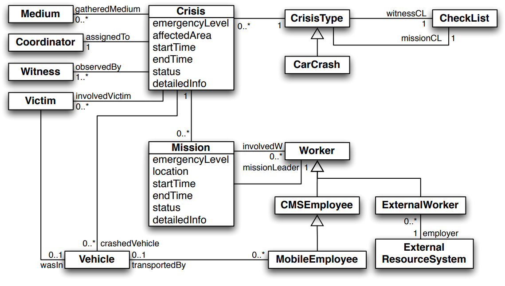
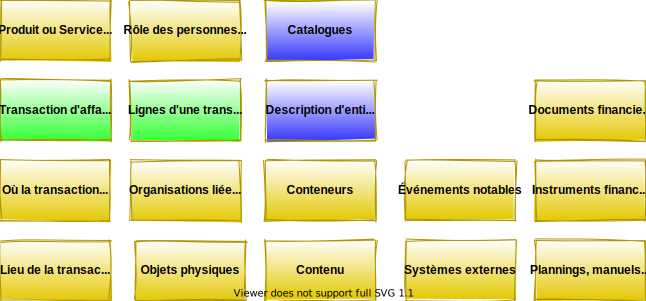
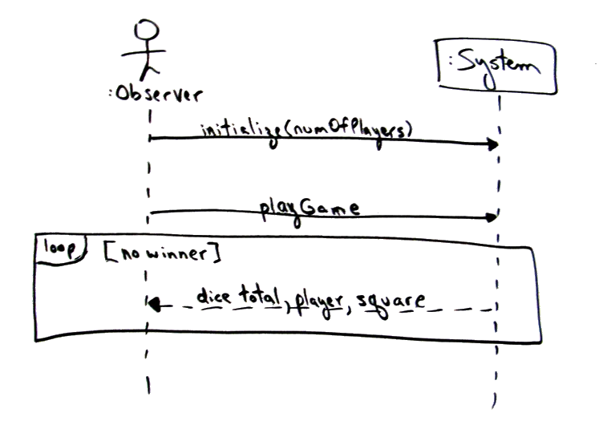
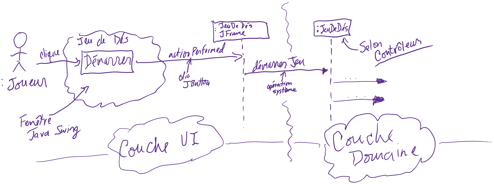

---

history: true
progress: true
controls: true
controlsTutorial: true
controlsBackArrows: faded
center: false
theme : beige
transition: none
transitionSpeed: fast
highlightTheme: monokai
logoImg: assets/logo_ets.svg
slideNumber: true
title: 'LOG210-seance-02'
margin: 0
minScale: 1
maxScale: 1
rtl: false
viewDistance: 3
display: block
navigationMode: 'linear'
height: 50%
width: 100%
autoPlayMedia: true
notesSeparator: "Note:"
customTheme : "slide_themes"
date: '`r format(Sys.time(), "%d %B, %Y")`'

---

## LOG210 Séance #02

:::block {style=font-size:0.8em}

- Analyse vs Conception (ndc sec 1.2)
- Décalage des représentations (ndc sec 1.3, fig1.1 et 1.2) 
- Complexités inhérentes, circonstancielle, environnementale (ndc sec 1.4) 
- le Modèle du domaine et les classes conceptuelles (ndc sec. 4, 4.1.x) 
  - Catègories pour identifier les classes conceptuelle
- <a onclick="window.open('https://github.com/profcfuhrmanets/exemples-ts/','_blank')">exemple Typescript</a>
:::
Note: https://docs.google.com/document/d/1Q2ggxHZaDxVKG11zxcJdKd0sTiuasi_aWEtZZsSnt94/edit

Note: Exercice (GC): à partir d’un CU, faire un DSS.
 Exercice (GC): à partir d’un CU, identifier les classes conceptuelles avec des catégories.
 Exercice (GC): à partir d’un ensemble de CC candidates, faire un MDD avec attributs et associations.

:::block {style=font-size:0.5em}
[whiteboard](#whiteboard) | [Supplément au cours en HTML](https://cc-yvanross.github.io/14f3178688ff2d131977e55d7002b1fc3b09e3ad/export/index.html)
:::

---

## Plan général des séances

{.plain}

--

# Survol Séance 02

- Rétroaction Mini-test
- Rappel méthodologie (MDD, DSS, Contrats, RDCU)
- MDD: Catégories (exercice)
- DSS: Introduction
- Architecture en couches

---

# Rétroaction
# mini-test  

{width=20% .plain}

--

# Questions difficiles

Selon les statistiques de la première tentative.

--

{width=35 .plain}tiny.cc/quizdesign $\rightarrow$ ETSLOGYVAN 

Pourquoi fait-on un modèle du domaine (MDD)?{align=left}

::: block {style=font-size:0.8em .socrative}

1. Si on commence avec un modèle du problème en termes de classes et d'objets, cela favorise une solution claire en termes de classes et d'objets logiciels.
1. Un MDD comprend tous les concepts importants dans le contexte du problème que le logiciel va résoudre. Il est primordial d'avoir une compréhension presque parfaite du problème au début d'un projet.
1. Un MDD est fait pour respecter le processus unifié.
1. Un MDD est la base de toutes les classes logicielles qui vont exister dans la solution.
:::

Note: https://b.socrative.com/teacher/#launch -> Multiple choice

--

{width=35 .plain}tiny.cc/quizdesign $\rightarrow$ ETSLOGYVAN 

Selon Larman, laquelle des réponses ne fait-elle pas partie des moyens pour trouver des classes conceptuelles?{align=left}

::: block {style=font-size:0.8em .socrative}

1. Identifier les noms dans les cas d'utilisation.
1. Trouver des classes conceptuelles à partir des catégories typiques.
1. Réutiliser les noms des classes logicielles, s'il existe une version antérieure du logiciel.
1. Réutiliser un modèle du domaine existant.
:::

Note: https://b.socrative.com/teacher/#launch -> Multiple choice

---

# Méthodologie

--

### Survol Visuel{align=right}

<!-- .slide: data-fullscreen data-background-image="assets/Fig6.1.svg" data-background-size="40%" data-background-opacity="1" -->

Note:
On dessine MDD, DSS, Contrat, RDCU sur cette image...

---

# MDD
## Identifier classes conceptuelles

1. Réutiliser modèle existant
2. Catégories de classes
3. Groupes nominaux

<!-- .slide: data-fullscreen data-background-image="assets/noun_mapping_2763502.svg" data-background-color="#CCFFCC" data-background-size="15%" data-background-position="top 5% right 5%" data-background-opacity="0.3" -->

--

<!-- .slide: data-fullscreen data-background-image="assets/noun_mapping_2763502.svg" data-background-color="#CCFFCC" data-background-size="15%" data-background-position="top 5% right 5%" data-background-opacity="0.3" -->

## Méthode 1: Modèle existant

{height=80% .plain}

--

<!-- .slide: data-fullscreen data-background-image="assets/noun_mapping_2763502.svg" data-background-color="#CCFFCC" data-background-size="15%" data-background-position="top 5% right 5%" data-background-opacity="0.3" -->

### Méthode 1: Modèle existant

--

<!-- .slide: data-fullscreen data-background-image="assets/noun_mapping_2763502.svg" data-background-color="#CCFFCC" data-background-size="15%" data-background-position="top 5% right 5%" data-background-opacity="0.3" -->

### Méthode 2: Chercher par catégorie

Section 9.5 du livre.

{width="85%" .plain}

--

<!-- .slide: data-fullscreen data-background-image="assets/noun_mapping_2763502.svg" data-background-color="#CCFFCC" data-background-size="15%" data-background-position="top 5% right 5%" data-background-opacity="0.3" -->

## Catégorie de classe

Cas d'utilisation « S'inscrire à un groupe-cours »

1. L'Étudiant commence une inscription.
2. L'Étudiant entre le sigle du cours.
3. Le Système affiche la liste des groupes-cours ainsi que l'horaire de chaque groupe-cours.
4. L'Étudiant sélectionne le groupe-cours auquel il veut s'inscrire.
5. …

>Catégories dans les [Notes de cours](https://tinyurl.com/log210ndc)

Note: Faire une liste de classes du MDD avec **Transaction métier**, **Rôle**, **Évènement notable**

--

<!-- .slide: data-fullscreen data-background-image="assets/noun_mapping_2763502.svg" data-background-color="#CCFFCC" data-background-size="15%" data-background-position="top 5% right 5%" data-background-opacity="0.3" -->

## Méthode 3: identifier les groupes nominaux

- Analyse linguistique du texte des spécifications (Cas d'utilisation, Récit utilisateur, etc.)
- Noms $\rightarrow$ Classes conceptuelles ou attributs possibles
- Approche *simple*, mais *imprécise*

--

<!-- .slide: data-fullscreen data-background-image="assets/noun_mapping_2763502.svg" data-background-color="#CCFFCC" data-background-size="15%" data-background-position="top 5% right 5%" data-background-opacity="0.3" -->

## Identifier les groupes nominaux(...)

Cas d'utilisation « S'inscrire à un groupe-cours »

1. L'Étudiant commence une inscription.
2. L'Étudiant entre le sigle du cours.
3. Le Système affiche la liste des groupes-cours ainsi que l'horaire de chaque groupe-cours.
4. L'Étudiant sélectionne le groupe-cours auquel il veut s'inscrire.
5. …

Note: Faire la liste des classes au tableau

--

<!-- .slide: data-fullscreen data-background-image="assets/noun_mapping_2763502.svg" data-background-color="#CCFFCC" data-background-size="15%" data-background-position="top 5% right 5%" data-background-opacity="0.3" -->

## Identifier les groupes nominaux(...)

Cas d'utilisation « S'inscrire à un <ins>groupe-cours</ins> »

1. L'<ins>Étudiant</ins>  commence une <ins>inscription</ins>.
2. L'Étudiant entre le <ins>sigle</ins>  du <ins>cours</ins>.
3. Le <ins>Système</ins>  affiche la <ins>liste</ins>  des groupes-cours ainsi que l'<ins>horaire</ins>  de chaque groupe-cours.
4. L'Étudiant sélectionne le groupe-cours auquel il veut s'inscrire.
5. …

--

<!-- .slide: data-fullscreen data-background-image="assets/noun_mapping_2763502.svg" data-background-color="#CCFFCC" data-background-size="15%" data-background-position="top 5% right 5%" data-background-opacity="0.3" -->

## Identifier les groupes nominaux(...)

**Résultat:** *Classes candidates*

- Beaucoup de directives (Chapitre 9)
- Classe vs Attribut?
- Attribut vs Association?

C'est l'analyse (pas la conception)
> L'étude du problème

---

<!-- .slide: data-fullscreen data-background-image="assets/noun_user interaction_2209214.svg" data-background-color="#CCCCFF" data-background-size="15%" data-background-position="top 5% right 5%" data-background-opacity="0.3" -->

## Diagramme Séquence Système (DSS)

{.plain}

--

<!-- .slide: data-fullscreen data-background-image="assets/noun_user interaction_2209214.svg" data-background-color="#CCCCFF" data-background-size="15%" data-background-position="top 5% right 5%" data-background-opacity="0.3" -->

# DSS

- Créé à partir d'un cas d'utilisation
- Modélise l'interaction
  - Opérations système
  - Messages de retour (au besoin)
- Notation UML
- But : définir l'API (haut niveau){style=color:red}
- Système est objet sans détails

--

<!-- .slide: data-fullscreen data-background-image="assets/noun_user interaction_2209214.svg" data-background-color="#CCCCFF" data-background-size="15%" data-background-position="top 5% right 5%" data-background-opacity="0.3" -->

# Tracer un DSS

- Identifier l'acteur principal
- Modéliser le système comme objet sans détails
- Identifier les évènements système
  - *Évènements externes en entrée*
  - Décrits dans cas d'utilisation
- Proposer une **opération système** pour chaque **évènement système**
  - Types primitifs pour arguments
  - Messages de retour si nécessaire

--

<!-- .slide: data-fullscreen data-background-image="assets/noun_user interaction_2209214.svg" data-background-color="#CCCCFF" data-background-size="15%" data-background-position="top 5% right 5%" data-background-opacity="0.3" -->

### DSS: CU01 - Ajouter un livre à échanger

1. Le Client démarre un nouvel ajout de livre.
2. Le Client entre le code ISBN du livre, ainsi que le code de sa
condition.
3. Le Système enregistre le livre et présente sa description. 
> Le Client répète les étapes 2 à 3 jusqu'à ce qu'il ait saisi tous les livres à échanger.
4. Le Système présente la liste de livres que possède le Client.

Note: 
faire le DSS 

--

<!-- .slide: data-fullscreen data-background-image="assets/noun_user interaction_2209214.svg" data-background-color="#CCCCFF" data-background-size="15%" data-background-position="top 5% right 5%" data-background-opacity="0.3" -->

### DSS: « Attaquer un pays »

1. Le Joueur attaquant choisit d'attaquer un pays voisin du Joueur défenseur.
2. Le Joueur attaquant annonce combien de régiments il va utiliser pour son attaque.
3. Le Joueur défenseur annonce combien de régiments il va utiliser pour sa défense.
4. Les deux Joueurs jettent le nombre de dés selon leur stratégie choisie aux étapes précédentes.
5. Le Système compare les dés et élimine les régiments de l'attaquant ou du défenseur selon les règles et affiche le résultat.

--

<!-- .slide: data-fullscreen data-background-image="assets/noun_user interaction_2209214.svg" data-background-color="#CCCCFF" data-background-size="15%" data-background-position="top 5% right 5%" data-background-opacity="0.3" -->

### DSS: « Attaquer un pays »

> Les Joueurs répètent les étapes 2 à 5 jusqu'à ce que l'attaquant ne puisse plus attaquer ou ne veuille plus attaquer.

--

<!-- .slide: data-fullscreen data-background-image="assets/noun_user interaction_2209214.svg" data-background-color="#CCCCFF" data-background-size="15%" data-background-position="top 5% right 5%" data-background-opacity="0.3" -->

### DSS: « Attaquer un pays »

{style="width:70%" .plain}

--

<!-- .slide: data-fullscreen data-background-image="assets/noun_user interaction_2209214.svg" data-background-color="#CCCCFF" data-background-size="15%" data-background-position="top 5% right 5%" data-background-opacity="0.3" -->

{width=35 .plain}tiny.cc/quizdesign $\rightarrow$ ETSLOGYVAN

Vrai/Faux: Il y a 5 opérations système dans ce DSS

{style="width:50%" .plain}

Note: https://b.socrative.com/teacher/#launch -> True/False

---

<!-- .slide: data-fullscreen data-background-image="assets/noun_Prototyping_2017211.svg" data-background-color="#FFCCFF" data-background-size="15%" data-background-position="top 5% right 5%" data-background-opacity="0.3" -->

# Réalisations de cas d'utilisation (RDCU)

## Contrôleur GRASP

--

## Qu'est-ce qu'une RDCU

- C'est la conception des opérations système.
- Diagrammes d'interaction (de séquence)

--

## Exemple DSS

{.plain}

--

#### Exemple DSS + RDCU

{.plain width=80%}

--

<!-- .slide: data-fullscreen data-background-image="assets/noun_Prototyping_2017211.svg" data-background-color="#FFCCFF" data-background-size="15%" data-background-position="top 5% right 5%" data-background-opacity="0.3" -->

## 🤠:Pourquoi faire une RDCU?

Pour apprendre à faire une solution  
**modulaire** et **intuitive**

--

Spectre de la conception

{.plain width=80%}

Note:
Les stagiaires n'ont souvent pas la mission de faire une solution modulaire/intuitive. Les compagnies paient pour quelque chose qui fonctionne d'abord. Mais dans LOG210 on s'intéresse à la modularité et à la facilité de maintenance!

--

<!-- .slide: data-fullscreen data-background-image="assets/noun_Prototyping_2017211.svg" data-background-color="#FFCCFF" data-background-size="15%" data-background-position="top 5% right 5%" data-background-opacity="0.3" -->

## RDCU: aspects

- Proposer des **classes logicielles** correspondant aux **classes conceptuelles**
  - Inspirées du MDD
  - Pour réduire le *décalage des représentations*
- Utiliser les principes GRASP
  - **Faible Couplage** et **Forte cohésion** (LOG121!)
  - **Contrôleur** (architecture en couches)

--

<!-- .slide: data-fullscreen data-background-image="assets/noun_Prototyping_2017211.svg" data-background-color="#FFCCFF" data-background-size="15%" data-background-position="top 5% right 5%" data-background-opacity="0.3" -->

## RDCU - Jeu de dés

Opérations système du DSS

"){.plain}

--

<!-- .slide: data-fullscreen data-background-image="assets/noun_Prototyping_2017211.svg" data-background-color="#FFCCFF" data-background-size="15%" data-background-position="top 5% right 5%" data-background-opacity="0.3" -->

## RDCU - Jeu de dés

Première opération système:

{.plain width="60%"}

Qui envoie l'opération? Qui la reçoit?

--

<!-- .slide: data-fullscreen data-background-image="assets/noun_Prototyping_2017211.svg" data-background-color="#FFCCFF" data-background-size="15%" data-background-position="top 5% right 5%" data-background-opacity="0.3" -->

## RDCU (solution Java Swing)

Opération `démarrerJeu` - qui **envoie** cette opération?

{.plain}

--

<!-- .slide: data-fullscreen data-background-image="assets/noun_Prototyping_2017211.svg" data-background-color="#FFCCFF" data-background-size="15%" data-background-position="top 5% right 5%" data-background-opacity="0.3" -->

## RDCU (solution Java Swing)

Opération `démarrerJeu` - qui **reçoit** cette opération?

{.plain}

--

<!-- .slide: data-fullscreen data-background-image="assets/noun_Prototyping_2017211.svg" data-background-color="#FFCCFF" data-background-size="15%" data-background-position="top 5% right 5%" data-background-opacity="0.3" -->

## Principe Contrôleur GRASP

**Problème:** Quel est le premier objet en dehors de la couche présentation **qui reçoit** et coordonne («&nbsp;contrôle&nbsp;») les opérations système ?

--

<!-- .slide: data-fullscreen data-background-image="assets/noun_Prototyping_2017211.svg" data-background-color="#FFCCFF" data-background-size="15%" data-background-position="top 5% right 5%" data-background-opacity="0.3" -->

### Principe Contrôleur GRASP

**Solution:** Affectez une responsabilité à la classe qui correspond à l'une de ces définitions:
1. <u>Contrôleur de facade:</u> Elle représente le **système global,** un « **objet racine** », un **équipement** ou un
**sous-système**.
1. <u>Controleur de session:</u> Elle correspond au cas d'utilisation.

{.plain}

--

<!-- .slide: data-fullscreen data-background-image="assets/noun_Prototyping_2017211.svg" data-background-color="#FFCCFF" data-background-size="15%" data-background-position="top 5% right 5%" data-background-opacity="0.3" -->

# RDCU - Contrôleur

`JeuDeDés` est le contrôleur GRASP de type objet racine (inspiré du MDD)

{.plain}

--

<!-- .slide: data-fullscreen data-background-image="assets/noun_Prototyping_2017211.svg" data-background-color="#FFCCFF" data-background-size="15%" data-background-position="top 5% right 5%" data-background-opacity="0.3" -->

## RDCU - détaillé 

Faire un design modulaire et facile à comprendre. Affecter les responsabilités aux bonnes classes.

{width="65%" .plain}

---

<!-- .slide: data-fullscreen data-background-color="bisque" -->

# Architecture logique

Solution avec Java/Swing:

{.plain}

--

<!-- .slide: data-fullscreen data-background-color="bisque" -->

## Architecture logique

Solution avec Navigateur/HTTP/ExpressJS/TypeScript:

{.plain}

--

<!-- .slide: data-fullscreen data-background-color="bisque" -->

## Comprendre et respecter l'architecture en couches du laboratoire

https://log210-cfuhrman.github.io/log210-valider-architecture-couches/

---

## Exemple Typescript
- <a onclick="window.open('https://github.com/profcfuhrmanets/exemples-ts/','_blank')">https://github.com/profcfuhrmanets/exemples-ts</a>

---

<!-- .slide: data-fullscreen data-background-color="skyblue" -->

# Feuille d'une minute

SVP m'écrire un message discord pour dire ce qu'étaient les points les moins clairs de la séance.

---

# Références et images

1. mapping by Vectors Point from the Noun Project
2. user interaction by mynamepong from the Noun Project
3. Prototyping by ProSymbols from the Noun Project

<!-- .slide id="whiteboard" --->

---

