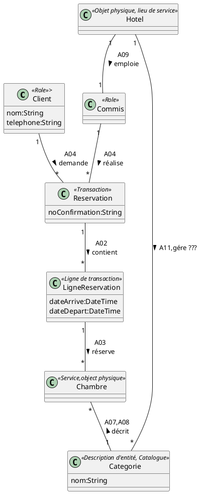
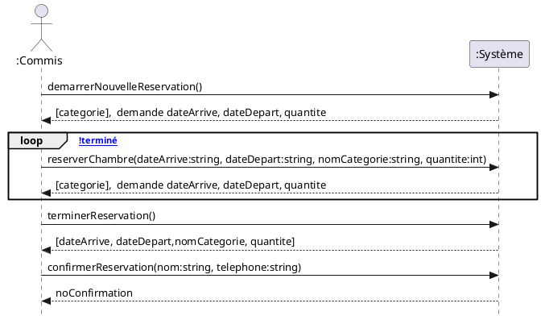
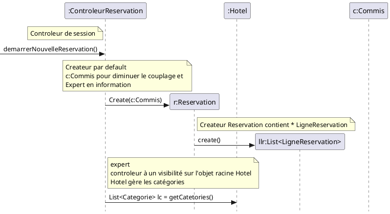
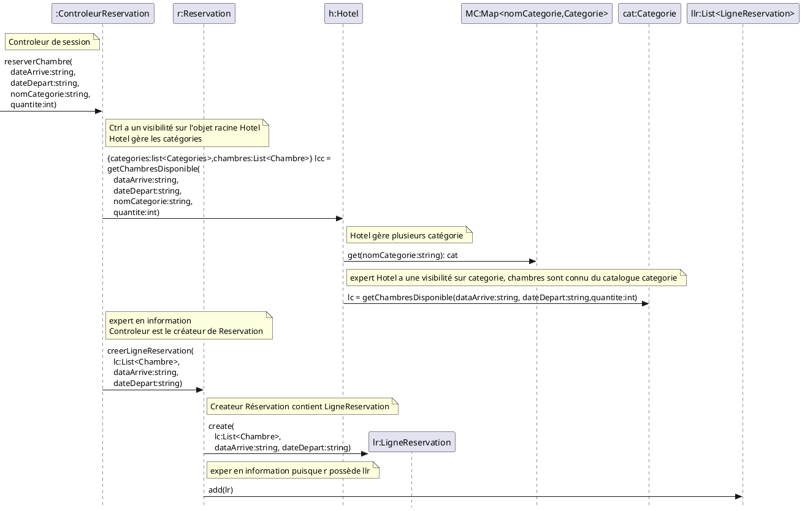
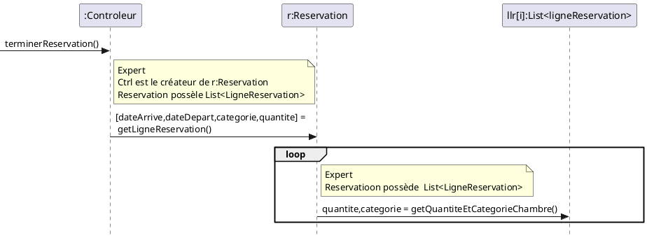
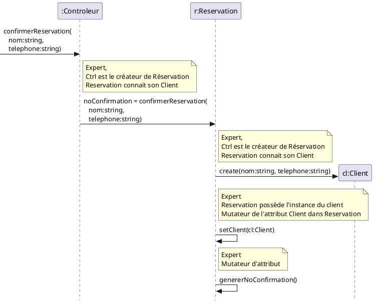

# Système de réservation de chambre d'hotel

1. Un client appelle à l'hôtel pour placer une réservation.
1. Le commis démarre une nouvelle réservation.
1. Le commis saisit la date d'arrivée; la date de départ; le nom de la catégorie de chambre; la quantité de chambres.
1. Le système inscrit les informations à la réservation.

Les étapes 3 et 4 sont répétées tant que le client n'indique pas qu'il a terminé{align="left"}

5. Le commis termine la réservation.
1. Le système affiche toutes les informations entrées.
1. Le commis valide les informations auprès du client et confirme la réservation à l'aide du nom et du numéro de téléphone du client.
1. Le système enregistre la réservation et affiche le numéro de confirmation.
1. Le commis communique le numéro de confirmation au client.

# MDD

# DSS

# Contrat

## demarrerNouvelleReservation()
- Précondition:
  - c:Commis est authentifié
- Postconditions:
  - Une instance r:Reservation a été créée
  - Une association a été créée entre r:Reservation et c:Commis

## reserverChambre(dateArrive:string, dateDepart:string, nomCategorie:string, quantite:int)
PostConditions:
- Une instance lr:LigneReservation a été créée
- lr.dateArrive est devenu dateArrive
- lr.dateDepart est devenu dateDepart
- quantite d'associations ont été créées entre lr:LigneReservation et Chambre sur la base de correspondance avec Categorie.nom == nomCategorie
- Une association a été créée entre r:Reservation et lr:LigneReservation

## terminerReservation()
AUCUNE postCondition

## confirmerReservation(nom:string, telephone:string)
- Une instance cl:Client a été créée
- cl.nom est devenu nom
- cl.telephone est devenu telephone
- r.noConfirmation est devenu numero unique

# RDCU's

## demarrerNouvelleReservation()

- Précondition:
  - c:Commis est authentifié
- Postconditions:
  - Une instance r:Reservation a été créée
  - Une association a été créée entre r:Reservation et c:Commis

## reserverChambre(dateArrive:string, dateDepart:string, nomCategorie:string, quantite:int)

PostConditions:
- Une instance lr:LigneReservation a été créée
- lr.dateArrive est devenu dateArrive
- lr.dateDepart est devenu dateDepart
- quantite d'associations ont été créées entre lr:LigneReservation et Chambre sur la base de correspondance avec Categorie.nom == nomCategorie
- Une association a été créée entre r:Reservation et lr:LigneReservation

## terminerReservation()

AUCUNE postCondition

## confirmerReservation(nom:string, telephone:string)

- Une instance cl:Client a été créée
- cl.nom est devenu nom
- cl.telephone est devenu telephone
- r.noConfirmation est devenu numero unique

