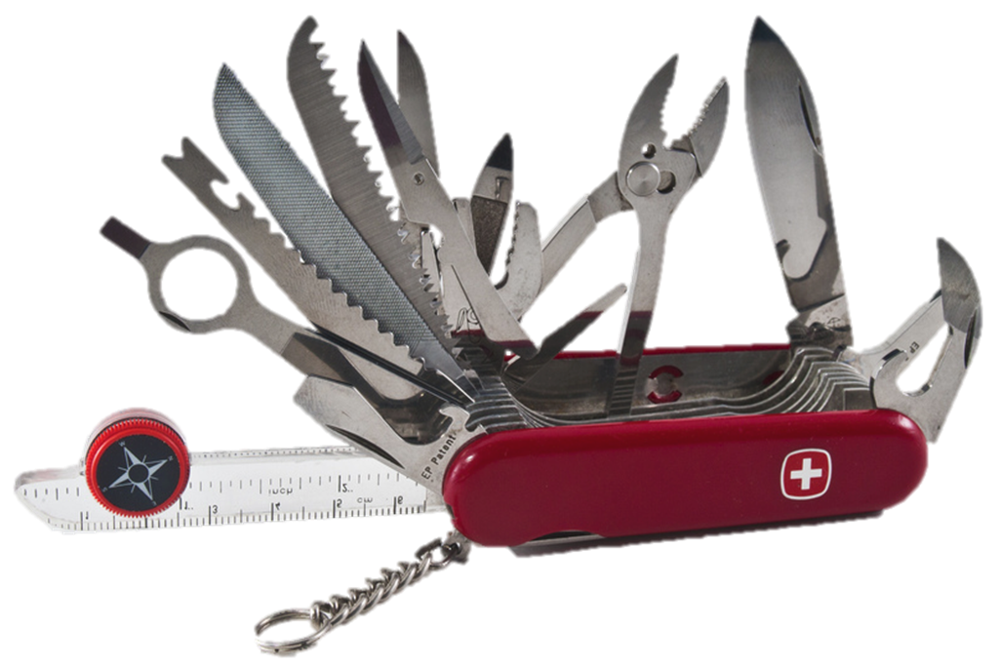

---

history: true
progress: true
controls: true
controlsTutorial: false
controlsBackArrows: faded
center: false
theme : beige
transition: none
transitionSpeed: fast
highlightTheme: "github"
logoImg: assets/logo_ets.svg
slideNumber: true
title: 'LOG210-seance-05'
margin: 0
minScale: 1
maxScale: 1
viewDistance: 3
display: block
navigationMode: 'linear'
notesSeparator: "Note:"
customTheme : "slide_themes"
chalkboard: false

---

<!-- ```Typescript
let x = 5
```

-- -->

# LOG210 Analyse et conception de logiciels: Séance 05

--

<!-- https://www.fastemoji.com/Search/?order=newest&q=bureaucrat -->
## ┌(▀Ĺ̯ ▀-͠ )┐

1. Une itération du lab 1
2. Se connecter à Socrative  
{width=35 .plain}tiny.cc/quizdesign $\rightarrow$ ETSDESIGN

--

## Schéma des outils

{.plain}

---

## Plan général des séances

{.plain}

--

# Survol

- Travail en équipe
- Rappel méthodologie
- Rétroaction mini-test
- Retour Exercices
- TDD
- RDCU: Faible couplage/Forte Cohésion

---

<!-- .slide: class="equipeslide center" -->
# Culture d'équipe

## Développement de logiciel

--

<!-- .slide: class="equipeslide center" -->

## Culture d'équipe

{.plain width=80%}

--

<!-- .slide: class="equipeslide center" -->
# Qu'est-ce qu'une culture d'équipe?

- Ensemble de valeurs, d'objectifs, d'expériences
- Unique à chaque équipe

--

<!-- .slide: class="equipeslide center" -->
# Éléments techniques

- Revues de code
- Développement piloté par les tests
- Documentation de la conception
- etc.

--

<!-- .slide: class="equipeslide center" -->
# Éléments sociaux

- Sushi à midi
- 5 à 7 le vendredi
- etc.

--

<!-- .slide: class="equipeslide center" -->
## Qu'est-ce qu'une culture d'équipe?

- Qu'elle soit bonne ou mauvaise, la culture existera
- Le/La leader ne décide pas la culture; il/elle s'en occupe.

--

<!-- .slide: class="equipeslide center" -->
## Culture forte d'équipe

- Ouverte au changement qui l'améliore
- Résistante à un changement radical qui lui fait mal

--

<!-- .slide: class="equipeslide center" -->
## Culture forte d'équipe

- Celle qui concentre l'effort sur **la livraison de logiciel génial** est la mieux réussite.
- Efforts pour souder une équipe ne mènent pas toujours à la productivité:
  - faire la fête, surenchère de programmation, faire des rencontres

--

<!-- .slide: class="equipeslide" -->
## Une culture s'auto-sélectionne

<style>
.container{
    display: flex;
}
.col{
    flex: 1;
}
</style>

<div class="container">
<div style="flex:1.">

{.plain width=200}  

</div>

<div class="col">
Ne faire que du hacking cowboy, initiation (bizutage), dérapages verbaux, agressivité
</div>
</div>

<div class="container">
<div style="flex:1.">

{.plain width=200}

</div>

<div class="col">
Écrire des tests, réviser le design/le code, valoriser l'inclusivité
</div>
</div>

<!-- - Code propre et facile à maintenir attirera des développeurs appréciant ces valeurs…
- Agressivité, bizutage, dérapages verbaux, etc. attirera des développeurs appréciant ces valeurs… -->

--

<!-- .slide: class="equipeslide center" -->
## Cas de Basecamp (2021)

[Basecamp proscrit les discussions politiques au sein de l'entreprise et 1/3 des employés démissionnent.](https://www.valeursactuelles.com/clubvaleurs/societe/le-geant-de-la-technologie-basecamp-proscrit-les-discussions-politiques-au-sein-de-lentreprise/)

--

<!-- .slide: class="equipeslide center" -->
### Éléments pour les cultures d'équipe réussites

::: block {style=font-size:0.8em}

- Énoncé de mission d'équipe
- Culture de HRC
- Favorise une participation des coéquipiers extrovertis et introvertis
- team.égo > coéquipier[i].égo
- La critique constructive
- Bonne communication
- Moyens de communication diversifiés (Slack, courriel, etc.)
- Documentation de design
- Communication synchrone (rencontres) vs asynchrone (courriel)

:::

--

<!-- .slide: class="equipeslide center" -->
### Comportements menaçant une bonne culture

- Ne pas respecter le temps des autres
- Ne pas respecter une décision prise par l'équipe
- Ne pas écouter ou respecter les autres
- Ne pas faire de compromis
- Être perfectionniste
- Être provocateur (troll) / Répondre aux provocateurs (trolls)
- Devenir trop affectif

*L'attention et la concentration sont primordiales.*

--

<!-- .slide: class="equipeslide center" -->
### Comment agir face à ces comportements

::: block {style=font-size:0.85em}

- Chercher des faits dans le drame
- Si quelqu'un se plaint, même avec trop d'émotion, lui donner le bénéfice du doute et chercher les causes (malgré le manque de respect, etc.)
- Amener la discussion sur un plan technique si possible.
- Souvent il y a des choses à améliorer dans la situation.
- La gentillesse peut chasser les trolls en fin de compte…

{.plain width=100px}

--

<!-- .slide: class="equipeslide center" -->
### Comment agir face à ces comportements

::: block {style=font-size:0.85em}

- Se concentrer sur l'objectif à long terme
- Un témoin de comportement délétère se demande:
  - Malgré la perte de concentration de l'équipe à court terme, une résolution du drame sera-t-elle bénéfique à l'équipe à long terme?
  - Est-ce que la situation se résoudra d'elle-même?
- Si la réponse est «&nbsp;non&nbsp;» à une de ces questions, mettre fin au comportement immédiatement (sans résolution).
:::
{.plain width=25%}

--

<!-- .slide: class="equipeslide center" -->
### Comment agir face à ces comportements

- Savoir quand abandonner
- Parfois le comportement d'un coéquipier ne s'améliore pas malgré beaucoup d'efforts. Il faut dans ce cas l'isoler de l'équipe.

> Avant de demander un changement d'équipe, il faudra avoir essayé une approche HRC et être en mesure de l'expliquer à l'enseignant.

--

<!-- .slide: class="equipeslide center" -->
## Culture d'équipe

- La plupart des gens ne sont pas des imbéciles!
- Cependant, il est naïf de penser aux gens comme «&nbsp;**bons**&nbsp;» ou «&nbsp;**mauvais**&nbsp;».
- La malice qui menace une bonne culture d'équipe est souvent expliquée par **l'ignorance**, **le besoin d'être reconnu**, ou **un manque d'empathie**
- Il faut toujours être tolérant *envers les gens*, mais *ne pas tolérer les comportements* qui nuisent à une bonne culture d'équipe (selon la norme HRC).

---

<!-- .slide: class="methodologieslide center" -->
# Méthodologie

--

<!-- .slide: class="methodologieslide center" -->

::: block {style="align-items:center"}
{.plain width=75%}
:::

Note:
On dessine MDD, DSS, Contrat, RDCU sur cette image...

---

<!-- .slide: class="retroquizslide center" -->
# Rétroaction
# mini-test

--

<!-- .slide: class="retroquizslide center" -->
# Questions difficiles 😕

Selon les statistiques de la première tentative.

--

<!-- .slide: class="typescriptslide" -->
{width=35 .plain}tiny.cc/quizdesign $\rightarrow$ ETSDESIGN  
Qu'affiche le programme suivant?

::: block {.dynamic-width-code style="font-size:1.2em"}
```TypeScript
let maMap = new Map<number, string>();
maMap.set(77,'Poisson');
maMap.set(22,'Citron');
console.log(maMap.get(77));
console.log(maMap.has(22));
```
:::

::: block {.socrative}

1. true / Citron
2. Poisson / Citron
3. Poisson / undefined
4. Poisson / true

:::

Tableau associatif {.fragment .current-only data-code-focus=2-3}

`get` vs `has` {.fragment .current-only data-code-focus=4-6}

--

<!-- .slide: class="typescriptslide center" -->
{width=35 .plain}tiny.cc/quizdesign $\rightarrow$ ETSDESIGN  
Quelle est la valeur de retour de  
`typeof(new Voiture())`?

::: block {.socrative}
1. `"Voiture"`
2. `Voiture`
3. `"object"`

:::

--

<!-- .slide: class="typescriptslide" -->
{width=35 .plain}tiny.cc/quizdesign $\rightarrow$ ETSDESIGN  
Complétez le programme suivant pour qu'il produise le message `[ 67, 46, 14, 6 ]`:

::: block {.dynamic-width-code style="font-size:1.5em"}

```TypeScript
const valeurs = [65, 44, 12, 4];
console.log(valeurs.map( __________ ));
```

:::

::: block {.socrative}

1. `v => v + 2`
1. `v + 2`
1. `v => v - 2`
1. `v - 2`

:::

Voir [cet exemple](https://github.com/profcfuhrmanets/exemples-ts/blob/master/src/array_map_arrow.ts).{.fragment .current-only}

--

<!-- .slide: class="equipeslide center" -->
{width=35 .plain}tiny.cc/quizdesign $\rightarrow$ ETSDESIGN  
Qu'est-ce que le **facteur de bus**?

::: block {.socrative}

1. nombre de coéquipiers travaillant sur les tâches différentes
2. degré de redondance des compétences
3. probabilité de perdre un coéquipier

:::

--

<!-- .slide: class="graspslide center" -->
Q: Deux classes différentes pourraient créer (selon Créateur). Quel(s) principe(s) GRASP existe(nt) pour vous aider à décider laquelle est la *meilleure* des classes pour avoir cette responsabilité? (18 tentatives)
| Réponse | Crédit | Compte | Fréquence |
| --------------------- | -------: | --: | ------: |
| **Expert**{style="color:red"} | -50.00% | **8**{style="color:red"}  | 44.44% |
| Faible Couplage       | 50.00%  | 6  | 33.33% |
| Forte Cohésion        | 50.00%  | 14 | 77.78% |
| Contrôleur            | -50.00% | 2  | 11.11% |

--

<!-- .slide: class="graspslide center" -->
## «Évaluation»

- Faible couplage (évaluation)
- Forte cohésion (évaluation)

> On applique ces principes *après* un autre principe, pour évaluer s'il y a plusieurs choix de conception.

--

<!-- .slide: class="graspslide center" -->
## Qui crée un Paiement?

Selon GRASP Créateur:
1. un Registre «&nbsp;enregistre&nbsp;» un Paiement, alors **Registre** crée
2. une Vente «&nbsp;utilise étroitement&nbsp;» un Paiement, alors **Vente** crée

Comment décider? On évalue les deux possibilités sur le plan du couplage.

--

<!-- .slide: class="graspslide center" -->
{.plain}

{.plain}

Note: exercice - faire un diagramme de classe pour chaque solution pour évaluer

--

<!-- .slide: class="graspslide center" -->
## Le vrai problème du couplage

Ce n'est pas le couplage fort en tant que tel. C'est **le couplage fort vers les choses instables**:

- une classe dont sont API risque de changer
- les classes de la couche de présentation (vues, le patron Observeur résout ce problème)
- un module externe hors de notre contrôle (npm est un bel exemple)

---

<!-- .slide: class="contratslide center" -->
# Retour exercices 
- Contrats
- Flots et visibilité
- RDCU

--

<!-- .slide: class="contratslide center" -->
# Contrats - approche

1. Contrat pour chaque opération système
2. Regarder toujours le MDD
3. Rappeler les formes de postconditions
   1. créer/supprimer instance
   2. former/briser association
   3. modifier attributs
4. Ne rien oublier (marquer le MDD, faire un diagram d'objets)

---

<!-- .slide: class="tddslide center" -->
# TDD 
**Test-driven development**  
Développement piloté par les tests

(Notes de cours)

---

<!-- .slide: class="rdcuslide center" id='rdcu' -->
# RDCU
## Réalisation d'un cas d'utilisation

--

<!-- .slide: class="rdcuslide center" -->
## RDCU

Prendre les bonnes décisions pour une solution facile à comprendre et modulaire... {align=left}

{width="65%" .plain}

--

<!-- .slide: class="rdcuslide center" -->
## Décalage des représentations

Facile? Les classes logicielles devraient ressembler à des classes conceptuelles (concepts du monde réel).

{.plain width="50%"}

Qui fait quoi? Qui a quelle responsabilité?

--

<!-- .slide: class="rdcuslide center" -->
# RDCU

Approche: conception orientée-responsabilités

## GRASP

**G**eneral **R**esponsability **A**ssignment **S**oftware **P**atterns

Pour décider où mettre les méthodes...

--

<!-- .slide: class="rdcuslide center" -->
## GRASP

- Contrôleur (séparation des couches){style="color:green"}
- Créateur{style="color:green"}
- Expert en information{style="color:green"}
- **Faible couplage**
- **Forte cohésion**
- Polymorphisme{style="color:gray"}
- Indirection{style="color:gray"}
- Protection de variation{style="color:gray"}
- Fabrication pure{style="color:gray"}

--

<!-- .slide: class="rdcuslide center" -->
#### RDCU (Survol)

{.plain width=50%}

Note: expliquer encore le contexte de la RDCU

--

<!-- .slide: class="graspslide center" -->
# Faible couplage
Déjà vu avec le retour sur le quiz

--

<!-- .slide: class="graspslide center" -->
# Forte cohésion

--

## Qu'est-ce que la Cohésion
<!-- .slide: class="graspslide center" -->
{width=35 .plain}tiny.cc/quizdesign $\rightarrow$ ETSDESIGN

Vrai ou Faux?

{.plain width=25% style="vertical-align:middle"} a plus de cohésion que {.plain width=30% style="vertical-align:middle"}

--

## Considérer la cohésion

<!-- .slide: class="graspslide center" -->
{.plain}

{.plain}

--

<!-- .slide: class="graspslide center" -->
# Résumé GRASP

- Faible couplage (évaluation)
- Forte cohésion (évaluation)

---

# Exercice
- TP#5 RDCU
- [Liens vers exercices](https://github.com/yvanross/LOG210-exercices)

<!-- .slide: class='feedbackslide center' -->
# Feuille d'une minute

SVP m'écrire un courriel pour dire ce qu'étaient les points les moins clairs de la séance.
