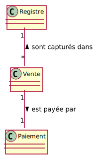
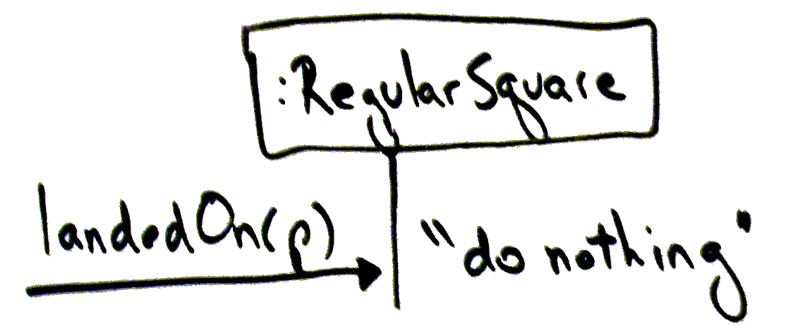
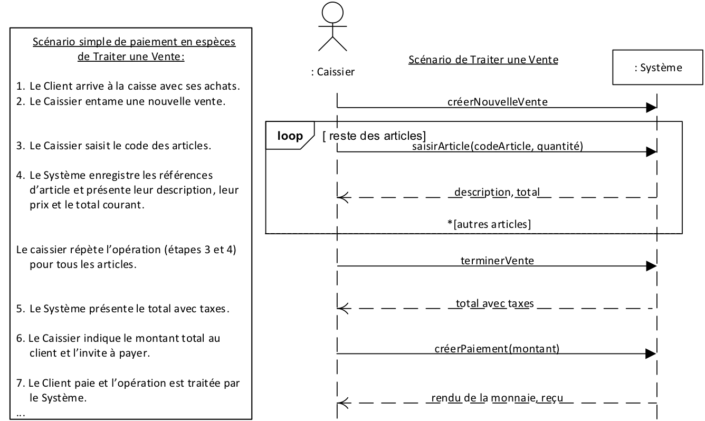
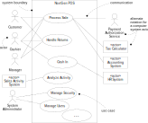

---

history: true
progress: true
controls: true
controlsTutorial: false
controlsBackArrows: faded
center: false
theme : beige
transition: none
transitionSpeed: fast
highlightTheme: "github"
logoImg: assets/logo_ets.svg
slideNumber: true
title: 'LOG210-seance-06'
margin: 0
minScale: 1
maxScale: 1
viewDistance: 3
display: block
navigationMode: 'linear'
notesSeparator: "Note:"
customTheme : "slide_themes"
chalkboard: false

---

# LOG210 Analyse et conception de logiciels: Séance 06

--

<!-- https://www.fastemoji.com/Search/?order=newest&q=bureaucrat -->
## ┌(▀Ĺ̯ ▀-͠ )┐

1. Se connecter à Socrative  
{width=35 .plain}tiny.cc/quizdesign $\rightarrow$ ETSDESIGN
^
--

## Schéma des outils

{.plain}

--

## Plan général des séances

{.plain}

---

# Survol

- Travail en équipe - rencontres efficaces
- Rappel méthodologie
- Rétroaction mini-test
- Retour Exercice TP5 TDD
- GRASP Polymorphisme F22.1/A25.1
- GRASP Fabrication Pure F22.2/A25.2
- Patron Transformer ID en objets (ndc 9.4)
- Patron Faire soi-même (ndc 9.8)

---

<!-- .slide: class="equipeslide center" -->
# Travail en équipe

## Développement de logiciels

--

<!-- .slide: class="equipeslide center" -->

## Rencontres efficaces

1. N'inviter que celles et ceux qui doivent absolument être présent.e.s
2. Préparer et distribuer l'ordre du jour *bien avant* que ça commence
3. Terminer tôt si les objectifs ont été atteints
4. Respecter l'ordre du jour
5. Planifier la rencontre autour des pauses habituelles (p.ex., à midi, à la fin de la journée)

[TeamGeek]

---

<!-- .slide: class="methodologieslide center" -->
# Méthodologie

--

<!-- .slide: class="methodologieslide center" -->

::: block {style="align-items:center"}
{.plain width=75%}
:::

Note:
On dessine MDD, DSS, Contrat, RDCU sur cette image...

---

<!-- .slide: class="retroquizslide center" -->
# Rétroaction
# mini-test

--

<!-- .slide: class="retroquizslide center" -->
# Questions difficiles 😕

Selon les statistiques de la première tentative.

--

<!-- .slide: class="graspslide center" -->
Q: Quel principe GRASP permet de gérer des alternatives (`if-then-else` ou `case`) qui dépendent des types? (4 tentatives)

| Model response            | Partial credit |Count |Frequency            |
| :------------------------- | -------: | -: | ------: |
| Polymorphisme             | 100.00% | 2 | 50.00% |
| Indirection               | 0.00%   | 0 | 0.00%  |
| Fabrication Pure          | 0.00%   | 0 | 0.00%  |
| **Protection des variations**{style="color:red} | 0.00%   | **2**{style="color:red} | 50.00% |

---

<!-- .slide: class="contratslide center" -->
# Retour exercice TP#5

TDD

---

<!-- .slide: class="rdcuslide center" -->
# Rappel: Diagrammes de séquence

--

<!-- .slide: class="rdcuslide center" -->
{width=35 .plain}tiny.cc/quizdesign $\rightarrow$ ETSDESIGN

Quel(s) est(sont) le(s) problème(s)  
de **flot de contrôle** avec le diagramme suivant?

{.plain}

Note: C'est C. Le flot ne peut pas passer de Base ou de Avion à Camion, sans message intermédiaire.

--

<!-- .slide: class="rdcuslide center" -->
{width=35 .plain}tiny.cc/quizdesign $\rightarrow$ ETSDESIGN

Selon le diagramme suivant, qui voit *e* ?

{.plain}

::: block {.socrative}
1. :Avion
1. :Base
1. :Camion
1. :Dragon
1. (tous)
:::

---

<!-- .slide: class="rdcuslide center" -->
## GRASP

- Contrôleur (séparation des couches){style="color:green"}
- Créateur{style="color:green"}
- Expert en information{style="color:green"}
- Faible couplage (révision) {style="color:red"}
- Forte cohésion (révision) {style="color:red"}
- **Polymorphisme**
- **Fabrication pure**
- Indirection{style="color:gray"}
- Protection de variation{style="color:gray"}

--

<!-- .slide: class="rdcuslide center" -->
#### RDCU (Survol)

{.plain width=50%}

Note: expliquer encore le contexte de la RDCU, ou vas t'on retrouvé le polymorphisme et la fabrication pure

--

### Faible couplage
<!-- .slide: class="graspslide center" -->
La solution est dans le MDD{.fragment .shade-up}

{.plain}

{.plain}

{.plain .fragment .shade-up}

Note: 2 animations

--

## Forte cohésion
<!-- .slide: class="graspslide center" -->

{.plain width=25% style="vertical-align:middle"} a plus de cohésion que {.plain width=30% style="vertical-align:middle"}

--

<!-- .slide: class="graspslide center" -->
## «Évaluation»

- Faible couplage (évaluation)
- Forte cohésion (évaluation)

> On applique ces principes *après* un autre principe, pour évaluer s'il y a plusieurs choix de conception.

--

<!-- .slide: class="graspslide center" -->
# Polymorphisme

- Exemples du livre
  - Calculateurs de taxe externes (`getTaxes()`)
  - Types de case Monopoly (`atterrirSur()`)

--

<!-- .slide: class="rdcuslide"  -->

## Polymorphisme

{.plain width=65%}

Fig. 25.1 (3e édition)

--

<!-- .slide: class="rdcuslide"  -->

## Polymorphisme

{.plain}

Fig. 25.2 (3e édition)

--

<!-- .slide: class="rdcuslide"  -->

## Polymorphisme
{.plain width=80%}

Fig. 25.3 (3e édition)

--

<!-- .slide: class="rdcuslide"  -->

## Polymorphisme
Fig. 25.4, 25.5, 25.7 (3e édition)

{width=30%}{.plain} &nbsp;&nbsp;&nbsp;&nbsp;&nbsp;&nbsp;{width=30%}{.plain}

{.plain}{width=50%}

--

<!-- .slide: class="graspslide center" -->
# Polymorphisme $=$ réusinage

"[Replace conditional with polymorphism](https://www.refactoring.com/catalog/replaceConditionalWithPolymorphism.html)"

---

<!-- .slide: id="FabricationPure" class="rdcuslide"  -->

## Fabrication pure
- Parfois en suivant un patron
    - assigne une responsabilité
    - mais il y a des conséquences non désirables
        - augmentation du couplage
        - diminution de la cohésion
- Solution
    - fabrique une classe «&nbsp;comportementale&nbsp;»
    - qui n'a pas d'équivalent dans le modèle du domaine
    - invention de la part du concepteur

Note: Donc classe visible uniquement dans le diagramme de classe logiciel

--

<!-- .slide: class="graspslide center" -->
# Fabrication Pure

- Exemples du livre
  - StockagePersistant (s'occupe des responsabilités pour stocker des objets)
  <!-- - "Cornet" entre Joueur et Dé (réutilisable dans d'autres jeux) -->

Note: le StockagePersistant marche pour les "flat files" aussi (JSON) sans utiliser une BD

--

<!-- .slide: class="graspslide center" -->
# Fabrication Pure

Exemple: Choix no. 2 dans GRASP Contrôleur *(contrôleur de session* ou de cas d'utilisation) est une Fabrication Pure.

--

<!-- .slide: class="rdcuslide"  -->

## Fabrication pure
{.plain}

Fig. 25.8 (3e édition)

--

<!-- .slide: class="rdcuslide"  -->

## Fabrication pure
{.plain width=80%}

Fig. 25.9 (3e édition)

--

<!-- .slide: class="graspslide center" -->
### Contrôleur surchargé de responsabilités

{style=border:none}{width=60%}

"Traiter vente" nécessite des opérations systèmes envoyées à Registre (équipement, GRASP Contrôleur)

--

<!-- .slide: class="graspslide center" -->
### Registre "explose" de responsabilités

Tous les cas d'utilisation qui se déroulent sur la caisse (Registre) $\rightarrow$ situation désespérée 😩

{style=border:none}{width=50%}

--

<!-- .slide: class="graspslide center" -->
## Solution : Fabrication pure

{.plain}

--

<!-- .slide: class="graspslide center" -->
# Fabrication Pure $=$ réusinage

[Extract (methods) to Class](https://refactoring.com/catalog/extractClass.html)

--

<!-- .slide: class="graspslide center" -->
## Forces parfois opposées

1. Principe: Réduire l'écart des représentations  
2. Principe: Faible couplage et Forte cohésion

Fabrication Pure $\rightarrow$ `GestionnaireVentes`  
Représentation facile à comprendre? 🤔

Peut-on "équilibrer" ces forces?

- Fabrication Pure va à l'encontre du principe de réduire l'écart des représentations {.fragment .shade-up}
  - une FP n'est pas traçable au "domaine" {.fragment .shade-up}

Note: 2 animations. Plus difficile à comprendre puisque le nouveau contrôleur ne correspond pas à un objet du domaine.

--

<!-- .slide: class="graspslide center" -->
## Patterns GOF et Fabrication Pure

### Visitor, Moderator, Observer, etc.

- Abstractions (classes ou types interface) ayant un ensemble cohésif de responsabilités.
- Augmentent l'écart des représentations:
  - Solutions au problèmes de design (plutôt que du domaine).
  - Complexité circonstancielle (accidentelle).

## ⚠️

--

<!-- .slide: class="graspslide center" -->
## Résumé GRASP

- Forte cohésion (évaluation)
- Faible couplage (évaluation)
- Polymorphisme
- Fabrication Pure

---

## Autre patron de conception
- Patron Transformer ID en objets (ndc 9.4)
- Patron Faire soi-même (ndc 9.8)

---

## TDD, réusinage et dette technique

Faire un exemple de réusinage de la classe photo.ts dans typescript-tdd-kata

---

# Exercices
- TP6 polymorphisme
- TP6 RDCU Bibliotheque

- Exercices supplémentaires
  - https://github.com/yvanross/LOG210-exercices

---

<!-- .slide: class='feedbackslide center' -->
# Feuille d'une minute

SVP m'écrire un message discord pour dire ce qu'étaient les points les moins clairs de la séance.
