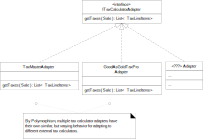
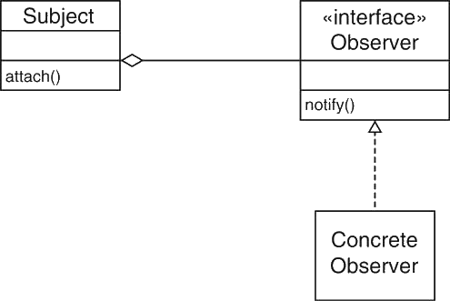
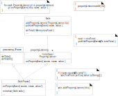

---

history: true
progress: true
controls: true
controlsTutorial: true
controlsBackArrows: faded
center: false
theme : beige
transition: none
transitionSpeed: fast
highlightTheme: monokai
logoImg: assets/logo_ets.svg
slideNumber: true
title: 'LOG210-seance-07'
margin: 0
minScale: 1
maxScale: 1à
rtl: false
viewDistance: 3
display: block
navigationMode: 'linear'
height: 50%
width: 100%
autoPlayMedia: true
notesSeparator: "Note:"
customTheme : "slide_themes"
date: '`r format(Sys.time(), "%d %B, %Y")`'

---

# LOG210 Analyse et conception de logiciels: Séance 07

--

<!-- https://www.fastemoji.com/Search/?order=newest&q=bureaucrat -->
## ┌(▀Ĺ̯ ▀-͠ )┐

1. Se connecter à Socrative  
{width=35 .plain}tiny.cc/quizdesign $\rightarrow$ ETSDESIGN

--

## Schéma des outils

{.plain}

--

## Plan général des séances

{.plain}

---

# Survol

- Travail en équipe
- Rappel méthodologie
- Rétroaction mini-test
- Retour Exercice RDCU
  - Révision des RDCU labos
- GRASP Indirection F22.3/A25.3
- GRASP Protection des variations F22.4/A25.4
- Révision GoF Observer (diapos de LOG121)

---

<!-- .slide: class="equipeslide center" -->
# Travail en équipe

## Développement de logiciels

--

<!-- .slide: class="equipeslide center" -->

## Travail d'équipe

- Quels sont les problèmes HRC rencontrés par votre équipe?
- Quelles solutions avez-vous apportées?

---

<!-- .slide: class="methodologieslide center" -->
# Méthodologie

--

<!-- .slide: class="methodologieslide center" -->


<div class="container">
<div class="col">

{.plain width=150%}

</div>
<div class="col">

::: block {style="align-items:center", font-size:0.5em}
- Controleur
- Expert{.fragment .shade-up} 
- Createur{.fragment .shade-up} 
- Forte cohesion{.fragment .shade-up} 
- Faible couplage{.fragment .shade-up} 
- Polymorphisme{.fragment .shade-up} 
- Fabrication pure{.fragment .shade-up} 
- Indirection{.fragment .shade-up style="color:gray"} 
- Protection de variations{.fragment .shade-up style="color:gray"} 

:::

</div>
</div>

Note:On dessine MDD, DSS, Contrat, RDCU sur cette image...

---

<!-- .slide: class="retroquizslide center" -->
# Rétroaction<br>mini-test

--

<!-- .slide: class="retroquizslide center" -->
# Questions difficiles 😕

Selon les statistiques de la première tentative.


--

## Contrôleur de façade vs<br>Contrôleur de session

"){.plain}

---

<!-- .slide: class="rdcuslide center" -->
# Retour exercice RDCU

Google drive tp#6
- <a onclick="window.open('https://github.com/yvanross/LOG210-exercices/blob/master/ACOO/Reserver-livre-bibliotheque-solution.md','_blank')">Solution - RDCU réserver livre bibliotheque</a>


--

### Retour RDCU laboratoire
- Voir seance-07-G01-Revue-rapport.pdf
- Voir seance-07-G02-Revue-rapport.pdf
- Voir seance-07-G03-Revue-rapport.pdf

<!-- #### Équipe jaune -->
<!-- .slide: class="rdcuslide center" -->
<!-- {.plain width=90%} -->

<!-- Note: 1) SgaContrôleur n'est pas un objet racine. Ce n'est pas non plus un GestionnaireCourse. Conséquence: SgaController n'est pas très cohésif. Ça contient beaucoup de méthodes 2) Appliquer Contrôleur de session, une classe par CU. 3) Créateur est mal appliqué? Qui est le meilleur créateur de Course? -->

--

<!-- .slide: class='graspslide center' -->
# Diagramme de classe

Généré avec [tplant](https://github.com/bafolts/tplant)  

```bash
tplant -i src/App.ts -o src/App.puml
```

---

<!-- .slide: class="rdcuslide center" id='rdcu' -->
## GRASP

- Contrôleur (séparation des couches){style="color:green"}
- Créateur{style="color:green"}
- Expert en information{style="color:green"}
- Faible couplage{style="color:green"}
- Forte cohésion{style="color:green"}
- Polymorphisme{style="color:green"}
- Fabrication pure{style="color:green"}
- **Indirection**
- **Protection de variation**

--

<!-- .slide: class='graspslide center' -->
# Indirection 

Définition du livre (ndc 14.3.3)  

Exemples:{align=left}
- AdaptateurCalculateurTaxes

--

<!-- .slide: class='graspslide center' -->
# Indirection 

{.plain width=65%}

Fig. 25.1 (3e édition)

--

<!-- .slide: class='graspslide center' -->
# Indirection 
{.plain width=100%}

Fig. 25.1 (3e édition)


--

<!-- .slide: class='graspslide center' -->
{width=35 .plain}tiny.cc/quizdesign $\rightarrow$ ETSDESIGN  
Qu'est-ce qui est faux dans le problème de design des calculateurs de taxes?
::: block {.socrative}
1. On ne peut changer l'API des calculateurs de taxes.
2. On ne veut pas que le "core" de NextGenPOS soit couplé aux API différentes des calculateurs.
3. Pour intégrer un nouveau calculateur de taxes, on n'à qu'à écrire son adaptateur.
4. Chaque adaptateur a une API différente pour fonctionner avec son calculateur externe.
5. Aucune de ces réponses.
:::

Note: 4 est la bonne réponse - les adaptateurs ont tous la même API, p. ex., une méthode polymorphe `getTaxes()`

--

<!-- .slide: class='graspslide center' -->
# Indirection

D'autres exemples:
- Contrôleur de cas d'utilisation (de session) est une indirection qui 
  - «&nbsp;découple les objets pour maintenir le potentiel de réutilisation.&nbsp;»
  - une application du patron GoF «&nbsp;Façade&nbsp;»

https://log210-cfuhrman.github.io/log210-valider-architecture-couches/#/0/2

--

<!-- .slide: class='gofslide center' -->
## Patron GOF -> Indirection
- Adaptateur
- Proxy
- Broker
- Mediateur
- Facade
- Observateur

--

<!-- .slide: class='graspslide center' -->
# Protection des variations

Définition du livre (ncd: 14.3.4)  
Exemples:
- Problème du calculateur de taxes
  - Solution: Adaptateur avec `getTaxes` polymorphe

--

<!-- .slide: class='graspslide center' -->
## Protection des variations
{.plain}


--


<!-- .slide: class='graspslide center' -->
## D'autres exemples de PV
:::block {style="font-size:0.7em"}
- Conceptions pilotées par les données
  - `tsconfig.json` permet de configurer le générateur de Javascript selon beaucoup de variations
- Une machine virtuelle (JVM)
  - programme en "bytecode" qui peut exécuter sur plusieurs plateformes (qui varient)
- Langages standard:
  - Requêtes SQL qui fonctionnent sur plusieurs BD
- Le polymorphisme
- Language et interpréteurs à base de règles
- La réflectivité
- Les métadonnées
:::

--

# ⚠️ PV spéculatif

Deux types de points de changement:

- **Points de variations**: spécifiés **explicitement** dans les besoins (cahier des charges)
- **Points d'évolution**: points de variation «&nbsp;spéculatifs&nbsp;» **absents des besoins existants**

Principe YAGNI: «&nbsp;**Y**ou **A**in't **G**onna **N**eed **I**t&nbsp;»  
Il vaut mieux ne pas spéculer.

---

<!-- .slide: class='gofslide center' -->
## Révision Observateur
[Diapos LOG121](https://fuhrmanator.github.io/oodp-horstmann/htm/Ch5/Ch5_fr.html#:~:text=Contr%C3%B4leur-,Patron%20Observateur,qui%20leur%20int%C3%A9resse,-Un)

--

<!-- .slide: class='gofslide center' -->
## Révision Observateur
{.plain}


--


<!-- .slide: class='gofslide center' -->
#### Observateur Fig.A26.22/F23.22 et Indirection

«&nbsp;Comment affecter les responsabilités pour éviter le couplage direct?&nbsp;»

{.plain width=55%}

Note: Séparation des couches, Sale devrait être découplée de SaleFrame1 puisque cette dernière n'est pas stable.

--

<!-- .slide: class='gofslide center' -->
#### Observateur Fig.A26.22/F23.22 et PV

::: block {style="font-size:0.8em"}
«&nbsp;Comment affecter les responsabilités aux objets, sous-systèmes et systèmes de sorte que
les variations ou l'instabilité de ces éléments n'aient pas d'impact négatif sur les autres?&nbsp;»
:::

{.plain width=50%}

Note: Ce sont les classes de la GUI qui sont instables et on veut protéger les classes du domaine des changements. C'est l'interface Observable qui est le point de stabilité, avec appels polymorphes.

---


<!-- .slide: class="evalslide"  -->
## Exercice 07
- <a onclick="window.open('https://docs.google.com/document/d/1VDBvVnWx3nCSzTv2vrOzfSTI7I2goLgC9_zDWgrGqC0/edit?usp=sharing">TP7 - RDCU Inscription cours</a>
- Coaching - architecture en couche
- Coaching - rapport de laboratoire


:::block {style=font-size:0.5em}
[whiteboard](#whiteboard) | [Supplément au cours en HTML](https://cc-yvanross.github.io/14f3178688ff2d131977e55d7002b1fc3b09e3ad/export/index.html)
:::


---


<!-- .slide: class='feedbackslide center' -->
# Feuille d'une minute

SVP m'écrire un courriel pour dire ce qu'étaient les points les moins clairs de la séance.


---

<!-- .slide id="whiteboard" --->

---