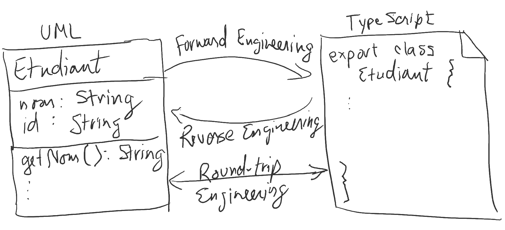

---

history: true
progress: true
controls: true
controlsTutorial: false
controlsBackArrows: faded
center: false
theme : beige
transition: none
transitionSpeed: fast
highlightTheme: "github"
logoImg: assets/logo_ets.svg
slideNumber: true
title: 'LOG210-seance-09'
margin: 0
minScale: 1
maxScale: 1
viewDistance: 3
display: block
navigationMode: 'linear'
notesSeparator: "Note:"
customTheme : "slide_themes"
chalkboard: false

---

# LOG210 Analyse et conception de logiciels: Séance 09

--

<!-- https://www.fastemoji.com/Search/?order=newest&q=bureaucrat -->
## ┌(▀Ĺ̯ ▀-͠ )┐

1. Se connecter à Socrative  
{width=35 .plain}tiny.cc/quizdesign $\rightarrow$ ETSDESIGN

--

## Schéma des outils

{.plain}

---

## Plan général des séances

{.plain}

--

# Survol

- Travail en équipe
- Rappel méthodologie
- Rétroaction mini-test
- Architecture logique (en couches) F12.1-12.8/A13.1-13.8
- Conception de packages (ndc 18)
- Diagrammes d'activités
- Diagrammes d'états

---

<!-- .slide: class="equipeslide center" -->
# Travail en équipe

## Développement de logiciels

--

<!-- .slide: class="equipeslide center" -->

## Travail en équipe

Nouveauté dans les notes de cours:

[Faire face aux parasites et aux mollassons dans une équipe](https://docs.google.com/document/d/e/2PACX-1vRWTtdcGjUg34gqB6CW_EMt0H28Cgunq09_7HxMUoTLGERjUcQXBHlrYyB76PYJGjtaoYJhhsHS1Tjj/pub)

---

<!-- .slide: class="methodologieslide center" -->
# Méthodologie

--

<!-- .slide: class="methodologieslide center" -->

::: block {style="align-items:center"}
{.plain width=75%}
:::

Note:
"Passer des diagrammes au code"

---

<!-- .slide: class="retroquizslide center" -->
# Rétroaction mini-test

--

<!-- .slide: class="retroquizslide center" -->
# Questions difficiles 😕

Selon les statistiques de la première tentative.  
(à vérifier avant le cours)

---

<!-- .slide: class="rdcuslide center" id='rdcu' -->
# RDCU
## Réalisation d'un cas d'utilisation

--

<!-- .slide: class="rdcuslide center" -->
## RDCU

Prendre les bonnes décisions pour une solution facile à comprendre et modulaire... {align=left}

{width="65%" .plain}

--

<!-- .slide: class="rdcuslide center" -->
## Faible décalage des représentations

Facile? Les classes logicielles devraient ressembler à des classes conceptuelles (concepts du monde réel).

{.plain width="50%"}

Qui fait quoi? Qui a quelle responsabilité?

--

<!-- .slide: class="rdcuslide center" -->
# RDCU

Approche: conception orientée-responsabilités

## GRASP

**G**eneral **R**esponsability **A**ssignment **S**oftware **P**atterns

Pour décider où mettre les méthodes...

--

<!-- .slide: class="rdcuslide center" -->
# Retour sur l'exercice RDCU

Note: 1 soumission...

--

<!-- .slide: class="rdcuslide center" -->
## GRASP

- Contrôleur (séparation des couches){style="color:green"}
- Créateur{style="color:green"}
- Expert en information{style="color:green"}
- Faible couplage{style="color:green"}
- Forte cohésion{style="color:green"}
- Polymorphisme{style="color:green"}
- Fabrication pure{style="color:green"}
- Indirection{style="color:green"}
- Protection de variation{style="color:green"}

--

<!-- .slide: class="rdcuslide center" -->
#### RDCU (Survol)

{.plain width=50%}

Note: expliquer encore le contexte de la RDCU

---

<!-- .slide: class='methodologieslide center' -->
# Passer des diagrammes au code

Ne pas oublier la ***Visibilité*** des objets (ndc 9.3)

--

<!-- .slide: class='methodologieslide center' -->
## Qu'est-ce qui est plus important?

{.plain width=80%}

Note: les deux ont des avantages et inconvénients

--

<!-- .slide: class='methodologieslide center' -->
## Outils pour automatiser le passage

{.plain}

--

<!-- .slide: class='methodologieslide center' -->
# Exercice sur Google Classroom

[LOG210: Créer des méthodes à partir des diagrammes d'interaction](https://docs.google.com/document/d/11jUkKYpYbUdTHipNbg2DJ6PjAj0QkQcTcK9mVOafTQU/edit?usp=sharing)

---

<!-- .slide: class='methodologieslide center' -->
# Architecture logique (en couches) F12.1-12.8/A13.1-13.8

--

<!-- .slide: class='methodologieslide center' -->
{width=35 .plain}tiny.cc/quizdesign $\rightarrow$ ETSDESIGN

Quel concept de LOG121 est proche de la notion d'architecture logique (en couches)?

::: block {.socrative}
1. Polymorphisme
2. Patron itérateur
3. MVC
4. Compilateur Java
5. Patron méthode fabrique
:::

---

<!-- .slide: class='methodologieslide center' -->
# Conception de packages (ndc 18)

---

<!-- .slide: class='umlslide center' -->
# Diagrammes d'activités

--

<!-- .slide: class='umlslide center' -->
### Où appliquer les diagrammes d'activités?

{.plain width=65%}

Note: ça sert pour saisir (modéliser, comprendre) les processus d'affaires

--

<!-- .slide: class='umlslide center' -->
# Exercice sur Google Classrooms

Diagrammes d'activité

Note: 15 minutes?

---

<!-- .slide: class='umlslide center' -->
# Diagrammes d'états

--

<!-- .slide: class='umlslide center' -->
### Où appliquer les diagrammes d'état?

{.plain width=65%}

Note: la notion d'évolution d'état est important

--

<!-- .slide: class='umlslide center' -->
# Qu'est-ce qu'un état?

- Système (DSS): il y a un ordre des opérations système (😮[RE**S**T](https://restfulapi.net/))
- Objet: une `:Commande` peut-elle être annulée en tout temps?
- Dispositif: caméra ouverte ou fermée
- Transport (avion): décollage, croisière, atterrissage.
- [Cerveau (sommeil)](https://fr.wikipedia.org/wiki/Sommeil#%C3%89tats_fonctionnels_du_cerveau): éveil, sommeil à ondes lentes, sommeil paradoxal

--

<!-- .slide: class='umlslide center' -->
# Exercice sur Google Classrooms

Diagrammes d'état

Note: 15 minutes?

---

<!-- .slide: class='feedbackslide center' -->
# Feuille d'une minute

SVP m'écrire un courriel pour dire ce qu'étaient les points les moins clairs de la séance.
