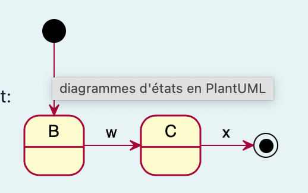
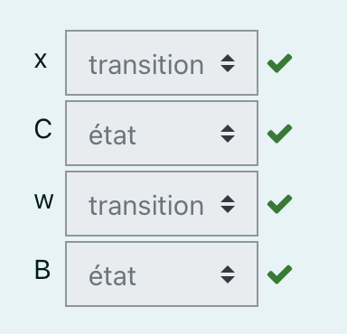
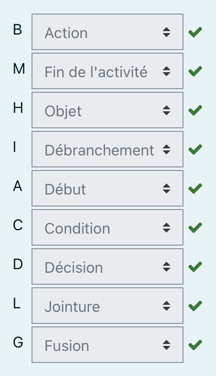

---

history: true
progress: true
controls: true
controlsTutorial: true
controlsBackArrows: faded
center: false
theme : beige
transition: none
transitionSpeed: fast
highlightTheme: monokai
logoImg: assets/logo_ets.svg
slideNumber: true
title: 'LOG210-seance-09'
margin: 0
minScale: 1
maxScale: 1
rtl: false
viewDistance: 3
display: block
navigationMode: 'linear'
height: 50%
width: 100%
autoPlayMedia: true
notesSeparator: "Note:"
customTheme : "slide_themes"
date: '`r format(Sys.time(), "%d %B, %Y")`'

---

# LOG210 Analyse et conception de logiciels: Séance 09

--

<!-- https://www.fastemoji.com/Search/?order=newest&q=bureaucrat -->
## ┌(▀Ĺ̯ ▀-͠ )┐

1. Se connecter à Socrative  
{width=35 .plain}tiny.cc/quizdesign $\rightarrow$ ETSDESIGN

--

## Schéma des outils

{.plain}

--

## Plan général des séances

{.plain}

---

# Survol

- Travail en équipe
  - socrative Parasite & molasson
- Rétroaction TP#8 réusinage
- Rétroaction mini-test
- Diagrammes d'activités
- Diagrammes d'états

---

## Travail en équipe

- [Quiz socrative - parasites et mollassons](https://b.socrative.com/teacher/#launch)
- [Faire face aux parasites et aux mollassons dans une équipe](https://docs.google.com/document/d/e/2PACX-1vRWTtdcGjUg34gqB6CW_EMt0H28Cgunq09_7HxMUoTLGERjUcQXBHlrYyB76PYJGjtaoYJhhsHS1Tjj/pub)

---

<!-- .slide: class="rdcuslide center" -->
# Retour sur l'exercice RDCU

Exercice TP09 réusinage

---

<!-- .slide: class="retroquizslide center" -->
# Rétroaction mini-test

--

<!-- .slide: class="retroquizslide center" -->
## Diagramme d'état

{.plain}

État et transition?

Classe et opération?

--

## Diagramme d'état

{.plain}

{.plain}

--

### Diagramme d'activité

{.plain width="55%"}

--

### Diagramme d'activite

{.plain width="55%"}

- Action

- Fin de l'action

- Objet</li>

- Débranchement</li>

- Début

- Condition

- Décision

- Jointure

- Fusion

Partitions{.fragment .shade-up style="align:left"}

--

### Diagramme d'activite

{.plain width="55%"}

{.plain width="55%"}

---

<!-- .slide: class='umlslide center' -->
# Diagrammes d'activités

--

<!-- .slide: class='umlslide center' -->
### Où appliquer les diagrammes d'activités?

{.plain width=65%}

Note: ça sert pour saisir (modéliser, comprendre) les processus d'affaires

--

<!-- .slide: class='umlslide center' -->
### Exercice sur Google Drive

Diagrammes d'activité 
:::block {style="font-size:0.5em"}
G01 - https://docs.google.com/document/d/1_z5R21OrKDkXcxf9JtiuHtq3kOOSW33hVvY-UraBWlY/edit?usp=sharing

G02 - https://docs.google.com/document/d/1aeY9T48nCdNUUGMwRr7p-j9OavrC2YKqKBCgtMVluLk/edit?usp=sharing

G03 - https://docs.google.com/document/d/1zi-2X7uEWttMgN9UehEvp7RRauns2mzT3aUgdvgdrbM/edit?usp=sharing

:::

Note: 15 minutes?

--

### Diagramme d'activité en pratique
  - Chaque équipe doit me :
    - montrer et expliquer graphiquement tous les éléments de votre diagramme d'activité,
    - expliquer et démontrer comment passer du diagramme d'activité vers le code

:::block {style=font-size:0.5em}
[whiteboard](#whiteboard) | [Supplément au cours en HTML](https://cc-yvanross.github.io/14f3178688ff2d131977e55d7002b1fc3b09e3ad/export/index.html)
:::

--

<!-- .slide: class="dssslide" -->

## Exercices diagramme d’activité
::: block {style=text-align:left}
<a onclick="window.open('https://github.com/yvanross/LOG210-exercices/tree/master/activite','_blank')">LOG210-exercice/activites</a>

Par ordre de complexité
1. [Retour de voiture louée](https://docs.google.com/document/d/1u46J7q2Ddx_a9DmZcubZQgBxo0IG_TqlzN-ADX2bXzM/edit?usp=sharing)
1. [Processus d'achat sur le Web](https://docs.google.com/document/d/1S-RPphojGUECpL_c86J85cygnlu_OztB_oST0lTsX_A/edit?usp=sharing)
1. [Recette de cuisine](https://drive.google.com/open?id=0B1nFsP0-88qudEFxaVUyVFhOdlk)
1. [Ordinateur de plongée](https://drive.google.com/open?id=1TuQvODQlD4rfFub54gqMk4Sl34Fg_WjQ)

Sans solution:
1. [Demander un remplacement](https://drive.google.com/open?id=0B1nFsP0-88qubU42YmZlb1Q2SUE)
:::

---

<!-- .slide: class='umlslide center' -->
# Diagrammes d'états

--

<!-- .slide: class='umlslide center' -->
### Où appliquer les diagrammes d'état?

{.plain width=65%}

Note: la notion d'évolution d'état est important, MDD ou DCL, RDCU pour les changement d'état

--

<!-- .slide: class='umlslide center' -->
# Qu'est-ce qu'un état?

- Système (DSS): il y a un ordre des opérations système (😮[RE**S**T](https://restfulapi.net/))
- Objet: une `:Commande` peut-elle être annulée en tout temps?
- Dispositif: caméra ouverte ou fermée
- Transport (avion): décollage, croisière, atterrissage.
- [Cerveau (sommeil)](https://fr.wikipedia.org/wiki/Sommeil#%C3%89tats_fonctionnels_du_cerveau): éveil, sommeil à ondes lentes, sommeil paradoxal

--

## Diagramme d'état

 {width=80% .plain}

--

<!-- .slide: class="stateslide" -->
#### *Automate fini et cas d'utilisation 1/2

{.plain width=70%}

::: block {style=font-size:0.7em}
- Diagramme d'état correspondant?
:::

Note: Déterminer les états à partir d'un diagramme de séquence système.  Question aux étudiants: Quel est l'intérêt?  Les nom des opérations correspondent aux nom des transitions. 

--

<!-- .slide: class="stateslide" -->
### *Automate fini et cas d'utilisation 2/2

{.plain width=100%}

::: block {style=font-size:0.7em}
- Diagramme de classes logiciels correspondant?
:::

Note: Convertissez ce diagramme d'état en diagramme de classe. 

--

<!-- .slide: class="stateslide" -->
### Diagramme de classe correspondant

{.plain}

--

<!-- .slide: class="stateslide" -->
#### Diagramme de séquence
{.plain width="75%"}

--

<!-- .slide: class='umlslide center' -->
### Exercice sur google Drive
Diagramme d'état

:::block {style="font-size:0.5em"}
G01-https://docs.google.com/document/d/1B5GhGxr2jktLOIuyC22dWHgnzfY9xJNhb37h8bKiyjk/edit?usp=sharing

G02-https://docs.google.com/document/d/1AVBSDTetewFnVFGBaU1BnznFbjYauFj2QeGS46uXSkA/edit?usp=sharing

G03-https://docs.google.com/document/d/191doOKmAoNoU10xlIXoFrVwh2WeAUcMb7cYT_3TEHPE/edit?usp=sharing
:::

Note: 30 minutes?

--

### Diagramme d'état en pratique
  - Chaque équipe doit me:
    - montrer et expliquer graphiquement tous les éléments permettant de créer un diagramme d'état,
    - expliquer le concept de super état
    - expliquer et démontrer comment passer du diagramme d'état vers le code

--

<!-- .slide: class="stateslide" -->

## Exercices diagramme d'état
::: block {style=text-align:left;font-size:0.8em}
<a onclick="window.open('https://github.com/yvanross/LOG210-exercices/tree/master/etat','_blank')">LOG210-exercice/etat</a>

Par ordre de complexité
1. [Téléphone intelligent](https://docs.google.com/document/d/1q4lxM57nNkflYTwNAD2D8ytHzk-1McsT7QJNK9WWUE8/edit?usp=sharing)
1. [Guichet automatique](https://docs.google.com/document/d/1TwktdMLWQ6NIS-7GF88fmsKbsitungXv_Ban_52ayhc/edit?usp=sharing)
1. [CU29-Annuler un service](https://docs.google.com/document/d/18s-eN0QoqREblJUihUaEC2L7f1hZF82_Jm9PjfL6BuY/edit?pli=1#heading=h.woe7hjrtreze) + [CU30-Confirmer une visite supervisée](https://docs.google.com/document/d/18s-eN0QoqREblJUihUaEC2L7f1hZF82_Jm9PjfL6BuY/edit?pli=1#heading=h.woe7hjrtreze) => [solution](https://github.com/yvanross/LOG210-exercices/blob/master/etat/rqrsda/cu29-30-rqrsda.md)
3. [CU32-Rédiger une note d’observation](https://docs.google.com/document/d/18s-eN0QoqREblJUihUaEC2L7f1hZF82_Jm9PjfL6BuY/edit?pli=1#heading=h.1u1pach8bqyv) + [CU33-Corriger une note d’observation](https://docs.google.com/document/d/18s-eN0QoqREblJUihUaEC2L7f1hZF82_Jm9PjfL6BuY/edit?pli=1#heading=h.8rnjn3p0d663) => [Solution](https://github.com/yvanross/LOG210-exercices/blob/master/etat/rqrsda/cu32-33-rqrsda.md)
1. [Vidéo projecteur](https://drive.google.com/file/d/17QHRAjmdIm0paFwLidhHs4v3R1NtvpOD/view?usp=sharing)

Autres exercices sans solution

2. [CU31-Confirmer des échanges de garde](https://docs.google.com/document/d/18s-eN0QoqREblJUihUaEC2L7f1hZF82_Jm9PjfL6BuY/edit?pli=1#heading=h.571qr0tmgkvv)
:::

---

<!-- .slide: class='feedbackslide center' -->
# Feuille d'une minute

SVP m'écrire un courriel pour dire ce qu'étaient les points les moins clairs de la séance.

---

<!-- .slide id="whiteboard" --->

