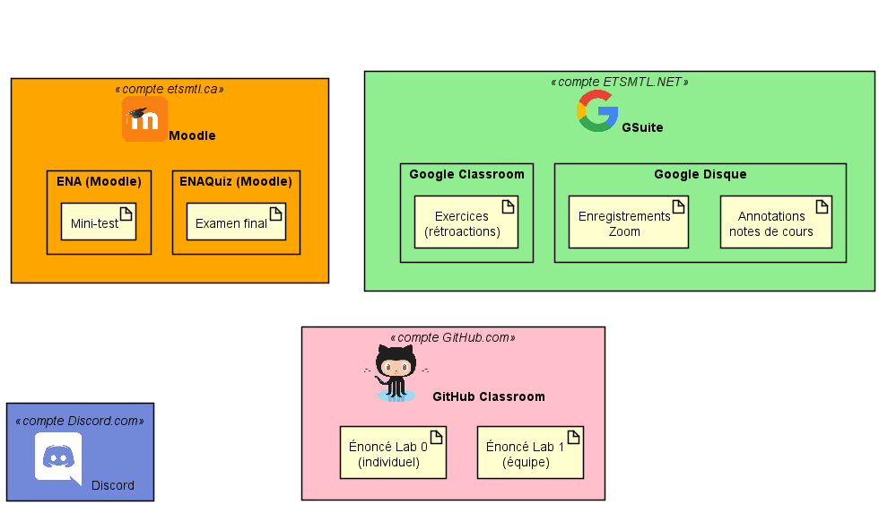
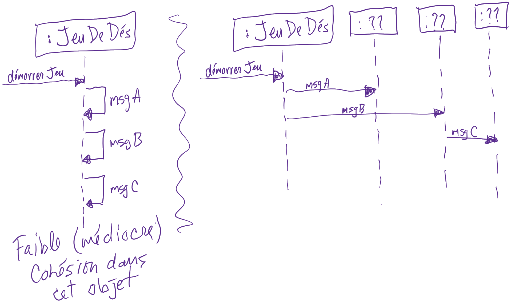

---

history: true
progress: true
controls: true
controlsTutorial: false
controlsBackArrows: faded
center: false
theme : beige
transition: none
transitionSpeed: fast
highlightTheme: "github"
logoImg: assets/logo_ets.svg
slideNumber: true
title: 'LOG210-seance-10'
margin: 0
minScale: 1
maxScale: 1
viewDistance: 3
display: block
navigationMode: 'linear'
notesSeparator: "Note:"
customTheme : "slide_themes"
chalkboard: false

---

<!-- .slide: class="center" -->
# LOG210 Analyse et conception de logiciels: Séance 10

--

<!-- https://www.fastemoji.com/Search/?order=newest&q=bureaucrat -->
<!-- .slide: class="center" -->
## ┌(▀Ĺ̯ ▀-͠ )┐

1. Rappel changements énoncé du lab1 (discord)
1. Se connecter à Socrative  
{width=35 .plain}tiny.cc/quizdesign $\rightarrow$ ETSDESIGN

--

<!-- .slide: class="center" -->
## Schéma des outils

{.plain}

---

## Plan général des séances

{.plain}

--

# Survol

- Travail en équipe
- Rappel méthodologie
- Rétroaction mini-test
- Diagrammes d'états (continuation)
- Phases Processus Unifié (ndc 1.6)
- FURPS+ (ndc 2, A35.2/F30.2)
- Modèle GMOT de LOG210

---

<!-- .slide: class="equipeslide center" -->
# Travail en équipe

## Développement de logiciels

--

<!-- .slide: class="equipeslide center" -->

## Travail en équipe

Nouveauté dans les notes de cours:

[Faire face aux parasites et aux mollassons dans une équipe](https://docs.google.com/document/d/e/2PACX-1vRWTtdcGjUg34gqB6CW_EMt0H28Cgunq09_7HxMUoTLGERjUcQXBHlrYyB76PYJGjtaoYJhhsHS1Tjj/pub)

---

<!-- .slide: class="methodologieslide center" -->
# Méthodologie

--

<!-- .slide: class="methodologieslide center" -->

::: block {style="align-items:center"}
{.plain width=75%}
:::

Note:
"Passer des diagrammes au code"

---

<!-- .slide: class="retroquizslide center" -->
# Rétroaction mini-test

--

<!-- .slide: class="retroquizslide center" -->
# Questions difficiles 😕

Selon les statistiques de la première tentative.  
(à vérifier avant le cours)

---

<!-- .slide: class="rdcuslide center" id='rdcu' -->
# RDCU
## Réalisation d'un cas d'utilisation

--

<!-- .slide: class="rdcuslide center" -->
## RDCU

Prendre les bonnes décisions pour une solution facile à comprendre et modulaire... {align=left}

{width="65%" .plain}

--

<!-- .slide: class="rdcuslide center" -->
## Faible décalage des représentations

Facile? Les classes logicielles devraient ressembler à des classes conceptuelles (concepts du monde réel).

{.plain width="50%"}

Qui fait quoi? Qui a quelle responsabilité?

--

<!-- .slide: class="rdcuslide center" -->
# RDCU

Approche: conception orientée-responsabilités

## GRASP

**G**eneral **R**esponsability **A**ssignment **S**oftware **P**atterns

Pour décider où mettre les méthodes...

--

<!-- .slide: class="rdcuslide center" -->
# Retour sur l'exercice RDCU

Note: 1 soumission...

--

<!-- .slide: class="rdcuslide center" -->
## GRASP

- Contrôleur (séparation des couches){style="color:green"}
- Créateur{style="color:green"}
- Expert en information{style="color:green"}
- Faible couplage{style="color:green"}
- Forte cohésion{style="color:green"}
- Polymorphisme{style="color:green"}
- Fabrication pure{style="color:green"}
- Indirection{style="color:green"}
- Protection de variation{style="color:green"}

--

<!-- .slide: class="rdcuslide center" -->
#### RDCU (Survol)

{.plain width=50%}

Note: expliquer encore le contexte de la RDCU

---

<!-- .slide: class='umlslide center' -->
# Diagrammes d'états

(continuation)

--

<!-- .slide: class='umlslide center' -->
### Où appliquer les diagrammes d'état?

{.plain width=65%}

Note: la notion d'évolution d'état est important

--

<!-- .slide: class='umlslide center' -->
# Qu'est-ce qu'un état?

- Système (DSS): il y a un ordre des opérations système (😮[RE**S**T](https://restfulapi.net/))
- Objet: une `:Commande` peut-elle être annulée en tout temps?
- Dispositif: caméra ouverte ou fermée
- Transport (avion): décollage, croisière, atterrissage.
- [Cerveau (sommeil)](https://fr.wikipedia.org/wiki/Sommeil#%C3%89tats_fonctionnels_du_cerveau): éveil, sommeil à ondes lentes, sommeil paradoxal

--

<!-- .slide: class='umlslide center' -->
# Exercice sur Google Classrooms

Diagrammes d'état

Note: 15 minutes?

--

<!-- .slide: class='umlslide center' -->
# Implémenter une MEF

https://stackoverflow.com/a/44955234/1168342

---

<!-- .slide: class='puslide center' -->
# Phases Processus Unifié

Notes de cours

---

<!-- .slide: class='exigencesslide center' -->
# FURPS+ (ndc 2, A35.2/F30.2)

Notes de cours 2.1

--

<!-- .slide: class='exigencesslide center' -->
# Importance des exigences

Une conception doit les satisfaire!

--

<!-- .slide: class='exigencesslide center' -->
{width=35 .plain}tiny.cc/quizdesign $\rightarrow$ ETSDESIGN

{.plain width=40%}

::: block {.socrative style="font-size:0.8em"}

1. **F**onctionnalité
2. Aptitude à l'utilisation (**U**sability)
3. Fiabilité (**R**eliability)
4. **P**erformance
5. Possibilités de prise en charge (**S**upportability)

:::

Note: F - La sécurité est considérée comme F dans FURPS

--

<!-- .slide: class='exigencesslide center' -->
{width=35 .plain}tiny.cc/quizdesign $\rightarrow$ ETSDESIGN

> Le logiciel doit supporter une interface pour les utilisateurs francophones

::: block {.socrative style="font-size:0.8em"}

1. **F**onctionnalité
2. Aptitude à l'utilisation (**U**sability)
3. Fiabilité (**R**eliability)
4. **P**erformance
5. Possibilités de prise en charge (**S**upportability)

:::

Note: U - Utiliser une interface en français est plus facile pour les francophones

--

<!-- .slide: class='exigencesslide center' -->
{width=35 .plain}tiny.cc/quizdesign $\rightarrow$ ETSDESIGN

> Le logiciel doit supporter le changement de langue par le client

::: block {.socrative style="font-size:0.8em"}

1. **F**onctionnalité
2. Aptitude à l'utilisation (**U**sability)
3. Fiabilité (**R**eliability)
4. **P**erformance
5. Possibilités de prise en charge (**S**upportability)

:::

Note: F - changer la langue par le client est une fonctionnalité

--

<!-- .slide: class='exigencesslide center' -->
{width=35 .plain}tiny.cc/quizdesign $\rightarrow$ ETSDESIGN

> Le logiciel doit supporter l'ajout facile de nouvelles langues pour son interface

::: block {.socrative style="font-size:0.8em"}

1. **F**onctionnalité
2. Aptitude à l'utilisation (**U**sability)
3. Fiabilité (**R**eliability)
4. **P**erformance
5. Possibilités de prise en charge (**S**upportability)

:::

Note: S - possibilité d'ajouter de nouvelles choses

--

<!-- .slide: class='exigencesslide center' -->
{width=35 .plain}tiny.cc/quizdesign $\rightarrow$ ETSDESIGN

> L'authentification doit se faire dans moins de 2 secondes

::: block {.socrative style="font-size:0.8em"}

1. **F**onctionnalité
2. Aptitude à l'utilisation (**U**sability)
3. Fiabilité (**R**eliability)
4. **P**erformance
5. Possibilités de prise en charge (**S**upportability)

:::

Note: P - durée de temps

--

<!-- .slide: class='exigencesslide center' -->
{width=35 .plain}tiny.cc/quizdesign $\rightarrow$ ETSDESIGN

> La création d'un devoir nécessite moins de 5 clics à partir de la page d'accueil.

::: block {.socrative style="font-size:0.8em"}

1. **F**onctionnalité
2. Aptitude à l'utilisation (**U**sability)
3. Fiabilité (**R**eliability)
4. **P**erformance
5. Possibilités de prise en charge (**S**upportability)

:::

Note: U - nombre de clics est toujours reliés à la facilité d'utilisation

--

<!-- .slide: class='exigencesslide center' -->
{width=35 .plain}tiny.cc/quizdesign $\rightarrow$ ETSDESIGN

> Si un jeton d'authentification s'expire durant un travail, l'utilisateur s'authentifie de nouveau et son travail n'est pas perdu.

::: block {.socrative style="font-size:0.8em"}

1. **F**onctionnalité
2. Aptitude à l'utilisation (**U**sability)
3. Fiabilité (**R**eliability)
4. **P**erformance
5. Possibilités de prise en charge (**S**upportability)

:::

Note: R - ne pas perdre les données malgré un problème d'authentification (mais aussi F, car ce n'est pas vraiment une panne si un jeton s'expire)

---

<!-- .slide: class='center' -->
# Modèle GMOT de LOG210

---

<!-- .slide: class='feedbackslide center' -->
# Feuille d'une minute

SVP m'écrire un courriel pour dire ce qu'étaient les points les moins clairs de la séance.
