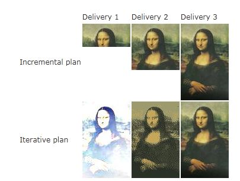
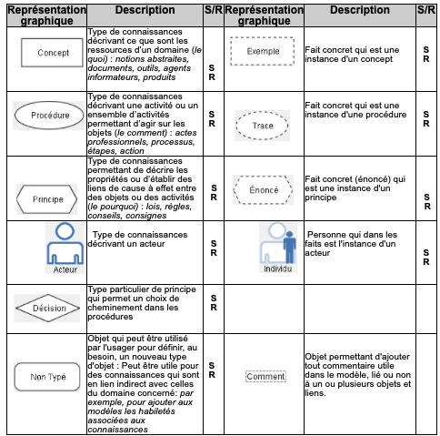
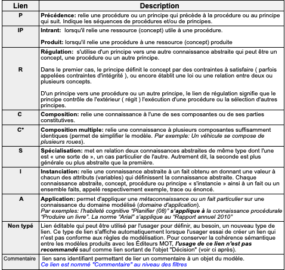

---

history: true
progress: true
controls: true
controlsTutorial: true
controlsBackArrows: faded
center: false
theme : beige
transition: none
transitionSpeed: fast
highlightTheme: monokai
logoImg: assets/logo_ets.svg
slideNumber: true
title: 'LOG210-seance-10'
margin: 0
minScale: 1
maxScale: 1
rtl: false
viewDistance: 3
display: block
navigationMode: 'linear'
height: 50%
width: 100%
autoPlayMedia: true
notesSeparator: "Note:"
customTheme : "slide_themes"
date: '`r format(Sys.time(), "%d %B, %Y")`'

---

## Séance 10
<!-- .slide: class="furpslide"  -->
- Rétroaction mini-test
- Diagrammes d'activité (Réviser TP#9)
- Diagrammes d'états (Réviser TP#9)
- Rappel méthodologie
- Phases Processus Unifié (ndc 1.6)
- FURPS+ (ndc 2, A35.2/F30.2)
- Modèle de connaissance de LOG210
- TP#10 TDD + États

---

<!-- .slide: class="retroquizslide center" -->
# Questions difficiles 😕

Selon les statistiques de la première tentative.  

--

### Questions difficiles 😕
Les phases du processus unifié sont

1. Test
4. Construction
2. Implémentation
5. Conception
6. Transition
1. Inception
7. Analyse
8. Élaboration

Dans quel ordre?

Note: - Inception, Elaboration, Construction, Transition

--

### Questions difficiles 😕

Selon le livre de Larman, quel est le  pourcentage réel des fonctionnalités utilisées à la suite de la réalisation d'un projet utilisant un processus en cascade.

Choix: 7%, 19% et 45%.

- Jamais 
  - 45% {.fragment .shade-up}
- Rarement 
  - 19% {.fragment .shade-up}
- Toujours 
  - 7% {.fragment .shade-up}

---

<!-- .slide: class='umlslide center' -->
## Diagrammes d'activité

Réviser TP9

---

<!-- .slide: class='umlslide center' -->
## Diagrammes d'états

Réviser TP9

---

<!-- .slide: class="methodologieslide center" -->
# Rapel Méthodologie
"Passer des diagrammes d'état et d'activité au code"

--

<!-- .slide: class="retroquizslide center" -->
## Diagramme d'état

{.plain}

Diagramme -> Code?

--

### Diagramme d'activité

{.plain width="20%"}

Diagramme -> Code

---

<!-- .slide: class='puslide center' -->
### Phases du Processus Unifié (ndc 1.6)

{style="border:none; margin-left:12%"}

--

<!-- .slide: class="puslide"  -->

## Phase  Inception
- Étude de faisabilité
    - Vision approximative
    - Estimations globales
    - Cas d'utilisation
    - Continuer ou non (p.ex. chercher le financement)

    {style="margin-left:25%"}

Note: Ne pas confondre avec - analyse des exigences

--

<!-- .slide: class='puslide center' -->
### Phases du Processus Unifié (ndc 1.6)

{style="border:none; margin-left:12%"}

--

<!-- .slide: class='exigencesslide center' -->
## Importance des exigences

Une conception doit les satisfaires!

3 types d'exigences
- Fonctionnelles {.fragment .shade-up}
- Non fonctionnelles, de qualité {.fragment .shade-up}
- Contraintes {.fragment .shade-up}

--

###  Phases du Processus Unifié

- Débute la conception avec les pilotes architecturaux

- Planification itérative et incrémentale piloté par 
  - les risques 
  - et le client

Note: Pilotes archituraux: exigence architecturalement significatif

--

### Itératif vs Incrémental
{width=80% .plain}
 

--
 
<!-- .slide: class='exigencesslide center' -->
# FURPS+ (ndc 2, A35.2/F30.2)
## (ndc 2, A35.2/F30.2)

Notes de cours 2.1

--

<!-- .slide: class='exigencesslide center' -->
# Test socrative
## LOG210-FURPS

--

## Autre processus de développement
- [Waterfall vs Agile](https://www.youtube.com/watch?v=5RocT_OdQcA)
- [Le modèle de processus en V](https://www.youtube.com/watch?v=2ht9FzHDfzs)
- [Le modèle en cascade](https://www.youtube.com/watch?v=K4dPbWcAgm0)
- [Modèle de processus en Spirale](https://www.youtube.com/watch?v=XJk9OprssxQ)
- [Modèle de processus en Spirale - anglais](https://www.youtube.com/watch?v=mp22SDTnsQQ)

--

<!-- .slide: class='center' -->
## Modèle GMOT de LOG210
Modèle de connaissance

- [GMOT LOG210](https://github.com/fuhrmanator/log210-notes-de-cours/blob/master/docs/gmot/LOG210_gmot.pdf)

- [format MOT](https://docs.google.com/document/d/14zX8Lyy0_221m_ep6ptbEFn4JM57myVxn2KXN99BHOg/pub#h.7c2acbc19e02)

Ne pas se soucier de la notation.

--

## Modèle GMOT - Symboles
{.plain}

--

## Modèle GMOT - Liens
{.plain}

---

<!-- .slide: class='feedbackslide center' -->
### Évaluation des cours
La période d'évaluation des cours et de l’enseignement de la session d'Automne 2021 se déroulera du 12-11-2021 au 21-11-2021.

---

<!-- .slide: class='feedbackslide center' -->
# Feuille d'une minute

SVP m'écrire un courriel pour dire ce qu'étaient les points les moins clairs de la séance.

---

<!-- .slide: class='umlslide center' -->
# TP #10
## Implémenter un changement d'état

- https://stackoverflow.com/a/44955234/1168342
- https://stackoverflow.com/questions/133214/is-there-a-typical-state-machine-implementation-pattern

---

<!-- .slide id="whiteboard" --->
