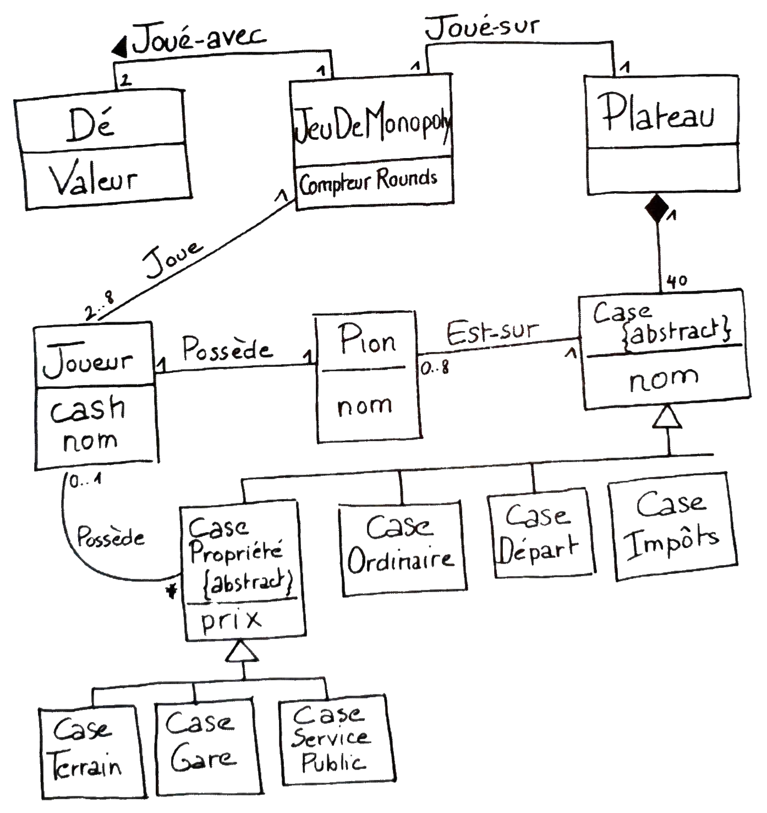

---

history: true
progress: true
controls: true
controlsTutorial: false
controlsBackArrows: faded
center: false
theme : beige
transition: none
transitionSpeed: fast
highlightTheme: "github"
logoImg: assets/logo_ets.svg
slideNumber: true
title: 'LOG210-seance-11'
margin: 0
minScale: 1
maxScale: 1
viewDistance: 3
display: block
navigationMode: 'linear'
notesSeparator: "Note:"
customTheme : "slide_themes"
chalkboard: false

---

<!-- .slide: class="center" -->
# LOG210 Analyse et conception de logiciels: Séance 11

--

<!-- https://www.fastemoji.com/Search/?order=newest&q=bureaucrat -->
<!-- .slide: class="center" -->
## ┌(▀Ĺ̯ ▀-͠ )┐

1. Rappel changements énoncé du lab1 (discord)
1. Se connecter à Socrative  
{width=35 .plain}tiny.cc/quizdesign $\rightarrow$ ETSDESIGN

--

<!-- .slide: class="center" -->
## Schéma des outils

{.plain}

---

## Plan général des séances

{.plain}

--

# Survol

- Travail en équipe
- Rappel méthodologie
- Rétroaction mini-test
- Modèle GMOT de LOG210
- Fiabilité (ndc 15)
- Adaptateur (ndc 15, A35.2/F30.2)
- Proxy (ndc 15)

---

<!-- .slide: class="equipeslide center" -->
# Travail en équipe

## Développement de logiciels

--

<!-- .slide: class="equipeslide center" -->

## Travail en équipe

Nouveauté dans les notes de cours:

[Faire face aux parasites et aux mollassons dans une équipe](https://docs.google.com/document/d/e/2PACX-1vRWTtdcGjUg34gqB6CW_EMt0H28Cgunq09_7HxMUoTLGERjUcQXBHlrYyB76PYJGjtaoYJhhsHS1Tjj/pub)

---

<!-- .slide: class="methodologieslide center" -->
# Méthodologie

--

<!-- .slide: class="methodologieslide center" -->

::: block {style="align-items:center"}
{.plain width=75%}
:::

Note:
"Passer des diagrammes au code"

---

<!-- .slide: class="retroquizslide center" -->
# Rétroaction mini-test

--

<!-- .slide: class="retroquizslide center" -->
# Questions difficiles 😕

Selon les statistiques de la première tentative.  

--

<!-- .slide: class="retroquizslide center" -->
- 😕 Dans la réalisation de basculement sur les services locaux pour getDescription() envoyé au CatalogueProduits/ProductCatalog, combien de copies d'une description de produits peut-il y avoir?

Réponse: 4
- Map
- fichier indexé
- base de données externe
- prix affiché

--

- 😕 Dans la figure A35.13/F30.13, comment les informations dans le service redondant de comptabilité (LocalAccounting/ComptaLocal) et le système principal (SAPAccounting/ComptaSAP) se synchronisent-elles?{align=left}

::: block {.socrative}
1. Les données stockées dans le système local (redondant) sont transmises vers SAP ultérieurement. 42.86%{style="color:green"}
2. Les données stockées dans SAP sont copiées dans le système local (redondant). **50.00%**
3. Les informations n'ont pas besoin d'être synchronisées. 7.14%
:::

---

<!-- .slide: class="rdcuslide center" id='rdcu' -->
# RDCU
## Réalisation d'un cas d'utilisation

--

<!-- .slide: class="rdcuslide center" -->
## RDCU

Prendre les bonnes décisions pour une solution facile à comprendre et modulaire... {align=left}

{width="65%" .plain}

--

<!-- .slide: class="rdcuslide center" -->
## Faible décalage des représentations

Facile? Les classes logicielles devraient ressembler à des classes conceptuelles (concepts du monde réel).

{.plain width="50%"}

Qui fait quoi? Qui a quelle responsabilité?

Note: Dans un design, on s'attend à voir des choses évidentes par rapport au MDD.

--

<!-- .slide: class="rdcuslide center" -->
# Google Classrooms : Critique d'analyse

--

<!-- .slide: class="rdcuslide center" -->
MDD en française et en anglais  
{.plain width=40%}&nbsp;&nbsp;&nbsp;&nbsp;&nbsp;&nbsp;&nbsp;&nbsp;&nbsp;&nbsp;&nbsp;{.plain width=40%}

--

<!-- .slide: class="rdcuslide center" -->
# RDCU

Approche: conception orientée-responsabilités

## GRASP

**G**eneral **R**esponsability **A**ssignment **S**oftware **P**atterns

Pour décider où mettre les méthodes...

--

<!-- .slide: class="rdcuslide center" -->
# Retour sur l'exercice RDCU

Note: 1 soumission...

--

<!-- .slide: class="rdcuslide center" -->
## GRASP

- Contrôleur (séparation des couches){style="color:green"}
- Créateur{style="color:green"}
- Expert en information{style="color:green"}
- Faible couplage{style="color:green"}
- Forte cohésion{style="color:green"}
- Polymorphisme{style="color:green"}
- Fabrication pure{style="color:green"}
- Indirection{style="color:green"}
- Protection de variation{style="color:green"}

--

<!-- .slide: class="rdcuslide center" -->
#### RDCU (Survol)

{.plain width=50%}

Note: expliquer encore le contexte de la RDCU

---

<!-- .slide: class='methodologieslide center' -->
# Modèle GMOT de LOG210

Ne pas se soucier de la notation.
Il s'agit d'un modèle de connaissances en [format MOT](https://docs.google.com/document/d/14zX8Lyy0_221m_ep6ptbEFn4JM57myVxn2KXN99BHOg/pub#h.7c2acbc19e02).

---

<!-- .slide: class='nfrslide center' -->
# Fiabilité

(ndc 15)

---

<!-- .slide: class='nfrslide center' -->
# Adaptateur

(ndc 15, A35.2/F30.2)

--

<!-- .slide: class='nfrslide center' -->
## Scénario avec Adaptateur

{width=35 .plain}tiny.cc/quizdesign $\rightarrow$ ETSDESIGN

Quelle «&nbsp;panne&nbsp;» veut-on tolérer?

::: block {.socrative}

1. mauvaise information dans la base de données de descriptions
1. non-disponibilité de la base de données de descriptions{.fragment .highlight-green}
1. mauvaise information dans le système de comptabilité
1. non-disponibilité du système de comptabilité

:::

---

<!-- .slide: class='nfrslide center' -->
# Proxy

(ndc 15)

--

<!-- .slide: class='nfrslide center' -->
## Scénario avec Proxy

{width=35 .plain}tiny.cc/quizdesign $\rightarrow$ ETSDESIGN

Quelle «&nbsp;panne&nbsp;» veut-on tolérer?

::: block {.socrative}

1. mauvaise information dans la base de données de descriptions
1. non-disponibilité de la base de données de descriptions
1. mauvaise information dans le système de comptabilité
1. non-disponibilité du système de comptabilité{.fragment .highlight-green}

:::

---

<!-- .slide: class='feedbackslide center' -->
# Feuille d'une minute

SVP m'écrire un courriel pour dire ce qu'étaient les points les moins clairs de la séance.
