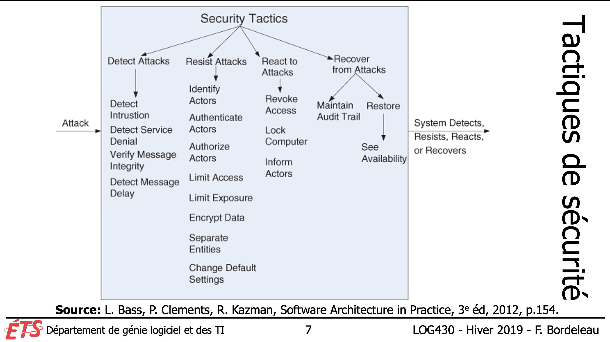
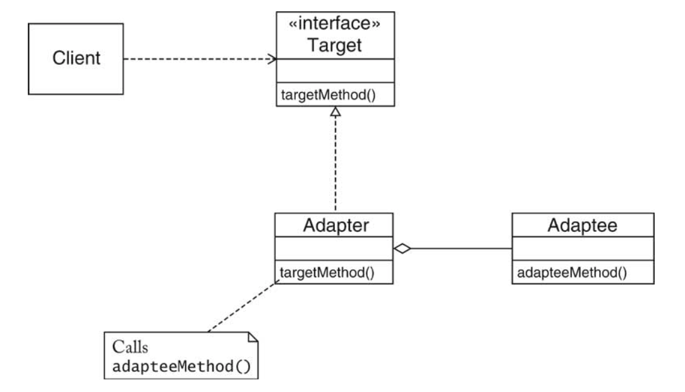
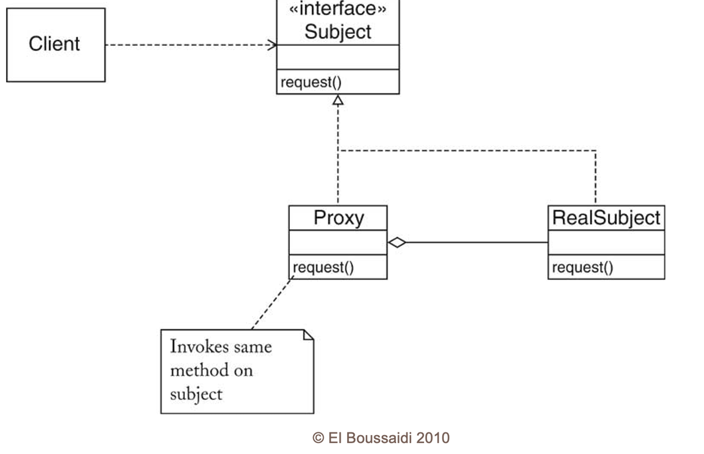
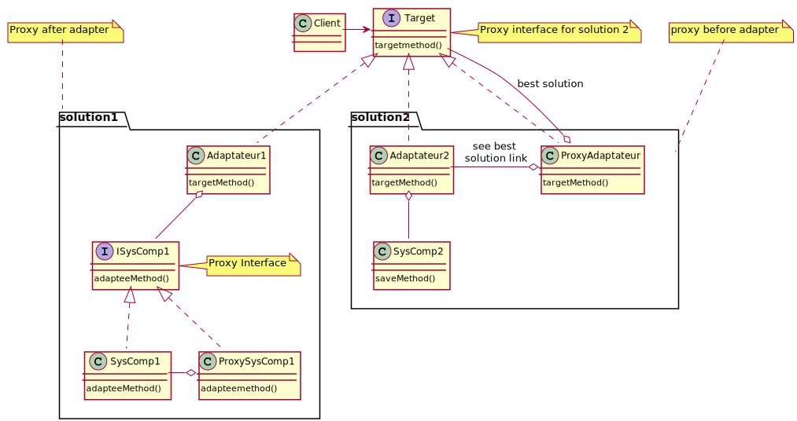

---

history: true
progress: true
controls: true
controlsTutorial: true
controlsBackArrows: faded
center: false
theme : beige
transition: none
transitionSpeed: fast
highlightTheme: monokai
logoImg: assets/logo_ets.svg
slideNumber: true
title: 'LOG210-seance-11'
margin: 0
minScale: 1
maxScale: 1
rtl: false
viewDistance: 3
display: block
navigationMode: 'linear'
height: 50%
width: 100%
autoPlayMedia: true
notesSeparator: "Note:"
customTheme : "slide_themes"
date: '`r format(Sys.time(), "%d %B, %Y")`'

---

## LOG210 Séance #11
### Révision patron GOF laboratoire
- FURPS et Patrons GOF
- Utilisation de services externes
- Patron Adapateur - Cache mémoire (Performance)
- Patron Proxy - Récupération (disponibilité)
- Combinaison Adaptateur-proxy
- Modèle GMOT de LOG210

[whiteboard](#whiteboard) | [Supplément au cours en HTML](https://cc-yvanross.github.io/14f3178688ff2d131977e55d7002b1fc3b09e3ad/export/index.html)

--

<!-- .slide id="whiteboard" --->

## FURPS et Patrons GOF
:::block {style=font-size:0.8em}
L'application d'un patron doit être motivée par des exigences: 
- *Memento* favorise l'implémentation de «&nbsp;Undo&nbsp;» (**F** et **U**)
- *Proxy* favorise la **disponibilité** ( R )
- *Flyweight* favorise une meilleure **performance** (**P**)
- *Façade* favorise la **modifiabilité** du code (**S**)
- *Stratégie* favorise des «&nbsp;plug-in&nbsp;» donc la **modifiabilité** (**S**)
- *Adapteur* favorise la **modifiabilité** (**S**)
:::

:::block {style=font-size:0.5em}
[whiteboard](#whiteboard) | [Supplément au cours en HTML](https://cc-yvanross.github.io/14f3178688ff2d131977e55d7002b1fc3b09e3ad/export/index.html)
:::

--

### Sécurité en LOG210
{.plain}

--

### Sécurité en LOG430
{.plain}

--

### LOG430
- Exigences fonctionnelles 
  - Cas d'utilisation
- Exigences d'attributs de qualité
  - Scénario d'attribut de qualité
    - Performance
    - Disponibilité
    - Sécurité
    - Testabilité
    - Usabilité
    - Mobifiabilité
    - Interopérabilité

---

## Services externes
[Services externes](https://cc-yvanross.github.io/14f3178688ff2d131977e55d7002b1fc3b09e3ad/export/index.html#afs9)

---

## Patron adaptateur
{width=50%}{.plain}

[Patron Adaptateur](https://cc-yvanross.github.io/14f3178688ff2d131977e55d7002b1fc3b09e3ad/export/index.html#/decouverte9)

---

## Patron Proxy
{width=50%}{.plain}

[Patron Proxy](https://cc-yvanross.github.io/14f3178688ff2d131977e55d7002b1fc3b09e3ad/export/index.html#/proxy9)

---

## Combinaison Adaptateur-proxy
{.plain}

---

<!-- .slide: class='center' -->
## Modèle GMOT de LOG210
https://docs.google.com/document/u/1/d/14zX8Lyy0_221m_ep6ptbEFn4JM57myVxn2KXN99BHOg/pub
https://github.com/fuhrmanator/log210-notes-de-cours/blob/master/docs/gmot/LOG210_gmot.pdf
