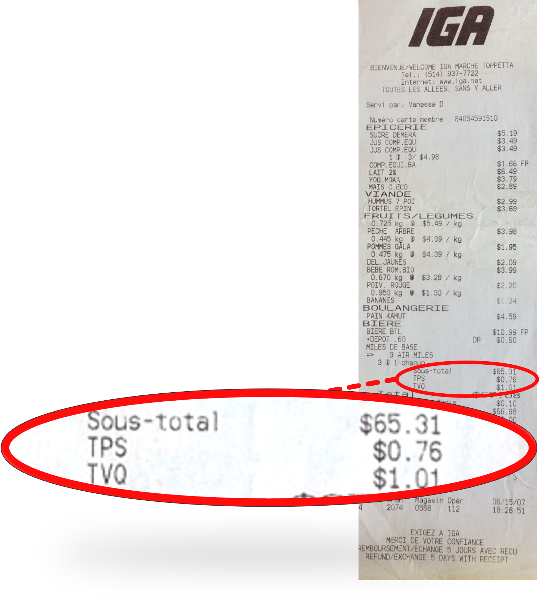
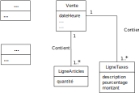
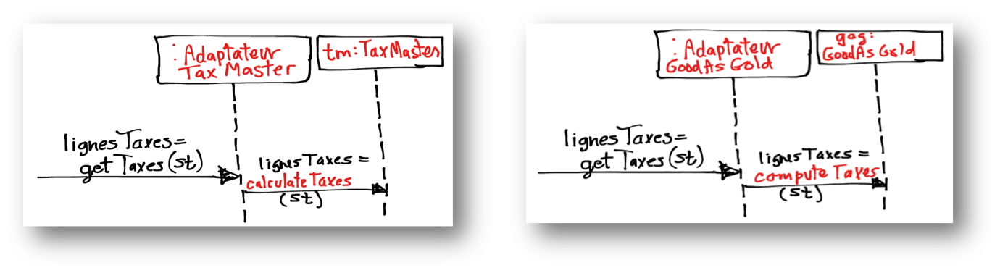
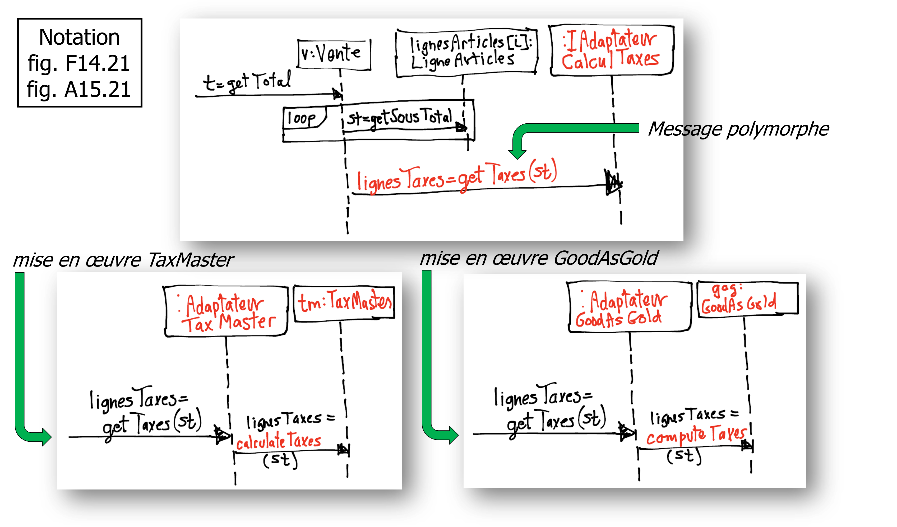

---

history: true
progress: true
controls: true
controlsTutorial: false
controlsBackArrows: faded
center: false
theme : beige
transition: none
transitionSpeed: fast
highlightTheme: "github"
logoImg: assets/logo_ets.svg
slideNumber: true
title: 'LOG210-seance-12'
margin: 0
minScale: 1
maxScale: 1
viewDistance: 3
display: block
navigationMode: 'linear'
notesSeparator: "Note:"
customTheme : "slide_themes"
chalkboard: false

---

<!-- .slide: class="center" -->
# LOG210 Analyse et conception de logiciels: Séance 12

--

<!-- https://www.fastemoji.com/Search/?order=newest&q=bureaucrat -->
<!-- .slide: class="center" -->
## ┌(▀Ĺ̯ ▀-͠ )┐

1. Rappel changements énoncé du lab1 (discord)
1. Valère est votre premier contact pour les questions
1. Se connecter à Socrative  
{width=35 .plain}tiny.cc/quizdesign $\rightarrow$ ETSDESIGN

--

<!-- .slide: class="center" -->
## Schéma des outils

{.plain}

---

## Plan général des séances

{.plain}

--

# Survol

- Travail en équipe
- Rappel méthodologie
- Rétroaction mini-test
- Décortiquer GoF avec GRASP
- Adaptateur (ndc 15, A35.2/F30.2)
- Stratégie

---

<!-- .slide: class="equipeslide center" -->
# Travail en équipe

## Développement de logiciels

--

<!-- .slide: class="equipeslide center" -->

## Travail en équipe

Nouveauté dans les notes de cours:

[Faire face aux parasites et aux mollassons dans une équipe](https://docs.google.com/document/d/e/2PACX-1vRWTtdcGjUg34gqB6CW_EMt0H28Cgunq09_7HxMUoTLGERjUcQXBHlrYyB76PYJGjtaoYJhhsHS1Tjj/pub)

---

<!-- .slide: class="methodologieslide center" -->
# Méthodologie

--

<!-- .slide: class="methodologieslide center" -->

::: block {style="align-items:center"}
{.plain width=75%}
:::

Note:
"Passer des diagrammes au code"

---

<!-- .slide: class="retroquizslide center" -->
# Rétroaction<br>mini-test

--

<!-- .slide: class="retroquizslide center" -->
# Questions difficiles 😕

Selon les statistiques de la première tentative.  

--

<!-- .slide: class="retroquizslide center" -->
- Expert et Stratégie

---

<!-- .slide: class="rdcuslide center" id='rdcu' -->
# RDCU
## Réalisation d'un cas d'utilisation

--

<!-- .slide: class="rdcuslide center" -->
## RDCU

Prendre les bonnes décisions pour une solution facile à comprendre et modulaire... {align=left}

{width="65%" .plain}

--

<!-- .slide: class="rdcuslide center" -->
## Faible décalage des représentations

Facile? Les classes logicielles devraient ressembler à des classes conceptuelles (concepts du monde réel).

{.plain width="50%"}

Qui fait quoi? Qui a quelle responsabilité?

Note: Dans un design, on s'attend à voir des choses évidentes par rapport au MDD.

--

<!-- .slide: class="rdcuslide center" -->
# RDCU

Approche: conception orientée-responsabilités

## GRASP

**G**eneral **R**esponsability **A**ssignment **S**oftware **P**atterns

Pour décider où mettre les méthodes...

--

<!-- .slide: class="rdcuslide center" -->
# Retour sur l'exercice RDCU

Note: 1 soumission...

--

<!-- .slide: class="rdcuslide center" -->
## GRASP

- Contrôleur (séparation des couches){style="color:green"}
- Créateur{style="color:green"}
- Expert en information{style="color:green"}
- Faible couplage{style="color:green"}
- Forte cohésion{style="color:green"}
- Polymorphisme{style="color:green"}
- Fabrication pure{style="color:green"}
- Indirection{style="color:green"}
- Protection de variation{style="color:green"}

--

<!-- .slide: class="rdcuslide center" -->
#### RDCU (Survol)

{.plain width=50%}

Note: expliquer encore le contexte de la RDCU

---

<!-- .slide: class='graspslide center' -->
# Décortiquer les GoF avec les GRASP

ndc chapitre 14

--

<!-- .slide: class='graspslide center' -->
# Adaptateur?

Quel problème est résolu par le pattern?
{.plain}

--

<!-- .slide: class='mddslide center' -->
## Taxes (MDD)

::: block {.container}
{.plain width=46% style="vertical-align:middle" align=left}
{.plain width=46% style="vertical-align:middle" align=right}
:::

--

<!-- .slide: class='graspslide center' -->
### Pourquoi plusieurs calculateurs de taxes?

- Trop compliqué pour NextGen de supporter
50 états (USA) + 10 provinces + 3 territoires (Canada)
- https://sourceforge.net/software/sales-tax/
- Clients différents avec les exigences différentes

::: block {.container style="font-size:0.3em"}
<div about='https://farm66.static.flickr.com/65535/49314353466_4d48cb8fa6.jpg' class='col'><a href='https://www.flickr.com/photos/danramarch/49314353466/' target='_blank'></a><br/>&quot;<a href='https://www.flickr.com/photos/danramarch/49314353466/' target='_blank'>Don Quijote Kaheka</a>&quot;&nbsp;(<a rel='license' href='https://creativecommons.org/licenses/by/2.0/' target='_blank'>CC BY 2.0</a>)&nbsp;by&nbsp;<a xmlns:cc='http://creativecommons.org/ns#' rel='cc:attributionURL' property='cc:attributionName' href='https://www.flickr.com/people/danramarch/' target='_blank'>jdnx</a></div>
<div about='https://farm8.static.flickr.com/7366/8959383085_be1b79817b_m.jpg' class=''><a href='https://www.flickr.com/photos/ivanfebri/8959383085/' target='_blank'></a><br/>&quot;<a href='https://www.flickr.com/photos/ivanfebri/8959383085/' target='_blank'>cashier</a>&quot;&nbsp;(<a rel='license' href='https://creativecommons.org/licenses/by/2.0/' target='_blank'>CC BY 2.0</a>)&nbsp;by&nbsp;<a xmlns:cc='http://creativecommons.org/ns#' rel='cc:attributionURL' property='cc:attributionName' href='https://www.flickr.com/people/ivanfebri/' target='_blank'>Human Interest (Instagram: ivanfebri)</a></div>
:::

--

<!-- .slide: class='graspslide center' -->
# Départ

Supporter deux calculateurs de taxes:
- **Tax Master** et 
- **Good As Gold Tax Pro**

--

<!-- .slide: class='graspslide center' -->
## Solution KISS (🤠)

Keep it simple stupid

```java
if(calculateurTaxes == "GoodAsGoldTaxPro") {

  // série d'instructions pour intéragir 
  // avec le calculateur Good As Gold Tax Pro

} else if(calculateurTaxes == "TaxMaster") {

  // série d'instructions pour intéragir 
  // avec le calculateur Tax Master

} else if /* etc. pour chacun des calculateurs */

  // ...

}
```

--

<!-- .slide: class='graspslide center' -->
## Doucement vers le pattern...

{.plain}

--

<!-- .slide: class='graspslide center' -->
## On ne peut pas changer les API

{.plain}

--

<!-- .slide: class='graspslide center' -->
## Utilisons un adaptateur

(st = sous total)

{.plain}

--

<!-- .slide: class='graspslide center' -->
### Mise en œuvre avec polymorphisme

{.plain}

--

<!-- .slide: class='graspslide center' -->
## Adaptateur solution

{.plain}

--

<!-- .slide: class='graspslide center' -->
## Plein d'adaptateurs

- Calcul de taxes
- Autorisation de crédit
- Comptabilité
- Stockage (Inventaire)
- etc.

--

<!-- .slide: class='graspslide center' -->
## Exercice sur Google Classrooms

--

<!-- .slide: class='graspslide center' -->
# GRASP dans GOF

ndc Figure 14.2 (A26.3/F23.3)

----|> "est un"

--

<!-- .slide: class='graspslide center' -->
# GRASP dans GOF  

## Exercice Google Classrooms

--

<!-- .slide: class='graspslide center' -->
# GRASP et Réusinage

ndc 14.4

---

<!-- .slide: class='feedbackslide center' -->
# Feuille d'une minute

SVP m'écrire un courriel pour dire ce qu'étaient les points les moins clairs de la séance.
