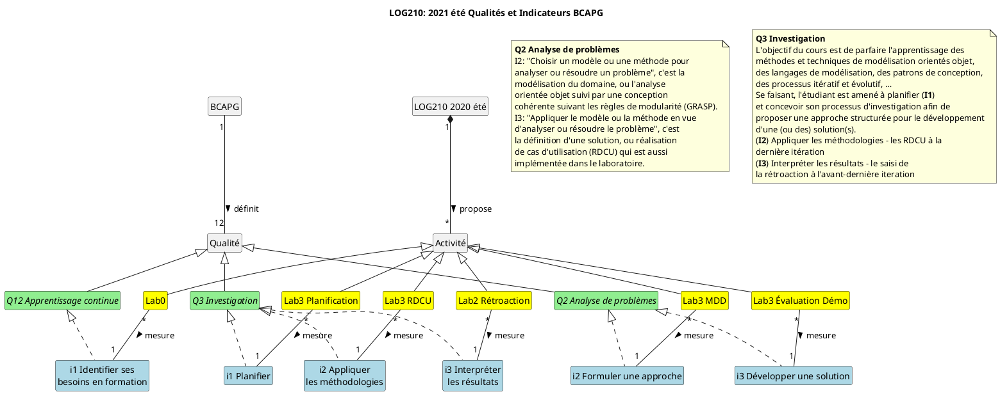

# LOG210: Formation évaluation laboratoires

--

## Objectifs

- 1er: Expliquer les éléments essentiels de l'évaluation
- Secondaire: votre rétroaction sur la correction

--

## Préliminaires

Plusieurs contextes pour les **évaluations**

  1. Processus unifié: Intervenants évaluent un logiciel (critères d'évaluation définis dans le plan d'itération)
  2. LOG210: Auxiliaires évaluent les travaux de lab (critères d'évaluation dans la grille) {.fragment .current-visible .highlight-green}
  3. BCAPG: Visiteurs évaluent les cours (LOG210) selon leur processus.

note: Auxiliaires sont appelés à évaluer l'évaluation de la démo (!)

---

## Éléments essentiels de l'évaluation

- Plan d'itération plus étoffé ([gabarit du plan](https://github.com/profcfuhrmanets/log210-enonce-lab1/blob/main/rapports/plan-iteration-gabarit.md#crit%C3%A8res-d%C3%A9valuation))
- [Processus d'évaluation de la démo](https://github.com/profcfuhrmanets/log210-enonce-lab1#d%C3%A9monstration)
- [Processus d'évaluation de la conception et des tests](https://github.com/profcfuhrmanets/log210-enonce-lab1#%C3%A9valuation-de-la-conception-et-des-tests)
- Grille d'évaluation [`log210-template-notes-lab1-bcapg.xls`](https://docs.google.com/spreadsheets/d/1M1mnxtXvlemp86aDPpdaTEhOxlhztEMf/edit?usp=sharing&ouid=100642354018215358554&rtpof=true&sd=true)

--

## Résumé des nouveautés

- Les étudiants doivent [compléter la section évaluation du plan d'itération *après* la démo et soumettre de nouveau ce plan actualisé](https://github.com/profcfuhrmanets/log210-enonce-lab1#d%C3%A9monstration)
- Les auxiliaires doivent évaluer cette section (dans la [grille](https://docs.google.com/spreadsheets/d/1M1mnxtXvlemp86aDPpdaTEhOxlhztEMf/edit?usp=sharing&ouid=100642354018215358554&rtpof=true&sd=true))
  - Qualité de l'évaluation
  - (Après la démo) Complétude de l'évaluation

---

{width=30%}

## BCAPG: TL;DR

- Certaines parties de la correction sont importantes pour **le BCAPG** et ne doivent pas être ignorées.
- Il s'agit des **Mesures BCAPG** résumées à l'onglet **Équipe** et expliquées à l'onglet **QDR BCAPG** du template [`log210-template-notes-lab1-bcapg.xls`](https://docs.google.com/spreadsheets/d/1M1mnxtXvlemp86aDPpdaTEhOxlhztEMf/edit?usp=sharing&ouid=100642354018215358554&rtpof=true&sd=true)

--

## Mesures se font lors des itérations

1. Lab 2 Rétroaction
2. Lab 3 planification
3. Lab 3 RDCU

C'est automatique, si vous complétez toutes les parties de l'évaluation normale (dans la bonne version de la grille [`log210-template-notes-lab1-bcapg.xls`](https://docs.google.com/spreadsheets/d/1M1mnxtXvlemp86aDPpdaTEhOxlhztEMf/edit?usp=sharing&ouid=100642354018215358554&rtpof=true&sd=true))

--

## LOG210 est obligatoire dans deux programmes

```plantuml
skinparam style strictuml
hide empty members
class LOG as "Baccalauréat en génie logiciel\n(LOG)"
class GTI as "Baccalauréat en génie des\ntechnologies de l'information\n(GTI)"
class LOG210 as "LOG210: Analyse et conception de logiciels"
LOG -d-> LOG210
GTI -d-> LOG210
```

--

## BCAPG

- Les programmes d'ingénierie doivent être [agréés](https://engineerscanada.ca/fr/agrement/a-propos-de-l-agrement) au Canada.
- L'agrément se fait
  - par le **Bureau canadien d'agrément des programmes en génie (BCAPG)**
  - à tous les 4 ans environ à la suite des visites (vérifications)

--

## Vérifications (Visites)

- C'est une sorte d'audit
- [PlanETS de LOG210](https://planets.etsmtl.ca/Public/Versionpdf.aspx?session=20213&sigle=LOG210&groupe=00)
- LOG210 est censé toucher à 3 qualités:
  - Q2: Analyse de problèmes
  - Q3: Investigation
  - Q12: Apprentissage continu

--

<!-- .slide: data-fullscreen -->
## Qualités d'ingénieur


