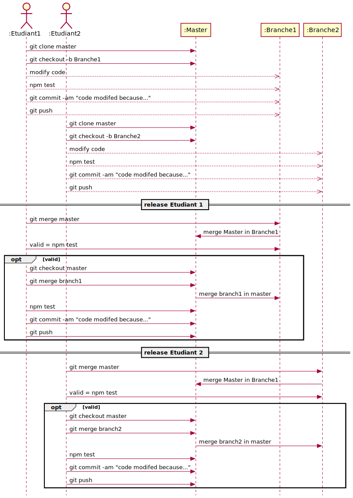

---

history: true
progress: true
controls: true
controlsTutorial: true
controlsBackArrows: faded
center: false
theme : beige
transition: none
transitionSpeed: fast
highlightTheme: monokai
logoImg: assets/logo_ets.svg
slideNumber: true
title: 'LOG210-C01-00-seance'
margin: 0
minScale: 1
maxScale: 1
rtl: false
viewDistance: 3
display: block
navigationMode: 'linear'
height: 50%
width: 100%
autoPlayMedia: true
notesSeparator: "Note:"
customTheme : "slide_themes"

---

## LOG210 Séance #01

- <a href="ssh://rossypro@localhost/open sources\/ets\/log121\/LOG121-contenu\/alias\/03-Comment-reconnaitre-les-patrons-15.ppt">exemple liens ssh</a>

---

## LOG210 Séance #02

- Révision rapide de la théorie
- Réponse à vos questions sur la théorie
- Réponse à vos questions sur le laboratoire #0
- Réalisation du Quiz

Mettre timer pour quiz 60 minutes avant la fin du cours

--

<!-- .slide: data-background-image="https://www.plantuml.com/plantuml/svg/VLJBRjim4BppAnQvE77X8cblXM74Tlf86nH5dRG7EmUAN4k4ALBW0wxxHq4_eRVanxgKR4UsKmC21SpEpYvd85twm5s8fMP-eKp57I_1XvL6EfqIUvMCYqNkR3HIM6qT1CUDfnAQm3eG2kM17Wu5DtBfL0XeO6vD06NWfpBIBZthFCj9dFEeGs8ONY9ySSgdbklRCUlS5kWHR2ZGUT3MBY1to6kfoO-FS5ho1IqP7T9SN7NehGnTHckKDDF1yEO6xYRllqzQm-7Y_8pzVxxdUJhCqIMlpG8-s-WCryTelnP2maGuLOLZj6z89ZdVMghjNN0HcHUSuhXu_QP54ffxFx9EeXlNIHHAIZG7Z6rUnrX3v-oo8MIQEXZHKlxeq8PLXRu1iAp22aeiixHmtGadVQz-uxktvuFx4-0UbfowvXJ2flxu1yQSRa3zLShgyM_D-ogg3QFRVTNjrc0cunpw_PAMr3WOR0WZv57OM95tCoEi4LW5PStCy0ZowI6BOMPEHrTt7yuQwIHpAFwozXL9e5Vvdjh4KZJFYYyAybnHB8UImuGtVNmxPZtZwQ54bzFNijR50nkdTQMW59J9MoP-QX0GTfdPrTR6Wh6jvT3JE0_Jp6fvtwlDPBMZEt123y3wAgovq4vXiqThIByNfvBx0bCznTYarfCjDDjCsIKdTEtQ3btY5cxJELkFtwCNx1ADf1_JFm00" data-background-size="80%" data-background-opacity="1" -->

Note: 1. https://drive.google.com/file/d/1__yjzv7vuqbX0ElxLj5AkVO0xEk7ubVO/view 
Note: 1. Relié à la notion d'effort 
Note: 2. Cowboy hacking dans le contexte de Miminum Viable product pour une startup avec fond limité => ok => Dette technique 

--

### Survol des modèles
{.plain}

Note:
Indiquer ANALYSE / CONCEPTION / etc.

--

<!-- .slide: class="puslide"  -->
## Phases du Processus Unifié

{style="border:none; margin-left:12%"}

--

<!-- .slide: class="mddslide"  -->

### MDD Catégorie de classe

Section 9.5 du livre.

{width="85%" .plain}

--

<!-- .slide: class="rdcuslide" -->

##  DSS et opérations système

"){.plain}

--

## Contrat

- Transformation dans le modèle du domaine
- quels sont les transformations possibles?

--

<!-- .slide: class="rdcuslide" -->

## RDCU (solution Java Swing)

Opération `démarrerJeu` - qui **reçoit** cette opération?

{.plain}

--

<!-- .slide: class="rdcuslide" -->

### Principe GRASP Contrôleur 

Affectez une responsabilité à la classe qui correspond à l'une de ces définitions:{align=left}
1. Contrôleur de facade qui correspond à une classe du MDD et représente le
   1.  **système global,** 
   2.  un « **objet racine** », 
   3.  un **équipement** 
   4.  un **sous-système**.
2. Contrôleur de session

--

<!-- .slide: class="packageslide" -->
## Comprendre et respecter l'architecture en couches du laboratoire

- Opération système n'ont pas d'objet comme paramètres
- Les retours des opérations système ne sont pas des objets
- Retour sont de type
  - Primitifs
  - String (json, xml)

--

<!-- .slide:  class="codeslide" -->
# Exercice 
- Réservation hotel
- Mise en plateau

---

## LOG210 Séance #03

1. Retour sur l'exercice de gestion hotelière
1. Attribut dérivé et classe d'association
1. classes types de données
1. Règle de généralisation
1. Contrat: Postconditions
1. GRASP: Créateur
1. GRASP: Expert en information
1. Introduction SGB
2. Exercice en équipe -> 02-Mise en plateau
3. Quiz #3 - 50 min

--

##  Retour sur l'exercice de gestion hotelière
  https://github.com/yvanross/LOG210-exercices/blob/master/DCU-CU-MDD-DSS-CON-RDCU-DCC/01-application-gestion-hoteliere-solution-V2.md

--

### Attribut dérivé et classe d'association
{.plain width="35%"}

--

<!-- .slide: class="mddslide"  -->
## UML : classes types de données
{.plain}

--

## Règle de généralisation
- est-un
- à 100% 

--

## Contrat: Postconditions
  - création (ou suppression) d'instances;
  - modification des valeurs des attributs;
  - formation (ou rupture) d'associations.
- Écriture au passé
  - Une instance r:Réservation a été créée
  - r.dateDébut est devenu maintenant
  - Une association a été créée entre c:Commis et r:Réservation
  - Une association a été créée entre r:Réservation et Commis sur la base de correspondance de noCommis

--

<!-- .slide:  class="rdcuslide"   -->
## GRASP: Créateur

- **Problème**: Qui crée? (postcondition d'un contrat)

- **Solution**: Affecter à la classe B la responsabilité de créer les objets d'une classe A si...
  - B <u>P</u>ossède les données d'initialisation des objets A
  - B <u>U</u>tilise étroitement des objets A
  - B <u>C</u>ontient ou agrège des objets A
  - B <u>E</u>nregistre des objets A

On s'inspire du MDD. On réutilise les liens existents.

Utiliser l'acronyme PUCE pour vous rappeller ce paton

--

<!-- .slide:  class="rdcuslide"   -->
## GRASP: Expert en Information

- **Problème:** Quel est le principe général d'affectation des responsabilités aux objets?
- **Solution:** Affecter la responsabilité à la classe qui possède les informations nécessaires pour s'en acquitter
> <u>**En termes de paramètres, associations**</u>

--

# Introduction SGB
* https://github.com/yvanross/log210-systeme-gestion-bordereau-node-express-ts
* Tplant
* gitinspector

--

# Exercices en équipe
- Réserver livre
https://github.com/yvanross/LOG121-GOF-exemples

---

## LOG210 Séance #04
- Composition
- Modélisation des associations
- Classe de description
- Faible couplage
- Forte cohésion
- Système d'échange de livres universitaires 

--

<!-- .slide: class="mddslide" -->
### Composition?
Durée de vie des composants est limitée à celle du composite; {align=left}
- **dépendance de création-suppression** de la partie avec le tout. 
- **Assemblage logique ou physique évident** entre le tout et les parties
- **Propriétés** du composite (ex. son emplacement s'étendent aux composants)
- **Opérations** appliquées au composite (destruction, déplacement et enregistrement) se propagent aux composants

--

<!-- .slide: class="mddslide" -->
## Modélisation des associations 

- <u>La création d'une instance ne signifie pas la création d'une association</u>
- Association un à plusieurs (⚠️dans la solution)
  - Avec  un attribut
  - Avec une map (tableau associatif)
  - Avec une liste

--

## Pertinence de l'association

{.plain}
:::block {style=font-size:0.6em}
 |caissier|caisse|
 |--------|------|
 | 1 | 1 |
 | 1 | 2 |
 | 2 | 1 |
 | 2 | 2 |  
 :::

--

<!-- .slide: class="mddslide" -->
## Classes de description
- Comment trouve t'on les classes de description?
- La description d'un élément doit exister même quand l'élément n'existe plus{.fragement .shade-up}
- Minimise la duplication d'information{.fragement .shade-up}

--

<!-- .slide: class="rdcuslide" -->
## Faible Couplage
- Problème :
    - Comment réduire l'impact des modifications?
- Solution :
    - Assigner les responsabilités de sorte à **éviter tout couplage inutile**.
    - Appliquer ce principe pour **évaluer plusieurs solutions possibles**.

{width=60% .plain}

--

<!-- .slide: class="rdcuslide" -->
## Forte Cohésion
1. **Problème** :
    - Comment s'assurer que les objets restent compréhensibles et faciles à gérer, et, bénéfice second, qu'ils contribuent au Faible Couplage?
1. **Solution** :
    - Assigner les responsabilités de sorte que la cohésion demeure élevée. Appliquer ce principe pour évaluer les solutions possibles.

1. Erreur vidéo: Cohésion Itérateur

Note: Erreur cohésion itérateur remove() ne fait pas partie du patron itérateur.

--

## Exercice
https://github.com/yvanross/LOG210-exercices/blob/master/ACOO/Reserver-livre-bibliotheque-enonce.md

---

## LOG210 Séance #05
- Défis posés par la complexité
- Exemples TypeScript
- RDCU: Types de visibilité
- Exercices: RQRSDA

--

<!-- .slide: class="complexiteslide"  -->
### Défis posés par la complexité

- La complexité est l'adversaire de tout développeur logiciel
- On peut distinguer entre deux sources de complexité (F. Brooks)
- Le domaine du problème
  - «&nbsp;complexité inhérente (essentielle)&nbsp;»
- La solution (logicielle)
  - «&nbsp;complexité accidentelle&nbsp;»
  
Note: Abstraction, encapsulation - ca, masquage de l'information 
Note: Un patron GOF permet de gérer quelle complexité?

--

<!-- .slide: class="codeslide"  -->
# Exemples TypeScript

[Dépôt github](https://github.com/profcfuhrmanets/exemples-ts/)
https://github.com/profcfuhrmanets/exemples-ts/

Note: demo app ui, package.json, watch, test

--

<!-- .slide: class="rdcuslide"  -->
## RDCU: Types de visibilité
- Attribut
- Paramètre
- Locale
- Globale

Expliquer ou on trouve ces visibilité dans les artéfact d'analyse et de conception{align=left}

--

# Exercices

En équipe faire l'ACOO des cu de RQRSDA
- CU026
https://github.com/yvanross/LOG210-exercices

---

## LOG210 Séance #06
- Évaluation informelle
- Perspective UML
- FURPS et GOF
- Influence des artéfacts
- Erreurs fréquentes
- Catégorie d'association
- Exercice TDD
- Examen intra

--

## Évaluation informelle

- Prenez 20 minutes pour compléter cette évaluation.  
- J'ai besoin de vos commentaire sur:
  - Le principes de classe inversé avec les vidéos en ligne
  - La suppression des silences dans les vidéos
  - Les travaux pratiques
  - Autres
https://docs.google.com/forms/d/e/1FAIpQLSfR_Fz7LQQCj5jN9A_8zjufBruN7gdzplVhl9EKciuC8MMH7g/viewform?usp=sf_link

--

<!-- .slide: class="codeslide"  -->
## Perspectives UML
- Conceptuel (monde réel)
- Spécifications (logicielles)
- Implémentation (logicielle)
{.plain width=100%}

--

<!-- .slide: class="furpslide"  -->
## FURPS et Patrons GOF
:::block {style=font-size:0.8em}
L'application d'un patron doit être motivée par des exigences: 
- *Façade* favorise la modifiabilité du code (**S**)
- *Memento* favorise l'implémentation de «&nbsp;Undo&nbsp;» (**F** et **U**)
- *Stratégie* favorise des «&nbsp;plug-in&nbsp;» (**S**)
- *Stratégie* peut faciliter la mise en place de la redondance de l'information (**R** et **P**)
- *Flyweight* favorise une meilleure performance (**P**)
:::
- [Sécurité FURPS?](./seance-06-furps-securite.JPG){.fragment .shade-up}
- [LOG430 attribut de qualité de sécurité](assets/log430-securite.png){.fragment .shade-up}

--

<!-- .slide: class="dssslide"  -->

### Influence entre artefacts du PU

{.plain width=55%}

--

# Erreurs fréquents
- MDD
- DSS
- Contrats
- RDCU
- DCL

Note: revenir sur le diagramme précédent pour identifier les erreurs fréquentes.

--

## Catégorie d'association

Voir le PDF des [notes de cours](https://drive.google.com/file/d/1__yjzv7vuqbX0ElxLj5AkVO0xEk7ubVO/view?usp=sharing)

Page 18 tableau 5.2 catégorie d'association

--

## TDD  Faire exercice
### Exercice  TDD 
1. Vous n'êtes pas autorisé à écrire du code de production tant que vous n'avez pas écrit un test unitaire ayant échoué.
2. Vous n'êtes pas autorisé à écrire plus de tests unitaires que ce qui est suffisant pour échouer et ne pas compiler échoue. {.fragment .shade-up}
3. Vous n'êtes pas autorisé à écrire plus de code de production que ce qui est suffisant pour réussir le test qui échoue actuellement. 
   
Ces trois derniers nous donnent la documentation de bas niveau parfaite pour des exemples de code système. {.fragment .shade-up} 

--

# Exercice possible
- Extraire verbes dans une phrase
- Extraire tout les mots unique d'un texte.
- Nouvelle fonctionnalité dans SGB.
- Formater nom fichier par la date exif
- https://github.com/profcfuhrmanets/typescript-tdd-kata

--

<!-- .slide: class="evalslide"  -->
## Séance 07
### Examen intra

- Question sur toute la matière.
- Question concernant le laboratoire.
- Toute documentation permise (!)
- Remise des diagrammes avec url de planuml
- Durée ?

---

# séance 08
- Retour sur l'évaluation informelle
- Retour sur l'examen intra
- Patron GRASP
- Patron GOF
- Packages vs attributs de qualité
- TDD

async: 80min sync: 100min{.small}

--

<!-- .slide: class="feedbackslide" -->
### Retour sur l'évaluation informelle
### Proposition d'amélioration
- Séance
  - [Regrouper le contenu par thème](http://localhost:52330/S20212/export/index.html#/)
  - [Ajouter des sondages durant le cours](https://b.socrative.com/teacher/#results/59375611)
  - Pouvoir poser des questions sur le laboratoire
  - Faire des exercices guidé durant les séances de cours
  - Séance + vidéo - trop long (82min)(reste 128min incluant pauses)

--

<!-- .slide: class="feedbackslide" -->
### Proposition d'amélioration

- PDF
  - Faire la correspondance entre les chapitres des notes de cours et la théorie (en cours)
  - Enlever les références à google Classroom (besoin de votre aide)
  - Enlever les sections de questions posées aux étudiants (sondage)

--

<!-- .slide: class="feedbackslide" -->
### Proposition d'amélioration

- Quiz 
  - Formateur vs punitif (Quiz 8 à 12)
  - ne corresponds pas à la matière de la séance (aidez-moi)
  - double négation (aidez-moi)
  - permettre la réalisation après la séance (Actif)
  - Point pour trouver les erreurs dans les quiz (apprentissage)

--

<!-- .slide: class="feedbackslide" -->
### Proposition d'amélioration

- Vidéo
  - Enlever les sections de questions posé aux étudiants (sondage)
    - En faire une section vidéo à part ou conserver pour des questions/sondage durant la séance (sondage)
    - Enlever dans les PDF (sondage)
  - Enlever les références à google Classroom (aidez-moi)
  - Trop long (sondage)

--

<!-- .slide: class="feedbackslide" -->
### Proposition d'amélioration
- Exercice
    - Limiter le temps accorder à chaque équipe pour permettre d'itérer plus rapidement entre les équipes
      - Sondage 5, 10, 15min

- Discord
    - désactiver les notifications (@mention)
     

--

<!-- .slide: class="feedbackslide" -->
### Proposition d'amélioration
- Laboratoire
  - Un seul readme par laboratoire (en cours)
  - LAB0: Problème avec les tests - modification exigences
  - LAB1: Éliminer le concept cours(SGA) vs groupCours(SGB) 
    - Problème de perspective

--

<!-- .slide: class="evalslide" -->
## Séance 08
### Retour sur l'examen intra
https://docs.google.com/document/d/1Jg4KACuL4Ftn2Ss6vtTMMbG0splD6Gz6m8DjBvZqF38/edit
- révision avec chaque étudiant à la fin de la séance

--

<!-- .slide: class="rdcuslide" -->
## Séance 08
### Patron Grasp
- Polymorphism1e. 
- Fabrication pure
- Indirectio1n. 
- Protection des variations

--

<!-- .slide: class="gofslide" -->

## Séance 08
### Patron GOF
[Quiz patron GOF](http://www.vincehuston.org/dp/patterns_quiz.html)

--

<!-- .slide:  class="packageslide" -->
## Séance 08 - Packaging?
::: block 
### Attribut de qualité
1. [ ] Performance 
1. [ ] Disponibilité 
1. [ ] Testabilité
1. [ ] Interopérabilité
1. [ ] Sécurité
1. [ ] Usabilité
1. [X] Modifiabilité
:::

Note: Les autres attributs de qualité sont principlament relié à la dynamique d'exécution de code

--

<!-- .slide: class="codeslide" -->
## Séance 08
### TDD en pratique
- Est ce que certain étudiants ont fait l'exercice?
[typescript-td-kata](https://github.com/profcfuhrmanets/typescript-tdd-kata)

---

## Séance 09

- [async / await](https://medium.com/@patarkf/synchronize-your-asynchronous-code-using-javascripts-async-await-5f3fa5b1366d)
- [13. Grasp dans les GOF](https://web.kamihq.com/web/viewer.html?state=%7B%22ids%22%3A%5B%221__yjzv7vuqbX0ElxLj5AkVO0xEk7ubVO%22%5D%2C%22action%22%3A%22open%22%2C%22userId%22%3A%22115008909369430627351%22%2C%22resourceKeys%22%3A%7B%7D%7D&kami_user_id=8216698)
- [14. fiabilité](https://drive.google.com/file/d/1__yjzv7vuqbX0ElxLj5AkVO0xEk7ubVO/view)
- [Patron faire soi-même](https://cc-yvanross.github.io/14f3178688ff2d131977e55d7002b1fc3b09e3ad/export09/index.html#/soimeme)
- [Patternite](https://cc-yvanross.github.io/14f3178688ff2d131977e55d7002b1fc3b09e3ad/export09/index.html#/patternite)
- Disponible pour
  - SGB login
  - async/await

async: 90m sync: 90m

---

## Séance 10

1. **[Travail d'équipe](#equipe)** 
2. **[Affinement du MDD](#affineentMDD)** 
3. **[Diagramme d'intéraction](#interaction)**
4. **[Diagramme d'état](#etat)** 
5. **[Diagramme d'activité](#activite)** 

async: 76m sync: 104m

--

#### **[Séance 10 - Travail d'équipe](#equipe)** 
{.plain}{height=600}

Note: besoin d'une preuve que le code fonctionne -> test

--

#### **[Séance 10 - Affinement du MDD](#affineentMDD)** 
  - Généralisation/spécialisation
  - Changement d'état
  - Hiérarchie
  - Roles: Nom et multiplicité
  - Éléments dérivés
  - Packages et dépendances

--

#### **[Séance 10 - Diagramme d'intéraction](#interaction)**
  - [Voir théorie jusqu'à exercice](https://cc-yvanross.github.io/14f3178688ff2d131977e55d7002b1fc3b09e3ad/export10/index.html#interaction)

--

#### **[Séance 10 - Diagramme d'état](#etat)** 
- [Théorie](https://web.kamihq.com/web/viewer.html?state=%7B%22ids%22%3A%5B%221__yjzv7vuqbX0ElxLj5AkVO0xEk7ubVO%22%5D%2C%22action%22%3A%22open%22%2C%22userId%22%3A%22115008909369430627351%22%2C%22resourceKeys%22%3A%7B%7D%7D&kami_user_id=8216698)
- [CU29-Annuler un service](https://docs.google.com/document/d/18s-eN0QoqREblJUihUaEC2L7f1hZF82_Jm9PjfL6BuY/edit?pli=1#heading=h.woe7hjrtreze)
- [CU30-Confirmer une visite supervisée](https://docs.google.com/document/d/18s-eN0QoqREblJUihUaEC2L7f1hZF82_Jm9PjfL6BuY/edit?pli=1#heading=h.woe7hjrtreze)
- [CU32-Rédiger une note d'observation](https://docs.google.com/document/d/18s-eN0QoqREblJUihUaEC2L7f1hZF82_Jm9PjfL6BuY/edit?pli=1#heading=h.1u1pach8bqyv)
- [CU33-Corriger une note d'observation](https://docs.google.com/document/d/18s-eN0QoqREblJUihUaEC2L7f1hZF82_Jm9PjfL6BuY/edit?pli=1#heading=h.8rnjn3p0d663)

--

#### **[Séance 10 - Diagramme d'activité](#activite)** 
https://github.com/yvanross/LOG210-exercices

- [Théorie](https://web.kamihq.com/web/viewer.html?state=%7B%22ids%22%3A%5B%221__yjzv7vuqbX0ElxLj5AkVO0xEk7ubVO%22%5D%2C%22action%22%3A%22open%22%2C%22userId%22%3A%22115008909369430627351%22%2C%22resourceKeys%22%3A%7B%7D%7D&kami_user_id=8216698)
- Retour de voiture louée
- Recette de cuisine
- Retrait au guichet automatique
- Ordinateur de plongée
- Demander un remplacement
- Processus d'achat sur le web
- Vendre au comptoir